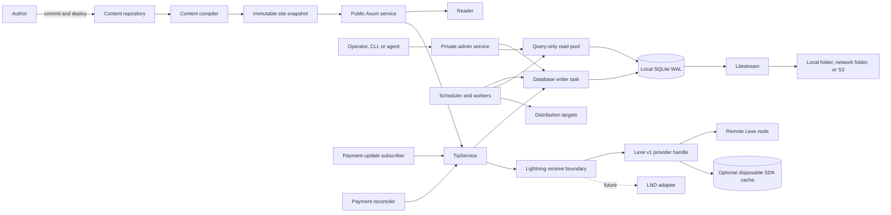
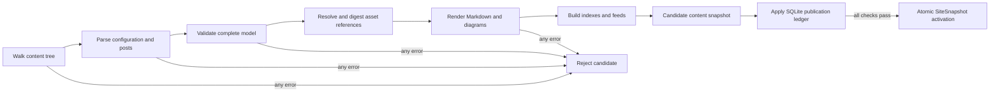
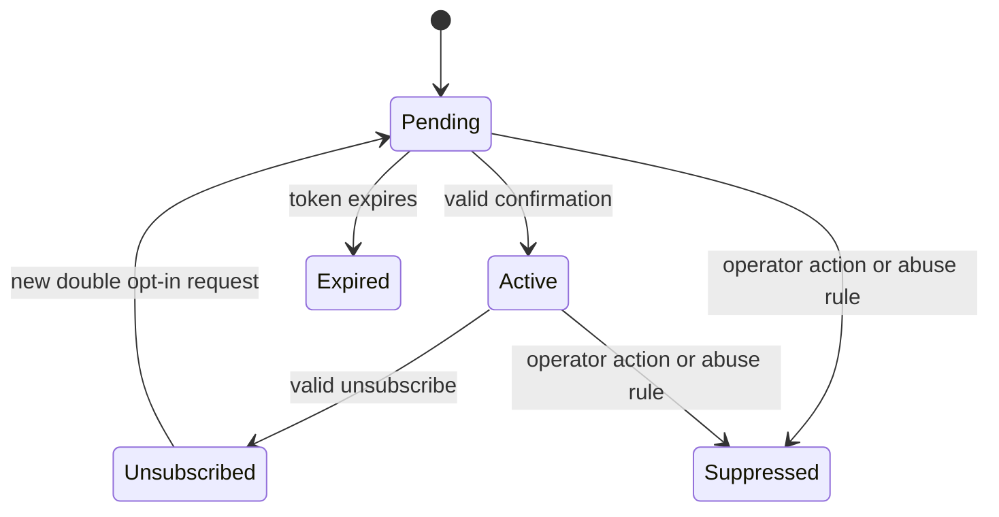
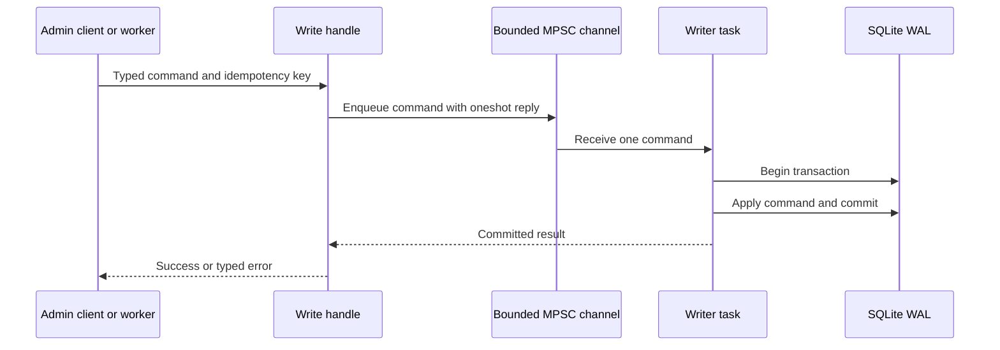
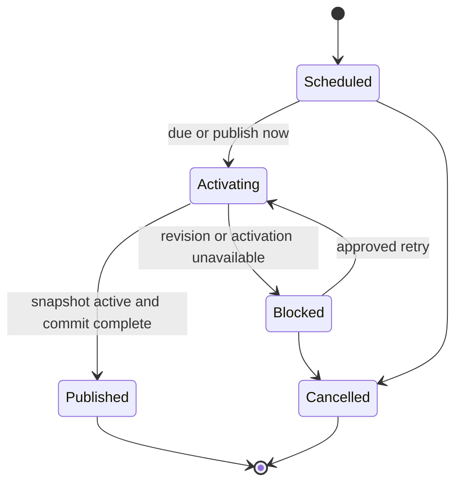
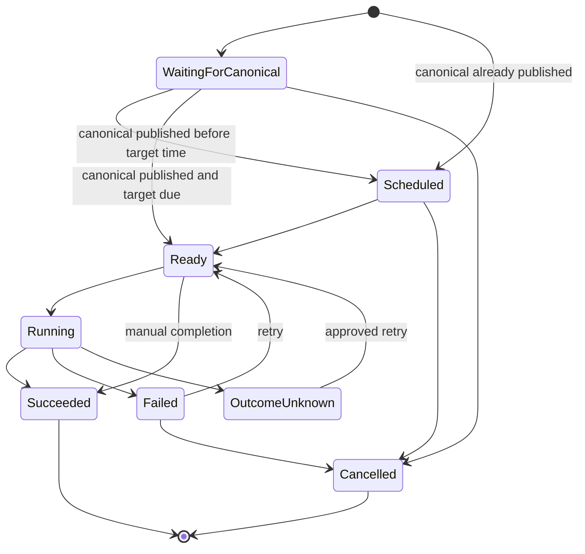

# Maincopy design

Status: accepted direction for v1
Last updated: 2026-08-29

## Purpose

Maincopy is a small, self-hosted publishing engine for technical writers. Git
stores the canonical Markdown. The author's domain stores the canonical
publication. Other networks provide discovery and distribution.

> One canonical copy. Every channel.

This document defines the durable v1 architecture. [IMPLEMENTATION.md](IMPLEMENTATION.md)
defines the delivery order and acceptance criteria.

## Product principles

### Content ownership comes first

The content repository contains every article and its declarative presentation
policy. Maincopy must remain replaceable without an article-body migration.

SQLite contains operational schedules, activation records, and delivery
history. It must never become a second content management system.

### The author's domain is canonical

Maincopy publishes the complete article on the author's domain. Feeds and
external networks link back to that canonical URL.

### Distribution cannot block publication

Canonical publication does not wait for an external network. A failed target
creates a failed attempt, but the article remains available.

### Server-rendered output is the default

Public pages use HTML, CSS, and SVG. JavaScript can enhance a feature, but it
cannot be required for reading or navigation.

### Features must earn their complexity

V1 uses one Rust crate, one service process, and one local SQLite database.
Maincopy adds a new component only when a current requirement needs it.

### Finite domains use strong types

A finite set of states, kinds, modes, versions, targets, or outcomes is an enum.
Application code does not represent that domain with raw strings or integers.

Semantically different values use different Rust types even when they share a
wire representation. For example, the admin API version and a feature-contract
version are separate enum types, even when both serialize as `v1`. Liveness and
readiness also use separate status enums inside a typed response wrapper.

Newtypes distinguish identifiers, digests, idempotency keys, addresses, and
other primitives that are not interchangeable. A function must accept the
narrowest meaningful type instead of a generic `String`, integer, or UUID.

Operational timestamps use `time::OffsetDateTime` directly. Constructors
normalize values to `UtcOffset::UTC`. Serde fields use Time's RFC 3339 adapter.
Maincopy does not define a custom timestamp wrapper or timestamp module.

Raw external values can exist only at an input, serialization, database, or
protocol boundary. Boundary code parses them into domain types before it calls
application logic. Serde and SQLx mappings use explicit stable names. An
unknown value fails with a typed error unless the protocol explicitly defines
forward-compatible unknown values.

Contract tests protect each serialized enum name. State-transition tests work
with enum variants, not string comparisons. A schema migration must accompany
a persisted enum change that is not backward compatible.

## V1 boundary

V1 is the first release that an author can operate on one host.

| Included in v1 | Deferred until after v1 |
| --- | --- |
| External Git-backed content repository | Browser content editor |
| TOML frontmatter | Multiple frontmatter formats |
| Content validation and immutable snapshots | Multi-author and multi-tenant hosting |
| Axum routes and Maud views | Comments, accounts, and analytics |
| RSS, sitemap, metadata, and redirects | Bulk newsletter campaigns and delivery |
| Local assets and allowlisted HTTPS CDN assets | Asset uploads and CDN management |
| Favicon and post preview images | Image transformation and optimization service |
| First-party email capture with double opt-in | Subscriber segmentation and campaign analytics |
| Code, ASCII, and Mermaid rendering | ActivityPub and WebFinger |
| Provider-neutral BOLT11 tip invoices with a Lexe v1 adapter | LND adapter, paid articles, access grants, and refunds |
| SQLite publication and distribution ledger | Multiple active writer processes |
| Private admin API and minimal admin UI | General plugin system |
| Scheduled canonical publication and manual distribution jobs | Automatic closed-network adapters |
| Litestream backup and tested restore | High-availability database failover |
| Dedicated Nix flake and NixOS module | Theme marketplace |

The first automatic target adapter can follow v1. The v1 job model must support
that adapter without a schema redesign.

## System context



The public service and admin service run in one process. They use separate
listeners and separate trust boundaries.

## Source-of-truth boundaries

| Data | Authoritative store | Notes |
| --- | --- | --- |
| Article body and authored metadata | Git content repository | SQLite never stores article bodies. |
| Slugs and live redirects | Git content repository | Removing a published alias fails validation. |
| Presentation configuration | Git content repository | Secrets are not allowed. |
| Canonical schedule and activation | SQLite | A reload cannot publish an unscheduled post. |
| Runtime configuration | Host configuration | Paths, listeners, and limits live here. |
| Publication jobs and attempts | SQLite | Jobs bind to immutable content revisions. |
| Remote IDs and URLs | SQLite | Records describe completed external actions. |
| Subscriber consent and lifecycle | SQLite | These records contain protected personal data. |
| Tip intent and public receive status | SQLite | The record uses provider-neutral invoice and settlement types. |
| Lightning provider reference and update cursor | SQLite | The record stores `ProviderKind::Lexe`, an opaque payment locator, and an opaque typed provider cursor. |
| Lightning payment truth | Remote Lexe node | A local Lexe SDK cache is disposable and cannot establish invoice or settlement state. |
| Credentials | Secret file or secret manager | Maincopy SQLite never stores credentials. Lexe client credentials are revocable and narrowly scoped. |
| Database backup | Litestream replica | Git content needs a separate Git backup. |
| Provider recovery state | Remote Lexe node plus Maincopy's tip ledger | Restore reconciles the local ledger against remote payment indexes before tips become ready. |

## Repository and runtime layout

The engine and publication content use separate repositories.

```text
/srv/maincopy/
|-- engine/                 # Maincopy checkout or Nix store path
|-- content/                # publication checkout
|   |-- publication.toml
|   |-- posts/
|   |-- drafts/
|   `-- assets/
|-- state/
|   |-- maincopy.db         # local disk only
|   |-- compiled-assets/
|   `-- lexe-cache/         # optional; disposable and non-authoritative

/run/maincopy/              # tmpfs runtime state, created at service start
|-- maincopy.lock
`-- admin.sock
```

The content path is always explicit. Maincopy does not require a Git submodule.
Production can use a Git worktree, a checkout, or a content-only deployment
artifact.

The configured content root is an operator-trusted deployment boundary. The
path can be a symbolic link. Each compilation follows the configured path once
and pins the opened directory. A later root-link swap affects only the next
compilation.

The live database, `-wal`, and `-shm` files must remain on local storage. A
network filesystem can hold only the Litestream replica.

## Configuration

Maincopy uses two configuration layers.

`publication.toml` travels with the content repository. It contains public site
metadata and feature choices.

The publication configuration selects a local or external favicon and lists
the external asset origins that content can use. For example:

```toml
[site]
title = "Example Blog"
base_url = "https://blog.example.com/"
description = "Technical notes and projects."
favicon = "assets/favicon.png"

[author]
name = "Example Author"

[assets]
allowed_https_origins = ["https://cdn.example.com"]

[subscriptions]
enabled = true
privacy_policy_revision = "2026-08-29"

[tips]
enabled = true
minimum_sats = 100
maximum_sats = 100000
```

`site.title`, `site.base_url`, `site.description`, and `author.name` are
required. The base URL must be an HTTPS origin. It cannot contain user
information, a query, a fragment, or a non-root path. Maincopy normalizes the
base URL to include one trailing slash.

The site favicon is optional. The asset origin list defaults to an empty list.
Subscriptions and tips are disabled when their sections are absent. An enabled
subscription requires a privacy-policy revision. Enabled tips require positive
minimum and maximum amounts, and the minimum cannot exceed the maximum.

Renderer policy is not authored configuration in v1. The compiler uses typed,
versioned renderer settings. V1 disables raw HTML, escapes plain code blocks,
and emits a typed Mermaid placeholder until Slice 6 selects the renderer.

`favicon` can also be an absolute HTTPS URL from an allowed origin. A post can
use a local asset or an absolute HTTPS URL from the same allowlist for its
preview image, Markdown images, and file links.

`maincopy.toml` belongs to the host. It contains paths, listeners, resource
limits, database limits, and secret references.

The host configuration selects a typed Lightning receive provider. The v1
configuration enum contains only `Lexe`. Maincopy will add an `Lnd` variant
only when that adapter exists. Public and admin contracts do not contain the
selected provider. A stable persisted `ProviderKind` and opaque provider
locator preserve historical payment records across future adapters.

The Lexe adapter uses the public `lexe` 0.1.22 crate. Its typed configuration
selects the Bitcoin network, the client-credential file, an optional local SDK
cache path, maximum in-flight operations, maximum pending operations, request
and reconciliation timeouts, a bounded reconciliation page size, and a
periodic recovery interval. The provider-operation deadline also bounds each
payment-update long poll. The typed in-flight limit rejects zero and one when
tips are enabled. The operator must provision revocable
credentials with exactly the
`Receive`, `ReadPayments`, and `ReadInfo` scopes and an empty explicit
`permissions` collection. `ReadInfo` supports node identity and health checks.
The Lexe 0.1.22 `ClientCredentials` blob does not expose its grants, so
Maincopy cannot prove that extra scopes or endpoint permissions are absent at
runtime. Provisioning audit is an operator security control.
Maincopy's code never calls spend, channel-management, full-administration, or
client-management operations.

Lexe client credentials and bearer tokens never appear in `publication.toml`,
Git, Maincopy SQLite, logs, metrics, or API responses. The remote Lexe node is
the source of payment truth. An SDK cache can improve local queries, but it is
non-authoritative, can be deleted, and is not part of Maincopy's Litestream
backup contract.

Command-line arguments can override non-secret runtime settings. Secret values
come from environment variables, credential files, or a secret manager.

Maincopy validates the complete effective configuration before it opens a
listener. A syntactically invalid or internally inconsistent host
configuration fails startup. Failure to load, authenticate, or authorize an
enabled Lexe credential fails the optional tip subsystem closed and keeps its
readiness false; it does not prevent the core article listener from starting.

## Content contract

V1 supports TOML frontmatter between `+++` delimiters.

```markdown
+++
id = "4f054633-2d09-4b05-97d0-c6f0011a5199"
title = "SQLite Does Not Need a Network"
slug = "sqlite-does-not-need-a-network"
authored_at = 2026-08-29T15:00:00-04:00
description = "A practical SQLite deployment model."
image = "https://cdn.example.com/posts/sqlite/cover-v1.webp"
tags = ["rust", "sqlite"]
aliases = ["sqlite-deployments"]
draft = false
tips = true

[distribution.x]
enabled = true
text = "SQLite is a file, but deployment still has coordination rules."
+++

# SQLite Does Not Need a Network
```

### Post fields

| Field | Requirement | Rule |
| --- | --- | --- |
| `id` | Required | It is a valid UUID and never changes. |
| `title` | Required | It is non-empty plain text. |
| `slug` | Required | It uses lowercase ASCII words and hyphens. |
| `authored_at` | Required | It includes a UTC offset. |
| `updated_at` | Optional | It is not earlier than `authored_at`. |
| `description` | Required | It supplies summaries and fallback copy. |
| `image` | Optional | It is a local asset or an allowed HTTPS URL. |
| `tags` | Optional | Maincopy normalizes case and rejects duplicates. |
| `aliases` | Optional | Each alias redirects to the current slug. |
| `draft` | Optional | Below `posts/`, the authored default is `false`. The `drafts/` collection forces the effective value to `true`. |
| `tips` | Optional | It inherits the publication default. |
| `distribution` | Optional | It contains target-specific policy and copy. |

Post UUID text must use the canonical lowercase hyphenated form. Slugs and
aliases use lowercase ASCII letters, digits, and single hyphens. They cannot
start or end with a hyphen.

Tags use the same route-safe grammar after Maincopy trims outer whitespace and
converts ASCII letters to lowercase. Maincopy preserves authored tag and alias
order. It rejects duplicates after normalization.

Maincopy preserves the authored UTC offset in `authored_at` and `updated_at`.
The compiler compares the two values as instants. These timestamps never make
a post public.

The publication tip setting is the default for a post. An explicit post
`tips = true` or `tips = false` overrides that default. V1 frontmatter supports
only the typed `x` distribution target.

`published_at` is not an authored frontmatter field in v1. Validation rejects
it so that Git and SQLite cannot provide conflicting publication times.

A file below `drafts/` always has an effective `Draft` status. An explicit
`draft = false` value below `drafts/` is a validation error.

A file below `posts/` uses its authored draft value. Draft posts validate but
cannot be scheduled. A non-draft post is eligible for publication. It remains
absent from public routes until SQLite records its canonical activation.

Each typed post source also carries its `Posts` or `Drafts` collection. The
collection must match the `posts/` or `drafts/` prefix in its logical path.
Validation rejects a mismatch, so an incorrectly constructed source cannot
bypass the draft policy.

The admin API supplies `scheduled_for`. When activation is claimed, SQLite
records one `activation_at` value immediately before the visibility swap. A
successful final commit copies that value to `published_at`. It is the durable
canonical visibility timestamp, not a measurement taken after activation
finishes. Public pages, feeds, and structured metadata use it.

The canonical post route is `/posts/{slug}`. A slug change does not change the
post ID, feed GUID, or prior alias redirects.

Validation rejects duplicate IDs, slugs, aliases, and asset paths. Validation
also rejects path traversal and every descendant symbolic link.

V1 disables raw HTML in Markdown. V1 also rejects authored SVG assets. The
diagram pipeline can emit sanitized SVG through one audited boundary.

### Content-tree boundary

The compiler manages only the following entries below the pinned content root:

| Entry | Requirement | Managed content |
| --- | --- | --- |
| `publication.toml` | Required regular file | UTF-8 publication configuration |
| `posts/` | Optional directory | UTF-8 Markdown post files |
| `drafts/` | Optional directory | UTF-8 Markdown draft files |
| `assets/` | Optional directory | Opaque content-owned files |

The compiler ignores unrelated top-level entries, such as `.git/` and
`README.md`. It rejects a case variant of a reserved managed entry. For
example, `Posts/` cannot replace or accompany `posts/`.

V1 content discovery supports Linux in the Nix development and deployment
environments. The compiler pins the trusted root first. It then opens each
descendant relative to that directory descriptor with `rustix` and `openat2`.

Each descendant lookup uses `BENEATH`, `NO_SYMLINKS`, `NO_MAGICLINKS`, and
`NO_XDEV`. These flags prevent path escape, descendant links, magic links, and
mount-boundary traversal. An unsupported platform, kernel, or flag set returns
a typed failure. Maincopy never uses a weaker fallback.

WARNING: Do not replace descriptor-relative lookup with a path-prefix check.
A descendant swap can escape after the check and before the open.

Every managed descendant path component uses the portable ASCII filename
characters `A-Z`, `a-z`, `0-9`, `.`, `_`, and `-`. A component cannot be empty,
`.` or `..`. Maincopy also rejects these path forms:

- non-UTF-8 or non-ASCII text;
- percent signs or encoded traversal;
- backslashes or control characters;
- absolute paths; and
- Windows drive-prefixed paths.

The same grammar and exact lowercase `.md` suffix apply when an internal caller
supplies a typed post source directly. Direct validation cannot bypass the
content-tree path contract.

A logical path preserves the accepted component spelling. It uses `/` between
components. Its case-collision key converts only ASCII letters to lowercase.
Validation rejects exact logical duplicates and ASCII case collisions. The
check includes directory prefixes.

Post and draft filenames use the exact lowercase `.md` suffix. Assets remain
opaque bytes. The compiler rejects `.svg` and `.svgz` asset suffixes without
regard to ASCII case.

The compiler rejects descendant symbolic links, FIFOs, sockets, devices, and
other special entries. It accepts regular-file hard links. Each hard-link path
counts as a separate entry and contributes its full byte length.

The host can configure each content-tree limit. V1 uses these defaults:

| Limit | Default | Counting rule |
| --- | ---: | --- |
| `publication.toml` bytes | 256 KiB | Count the configuration file bytes. |
| Post or draft file bytes | 4 MiB | Count each Markdown file separately. |
| Asset file bytes | 32 MiB | Count each asset file separately. |
| Total managed file bytes | 256 MiB | Count every managed logical file path. |
| Managed entries | 10,000 | Exclude only the pinned content root. |
| Logical path depth | 16 components | Count from the pinned content root. |
| Logical path length | 1,024 bytes | Count the full `/`-separated logical path. |

One kibibyte (KiB) is 1,024 bytes. One mebibyte (MiB) is 1,024 KiB. Every
limit is inclusive.

The loader enforces byte limits while it reads. It does not trust file metadata
as the only size check. Before it returns a candidate, it verifies the pinned
root and every loaded directory and file against their discovery fingerprints.
A change before, during, or after an individual file read rejects the complete
candidate. After discovery, the candidate owns all configuration, post, draft,
and asset bytes. Later compiler stages never reopen source paths.

### Local and external assets

Local assets remain the preferred content-owned path. The compiler digests and
copies them into the immutable snapshot asset directory.

An external asset URL must use HTTPS and match an origin in
`assets.allowed_https_origins`. The match includes the scheme, host, and port.
Maincopy rejects user information, fragments, non-HTTPS schemes, and origins
that are not listed. It also rejects raw controls and backslashes before URL
normalization.

V1 does not fetch, proxy, upload, or transform an external asset. The reader's
browser requests it directly. This rule keeps the compiler outside the server-
side request forgery boundary. The generated Content Security Policy derives
its external image origins from the same validated allowlist.

The post revision digest includes the normalized external URL. It cannot cover
bytes that a CDN changes at the same URL. Operators should use immutable,
versioned CDN URLs. Maincopy reports a validation warning for a URL that does
not appear versioned, but it does not guess from remote headers.

Each resolved post capability carries a private binding to the effective asset
policy that approved it. This binding is not part of the post digest. The
public snapshot builder compares it with the current site policy and rejects a
stale approval after an allowlist change.

The site favicon follows the same rules. A local favicon receives an immutable
snapshot URL. An external favicon remains a direct allowlisted HTTPS URL.

### Application frontend assets

Application and theme assets belong to the Maincopy source tree. Author and
site assets belong to the content repository. The build pipeline never treats
a favicon, post image, content attachment, or CDN reference as a compile-time
application asset.

Maud templates remain Rust modules. A custom `build.rs` processes only
first-party CSS and optional JavaScript pieces. It discovers declared inputs,
normalizes and sorts their paths, combines them in that order, minifies the
result, and calculates a content digest. A read, minification, or write error
fails the build. The script does not skip an input or serve an unminified
fallback.

The script writes bundles and generated Rust metadata to `OUT_DIR`. It does not
write generated files into the source tree. It emits `cargo:rerun-if-changed`
directives for the input roots, files, and build logic that affect output.

The generated `FrontendAssetManifest` contains typed `CssAsset` and optional
`JavaScriptAsset` values. Each value contains typed asset identity, MIME type,
content digest, immutable public path, and embedded bytes. Runtime code uses
the manifest instead of constructing filenames or MIME types from strings.

The binary embeds the generated bundles and serves them from
`/app-assets/{digest}/{name}`. The route uses exact manifest lookup. It never
maps an untrusted path to the host filesystem. Valid assets use their exact
CSS or JavaScript MIME type, ETag, and immutable cache headers. Unknown,
malformed, and traversal-like paths return `404`.

`FrontendBundleDigest` is part of `SiteShellRendererIdentity` and every
`SiteSnapshot` digest. A CSS or JavaScript byte change therefore changes the
renderer identity, snapshot identity, and immutable application-asset URL.

### Revision identity

Each post revision receives a BLAKE3 digest. The digest includes:

- normalized frontmatter;
- the Markdown source;
- referenced asset paths and digests;
- effective renderer settings;
- versioned renderer and sanitizer implementation identities;
- digests of deterministic rendered article fragments and generated asset
  bytes before snapshot-URL injection; and
- effective distribution settings.

The site snapshot also receives a digest. The snapshot digest covers the
publication configuration, every local site-asset path and byte digest,
normalized external site-asset URLs, the effective CDN allowlist, the
versioned site-shell renderer identity, the generated frontend bundle digest,
the deterministic shell output digest before snapshot-URL injection, all
public post revision digests, and their canonical activation timestamps. A
same-path favicon, site-asset byte, CSS byte, or JavaScript byte change creates
a new snapshot and immutable asset URL. Golden tests require an explicit
renderer identity change when an implementation change alters output.

Git commit metadata is recorded when available. Content digests remain valid
when a deployment artifact does not include `.git`.

#### Digest encoding

V1 uses full 256-bit BLAKE3 values. The wire encoding is one lowercase prefix
and 64 lowercase hexadecimal characters:

| Identity | Wire prefix |
| --- | --- |
| Asset content | `asset-b3-v1-` |
| Post revision | `post-b3-v1-` |
| Site snapshot | `site-b3-v1-` |

Parsing rejects an abbreviated value, uppercase text, an unknown algorithm or
schema version, a wrong identity kind, and non-hexadecimal text. A digest type
does not have a constructor that accepts an arbitrary string.

Each digest kind uses a separate BLAKE3 derive-key context. Its canonical V1
transcript starts with a fixed kind marker and a big-endian schema version.
Byte strings use a big-endian 64-bit length. Sequences use a big-endian 64-bit
count. Options use an explicit one-byte discriminant. Enums use fixed numeric
tags. Integers never use a native word size or native byte order.

The digest code does not hash TOML, JSON, a Serde representation, a debug
representation, a hash-map iteration, or a host filesystem path. It sorts
semantic path-keyed sets by their validated logical bytes. It preserves the
documented authored order of tags and aliases.

Canonical post content uses the typed, effective frontmatter model. TOML key
order, comments, quoting style, and an omitted value that equals its documented
default do not change the identity. Markdown source bytes remain exact; V1 does
not rewrite line endings for the digest. Authored timestamps include the
instant and authored UTC offset. The public-ledger input normalizes operational
publication timestamps to UTC before it encodes them.

WP1.3 supplies pure internal finalizers, but it does not create a shortcut from
`ValidatedContent` to a final revision or snapshot digest. The post finalizer
requires the content, resolved referenced assets, renderer and sanitizer
identity, rendered output, and generated-output components. WP1.4 is its sole
production caller and exposes only an opaque `RenderedPost`. The site finalizer
requires resolved publication and site assets, shell and frontend identities,
pre-injection shell output, and the public post ledger entries. Later work
packages construct these required components. None has a default value.

The asset resolver returns opaque `ResolvedPostAssets` and
`ResolvedSiteAssets` values. Each value carries a private source-binding
fingerprint that covers the complete typed source, including authored image,
favicon, and allowlist syntax. The final calculator rejects a resolved value
that belongs to different source content. This private binding is not part of
the public post or site identity. Raw authored asset text is therefore not
hashed as a substitute for resolution. The resolved value supplies the
role-aware normalized image or favicon, the effective normalized CDN
allowlist, and the complete referenced-asset set.

The rendered post fragment and site shell use distinct pre-injection wrapper
types. This prevents the final calculators from confusing output that already
contains a snapshot-scoped URL with the output that is an input to that
snapshot digest. Their constructors are content-internal. WP1.4 makes the
renderer the sole production constructor and binds each result to its complete
render input.

An asset content digest covers its raw bytes. A parent post or site transcript
also covers the normalized logical path or external URL. An unreferenced asset
does not change a post revision.

Content-asset URLs remain snapshot-scoped:

```text
/assets/{site-snapshot-digest}/{logical-path-without-assets-prefix}
```

Only the public snapshot manifest creates these URLs. Calculating an asset
digest does not make a draft, unpublished, or scheduled asset public.

Git object IDs use `git-sha1:` plus 40 lowercase hexadecimal characters or
`git-sha256:` plus 64 lowercase hexadecimal characters. Source commit metadata
is optional provenance. It is not an input to an asset, post, or site digest,
and it does not by itself prove that a mutable worktree matches the commit.

## Content compilation



The compiler aggregates independent validation errors. Each error identifies a
path, field, and stable error code.

The tree walk produces owned candidate bytes in deterministic logical-path
order. Parsing and later compiler stages use only those owned bytes.

The intermediate `ContentCatalog` belongs to one complete resolver candidate.
`(PostId, PostRevisionDigest)` is an exact lookup identity inside that catalog;
it is not a cross-candidate authorization or cache key. A render cache must
also bind the private effective asset-policy capability. Snapshot projection
compares that capability with the current site policy before it emits an
external asset URL. It also resolves every local asset slot by its exact digest
against the same catalog's owned byte store before it emits a snapshot URL.
Equal public revision digests do not authorize reuse after an allowlist or
local-byte change.

Asset resolution runs before Markdown rendering. The resolver supplies typed
destinations for each Markdown image and file link. The renderer does not emit
an authored destination that the resolver did not approve.

Request handlers never parse Markdown, execute a diagram renderer, or read the
mutable content tree. They read an immutable `SiteSnapshot`.

Compiled content assets live under a directory named by the snapshot digest.
Public content-asset URLs include that digest and use immutable cache headers.
Compile-time application bundles use their separate frontend bundle digest and
are embedded in the binary.

The initial content snapshot must compile before the service becomes ready. A
later validation or other pre-swap reload failure keeps the current public
snapshot live.

After startup, `POST /api/admin/v1/reloads` is the only v1 reload trigger. The
CLI and deployment automation call this operation through the Unix socket.
Repeated requests coalesce with an in-progress reload and return the same
operation ID. V1 does not use an implicit file watcher.

A reload does not expose a post that has no canonical publication record. If a
published post receives a valid new Git revision, a successful reload updates
that public post and its derived indexes. V1 rejects a reload that changes an
already published post back to `draft = true`; unpublishing needs a separate
future design.

A published-revision update uses a durable reload operation so SQLite and the
in-memory snapshot cannot diverge silently:

1. Compile and validate the complete candidate without changing public state.
2. The writer commits an `Applying` reload operation that pins the expected
   current site digest, candidate site digest, and all changed post digests. It
   retains the candidate inputs and does not advance the current published
   digests.
3. Atomically swap the complete candidate `SiteSnapshot`. Pages, feeds,
   sitemap, indexes, and assets change together.
4. The writer advances the current published digests and changes the reload
   operation to `Applied` in one transaction. Only this commit acknowledges a
   successful reload.

A failure before step 3 leaves the old snapshot active. A failure after step 3
makes readiness fail and starts controlled shutdown; it is an incomplete
`Applying` operation, not a reported reload failure. Before listener binding,
startup reconciles every `Applying` operation by rebuilding and installing its
exact retained candidate, then committing step 4. Missing or corrupt retained
input fails startup closed. The service never infers the current published
digest from whichever files happen to be newest.

One snapshot-transition coordinator serializes published-revision reloads and
first-publication activations. It is the only component that can swap the
active `SiteSnapshot`. This rule prevents an `Applying` reload and an
`Activating` publication from installing competing snapshots. On startup, the
coordinator first resolves every retained `Applying` candidate and then every
claimed `Activating` revision in deterministic ledger order. Recovery can
perform the required intermediate snapshot installs and digest commits while
both listeners remain closed; no reader can observe them. After all replay is
complete, the coordinator compiles, installs, and asserts one final canonical
initial snapshot before listener binding.

A scheduled canonical publication pins one post revision. A later content
reload cannot change the revision that the scheduler will publish. The
operator must cancel or replace the schedule to select another revision.

## Rendering boundary

Maud owns the page structure. The Markdown renderer owns article content.

Rendered Markdown crosses into Maud through one reviewed `PreEscaped` boundary.
All other strings use normal escaping.

V1 uses strict CommonMark without optional extensions. It does not add heading
anchors. The renderer converts block and inline raw HTML into escaped text.
Authored HTML therefore remains visible as text and never becomes active HTML.

The renderer validates and rebuilds every link and image event. V1 permits
absolute HTTPS navigation and same-site root-relative navigation. It rejects
other schemes, protocol-relative URLs, credentials, controls, backslashes, and
traversal. Images and asset-file links also require one matching approved
resolver occurrence.

Plain, `text`, `ascii`, and unknown code fences produce the same escaped
`<pre><code>` structure. V1 does not preserve an authored code-fence class.
Only a fence whose complete CommonMark-decoded info value is the exact
lowercase value `mermaid` creates a typed Mermaid placeholder. Trailing info
tokens and case variants do not create a Mermaid placeholder.

V1 applies these inclusive renderer limits:

| Resource | Limit |
| --- | ---: |
| Rendered article HTML | 32 MiB |
| One Mermaid source block | 256 KiB |
| Mermaid blocks in one post | 64 |

The existing content-tree limit keeps one Markdown source at or below 4 MiB.
The renderer uses checked output writes and returns a typed limit error.

The Markdown renderer returns one opaque render product. The product binds the
rendered bytes, generated outputs, renderer identity, source document, and
resolved assets. A digest calculator rejects a product for different inputs.

The site-shell renderer returns an equivalent opaque product. The public
snapshot builder requires that product and cannot substitute empty shell bytes
or an invented frontend identity. WP2.1 supplies the production Maud shell and
frontend bundle.

Asset URL injection uses typed render slots. Identity calculation and final
snapshot rendering project those slots through different typed scopes. The
compiler never replaces magic text inside trusted HTML.

Syntax highlighting and diagram rendering run during compilation. A
`DiagramRenderer` trait isolates Mermaid from the Markdown parser.

The selected Mermaid renderer must enforce input size, output size, execution
time, and concurrency limits. Maincopy sanitizes the resulting SVG before use.

The Mermaid implementation remains an implementation spike. V1 cannot release
until a representative fixture corpus passes.

`PostRendererVersion::V1` identifies the exact CommonMark parser, event policy,
and HTML serializer above. `SanitizerVersion::V1` identifies the raw-HTML and
destination policy. An output-affecting policy change requires an explicit
identity-version review before a golden output changes.

## Public web contract

| Method and path | Purpose |
| --- | --- |
| `GET /` | Publication index |
| `GET /posts/{slug}` | Canonical article |
| `GET /tags/{tag}` | Tag index |
| `GET /archive` | Chronological archive |
| `GET /feed.xml` | RSS feed |
| `GET /sitemap.xml` | XML sitemap |
| `GET /robots.txt` | Crawler policy |
| `GET /assets/{revision}/{*path}` | Immutable compiled asset |
| `GET /app-assets/{digest}/{name}` | Immutable embedded CSS or JavaScript bundle |
| `POST /subscriptions` | Start a double-opt-in subscription |
| `GET /subscriptions/confirm` | Render a confirmation result |
| `POST /subscriptions/confirm` | Confirm a pending subscription token |
| `GET /subscriptions/unsubscribe` | Render an unsubscribe confirmation form |
| `POST /subscriptions/unsubscribe` | Complete an unsubscribe request |
| `POST /posts/{slug}/tips/invoices` | Create a provider-neutral BOLT11 tip invoice |
| `GET /health/live` | Process liveness |
| `GET /health/ready` | Snapshot and required core-subsystem readiness; optional tip health does not gate it |

Public pages include canonical links, Open Graph metadata, and `BlogPosting`
JSON-LD. Feeds use stable post IDs as GUIDs and absolute canonical URLs.

HTML uses conditional requests and ETags. Immutable assets use a long cache
lifetime. Error pages do not expose internal paths or errors.

The public listener never serves admin routes.

### Subscription capture

Subscription capture is a first-party public feature. Maincopy stores consent
and subscriber lifecycle state, but v1 does not send newsletter campaigns.

V1 uses double opt-in. A form submission creates or refreshes a pending record
through the single database writer. Maincopy returns the same public response
for a new address, an existing address, and a suppressed address. This response
does not reveal whether an address exists.

The same transaction creates durable confirmation work in `email_outbox`. An
email worker claims that work in a short writer transaction. The claim creates
a single-use token digest and returns the raw token to worker memory. The worker
sends the message without a database transaction and records the sanitized
outcome through the writer. A process restart therefore cannot lose committed
confirmation work.

A crash after token creation can cause a retry to create another valid token.
The retry count and token count are bounded. The first successful confirmation
invalidates every outstanding confirmation token for that subscriber. This
rule keeps raw tokens out of SQLite without creating a commit-to-send loss gap.

The confirmation command changes the subscriber to `Active` and creates a
durable `SubscriptionControl` outbox item in one writer transaction. A worker
claim creates an unsubscribe-token digest and returns the raw token to memory.
The worker sends a control message with the unsubscribe link outside the
transaction. A successful unsubscribe invalidates every outstanding control
token for that subscriber.

A rate-limited subscription request for an already active address creates a
new control-message outbox item. The public response remains generic. This
operation lets a subscriber recover an unsubscribe link without revealing
membership.

The email transport is a replaceable trait. `email_outbox.kind` is a typed enum
with `Confirmation` and `SubscriptionControl` variants. V1 must select one SMTP
or provider-API implementation before this feature can be enabled. If no
transport is configured, Maincopy keeps the public subscription form disabled.
It must not accept an address and claim that it sent a message.

Confirmation and unsubscribe tokens have high entropy. SQLite stores only
token digests. Logs, metrics, audit events, error responses, and request IDs do
not contain raw email addresses or tokens.

Access logs record route templates, not query strings. The supported browser
gateway must apply the same rule because an emailed control link contains an
opaque token. A GET request can render a confirmation form, but only a POST can
confirm or unsubscribe. This rule prevents email link scanners from changing
subscriber state.

The public endpoints use request-body limits, per-source rate limits, a hidden
bot field, and strict Origin policy for browser submissions. The stored consent
record includes the UTC time, consent source, and privacy-policy revision.

A subscription has one of these states:



The admin service can list, export, suppress, and delete subscription records.
These operations require full admin-socket authority in v1 and create redacted
audit events. Export is an explicit action; no public route exposes subscriber
data.

## Operational database

SQLite stores operational history. It does not store Markdown or rendered
article HTML.

### Concurrency model



Exactly one Tokio task owns exactly one SQLx write connection. Every runtime
write uses one bounded `mpsc` channel.

Cloning the database handle clones only the channel sender and read pool. A
clone never creates another writer task.

The writer uses typed commands. It does not accept arbitrary SQL closures. One
command contains one complete transaction.

Each command includes a `oneshot` reply. A successful reply means that SQLite
committed the transaction.

If the caller disconnects after enqueue, the writer still completes the
command. Idempotency keys make safe retries possible.

Network calls never run on the writer task. A worker claims work in one short
transaction, performs the network call, then records the result in another
transaction.

### Direct reads

Reads use a separate, bounded SQLx pool. Each reader connection uses read-only
mode and `PRAGMA query_only=ON`.

The database uses WAL mode. WAL readers can run while the writer commits. A
reader uses a short transaction when several queries need one consistent
snapshot.

Maincopy does not checkpoint before ordinary reads. New read transactions see
committed WAL data without a checkpoint.

Every applicable connection enables foreign keys and a busy timeout. Startup
sets and verifies `journal_mode=WAL` before it opens the read pool.

V1 uses `synchronous=NORMAL`. This choice is paired with Litestream replication
and a tested restore procedure.

### Process ownership

The `serve` process acquires an exclusive lock before it opens the write
connection. A second writer process fails before it mutates the database.

The CLI and admin UI never open SQLite for writes. They send requests to the
running admin service.

If the admin service is unavailable, mutating CLI commands fail with an
actionable error. They never fall back to direct writes.

### Initial schema

| Table | Purpose |
| --- | --- |
| `site_revisions` | Records activated site snapshots and Git commits. |
| `post_revisions` | Records stable IDs, slugs, and revision digests. |
| `published_routes` | Remembers public slugs and aliases across restarts. |
| `reload_operations` | Reconciles published-revision snapshot swaps and digest commits. |
| `canonical_publications` | Stores pinned schedules and canonical activation state. |
| `publication_jobs` | Stores schedules, immutable payloads, and job state. |
| `publication_attempts` | Stores each target attempt and sanitized outcome. |
| `remote_publications` | Stores remote IDs and canonical remote URLs. |
| `subscriptions` | Stores normalized addresses, consent, and lifecycle state. |
| `subscription_tokens` | Stores confirmation and unsubscribe token digests. |
| `email_outbox` | Stores confirmation and subscription-control work with sanitized outcomes. |
| `audit_events` | Stores admin actor, action, request ID, and timestamp. |

Scheduled payloads contain a schema version. An upgrade must migrate or reject
an incompatible pending payload. It must never reinterpret one silently.

### Failure behavior

- A full queue applies backpressure before it returns `503 Retry-After`.
- A closed queue returns `writer_unavailable`.
- An unexpected writer exit makes readiness fail and starts controlled shutdown.
- A failed transaction changes no rows.
- A disk-full or corruption error stops new writes and preserves diagnostics.
- A long read transaction can delay checkpoints and grow the WAL.

The service records queue depth, enqueue latency, transaction latency, pool
wait time, writer health, WAL size, and checkpoint results.

## Private admin plane

The canonical admin transport is HTTP/JSON over a Unix domain socket. The
default path is `/run/maincopy/admin.sock`.

The runtime creates the parent directory with restricted permissions. The
socket uses owner or group permissions as the first authorization boundary.

Admin TCP is disabled by default. Development can enable a loopback listener.
Production browser access requires an authenticated reverse proxy or SSH
tunnel to the Unix socket.

The admin UI is served by the admin listener. It is never added to the public
router. State-changing forms use CSRF and Origin validation when a browser
gateway is enabled.

### Agent and CLI contract

The API prefix is `/api/admin/v1`. It publishes an OpenAPI document and a
capability endpoint.

Maincopy generates OpenAPI 3.1 with `utoipa` and `utoipa-axum`. Request,
response, parameter, error, enum, and newtype contracts derive `ToSchema` where
applicable. Each handler uses `utoipa::path`. One `OpenApiRouter` registry
creates both the Axum routes and their OpenAPI operations. A central `OpenApi`
derive supplies document metadata and shared components, but it does not keep
a second operation list. The generated document is the contract; Maincopy does
not maintain a separate handwritten schema.

The admin router serves the JSON document at
`GET /api/admin/v1/openapi.json`. The route is available only through the admin
transport. A human documentation viewer can be added to the admin UI, but it
must consume this same generated document and use vendored or pinned assets.

Contract tests exercise each generated route, validate enum wire values, and
parse the output as an OpenAPI 3.1 document. Admin API operations must be added
with the documented `OpenApiRouter::routes` boundary; raw Axum `.route` calls
are forbidden in the admin API registry. Thus a handler registration creates
its runtime route and contract operation together.

JSON timestamps use RFC 3339 UTC. Lists use cursor pagination. Every response
includes a request ID.

Every admin mutation accepts an idempotency key. A create operation binds the
expected post and site revision when applicable. An update or delete operation
also requires the expected resource version. These fields prevent duplicate
actions and lost updates.

Errors use one stable envelope:

```json
{
  "error": {
    "code": "job_conflict",
    "message": "The job changed after the client loaded it.",
    "request_id": "01J...",
    "details": {}
  }
}
```

The CLI supports JSON output and stable exit codes. Agents never need to parse
human-formatted tables.

The admin API exposes fixed operations only. It never exposes a shell command,
raw SQL, or arbitrary file access.

### V1 admin resources

| Method and path | Purpose |
| --- | --- |
| `GET /api/admin/v1/capabilities` | API and feature versions |
| `GET /api/admin/v1/posts` | Active and pending post revisions |
| `POST /api/admin/v1/reloads` | Compile and activate a content snapshot |
| `POST /api/admin/v1/previews` | Build a target representation preview |
| `GET /api/admin/v1/publications` | List canonical schedules and activations |
| `POST /api/admin/v1/publications` | Schedule or immediately publish a pinned revision |
| `GET /api/admin/v1/publications/{id}` | Read canonical and target state |
| `POST /api/admin/v1/publications/{id}/cancel` | Cancel an eligible schedule |
| `POST /api/admin/v1/publications/{id}/publish-now` | Advance an eligible schedule |
| `GET /api/admin/v1/jobs` | List and filter publication jobs |
| `POST /api/admin/v1/jobs` | Create and schedule a job |
| `GET /api/admin/v1/jobs/{id}` | Read job state and target status |
| `POST /api/admin/v1/jobs/{id}/cancel` | Cancel eligible work |
| `POST /api/admin/v1/jobs/{id}/retry` | Retry failed or unknown targets |
| `POST /api/admin/v1/jobs/{id}/complete` | Record manual completion |
| `GET /api/admin/v1/subscriptions` | List subscription records |
| `POST /api/admin/v1/subscriptions/export` | Create a protected export |
| `POST /api/admin/v1/subscriptions/{id}/suppress` | Suppress future messages |
| `DELETE /api/admin/v1/subscriptions/{id}` | Delete a subscription record |
| `GET /api/admin/v1/openapi.json` | Machine-readable API contract |

The minimal admin UI provides preview, canonical schedule, publish-now,
publication detail, target-job detail, cancel, retry, and manual completion
screens. It does not edit article content.

## Canonical publication and target jobs

A canonical publication binds one stable post ID, one retained post revision
digest, one optional source commit, one scheduled UTC instant, and an optional
set of target jobs. Content changes never mutate this pinned revision. An
operator must cancel and replace an eligible schedule to select another
revision.

The create command stores the canonical schedule and one child job per selected
target in one writer transaction. A successful `202 Accepted` response means
that this transaction committed; it does not mean that publication ran.



At the scheduled time, Maincopy uses this sequence:

1. The writer changes `Scheduled` to `Activating`, records one activation UTC
   timestamp named `activation_at`, and keeps each target job in
   `WaitingForCanonical`.
2. The scheduler builds and atomically swaps a public `SiteSnapshot` that
   contains the pinned revision and committed activation timestamp. It does not
   hold a database transaction.
3. The writer copies that timestamp to `published_at`, changes the canonical
   state to `Published`, and releases due target jobs in one transaction.

An `Activating` database row does not make a post visible by itself. The atomic
snapshot swap in step 2 is the only visibility point. At steady state, every
public post has a `Published` row. During the short activation interval, the
coordinator can serve the one claimed `Activating` revision after its snapshot
swap and before the final commit. Pages, feeds, sitemap, indexes, and asset
routes all consume that same snapshot and therefore change visibility at the
same point. Startup resolves all `Activating` rows before it opens a listener.

No target can run before the canonical snapshot is active. A target failure
cannot roll back the canonical post. If the final writer command fails after
the snapshot swap, readiness fails and controlled shutdown starts. Startup
reconciles every `Activating` record before it opens a listener.

After downtime, v1 immediately activates an overdue schedule and records both
the requested and actual times. The admin UI displays the delay. It never
silently changes the requested time.

Each target job binds one target, the same post revision, a bounded immutable
payload and digest, one payload schema version, and its own scheduled UTC
instant. The publication detail resource aggregates related one-target jobs.
SQLite does not store canonical Markdown.

Maincopy retains a compiled revision while a scheduled or non-terminal record
refers to it. If the revision or payload is missing, the canonical publication
or job becomes blocked with `revision_unavailable`.



V1 manual targets become `Ready` only after the canonical post is public and
the target time is due. An operator or agent posts the prepared copy and
records completion.

Future automatic adapters use the same jobs. Delivery is at least once because
a crash can occur after a remote side effect but before the result commit. An
adapter uses a stable target idempotency key when the remote API supports one.
Otherwise, an ambiguous crash result becomes `OutcomeUnknown`.

Attempts use durable leases. Startup recovers expired `Running` attempts before
the scheduler accepts new work. A retry selects only an eligible failed or
unknown target and never repeats a successful target.

## Lightning tip boundary

Maincopy owns the tip intent, invoice, and settlement contracts. These
contracts do not expose a wallet vendor. A closed `LightningProvider` enum owns
the production adapter. Its inherent methods accept a typed
`CreateTipInvoiceRequest`, return a verified `TipInvoice`, and observe
settlement through a typed `ProviderPaymentReference`.

V1 has one production variant:

```text
LightningProvider::Lexe(Arc<LexeProvider>)
```

Tests can add one `#[cfg(test)]` substitute. Each inherent method uses an
exhaustive match to delegate to the active adapter. Maincopy does not need a
provider manager, registry, `DashMap`, or dynamic string dispatch.
`LightningProvider` is a cloneable application-facing handle. The Lexe variant
clones only its `Arc`.

`TipService` is an ordinary service that composes the database handle with one
configured `LightningProvider`. It does not add a second queue. The Lexe
provider owns the sole bounded operation queue. One dispatcher owns its
receiver and a `JoinSet`, starts no more than the configured number of SDK
futures, and reaps each completion immediately. Because Maincopy has one
provider instance, one typed concurrency limit applies provider-wide. V1
rejects limits below two and runs exactly one update subscriber. Its long poll
can therefore use no more than one slot while at least one slot remains for an
ordinary provider operation. No provider registry or `DashMap` is required. No
provider call runs on the Maincopy database writer task or inside a Maincopy
database transaction.

The internal `TipInvoice` persistence model contains a validated BOLT11
invoice, exact amount, payment hash, expiry, and provider reference. The public
`TipInvoiceView` contains only the BOLT11 invoice, amount, and expiry. The
public route derives a `lightning:` link and never exposes the payment hash,
provider kind, provider locator, or provider update index.

`TipSettlement` contains the exact received amount and settlement time.
Operational timestamps use `time::OffsetDateTime`, are normalized to UTC, and
serialize with `time::serde::rfc3339`.

V1 ships `LexeProvider` through the public crates.io `lexe` 0.1.22 SDK. A
future `LndProvider` will add an intentional exhaustive enum variant without
changing the tip intent, public route, or admin contracts. V1 does not accept
an `Lnd` configuration value before that adapter exists.

### Tip intent state

The provider seam uses two separate closed result domains.
`InvoiceCreationReconciliation` has `Found(TipInvoice)`, `Missing`, and
`Ambiguous`. `ProviderPaymentState` has `InvoiceOpen`,
`Received(TipSettlement)`, `Expired`, and
`RecoveryRequired(TipRecoveryReason)`. `TipRecoveryReason` contains only
`SettlementIncomplete` and `ProviderConflict`. Missing and ambiguous creation
matches are not settlement reasons.

The later durable tip ledger surrounds those provider results with the local
`Requested` and `InvoiceCreating` phases:

```text
Requested -> InvoiceCreating -> InvoiceOpen
InvoiceCreating -> Requested                 # conclusive pre-create failure
InvoiceCreating -> InvoiceCreating            # OutcomeUnknown, Missing, or Ambiguous; creation stays blocked
InvoiceOpen -> Received(_)
InvoiceOpen -> Expired
InvoiceOpen -> RecoveryRequired(_)
RecoveryRequired(_) -> InvoiceOpen | Received(_) | Expired
```

The ledger records the last `CreateTipInvoiceError` or
`InvoiceCreationReconciliation` outcome while it stays in `InvoiceCreating`.
`OutcomeUnknown`, `Missing`, and `Ambiguous` never authorize automatic
recreation. Provider-specific details stay in the adapter and in redacted
operator diagnostics.

`Received` wraps a verified `TipSettlement`. A provider status named “settled”
is not sufficient by itself. For Lexe, the adapter requires one matching
inbound invoice payment with `Completed` status, the expected created index,
payment hash and amount, a finalization time, and the provider's completed
payment evidence. Missing final settlement fields produce
`ProviderPaymentState::RecoveryRequired(SettlementIncomplete)`. An identity
conflict in a direct known-payment reconciliation returns
`PaymentOperationError::ProviderConflict`, which `TipService` maps to durable
provider-conflict recovery. The update-poll path represents the same conflict
as `ProviderPaymentUpdate::TipRecoveryRequired` so it can advance in cursor
order without losing the recovery signal.

### Invoice creation and idempotency

The public tip form submits a bounded amount in sats and a bounded request
idempotency key. Maincopy first commits a typed `TipIntent` with a unique
opaque `TipIntentId`. It then commits `InvoiceCreating` before it calls Lexe. A
repeated request for the same idempotency key returns the existing result or
starts reconciliation. It never creates another provider invoice while a prior
call can have completed.

Lexe's `create_invoice` request has no provider idempotency field. Maincopy
therefore writes the deterministic marker
`maincopy-tip:<canonical TipIntentId UUID>` to Lexe's `personal_note` field.
The marker is bounded, contains no post, reader, or author data, and is not
visible to the payer. The BOLT11 description remains a separate, human-facing
value. Maincopy never requests `Spend`, so it cannot edit the personal note
after creation.

The provider-neutral request does not let a public caller select invoice
lifetime. V1 leaves Lexe's `expiration_secs` unset and uses the SDK's documented
86,400-second default. The adapter validates that the signed invoice is not
expired at the injected validation time.

`CreateTipInvoiceError` distinguishes `NotAccepted`, `NotCreated`, and
`OutcomeUnknown`. Local validation, concurrency rejection, or a conclusive
failure before the remote create request begins can be retried. Once the Lexe
create request begins, a timeout, transport error, dropped response, invalid
response, or process crash is `OutcomeUnknown` and requires reconciliation.
Lexe cannot prove `NotCreated` after an accepted remote call. Maincopy never
blindly repeats that call.

Lexe's fresh-create response does not echo `personal_note`. Before it reports
success, the adapter therefore reads the payment back by the returned created
index. It requires the exact marker, inbound invoice kind and direction,
matching created index and invoice identity, and the same encoded invoice. It
then validates the signed invoice's network, exact amount, payment hash,
human-facing description, and unexpired expiry. The create call and confirming
read share one response deadline. A failure or timeout in either call is
`OutcomeUnknown` because the invoice can already exist.

The adapter stores Lexe's `PaymentCreatedIndex` as an opaque locator inside a
`ProviderPaymentReference` whose stable kind is `ProviderKind::Lexe`. The HTTP
response succeeds only after Maincopy commits `InvoiceOpen`.

An `InvoiceCreating` intent always reconciles before another creation attempt.
The provider boundary exposes marker reconciliation as the closed result
`Found(TipInvoice)`, `Missing`, or `Ambiguous`. The Lexe adapter searches remote
payments by the exact `personal_note` marker and validates every candidate.
It attaches only one unique match. `Missing` and `Ambiguous` keep the durable
intent blocked in `InvoiceCreating` with the exact reconciliation outcome;
neither result proves that a prior remote create call had no effect. Maincopy
never guesses or recreates automatically.

### Lexe source of truth and reconciliation

The remote Lexe node is authoritative for invoice and settlement state. The
SDK can use an on-disk or in-memory payment cache, and it can run without a
local database. Any local cache is only a performance aid. Clearing or losing
it does not change remote payments. A cache result alone cannot make an intent
`Received`, prove that an invoice is missing, or authorize invoice recreation.

The adapter maps Lexe's `PaymentCreatedIndex` and `PaymentUpdatedIndex` into
bounded, opaque provider locator and cursor types. Native Lexe index types stay
inside the adapter. Maincopy persists the last processed provider cursor in its
own database and processes repeated updates idempotently. One common catch-up
routine reads authoritative updated-payment pages after that cursor, validates
each relevant payment through the provider-neutral reconciliation path, and
commits the ledger decision and new cursor in one SQLite writer transaction.
The routine advances the cursor only after it has durably handled every
earlier update in the page.

Startup recovery, periodic recovery after an error, and the long-lived payment
update subscriber all call the same provider-neutral `next_payment_updates`
operation. The Lexe adapter first reads an updated-payment page after the last
durable cursor. Only when that page is empty does it call
`wait_for_next_payment` under a finite operation deadline. The closed
`ProviderPaymentUpdatePoll` result is `Updates(ProviderPaymentUpdateBatch)` or
`Idle`. `Idle` is a normal heartbeat: it does not advance the cursor, degrade
payment health, or trigger error backoff. A transport or provider error is not
idle. It degrades subscriber health, uses bounded backoff, and resumes from the
durable cursor so a failed event is read again. Suspected cursor gaps also
resume paged catch-up from the durable cursor.

The closed `ProviderPaymentUpdate` enum is
`Tip(ObservedTipPaymentUpdate)`,
`TipRecoveryRequired(ObservedTipRecoveryUpdate)`, or
`Ignored(IgnoredProviderPaymentUpdate)`. The ignored wrapper contains the next
cursor and one closed `IgnoredPaymentUpdateReason`: `MissingMarker` or
`UnrecognizedMarker`. A `Tip` is provider-neutral observed evidence which
`TipService` must compare with the persisted intent before it can change the
ledger. An update with a valid Maincopy marker but conflicting provider
evidence becomes `TipRecoveryRequired`; it cannot disappear into `Ignored`.
`TipService` records durable
`RecoveryRequired(TipRecoveryReason::ProviderConflict)` only when that marker
matches a persisted Maincopy intent. An unknown marker does not create an
intent. An unrelated or outgoing wallet payment without a Maincopy marker
produces the typed `Ignored` notice with the applicable marker reason. The
writer handles each notice and commits its cursor so unrelated wallet activity
cannot stall the subscriber. The ignored path can update a bounded aggregate
diagnostic, but it does not persist the unrelated payment, note, invoice, or
counterparty data.

A returned live payment enters this same mapping and state-transition path as
a paged payment; it is not settlement proof by itself. Repeated notifications
are expected.

For an `InvoiceCreating` record without a provider reference, reconciliation
scans remote updated-payment pages and uses Lexe's polling or long-poll
tailing APIs for the exact marker:

- Zero valid matches produce `Missing` and keep the intent in
  blocked creation recovery.
- One valid match produces `Found(TipInvoice)` and attaches its opaque created
  index.
- More than one valid match produces `Ambiguous` and keeps every candidate for
  redacted operator review. The intent remains blocked in creation recovery.

For a known provider reference, the adapter requires an inbound invoice
payment whose created index, signed invoice, provider payment hash, marker, and
network match the Maincopy record. The signed invoice always supplies and must
match the exact amount. Lexe can omit `Payment.amount` for `Pending` and
`Failed`; when present, that field must also match. A `Completed` payment must
include the exact provider amount. The signed invoice hash, Lexe payment hash,
and Maincopy hash must all agree. It maps Lexe evidence as follows:

| Lexe evidence | Maincopy result |
| --- | --- |
| Matching inbound invoice with `Pending` status, valid future expiry, and an absent or exact provider amount | `InvoiceOpen` |
| Matching inbound invoice with `Completed` status, finalization time, and exact provider amount | `Received(TipSettlement)` |
| Matching unpaid inbound invoice with `Pending` or `Failed` status after signed expiry and an absent or exact provider amount | `Expired` |
| Matching inbound invoice with `Failed` status before signed expiry and an absent or exact provider amount | `ProviderPaymentState::RecoveryRequired(TipRecoveryReason::ProviderConflict)` |
| Wrong direction, kind, reference, amount, hash, marker, network, or contradictory identity fields | Direct reconciliation returns `PaymentOperationError::ProviderConflict`; update polling returns `TipRecoveryRequired`; `TipService` records `ProviderPaymentState::RecoveryRequired(TipRecoveryReason::ProviderConflict)` |
| Matching completed record without a finalization time or provider amount | `ProviderPaymentState::RecoveryRequired(TipRecoveryReason::SettlementIncomplete)` |

The adapter does not infer settlement from a status message. It does not
expose Lexe SDK types through public JSON, OpenAPI, application services, or
persisted provider-neutral enums.

### Operations and privacy

`Application` owns the Lexe queue runtime, its dispatcher join handle, the
long-lived payment-update subscriber, and the periodic and startup recovery
work. `LightningProvider` clones hold only operation intake and cannot close or
terminate these tasks. The queue has separate maximum in-flight and pending
limits. A full or closed queue rejects
work before acceptance with a typed `NotAccepted` result and retry guidance.
An accepted create operation returns its result through a oneshot reply. A
dropped reply does not cancel the accepted operation.

The subscriber and recovery work use bounded pages, finite waits, backoff,
cancellation, and the same persisted cursor. Neither holds a Maincopy database
transaction during a network wait. Application cancellation closes queue
intake, rejects later submissions, and lets the dispatcher drain every pending
entry and in-flight `JoinSet` completion. A provider operation panic also
closes intake, drains the other accepted work, and returns a typed runtime
failure. An abrupt process stop can still interrupt an accepted create. Any
create result that Maincopy did not commit remains an unknown outcome and must
reconcile on restart.

Payment readiness is independent of core publication readiness. Invalid Lexe
credentials, a remote-node outage, subscriber or reconciliation lag, or a
failed payment task makes the tip endpoint unavailable and reports degraded
payment health. It does not hide a published article, fail the public article
readiness gate, or start global shutdown. Application shutdown cancels the
subscriber and periodic recovery work, closes the operation queue, drains its
accepted work, and keeps database intake open for final durable results.

The browser receives the verified BOLT11 value, expiry, and a `lightning:`
wallet link. Maincopy vendors the QR component and its license. Plain invoice
text and the wallet link work without JavaScript. The route has amount, body,
rate, concurrency, and request-duration limits.

The operator provisions the Lexe credential with exactly `Receive`,
`ReadPayments`, and `ReadInfo`, with no explicit endpoint permissions.
Maincopy does not request or call spend, channel-management,
full-administration, or client-management operations and never receives seed
material. Lexe 0.1.22 does not let this limited client introspect its own grants
or manage clients. An operator with separate client-management authority uses
Lexe `ClientInfo` to audit the exact scopes and an empty `permissions` list,
then creates, rotates, or revokes the client outside Maincopy. Startup can
capability-check the required non-mutating reads. It cannot prove `Receive`
without creating an invoice, and success cannot prove the absence of extra
grants. The operator provisioning test covers `Receive`. The credential file
uses owner-only permissions. Maincopy disables unsanitized provider log targets
by default and emits typed redacted events. A release gate scans logs and
errors for invoices, payment hashes, preimages, client credentials, bearer
tokens, and provider locators.

Lexe currently documents a 0.5% fee for received Lightning payments. This fee
is an operator-cost and user-experience consideration, not a protocol or
correctness constant. Maincopy can surface the fee that the provider reports in
operator diagnostics, but it does not hard-code the published rate.

Litestream backs up `maincopy.db`, including the local tip ledger and update
cursor. It does not back up the remote Lexe node. An optional Lexe SDK cache is
not part of the recovery point and can be rebuilt from the remote node. The
cache can contain payment metadata, so its directory still requires owner-only
permissions and the same log and path redaction as other protected state.

### Deferred provider research

The attributed Bark work remains only on a local deferred R&D branch in an
upstream clone; no fork project or private remote is planned. It retains the
original repository history, license, copyright, and package attribution. The
work can later become an upstream pull request. Maincopy v1 has no Bark
dependency or Bark release prerequisite.

### Deferred paid articles

Paid articles are a post-v1 capability. The content repository will hold an
explicit authored preview boundary or `preview` document. Maincopy will not cut
Markdown at an arbitrary character or byte count.

A future payment intent will bind the post ID, immutable revision digest,
price, currency unit, and expiry. A settled payment will create a separate,
revocable `AccessGrant` and an opaque, short-lived reader credential. A payment
address, invoice, payment hash, or preimage will never be a bearer credential.
Private responses will use cache controls that prevent a CDN or shared cache
from publishing the full article. The feature requires a separate threat model
for replay, sharing, refunds, settlement confidence, and recovery before it can
enter a release plan.

## Startup and shutdown

`src/main.rs` is the process entry point. Its async Tokio `main` function
imports and calls `startup::run_until_stop`. It can initialize bootstrap
logging before that call. It does not load typed application configuration,
bind listeners, open the database, construct handlers, or spawn background
components.

V1 intentionally chooses startup-owned typed configuration. The earlier
allowance for `main.rs` to read configuration was permission, not a requirement.
Keeping the exact no-argument `run_until_stop().await` expression without a
global configuration singleton makes `src/startup.rs` the coherent owner. A
future signature change can revisit this decision explicitly.

`src/startup.rs` parses a typed `ProcessCommand`, loads the configuration for
that command, and performs process dispatch. `Serve` constructs the server
`Application`. Admin-client commands use the UDS API and do not construct the
server or open SQLite. This arrangement preserves the exact no-argument
`run_until_stop().await` boundary without a global configuration singleton.

For `Serve`, `src/startup.rs` owns configuration validation, dependency
construction, listener binding, task supervision, and graceful shutdown. Its
`Application` value owns the public server, admin server, writer task,
scheduler, workers, configured Lightning provider, startup and periodic
payment recovery work, long-lived payment-update subscriber, cancellation
token, socket cleanup, and process lock.

The public and admin router constructors remain separate from listener binding.
Tests can construct either router with injected state and call it through Tower
without starting a process. Integration tests can inject ephemeral listeners,
a clock, and a shutdown future.

The application supervisor observes both servers and every background task. An
unexpected exit from a core server, writer, or scheduler makes core readiness
fail, cancels the other core components, drains accepted work, and returns an
error. Payment reconciliation and update subscription are feature tasks. Their
failure makes payment readiness fail and disables tip operations, but article
routes stay ready.

Before either listener binds, startup reconciles all durable `Applying` reload
operations and all canonical `Activating` records. Public requests therefore
never observe an unresolved recovery state after process start.

Startup follows this order:

1. Parse and validate configuration.
2. Acquire the process lock.
3. When a restore acceptance marker is required or present, open the database
   read-only, verify the accepted schema and digests, prove that no migration
   is pending, and close that connection.
4. Open the write connection and configure WAL.
5. Apply embedded migrations. This step is a no-op for an accepted restore.
6. Open the query-only read pool.
7. Spawn the writer task.
8. Start the one snapshot-transition coordinator. Reconcile retained
   `Applying` reloads and then claimed `Activating` publications in
   deterministic ledger order. Any intermediate installs occur while listeners
   are closed.
9. Compile and install the canonical initial snapshot produced by that
   recovered ledger state.
10. Build the configured `LightningProvider` and start its bounded `JoinSet`
    operation queue when tips are enabled. Run paged remote catch-up from the
    durable update cursor. Keep payment readiness false until it succeeds.
11. Start the long-lived payment-update subscriber at that durable cursor. It
    uses finite long-poll waits and the same catch-up and state-transition path.
12. Bind the public and admin listeners.
13. Mark core article service readiness true. Do not wait for Lexe.

Shutdown follows this order:

1. Stop accepting public and admin requests.
2. Stop the scheduler from claiming work.
3. Signal the payment-update subscriber and periodic recovery work to stop.
   Cancel the provider runtime so it closes queue intake.
4. Drain active requests and workers. Drain every provider operation accepted
   before closure, await the provider `JoinSet`, and allow final writer
   commands. A dropped oneshot reply does not stop its accepted operation.
5. Reject new database commands.
6. Drain accepted database commands.
7. Close the read pool and writer connection.
8. Remove the admin socket and release the process lock.
9. Let the service manager stop Litestream after its final synchronization.

Maincopy does not force a WAL checkpoint during ordinary shutdown. Litestream
owns its compatible checkpoint and replication policy.

## Backup and recovery

Litestream is the supported SQLite backup tool. It runs beside Maincopy and
replicates the local WAL operational database. This policy applies only to
`maincopy.db`. A Lexe SDK cache is disposable and is not a backup target.

Development uses a separate local replica folder. This setup tests replication
and restore behavior, but it does not protect against disk loss.

Production uses S3 or a network-mounted replica folder. Credentials come from
the deployment secret mechanism.

The replicated database contains subscriber personal data when subscription
capture is enabled. Replica access, encryption, retention, and deletion
procedures must satisfy the same privacy boundary as the live database.

Maincopy never places the live database on the network mount.

A Maincopy database restore is an offline operation:

1. Stop Maincopy and Litestream.
2. Preserve the existing database and sidecar files.
3. Restore into a new local path.
4. Run the candidate Maincopy binary's offline restore preparation. It applies
   all supported migrations, completes a final WAL checkpoint, closes the
   database, and records the resulting schema version. It does not bind a
   listener or start a worker.
5. Run the offline restore verifier against that post-migration database. It
   performs `PRAGMA integrity_check`, pending-payload checks, and subscriber
   retention and deletion checks. It produces a canonical logical digest, a
   final database digest, and a redacted subscriber-state report.
6. Review the report. When the database contains subscriber data, record
   explicit operator acceptance bound to both digests and the schema version.
7. Start Maincopy. Before any database mutation, listener, readiness change,
   or worker, it verifies that the accepted schema and digests still match and
   that no migration is pending. If another migration is required, stop and
   repeat offline preparation and acceptance with the new binary.
8. Verify canonical publication, target, subscriber, and audit records through
   the admin service.
9. Restart Litestream replication.

Maincopy fails closed when the offline acceptance marker is missing, the
accepted schema or either digest does not match, a migration is pending, or a
repeated gate fails. A retained recovery point can predate a subscriber
deletion. The report must expose that risk before any restored subscriber state
becomes available to an operator or worker. Startup never invalidates its own
acceptance marker by migrating the database after verification.

The release process must exercise this restore sequence. Production operations
must record the achieved recovery point and recovery time.

After a Maincopy restore, the Lexe adapter discards or ignores any local SDK
cache and reconciles the restored tip ledger against the remote node. It checks
known payment indexes and marker-only `InvoiceCreating` records before payment
readiness becomes true. This process does not delay article listeners or core
readiness.

## Nix and release model

The repository owns a dedicated, locked Nix flake. It provides:

- `packages.default`;
- `apps.default`;
- `checks`;
- `devShells.default`;
- `formatter`; and
- `nixosModules.default` before v1.

The development shell contains Rust, SQLite tools, Litestream, and the Nix
formatter.

GitHub Actions runs flake checks, builds, Rust formatting, Clippy, and tests on
pull requests and pushes to `master`.

V1 releases start from a signed, annotated Semantic Versioning tag. The release
workflow verifies the tag signature, trusted signing-key fingerprint, tag-to-
`Cargo.toml` version match, and reachability from `master` before it can publish.

The release workflow uses a protected GitHub environment with explicit owner
approval. It builds and tests the tag once, creates a draft GitHub Release with
source archives, checksums, and the dependency inventory, then publishes that
same source version to crates.io and FlakeHub. The GitHub Release becomes final
only after both publication jobs succeed.

The crates.io job uses a narrowly scoped registry token stored in the protected
release environment. The FlakeHub job uses GitHub Actions OIDC and the pinned
`flakehub-push` action. Ordinary CI has neither release credentials nor
`id-token: write`. Every third-party action uses an immutable commit SHA.

A rerun must detect an already published version and verify it instead of
trying to overwrite it. The owner must approve any recovery from a partially
completed release because crates.io versions are immutable.

The project can enter nixpkgs after it has a stable license, users, and a
maintainer commitment.

## Module layout

Maincopy starts as one crate.

```text
build.rs
frontend/
|-- css/
`-- js/

src/
|-- main.rs
|-- lib.rs
|-- startup.rs
|-- cli.rs
|-- config/
|-- error.rs
|-- content/
|-- render/
|-- frontend_assets/
|-- web/
|-- admin/
|-- database/
|-- jobs/
|-- distribution/
|-- subscriptions/
`-- payments/

migrations/
examples/content/
tests/fixtures/
```

The project can split crates only after stable code boundaries appear.

## Required quality gates

V1 must prove these properties:

- Invalid content cannot replace a working snapshot.
- Draft, unpublished, and scheduled content cannot leak through public output.
- A target job cannot become ready before its canonical post is active.
- Readers continue during sustained serialized writes.
- Every runtime write uses the one shared writer task.
- No network call holds a database transaction.
- Duplicate admin requests create one durable action.
- Duplicate subscription requests do not reveal membership or create duplicate active records.
- Raw email addresses and subscription tokens never enter logs or public errors.
- Job recovery handles crashes before and after remote side effects.
- Public routing exposes no admin endpoint.
- Frontend input order is deterministic, and any frontend build error fails the
  build.
- A frontend bundle byte change changes its immutable URL, renderer identity,
  and site snapshot digest.
- Invalid or inconsistent Lightning provider responses fail closed.
- Provider-specific progress never enters a public or persisted domain enum.
- A tip is never `Received` before settlement evidence and operational state agree.
- Lexe logs and errors pass the provider-secret redaction gate.
- A Lexe outage disables tips without changing public article availability.
- Marker reconciliation never treats zero matches as proof that recreation is safe.
- The update subscriber commits each ledger decision with its opaque cursor,
  replays repeated updates idempotently, and catches up after disconnects.
- Unrelated or outgoing Lexe updates produce typed ignored decisions and do not
  stall the durable cursor.
- Litestream can restore the complete operational history.
- A clean checkout passes `nix flake check` and `nix build`.

## Open implementation decisions

The following decisions do not change the architecture:

- Select the Mermaid renderer after the compatibility spike.
- Select the authenticated browser gateway for production admin access.
- Select the confirmation email transport and retention policy before subscription capture is enabled.
- Set queue, pool, retry, and retention defaults from measured tests.
- Choose the final FlakeHub cache tier before v1 release.
- Define the LND adapter only after v1. Its implementation must preserve the
  existing provider-neutral contracts.

## References

- [SQLite write-ahead logging](https://sqlite.org/wal.html)
- [Tokio synchronization and channels](https://docs.rs/tokio/latest/tokio/sync/)
- [SQLx SQLite connection options](https://docs.rs/sqlx/latest/sqlx/sqlite/struct.SqliteConnectOptions.html)
- [Litestream operation](https://litestream.io/how-it-works/)
- [Litestream configuration](https://litestream.io/reference/config/)
- [FlakeHub publishing](https://docs.determinate.systems/flakehub/publishing/)
- [Lexe 0.1.22 crate](https://crates.io/crates/lexe/0.1.22)
- [Lexe Rust SDK](https://docs.lexe.tech/rust/)
- [Lexe authentication and scopes](https://docs.lexe.tech/authentication/)
- [Lexe pricing](https://docs.lexe.app/pricing/)
- [Lexe public Rust repository](https://github.com/lexe-app/lexe-public)
