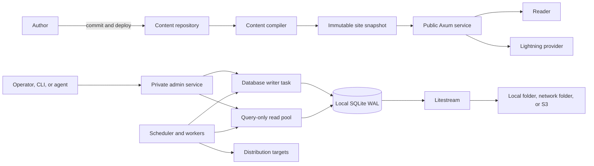
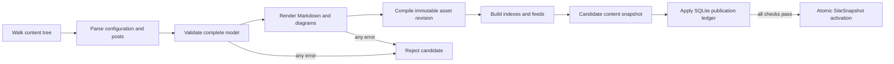
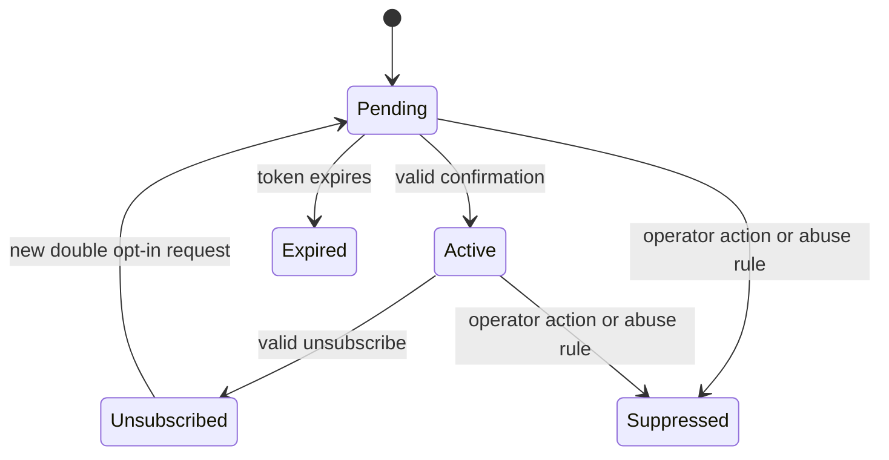
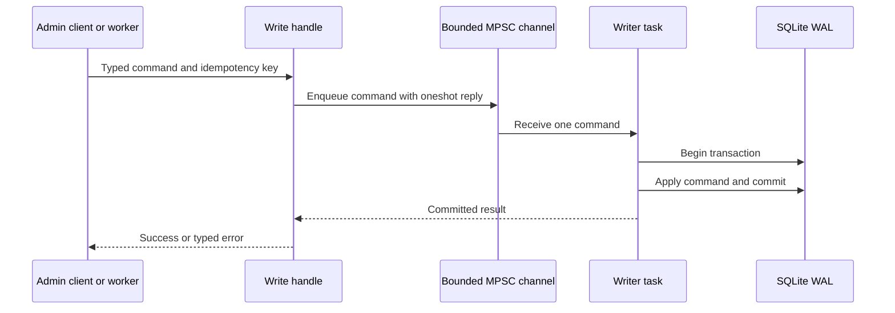
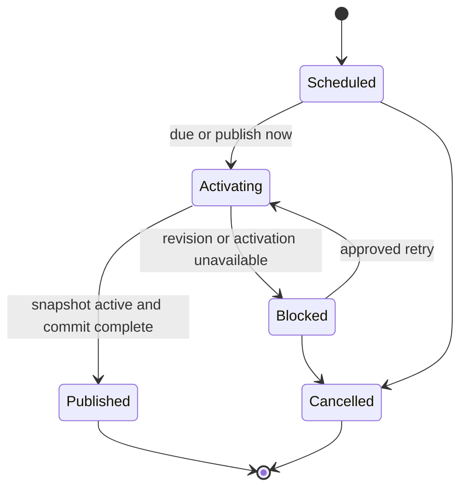
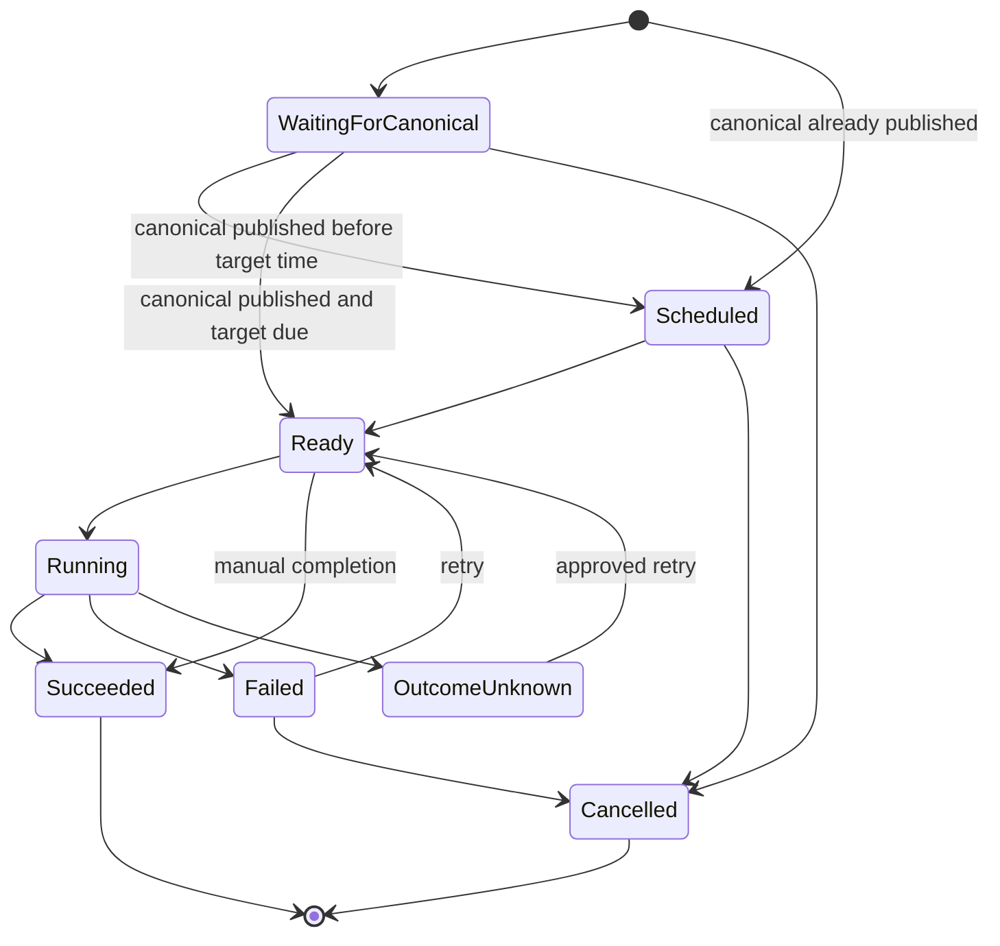

# Maincopy design

Status: accepted direction for v1
Last updated: 2026-08-29

## Purpose

Maincopy is a small, self-hosted publishing engine for technical writers. Git
stores the canonical Markdown. The author's domain stores the canonical
publication. Other networks provide discovery and distribution.

> One canonical copy. Every channel.

This document defines the durable v1 architecture. [IMPLEMENTATION.md](IMPLEMENTATION.md)
defines the delivery order and acceptance criteria.

## Product principles

### Content ownership comes first

The content repository contains every article and its declarative presentation
policy. Maincopy must remain replaceable without an article-body migration.

SQLite contains operational schedules, activation records, and delivery
history. It must never become a second content management system.

### The author's domain is canonical

Maincopy publishes the complete article on the author's domain. Feeds and
external networks link back to that canonical URL.

### Distribution cannot block publication

Canonical publication does not wait for an external network. A failed target
creates a failed attempt, but the article remains available.

### Server-rendered output is the default

Public pages use HTML, CSS, and SVG. JavaScript can enhance a feature, but it
cannot be required for reading or navigation.

### Features must earn their complexity

V1 uses one Rust crate, one service process, and one local SQLite database.
Maincopy adds a new component only when a current requirement needs it.

### Finite domains use strong types

A finite set of states, kinds, modes, versions, targets, or outcomes is an enum.
Application code does not represent that domain with raw strings or integers.

Semantically different values use different Rust types even when they share a
wire representation. For example, the admin API version and a feature-contract
version are separate enum types, even when both serialize as `v1`. Liveness and
readiness also use separate status enums inside a typed response wrapper.

Newtypes distinguish identifiers, digests, idempotency keys, timestamps,
addresses, and other primitives that are not interchangeable. A function must
accept the narrowest meaningful type instead of a generic `String`, integer, or
UUID.

Raw external values can exist only at an input, serialization, database, or
protocol boundary. Boundary code parses them into domain types before it calls
application logic. Serde and SQLx mappings use explicit stable names. An
unknown value fails with a typed error unless the protocol explicitly defines
forward-compatible unknown values.

Contract tests protect each serialized enum name. State-transition tests work
with enum variants, not string comparisons. A schema migration must accompany
a persisted enum change that is not backward compatible.

## V1 boundary

V1 is the first release that an author can operate on one host.

| Included in v1 | Deferred until after v1 |
| --- | --- |
| External Git-backed content repository | Browser content editor |
| TOML frontmatter | Multiple frontmatter formats |
| Content validation and immutable snapshots | Multi-author and multi-tenant hosting |
| Axum routes and Maud views | Comments, accounts, and analytics |
| RSS, sitemap, metadata, and redirects | Bulk newsletter campaigns and delivery |
| Local assets and allowlisted HTTPS CDN assets | Asset uploads and CDN management |
| Favicon and post preview images | Image transformation and optimization service |
| First-party email capture with double opt-in | Subscriber segmentation and campaign analytics |
| Code, ASCII, and Mermaid rendering | ActivityPub and WebFinger |
| Lightning invoice creation | Payment confirmation |
| SQLite publication and distribution ledger | Multiple active writer processes |
| Private admin API and minimal admin UI | General plugin system |
| Scheduled canonical publication and manual distribution jobs | Automatic closed-network adapters |
| Litestream backup and tested restore | High-availability database failover |
| Dedicated Nix flake and NixOS module | Theme marketplace |

The first automatic target adapter can follow v1. The v1 job model must support
that adapter without a schema redesign.

## System context



The public service and admin service run in one process. They use separate
listeners and separate trust boundaries.

## Source-of-truth boundaries

| Data | Authoritative store | Notes |
| --- | --- | --- |
| Article body and authored metadata | Git content repository | SQLite never stores article bodies. |
| Slugs and live redirects | Git content repository | Removing a published alias fails validation. |
| Presentation configuration | Git content repository | Secrets are not allowed. |
| Canonical schedule and activation | SQLite | A reload cannot publish an unscheduled post. |
| Runtime configuration | Host configuration | Paths, listeners, and limits live here. |
| Publication jobs and attempts | SQLite | Jobs bind to immutable content revisions. |
| Remote IDs and URLs | SQLite | Records describe completed external actions. |
| Subscriber consent and lifecycle | SQLite | These records contain protected personal data. |
| Credentials | Secret file or secret manager | Credentials never enter Git or SQLite. |
| Database backup | Litestream replica | Git content needs a separate Git backup. |

## Repository and runtime layout

The engine and publication content use separate repositories.

```text
/srv/maincopy/
|-- engine/                 # Maincopy checkout or Nix store path
|-- content/                # publication checkout
|   |-- publication.toml
|   |-- posts/
|   |-- drafts/
|   `-- assets/
|-- state/
|   |-- maincopy.db         # local disk only
|   `-- compiled-assets/

/run/maincopy/              # tmpfs runtime state, created at service start
|-- maincopy.lock
`-- admin.sock
```

The content path is always explicit. Maincopy does not require a Git submodule.
Production can use a Git worktree, a checkout, or a content-only deployment
artifact.

The live database, `-wal`, and `-shm` files must remain on local storage. A
network filesystem can hold only the Litestream replica.

## Configuration

Maincopy uses two configuration layers.

`publication.toml` travels with the content repository. It contains public site
metadata and feature choices.

The publication configuration selects a local or external favicon and lists
the external asset origins that content can use. For example:

```toml
[site]
favicon = "assets/favicon.png"

[assets]
allowed_https_origins = ["https://cdn.example.com"]

[subscriptions]
enabled = true
privacy_policy_revision = "2026-08-29"
```

`favicon` can also be an absolute HTTPS URL from an allowed origin. A post can
use a local asset or an absolute HTTPS URL from the same allowlist for its
preview image, Markdown images, and file links.

`maincopy.toml` belongs to the host. It contains paths, listeners, database
limits, and secret references.

Command-line arguments can override non-secret runtime settings. Secret values
come from environment variables, credential files, or a secret manager.

Maincopy validates the complete effective configuration before it opens a
listener.

## Content contract

V1 supports TOML frontmatter between `+++` delimiters.

```markdown
+++
id = "4f054633-2d09-4b05-97d0-c6f0011a5199"
title = "SQLite Does Not Need a Network"
slug = "sqlite-does-not-need-a-network"
authored_at = 2026-08-29T15:00:00-04:00
description = "A practical SQLite deployment model."
image = "https://cdn.example.com/posts/sqlite/cover-v1.webp"
tags = ["rust", "sqlite"]
aliases = ["sqlite-deployments"]
draft = false
tips = true

[distribution.x]
enabled = true
text = "SQLite is a file, but deployment still has coordination rules."
+++

# SQLite Does Not Need a Network
```

### Post fields

| Field | Requirement | Rule |
| --- | --- | --- |
| `id` | Required | It is a valid UUID and never changes. |
| `title` | Required | It is non-empty plain text. |
| `slug` | Required | It uses lowercase ASCII words and hyphens. |
| `authored_at` | Required | It includes a UTC offset. |
| `updated_at` | Optional | It is not earlier than `authored_at`. |
| `description` | Required | It supplies summaries and fallback copy. |
| `image` | Optional | It is a local asset or an allowed HTTPS URL. |
| `tags` | Optional | Maincopy normalizes case and rejects duplicates. |
| `aliases` | Optional | Each alias redirects to the current slug. |
| `draft` | Optional | The default is `false`. |
| `tips` | Optional | It inherits the publication default. |
| `distribution` | Optional | It contains target-specific policy and copy. |

`published_at` is not an authored frontmatter field in v1. Validation rejects
it so that Git and SQLite cannot provide conflicting publication times.

Draft posts validate but cannot be scheduled. A non-draft post is eligible for
publication, but it remains absent from every public route until SQLite records
its canonical activation.

The admin API supplies `scheduled_for`. SQLite records the actual
`published_at` time when activation completes. Public pages, feeds, and
structured metadata use that operational timestamp.

The canonical post route is `/posts/{slug}`. A slug change does not change the
post ID, feed GUID, or prior alias redirects.

Validation rejects duplicate IDs, slugs, aliases, and asset paths. Validation
also rejects path traversal and symlinks that escape the content root.

V1 disables raw HTML in Markdown. V1 also rejects authored SVG assets. The
diagram pipeline can emit sanitized SVG through one audited boundary.

### Local and external assets

Local assets remain the preferred content-owned path. The compiler digests and
copies them into the immutable snapshot asset directory.

An external asset URL must use HTTPS and match an origin in
`assets.allowed_https_origins`. The match includes the scheme, host, and port.
Maincopy rejects user information, fragments, non-HTTPS schemes, and origins
that are not listed.

V1 does not fetch, proxy, upload, or transform an external asset. The reader's
browser requests it directly. This rule keeps the compiler outside the server-
side request forgery boundary. The generated Content Security Policy derives
its external image origins from the same validated allowlist.

The post revision digest includes the normalized external URL. It cannot cover
bytes that a CDN changes at the same URL. Operators should use immutable,
versioned CDN URLs. Maincopy reports a validation warning for a URL that does
not appear versioned, but it does not guess from remote headers.

The site favicon follows the same rules. A local favicon receives an immutable
snapshot URL. An external favicon remains a direct allowlisted HTTPS URL.

### Revision identity

Each post revision receives a BLAKE3 digest. The digest includes:

- normalized frontmatter;
- the Markdown source;
- referenced asset paths and digests;
- effective renderer settings; and
- versioned renderer and sanitizer implementation identities;
- digests of deterministic rendered article fragments and generated asset
  bytes before snapshot-URL injection; and
- effective distribution settings.

The site snapshot also receives a digest. The snapshot digest covers the
publication configuration, every local site-asset path and byte digest,
normalized external site-asset URLs, the effective CDN allowlist, the
versioned site-shell renderer identity and its deterministic output digest
before snapshot-URL injection, all public post revision digests, and their
canonical activation timestamps. A same-path favicon or site-asset byte change
therefore creates a new snapshot URL. Golden tests require an explicit renderer
identity change when an implementation change alters output.

Git commit metadata is recorded when available. Content digests remain valid
when a deployment artifact does not include `.git`.

## Content compilation



The compiler aggregates independent validation errors. Each error identifies a
path, field, and stable error code.

Request handlers never parse Markdown, execute a diagram renderer, or read the
mutable content tree. They read an immutable `SiteSnapshot`.

Compiled assets live under a directory named by the snapshot digest. Public
asset URLs include that digest and use immutable cache headers.

The initial content snapshot must compile before the service becomes ready. A
later validation or other pre-swap reload failure keeps the current public
snapshot live.

After startup, `POST /api/admin/v1/reloads` is the only v1 reload trigger. The
CLI and deployment automation call this operation through the Unix socket.
Repeated requests coalesce with an in-progress reload and return the same
operation ID. V1 does not use an implicit file watcher.

A reload does not expose a post that has no canonical publication record. If a
published post receives a valid new Git revision, a successful reload updates
that public post and its derived indexes. V1 rejects a reload that changes an
already published post back to `draft = true`; unpublishing needs a separate
future design.

A published-revision update uses a durable reload operation so SQLite and the
in-memory snapshot cannot diverge silently:

1. Compile and validate the complete candidate without changing public state.
2. The writer commits an `Applying` reload operation that pins the expected
   current site digest, candidate site digest, and all changed post digests. It
   retains the candidate inputs and does not advance the current published
   digests.
3. Atomically swap the complete candidate `SiteSnapshot`. Pages, feeds,
   sitemap, indexes, and assets change together.
4. The writer advances the current published digests and changes the reload
   operation to `Applied` in one transaction. Only this commit acknowledges a
   successful reload.

A failure before step 3 leaves the old snapshot active. A failure after step 3
makes readiness fail and starts controlled shutdown; it is an incomplete
`Applying` operation, not a reported reload failure. Before listener binding,
startup reconciles every `Applying` operation by rebuilding and installing its
exact retained candidate, then committing step 4. Missing or corrupt retained
input fails startup closed. The service never infers the current published
digest from whichever files happen to be newest.

A scheduled canonical publication pins one post revision. A later content
reload cannot change the revision that the scheduler will publish. The
operator must cancel or replace the schedule to select another revision.

## Rendering boundary

Maud owns the page structure. The Markdown renderer owns article content.

Rendered Markdown crosses into Maud through one reviewed `PreEscaped` boundary.
All other strings use normal escaping.

Syntax highlighting and diagram rendering run during compilation. A
`DiagramRenderer` trait isolates Mermaid from the Markdown parser.

The selected Mermaid renderer must enforce input size, output size, execution
time, and concurrency limits. Maincopy sanitizes the resulting SVG before use.

The Mermaid implementation remains an implementation spike. V1 cannot release
until a representative fixture corpus passes.

## Public web contract

| Method and path | Purpose |
| --- | --- |
| `GET /` | Publication index |
| `GET /posts/{slug}` | Canonical article |
| `GET /tags/{tag}` | Tag index |
| `GET /archive` | Chronological archive |
| `GET /feed.xml` | RSS feed |
| `GET /sitemap.xml` | XML sitemap |
| `GET /robots.txt` | Crawler policy |
| `GET /assets/{revision}/{*path}` | Immutable compiled asset |
| `POST /subscriptions` | Start a double-opt-in subscription |
| `GET /subscriptions/confirm` | Render a confirmation result |
| `POST /subscriptions/confirm` | Confirm a pending subscription token |
| `GET /subscriptions/unsubscribe` | Render an unsubscribe confirmation form |
| `POST /subscriptions/unsubscribe` | Complete an unsubscribe request |
| `POST /posts/{slug}/tips/invoice` | Lightning invoice request |
| `GET /health/live` | Process liveness |
| `GET /health/ready` | Snapshot and subsystem readiness |

Public pages include canonical links, Open Graph metadata, and `BlogPosting`
JSON-LD. Feeds use stable post IDs as GUIDs and absolute canonical URLs.

HTML uses conditional requests and ETags. Immutable assets use a long cache
lifetime. Error pages do not expose internal paths or errors.

The public listener never serves admin routes.

### Subscription capture

Subscription capture is a first-party public feature. Maincopy stores consent
and subscriber lifecycle state, but v1 does not send newsletter campaigns.

V1 uses double opt-in. A form submission creates or refreshes a pending record
through the single database writer. Maincopy returns the same public response
for a new address, an existing address, and a suppressed address. This response
does not reveal whether an address exists.

The same transaction creates durable confirmation work in `email_outbox`. An
email worker claims that work in a short writer transaction. The claim creates
a single-use token digest and returns the raw token to worker memory. The worker
sends the message without a database transaction and records the sanitized
outcome through the writer. A process restart therefore cannot lose committed
confirmation work.

A crash after token creation can cause a retry to create another valid token.
The retry count and token count are bounded. The first successful confirmation
invalidates every outstanding confirmation token for that subscriber. This
rule keeps raw tokens out of SQLite without creating a commit-to-send loss gap.

The confirmation command changes the subscriber to `Active` and creates a
durable `SubscriptionControl` outbox item in one writer transaction. A worker
claim creates an unsubscribe-token digest and returns the raw token to memory.
The worker sends a control message with the unsubscribe link outside the
transaction. A successful unsubscribe invalidates every outstanding control
token for that subscriber.

A rate-limited subscription request for an already active address creates a
new control-message outbox item. The public response remains generic. This
operation lets a subscriber recover an unsubscribe link without revealing
membership.

The email transport is a replaceable trait. `email_outbox.kind` is a typed enum
with `Confirmation` and `SubscriptionControl` variants. V1 must select one SMTP
or provider-API implementation before this feature can be enabled. If no
transport is configured, Maincopy keeps the public subscription form disabled.
It must not accept an address and claim that it sent a message.

Confirmation and unsubscribe tokens have high entropy. SQLite stores only
token digests. Logs, metrics, audit events, error responses, and request IDs do
not contain raw email addresses or tokens.

Access logs record route templates, not query strings. The supported browser
gateway must apply the same rule because an emailed control link contains an
opaque token. A GET request can render a confirmation form, but only a POST can
confirm or unsubscribe. This rule prevents email link scanners from changing
subscriber state.

The public endpoints use request-body limits, per-source rate limits, a hidden
bot field, and strict Origin policy for browser submissions. The stored consent
record includes the UTC time, consent source, and privacy-policy revision.

A subscription has one of these states:



The admin service can list, export, suppress, and delete subscription records.
These operations require full admin-socket authority in v1 and create redacted
audit events. Export is an explicit action; no public route exposes subscriber
data.

## Operational database

SQLite stores operational history. It does not store Markdown or rendered
article HTML.

### Concurrency model



Exactly one Tokio task owns exactly one write connection. Every runtime write
uses one bounded `mpsc` channel.

Cloning the database handle clones only the channel sender and read pool. A
clone never creates another writer task.

The writer uses typed commands. It does not accept arbitrary SQL closures. One
command contains one complete transaction.

Each command includes a `oneshot` reply. A successful reply means that SQLite
committed the transaction.

If the caller disconnects after enqueue, the writer still completes the
command. Idempotency keys make safe retries possible.

Network calls never run on the writer task. A worker claims work in one short
transaction, performs the network call, then records the result in another
transaction.

### Direct reads

Reads use a separate, bounded SQLx pool. Each reader connection uses read-only
mode and `PRAGMA query_only=ON`.

The database uses WAL mode. WAL readers can run while the writer commits. A
reader uses a short transaction when several queries need one consistent
snapshot.

Maincopy does not checkpoint before ordinary reads. New read transactions see
committed WAL data without a checkpoint.

Every applicable connection enables foreign keys and a busy timeout. Startup
sets and verifies `journal_mode=WAL` before it opens the read pool.

V1 uses `synchronous=NORMAL`. This choice is paired with Litestream replication
and a tested restore procedure.

### Process ownership

The `serve` process acquires an exclusive lock before it opens the write
connection. A second writer process fails before it mutates the database.

The CLI and admin UI never open SQLite for writes. They send requests to the
running admin service.

If the admin service is unavailable, mutating CLI commands fail with an
actionable error. They never fall back to direct writes.

### Initial schema

| Table | Purpose |
| --- | --- |
| `site_revisions` | Records activated site snapshots and Git commits. |
| `post_revisions` | Records stable IDs, slugs, and revision digests. |
| `published_routes` | Remembers public slugs and aliases across restarts. |
| `reload_operations` | Reconciles published-revision snapshot swaps and digest commits. |
| `canonical_publications` | Stores pinned schedules and canonical activation state. |
| `publication_jobs` | Stores schedules, immutable payloads, and job state. |
| `publication_attempts` | Stores each target attempt and sanitized outcome. |
| `remote_publications` | Stores remote IDs and canonical remote URLs. |
| `subscriptions` | Stores normalized addresses, consent, and lifecycle state. |
| `subscription_tokens` | Stores confirmation and unsubscribe token digests. |
| `email_outbox` | Stores confirmation and subscription-control work with sanitized outcomes. |
| `audit_events` | Stores admin actor, action, request ID, and timestamp. |

Scheduled payloads contain a schema version. An upgrade must migrate or reject
an incompatible pending payload. It must never reinterpret one silently.

### Failure behavior

- A full queue applies backpressure before it returns `503 Retry-After`.
- A closed queue returns `writer_unavailable`.
- An unexpected writer exit makes readiness fail and starts controlled shutdown.
- A failed transaction changes no rows.
- A disk-full or corruption error stops new writes and preserves diagnostics.
- A long read transaction can delay checkpoints and grow the WAL.

The service records queue depth, enqueue latency, transaction latency, pool
wait time, writer health, WAL size, and checkpoint results.

## Private admin plane

The canonical admin transport is HTTP/JSON over a Unix domain socket. The
default path is `/run/maincopy/admin.sock`.

The runtime creates the parent directory with restricted permissions. The
socket uses owner or group permissions as the first authorization boundary.

Admin TCP is disabled by default. Development can enable a loopback listener.
Production browser access requires an authenticated reverse proxy or SSH
tunnel to the Unix socket.

The admin UI is served by the admin listener. It is never added to the public
router. State-changing forms use CSRF and Origin validation when a browser
gateway is enabled.

### Agent and CLI contract

The API prefix is `/api/admin/v1`. It publishes an OpenAPI document and a
capability endpoint.

Maincopy generates OpenAPI 3.1 with `utoipa` and `utoipa-axum`. Request,
response, parameter, error, enum, and newtype contracts derive `ToSchema` where
applicable. Each handler uses `utoipa::path`. One `OpenApiRouter` registry
creates both the Axum routes and their OpenAPI operations. A central `OpenApi`
derive supplies document metadata and shared components, but it does not keep
a second operation list. The generated document is the contract; Maincopy does
not maintain a separate handwritten schema.

The admin router serves the JSON document at
`GET /api/admin/v1/openapi.json`. The route is available only through the admin
transport. A human documentation viewer can be added to the admin UI, but it
must consume this same generated document and use vendored or pinned assets.

Contract tests exercise each generated route, validate enum wire values, and
parse the output as an OpenAPI 3.1 document. Admin API operations must be added
with the documented `OpenApiRouter::routes` boundary; raw Axum `.route` calls
are forbidden in the admin API registry. Thus a handler registration creates
its runtime route and contract operation together.

JSON timestamps use RFC 3339 UTC. Lists use cursor pagination. Every response
includes a request ID.

Every admin mutation accepts an idempotency key. A create operation binds the
expected post and site revision when applicable. An update or delete operation
also requires the expected resource version. These fields prevent duplicate
actions and lost updates.

Errors use one stable envelope:

```json
{
  "error": {
    "code": "job_conflict",
    "message": "The job changed after the client loaded it.",
    "request_id": "01J...",
    "details": {}
  }
}
```

The CLI supports JSON output and stable exit codes. Agents never need to parse
human-formatted tables.

The admin API exposes fixed operations only. It never exposes a shell command,
raw SQL, or arbitrary file access.

### V1 admin resources

| Method and path | Purpose |
| --- | --- |
| `GET /api/admin/v1/capabilities` | API and feature versions |
| `GET /api/admin/v1/posts` | Active and pending post revisions |
| `POST /api/admin/v1/reloads` | Compile and activate a content snapshot |
| `POST /api/admin/v1/previews` | Build a target representation preview |
| `GET /api/admin/v1/publications` | List canonical schedules and activations |
| `POST /api/admin/v1/publications` | Schedule or immediately publish a pinned revision |
| `GET /api/admin/v1/publications/{id}` | Read canonical and target state |
| `POST /api/admin/v1/publications/{id}/cancel` | Cancel an eligible schedule |
| `POST /api/admin/v1/publications/{id}/publish-now` | Advance an eligible schedule |
| `GET /api/admin/v1/jobs` | List and filter publication jobs |
| `POST /api/admin/v1/jobs` | Create and schedule a job |
| `GET /api/admin/v1/jobs/{id}` | Read job state and target status |
| `POST /api/admin/v1/jobs/{id}/cancel` | Cancel eligible work |
| `POST /api/admin/v1/jobs/{id}/retry` | Retry failed or unknown targets |
| `POST /api/admin/v1/jobs/{id}/complete` | Record manual completion |
| `GET /api/admin/v1/subscriptions` | List subscription records |
| `POST /api/admin/v1/subscriptions/export` | Create a protected export |
| `POST /api/admin/v1/subscriptions/{id}/suppress` | Suppress future messages |
| `DELETE /api/admin/v1/subscriptions/{id}` | Delete a subscription record |
| `GET /api/admin/v1/openapi.json` | Machine-readable API contract |

The minimal admin UI provides preview, canonical schedule, publish-now,
publication detail, target-job detail, cancel, retry, and manual completion
screens. It does not edit article content.

## Canonical publication and target jobs

A canonical publication binds one stable post ID, one retained post revision
digest, one optional source commit, one scheduled UTC instant, and an optional
set of target jobs. Content changes never mutate this pinned revision. An
operator must cancel and replace an eligible schedule to select another
revision.

The create command stores the canonical schedule and one child job per selected
target in one writer transaction. A successful `202 Accepted` response means
that this transaction committed; it does not mean that publication ran.



At the scheduled time, Maincopy uses this sequence:

1. The writer changes `Scheduled` to `Activating`, records one activation UTC
   timestamp, and keeps each target job in `WaitingForCanonical`.
2. The scheduler builds and atomically swaps a public `SiteSnapshot` that
   contains the pinned revision and committed activation timestamp. It does not
   hold a database transaction.
3. The writer copies that timestamp to `published_at`, changes the canonical
   state to `Published`, and releases due target jobs in one transaction.

An `Activating` database row does not make a post visible by itself. The atomic
snapshot swap in step 2 is the only visibility point. At steady state, every
public post has a `Published` row. During the short activation interval, the
coordinator can serve the one claimed `Activating` revision after its snapshot
swap and before the final commit. Pages, feeds, sitemap, indexes, and asset
routes all consume that same snapshot and therefore change visibility at the
same point. Startup resolves all `Activating` rows before it opens a listener.

No target can run before the canonical snapshot is active. A target failure
cannot roll back the canonical post. If the final writer command fails after
the snapshot swap, readiness fails and controlled shutdown starts. Startup
reconciles every `Activating` record before it opens a listener.

After downtime, v1 immediately activates an overdue schedule and records both
the requested and actual times. The admin UI displays the delay. It never
silently changes the requested time.

Each target job binds one target, the same post revision, a bounded immutable
payload and digest, one payload schema version, and its own scheduled UTC
instant. The publication detail resource aggregates related one-target jobs.
SQLite does not store canonical Markdown.

Maincopy retains a compiled revision while a scheduled or non-terminal record
refers to it. If the revision or payload is missing, the canonical publication
or job becomes blocked with `revision_unavailable`.



V1 manual targets become `Ready` only after the canonical post is public and
the target time is due. An operator or agent posts the prepared copy and
records completion.

Future automatic adapters use the same jobs. Delivery is at least once because
a crash can occur after a remote side effect but before the result commit. An
adapter uses a stable target idempotency key when the remote API supports one.
Otherwise, an ambiguous crash result becomes `OutcomeUnknown`.

Attempts use durable leases. Startup recovers expired `Running` attempts before
the scheduler accepts new work. A retry selects only an eligible failed or
unknown target and never repeats a successful target.

## Lightning tips

The public tip form submits an amount to the server. The server resolves the
configured Lightning Address and requests an LNURL-pay invoice.

The network layer treats all provider data as untrusted. It:

- permits only expected schemes;
- resolves and validates every destination;
- rejects private, loopback, and link-local addresses;
- validates again after redirects and DNS changes;
- bounds response size and request duration;
- caps the amount; and
- verifies the returned BOLT11 invoice amount and expiry.

Maincopy vendors the QR component and its license. Plain invoice text and wallet
links remain usable when JavaScript is disabled.

V1 does not confirm payment.

## Startup and shutdown

`src/main.rs` is the process entry point. Its async Tokio `main` function
imports and calls `startup::run_until_stop`. It can initialize bootstrap
logging before that call. It does not load typed application configuration,
bind listeners, open the database, construct handlers, or spawn background
components.

`src/startup.rs` parses a typed `ProcessCommand`, loads the configuration for
that command, and performs process dispatch. `Serve` constructs the server
`Application`. Admin-client commands use the UDS API and do not construct the
server or open SQLite. This arrangement preserves the exact no-argument
`run_until_stop().await` boundary without a global configuration singleton.

For `Serve`, `src/startup.rs` owns configuration validation, dependency
construction, listener binding, task supervision, and graceful shutdown. Its
`Application` value owns the public server, admin server, writer task,
scheduler, workers, cancellation token, socket cleanup, and process lock.

The public and admin router constructors remain separate from listener binding.
Tests can construct either router with injected state and call it through Tower
without starting a process. Integration tests can inject ephemeral listeners,
a clock, and a shutdown future.

The application supervisor observes both servers and every critical background
task. An unexpected exit from a server, writer, or scheduler makes readiness
fail, cancels the other components, drains accepted work, and returns an error.

Before either listener binds, startup reconciles all durable `Applying` reload
operations and all canonical `Activating` records. Public requests therefore
never observe an unresolved recovery state after process start.

Startup follows this order:

1. Parse and validate configuration.
2. Acquire the process lock.
3. Open the write connection and configure WAL.
4. Apply embedded migrations.
5. Open the query-only read pool.
6. Spawn the writer task.
7. Compile the initial site snapshot.
8. Reconcile canonical activations, durable jobs, and expired leases.
9. Bind the public and admin listeners.
10. Mark the service ready.

Shutdown follows this order:

1. Stop accepting public and admin requests.
2. Stop the scheduler from claiming work.
3. Drain active requests and workers.
4. Reject new database commands.
5. Drain accepted database commands.
6. Close the read pool and writer connection.
7. Remove the admin socket and release the process lock.
8. Let the service manager stop Litestream after its final synchronization.

Maincopy does not force a WAL checkpoint during ordinary shutdown. Litestream
owns its compatible checkpoint and replication policy.

## Backup and recovery

Litestream is the supported SQLite backup tool. It runs beside Maincopy and
replicates the local WAL database.

Development uses a separate local replica folder. This setup tests replication
and restore behavior, but it does not protect against disk loss.

Production uses S3 or a network-mounted replica folder. Credentials come from
the deployment secret mechanism.

The replicated database contains subscriber personal data when subscription
capture is enabled. Replica access, encryption, retention, and deletion
procedures must satisfy the same privacy boundary as the live database.

Maincopy never places the live database on the network mount.

A restore is an offline operation:

1. Stop Maincopy and Litestream.
2. Preserve the existing database and sidecar files.
3. Restore into a new local path.
4. Run the offline restore verifier. It performs `PRAGMA integrity_check`,
   schema compatibility, pending-payload checks, and subscriber retention and
   deletion checks without opening a listener.
5. Review the verifier's redacted subscriber-state report. When the database
   contains subscriber data, record explicit operator acceptance bound to the
   restored database digest.
6. Start Maincopy. It applies supported migrations and repeats the restore
   gates before it binds either listener or becomes ready.
7. Verify canonical publication, target, subscriber, and audit records through
   the admin service.
8. Restart Litestream replication.

Maincopy fails closed when the offline acceptance marker is missing, does not
match the database digest, or a repeated gate fails. A retained recovery point
can predate a subscriber deletion. The report must expose that risk before any
restored subscriber state becomes available to an operator or worker.

The release process must exercise this restore sequence. Production operations
must record the achieved recovery point and recovery time.

## Nix and release model

The repository owns a dedicated, locked Nix flake. It provides:

- `packages.default`;
- `apps.default`;
- `checks`;
- `devShells.default`;
- `formatter`; and
- `nixosModules.default` before v1.

The development shell contains Rust, SQLite tools, Litestream, and the Nix
formatter.

GitHub Actions runs flake checks, builds, Rust formatting, Clippy, and tests on
pull requests and pushes to `master`.

V1 releases start from a signed, annotated Semantic Versioning tag. The release
workflow verifies the tag signature, trusted signing-key fingerprint, tag-to-
`Cargo.toml` version match, and reachability from `master` before it can publish.

The release workflow uses a protected GitHub environment with explicit owner
approval. It builds and tests the tag once, creates a draft GitHub Release with
source archives, checksums, and the dependency inventory, then publishes that
same source version to crates.io and FlakeHub. The GitHub Release becomes final
only after both publication jobs succeed.

The crates.io job uses a narrowly scoped registry token stored in the protected
release environment. The FlakeHub job uses GitHub Actions OIDC and the pinned
`flakehub-push` action. Ordinary CI has neither release credentials nor
`id-token: write`. Every third-party action uses an immutable commit SHA.

A rerun must detect an already published version and verify it instead of
trying to overwrite it. The owner must approve any recovery from a partially
completed release because crates.io versions are immutable.

The project can enter nixpkgs after it has a stable license, users, and a
maintainer commitment.

## Module layout

Maincopy starts as one crate.

```text
src/
|-- main.rs
|-- lib.rs
|-- startup.rs
|-- cli.rs
|-- config.rs
|-- error.rs
|-- content/
|-- render/
|-- web/
|-- admin/
|-- database/
|-- jobs/
|-- distribution/
|-- subscriptions/
`-- lightning/

migrations/
static/
examples/content/
tests/fixtures/
```

The project can split crates only after stable code boundaries appear.

## Required quality gates

V1 must prove these properties:

- Invalid content cannot replace a working snapshot.
- Draft, unpublished, and scheduled content cannot leak through public output.
- A target job cannot become ready before its canonical post is active.
- Readers continue during sustained serialized writes.
- Every runtime write uses the one shared writer task.
- No network call holds a database transaction.
- Duplicate admin requests create one durable action.
- Duplicate subscription requests do not reveal membership or create duplicate active records.
- Raw email addresses and subscription tokens never enter logs or public errors.
- Job recovery handles crashes before and after remote side effects.
- Public routing exposes no admin endpoint.
- Hostile Lightning responses fail closed.
- Litestream can restore the complete operational history.
- A clean checkout passes `nix flake check` and `nix build`.

## Open implementation decisions

The following decisions do not change the architecture:

- Select the Mermaid renderer after the compatibility spike.
- Select the authenticated browser gateway for production admin access.
- Select the confirmation email transport and retention policy before subscription capture is enabled.
- Set queue, pool, retry, and retention defaults from measured tests.
- Choose the final FlakeHub cache tier before v1 release.

## References

- [SQLite write-ahead logging](https://sqlite.org/wal.html)
- [Tokio synchronization and channels](https://docs.rs/tokio/latest/tokio/sync/)
- [SQLx SQLite connection options](https://docs.rs/sqlx/latest/sqlx/sqlite/struct.SqliteConnectOptions.html)
- [Litestream operation](https://litestream.io/how-it-works/)
- [Litestream configuration](https://litestream.io/reference/config/)
- [FlakeHub publishing](https://docs.determinate.systems/flakehub/publishing/)
