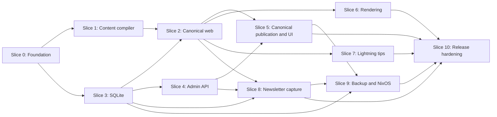
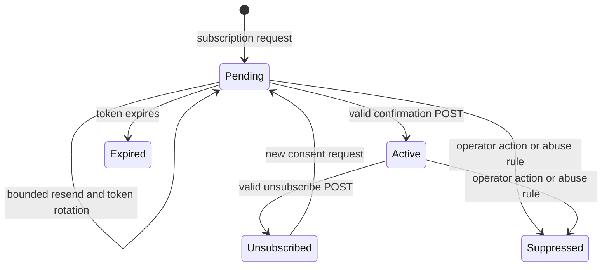

# Maincopy v1 implementation plan

Status: executable plan for v1
Last updated: 2026-08-29

## Purpose

This plan converts the accepted [design](DESIGN.md) into reviewable work.
Each work package must produce a working increment with tests.

Maincopy v1 is complete when Slice 10 passes its release gate.
Crate and flake publication require a separate owner approval.

## Delivery rules

- Keep v1 in one Rust crate and one service process.
- Keep each pull request small enough for one focused review.
- Merge infrastructure only when a product slice needs it.
- Add each dependency in the pull request that first uses it.
- Pin Rust dependencies in `Cargo.lock`.
- Pin Nix inputs in `flake.lock`.
- Run continuous integration on pull requests and pushes to `master`.
- Keep the repository private until the owner approves public release.
- Do not add a browser content editor in v1.
- Do not add an automatic social-network adapter in v1.
- Do not add bulk newsletter sending in v1.

A pull request can split one work package when review risk is high.
It must not combine unrelated work packages for convenience.

## Non-negotiable code boundaries

`src/main.rs` must stay tiny. Its asynchronous Tokio `main` must use
`maincopy::startup::run_until_stop` and call `run_until_stop().await`.

`src/main.rs` can install bootstrap logging. It must not load typed application
configuration, bind a listener, open SQLite, or spawn a long-lived task. The
no-argument call boundary does not use global configuration state.

V1 intentionally selects startup-owned typed configuration. The accepted
allowance for `main.rs` to read a configuration file did not require that
choice. The exact no-argument `run_until_stop().await` expression and the ban on
global configuration state make `src/startup.rs` the owner unless a future
change explicitly revises the function signature.

The final two lines of `src/main.rs` must remain:

```rust
    run_until_stop().await
}
```

Keep `src/main.rs` below 20 non-blank lines.

`src/startup.rs` owns process dispatch, application wiring, and lifecycle
behavior. It must:

- parse one typed `ProcessCommand`;
- load and validate the configuration required by that command;
- dispatch `Serve` to `Application` and admin commands to the UDS client;
- construct concrete dependencies;
- acquire the process lock;
- start the database components;
- compile the initial site snapshot;
- bind both listeners;
- supervise background tasks;
- coordinate readiness;
- handle termination signals; and
- perform ordered shutdown.

`src/startup.rs` must define the `run_until_stop` composition boundary. The
`#[tokio::main]` macro in `src/main.rs` creates the runtime first.

The free `run_until_stop` function must parse and dispatch one command. For
`Serve`, it builds an `Application` and invokes
`Application::run_until_stop`. Admin-client commands call the versioned UDS
API and return without constructing server state. `Application` owns all
supervised components and cleanup guards.

Startup can call component constructors. No handler can construct a database,
network client, scheduler, or renderer.

`src/lib.rs` exposes testable components and the startup boundary. Domain
components must accept explicit dependencies, clocks, and clients where tests
need control.

The library must not perform work during import. Avoid process-wide mutable
singletons and hidden service locators.

Use these dependency directions:

```text
src/main.rs -- Tokio runtime and optional bootstrap logging
    |
    v
startup::run_until_stop() ---- builds Application
    |
    v
Application::run_until_stop() ---- supervises tasks and shutdown
    |
    v
src/lib.rs modules ---- expose testable domain components
    |
    v
traits and domain types ---- do not depend on startup or handlers
```

The startup tests must inject listeners, shutdown signals, and task failures.
Component tests must not start the production process composition root.

## Architecture invariants

Every slice must preserve these invariants:

1. Git owns article source and presentation metadata.
2. SQLite owns canonical scheduling, activation, and delivery state.
3. Request handlers read an immutable `SiteSnapshot`.
4. A failed compilation cannot replace the active snapshot.
5. The public router cannot serve an admin route.
6. The Unix domain socket is the canonical admin transport.
7. Exactly one Tokio task owns the runtime SQLx write connection.
8. Every runtime database write uses one bounded command channel.
9. Read connections use a bounded, query-only SQLx pool.
10. No network call can hold a database transaction.
11. A canonical article never waits for a distribution target.
12. A job binds an immutable post revision and payload version.
13. The live SQLite database always uses local storage.
14. Public reading and navigation do not require JavaScript.
15. Maincopy never fetches or proxies an external content asset.
16. Subscription acceptance and email work commit in one transaction.
17. Logs, metrics, and audit events contain no raw email or control token.
18. A target job cannot become eligible before canonical publication.
19. Canonical `published_at` comes only from a committed SQLite activation.
20. Finite domains use enums, and non-interchangeable primitives use distinct
    wrappers.
21. The remote Lexe node is authoritative for payment state; an SDK cache is
    disposable.
22. Payment failure can disable tips, but it cannot make an article unavailable
    or fail core article readiness.
23. The operator provisions Maincopy's Lexe credential with receive and read
    scopes only. Maincopy contains no spend operation.
24. Startup catch-up and the long-lived payment-update subscriber use one
    provider-neutral validation path and one durable opaque update cursor.

### Strong-type policy

Use an enum for every finite set of states, kinds, modes, versions, targets,
commands, and outcomes. Do not pass a raw string or integer through application
code when the set of valid values is known.

Use separate enums or newtype wrappers for values that serialize to the same
primitive but have different meanings. Examples include API versions, feature
contract versions, post IDs, publication IDs, job IDs, revision digests,
idempotency keys, and email-control tokens.

Use `time::OffsetDateTime` directly for operational timestamps. Normalize
constructed values to `UtcOffset::UTC`, and annotate Serde fields with
`time::serde::rfc3339`. Do not add a custom timestamp wrapper, parser, error,
or module.

Parse external strings at the boundary. Domain and application functions must
receive the parsed type. Define explicit Serde and SQLx names for wire and
storage compatibility. Do not use `String` as an escape hatch for a state that
the compiler can make exhaustive.

Every new enum must have contract tests for its stable serialized form. Every
state-machine enum must have exhaustive legal-transition and illegal-transition
tests. Add an intentional `Unknown` variant only when an external protocol
requires forward compatibility and the application has defined safe behavior
for it.

## Slice dependencies



Slices 1 and 3 can run in parallel after Slice 0.
Rendering and Lightning tips can run in parallel after Slice 2.

## Review stacks

Use a formal GitHub pull request (PR) stack when a slice has dependent work
packages. Use one branch and one PR for each layer.

The bottom PR targets `master`. Each higher PR targets the branch directly
below it.

```text
master <- work-package branch 1 <- branch 2 <- branch 3
```

Each PR body must name its slice, layer number, base PR, and dependent PRs.
Each PR must also link the complete slice acceptance gate.

Do not target every layer at `master`. This would show cumulative diffs instead
of the isolated layer diff.

Do not start a dependent slice stack until its prerequisite slice has merged.
Slices 1 and 3 use separate stacks after Slice 0 merges.

| Stack | Bottom-to-top PR layers | Prerequisite |
| --- | --- | --- |
| Foundation | 0.1 -> 0.2 -> 0.3 -> 0.4 | None |
| Content compiler | 1.1 -> 1.2 -> 1.3 -> 1.4 -> 1.5 -> 1.6 | Slice 0 |
| Canonical web | 2.1 -> 2.2 -> 2.3 -> 2.4 -> 2.5 | Slices 1 and 3 |
| SQLite core | 3.1 -> 3.2 -> 3.3 -> 3.4 -> 3.5 | Slice 0 |
| Admin API | 4.1 -> 4.2 -> 4.3 -> 4.4 | Slice 3 |
| Canonical publication | 5.1 -> 5.2 -> 5.3 -> 5.4 -> 5.5 | Slices 2 and 4 |
| Rendering | 6.1 -> 6.2 -> 6.3 -> 6.4 | Slice 2 |
| Lightning tips | 7.1 -> 7.2 -> 7.3 -> 7.4 | Slice 2 |
| Newsletter capture | 8.1 -> 8.2 -> 8.3 -> 8.4 -> 8.5 | Slices 2, 3, and 4 |
| NixOS and restore | 9.1 -> 9.2 -> 9.3 -> 9.4 -> 9.5 | Slices 3, 5, and 8 |
| Release hardening | 10.1 -> 10.2 -> 10.3 -> 10.4 | All prior slices |

Run focused tests on each layer. Run the full slice gate on the top layer.

If a lower layer changes, cascade that change through each higher branch.
Verify the isolated diff and full stack again before review.

Planning these stacks does not authorize remote pushes, PR creation, rebases,
or merges. Obtain the required authority before each external action.

Before creating a stack, verify the installed `gh stack` commands. Preserve
formal stack metadata, linear branch history, and the exact base for each PR.

## Dependency register

The lock files select exact versions. Each selection must support the active
Rust toolchain and the project license.

| Concern | Expected dependency or decision | First slice |
| --- | --- | --- |
| Async runtime and channels | Tokio | 0 |
| Command-line parsing | Clap with derive-based typed subcommands | 0 |
| Serialization and TOML | Serde and a TOML parser | 0 |
| Errors and diagnostics | Typed library errors and startup context | 0 |
| Tracing and metrics | Select maintained tracing and metrics facades | 0 |
| UUIDs | `uuid` with only the features used by typed identifiers | 0 and 1 |
| Operational time | `time::OffsetDateTime` with `serde-well-known`; no custom timestamp type | 0 and 1 |
| Revision digests | BLAKE3 | 1 |
| Tree walking | Select a walker with explicit symlink control | 1 |
| Asset URLs and origins | Select one standards-compliant URL parser | 0 and 1 |
| Markdown | Select a CommonMark implementation through fixtures | 1 |
| Snapshot activation | Select a lock-free or short-lock `Arc` swap | 1 |
| HTTP service | Axum and Tower | 0 and 2 |
| HTML templates | Maud | 2 |
| Frontend asset build | A custom deterministic `build.rs` with reviewed CSS and JavaScript minifiers | 2 |
| SQLite | SQLx with SQLite and embedded migrations | 3 |
| Process lock | Select a cross-process file-lock implementation | 3 |
| OpenAPI | `utoipa` and `utoipa-axum` with stable path/schema ordering | 0 and 4 |
| Syntax highlighting | Select through the rendering corpus | 6 |
| Mermaid | Select through the required implementation spike | 6 |
| SVG sanitization | Use an explicit SVG allowlist boundary | 6 |
| Lightning receive boundary | Provider-neutral domain types with a closed provider enum and exhaustive delegation | 7 |
| Lexe adapter | Pin the public crates.io `lexe` SDK at 0.1.22 with its minimal feature set | 7 |
| BOLT11 invoices | `lightning-invoice`; parse and verify provider output before it enters the domain | 7 |
| QR generation | Select a vendorable component with a compatible license | 7 |
| Email transport | Select a consent-message-only transport behind a trait | 8 |
| Subscription tokens | Use a cryptographic generator and stored token digests | 8 |
| Database replication | Litestream executable from the Nix closure | 9 |
| Reproducible build | Nix, Crane, and the project flake | 0 and 9 |

Do not add a library only because a later slice might need it.
Record the license and feature flags for each direct dependency.

## Implementation decisions and remaining gates

A fixed row is binding. Resolve each selection row before its due work starts.

| Decision | Required resolution | Status | Due before |
| --- | --- | --- | --- |
| Job cardinality | Use one job per target in v1. Link related jobs by post revision in views. | Fixed | 5.1 |
| Git metadata | Make the Git commit optional. Always require the content digest. | Fixed | 5.1 |
| Pinned revision retention | Retain revisions used by non-terminal jobs. Treat unexpected loss as `revision_unavailable`. | Fixed | 5.1 |
| Create precondition | Require the expected post and site revision on job creation. | Fixed | 5.3 |
| Adapter crash tests | Ship no adapter. Use a deterministic test adapter for the job protocol. | Fixed | 5.5 |
| OpenAPI generator | Use `utoipa` schemas plus one `utoipa-axum` registry that creates routes and operations together. | Fixed | 0.1 |
| Browser gateway | Select the production gateway and actor-identity contract. | Select | 9.2 |
| Mermaid engine | Select only after the fixture and limit spike passes. | Select | 6.2 |
| Metrics export | Select the export path without adding it to the public router. | Select | 3.5 |
| Email transport | Select one transport for confirmation and subscription-control messages only. | Select | Slice 8 |
| Email normalization | Define the minimal, standards-safe comparison rule. | Select | 8.1 |
| Subscriber retention | Set pending, unsubscribed, token, audit, and backup retention. | Select | 8.1 |
| Recovery targets | Set measurable recovery point and recovery time targets. | Select | 9.4 |

The canonical publication scheduler controls first public visibility.
It uses the SQLite schedule and a post revision pinned at creation.

Target jobs wait until the related canonical publication is `Published`.
The admin API and UI can schedule, cancel, inspect, or publish now.

## Test strategy

Use the smallest test that can prove a property.

| Test level | Purpose |
| --- | --- |
| Unit | Validate domain rules, state transitions, and error codes. |
| Component | Test a module with real storage or a controlled fake dependency. |
| Router | Call Axum services without a network socket. |
| Process | Start the real binary with temporary paths and sockets. |
| Fault injection | Force failures at commit, task, network, and shutdown boundaries. |
| Golden fixture | Protect HTML, XML, JSON, digest, and rendering contracts. |
| Property test | Explore normalization, path, time, and state-machine inputs. |
| NixOS virtual machine | Prove service permissions, ordering, backup, and restore. |

Tests must use an injected clock for schedule behavior.
Tests must use temporary local directories for SQLite and socket files.
Tests must not use a developer's home directory or real credentials.

### Router and transport harness

`src/lib.rs` must export pure `public_router` and `admin_router` constructors.
Each constructor must accept explicit state and return an Axum router.

Router tests must call `tower::ServiceExt::oneshot` without binding a socket.
Use these tests for routes, middleware, bodies, headers, and error contracts.

Provide one `TestServer` only for behavior that needs a transport. It must use
`127.0.0.1:0` or an injected listener.

`TestServer` must expose its selected address and an explicit shutdown handle.
Its shutdown method must await listener and task completion.

Use a Unix-socket process harness for socket permissions and stale-path tests.
Do not use `TestServer` when `ServiceExt::oneshot` can prove the property.

## Slice 0: Foundation and continuous integration

### Goal

Create a reproducible crate with a tested process boundary.
Establish checks that every later pull request must pass.

### Work package 0.1: Crate and composition root

Create the initial library modules and preserve the required code boundaries.

Deliverables:

- A tiny async Tokio `src/main.rs` with
  `use maincopy::startup::run_until_stop;`.
- A `src/main.rs` that ends with `run_until_stop().await` and `}`.
- Optional bootstrap logger setup in `src/main.rs` only.
- Typed process-command parsing and dispatch in `src/startup.rs`.
- A `src/startup.rs` composition root with documented startup stages.
- A free `run_until_stop` function that builds `Application` only for `Serve`.
- An `Application::run_until_stop` method that supervises tasks and shutdown.
- A `src/lib.rs` that exposes testable components.
- Empty module boundaries for configuration, errors, content, web, admin,
  database, jobs, rendering, distribution, and payments.
- A startup result that maps typed failures to a process exit code.
- Typed status and version enums for the first public and admin contracts.
- `utoipa` schemas and one `utoipa-axum` registry that generates the admin
  routes and OpenAPI operations together.

Tests:

- Assert that `--help` exits successfully without opening runtime state.
- Reject an unknown command without opening runtime state.
- Dispatch an admin command without building `Application`.
- Verify that Tokio constructs the runtime before `run_until_stop` runs.
- Inject an early startup failure and verify that later stages do not run.
- Inject a termination signal and verify one ordered shutdown request.
- Check that `src/main.rs` contains no listener, storage, scheduler, or worker
  wiring.
- Verify the stable JSON names of every foundation status and version enum.
- Parse the generated OpenAPI document and verify the same enum values.

### Work package 0.2: Configuration, errors, and observability

Implement layered configuration without a listener or database dependency.

Deliverables:

- Typed `publication.toml` and `maincopy.toml` loaders.
- Command-line overrides for non-secret runtime settings.
- Secret references that never print their values.
- Stable error categories for configuration, validation, availability,
  conflict, and internal failure.
- Structured tracing with request and task correlation fields.
- A clock trait for time-sensitive components.

Tests:

- Reject an invalid effective configuration before startup advances.
- Verify precedence for file and command-line values.
- Snapshot redacted diagnostics that contain secret references.
- Verify all accepted timestamp inputs contain a UTC offset.

### Work package 0.3: Locked flake and CI baseline

Complete the dedicated flake outputs needed before feature development.

Deliverables:

- Locked Rust and Nix dependency graphs.
- `packages.default`, `apps.default`, `devShells.default`, `checks`, and
  `formatter` outputs for supported Linux systems.
- Formatting, Clippy, unit-test, build, and Nix-format checks.
- GitHub Actions for pull requests and pushes to `master`.
- Read-only workflow permissions and pinned action revisions.
- No release credential in the ordinary CI workflow.

Tests:

```sh
nix flake check --print-build-logs
nix build --print-build-logs
nix run . -- --help
nix develop -c cargo test --all-targets --all-features
```

Each command must succeed from a clean checkout.

### Work package 0.4: Fixtures and decision spikes

Create reusable fixtures before their production implementations.

Deliverables:

- A minimal valid publication repository.
- Invalid frontmatter, duplicate identity, traversal, and symlink fixtures.
- Public HTML, feed, sitemap, Markdown, code, and Mermaid fixtures.
- Local and allowlisted external favicon, image, and file fixtures.
- Rejected HTTP, user-information, fragment, and unlisted-origin fixtures.
- A temporary SQLite and Unix socket process-test harness.
- Exported pure `public_router` and `admin_router` test constructors.
- A transport-only `TestServer` with an injected listener.
- Explicit `TestServer` shutdown that awaits all owned tasks.
- Controlled clocks, DNS answers, HTTP servers, and target adapters.
- Short decision records for each resolved blocking decision.

Tests:

- Verify that all fixtures are hermetic.
- Verify that network fakes reject unplanned external connections.
- Verify that process tests clean their sockets and child processes.
- Bind `TestServer` to `127.0.0.1:0` and verify explicit shutdown.

### Slice 0 exit gate

- All work packages have merged through focused pull requests.
- A clean checkout passes the four Nix commands above.
- CI runs on `master` and pull requests.
- `src/main.rs` remains below 20 non-blank lines.
- `src/startup.rs` owns all current wiring and lifecycle behavior.
- No feature module performs process-wide initialization.

## Slice 1: Content model and compiler

### Goal

Compile Git content into a deterministic catalog and public `SiteSnapshot`.
Filter public posts through explicit canonical publication state.

### Work package 1.1: Publication and post domain model

Implement the TOML frontmatter contract from the design.

Deliverables:

- Typed publication, post, distribution, and renderer settings.
- Required offset-aware `authored_at` metadata.
- Optional `updated_at` that is not earlier than `authored_at`.
- UUID, slug, tag, alias, draft, and tip validation.
- Stable validation codes with path and field context.
- Aggregation of independent validation failures.
- Explicit normalization rules with golden fixtures.
- Required site title, HTTPS canonical origin, site description, and author
  name in `publication.toml`.
- Canonical lowercase hyphenated UUID text.
- Route-safe ASCII slugs, aliases, and normalized tags.
- Authored UTC-offset preservation for authored metadata.
- A fixed typed renderer policy that is not authored configuration in v1.
- Publication-default tip behavior with explicit per-post overrides.

Tests:

- Parse every documented field and default.
- Reject a canonical base URL with user information, a query, a fragment, or a
  non-root path.
- Normalize the canonical base URL to one trailing slash.
- Reject malformed delimiters and unknown unsafe values.
- Reject duplicate IDs, slugs, tags, and aliases.
- Reject `published_at` in frontmatter as an unsupported policy field.
- Reject `updated_at` values earlier than `authored_at`.
- Prove that `authored_at` does not control public visibility.
- Prove stable error ordering across repeated runs.
- Prove stable error ordering across input permutations.
- Preserve authored tag and alias order after normalization.

### Work package 1.2: Safe content-tree walk

Walk posts, drafts, and assets without escaping the configured root.

Deliverables:

- Explicit file and total-tree size limits.
- Explicit symlink policy.
- Normalized logical asset paths.
- Duplicate and case-collision detection.
- A platform policy for unsupported filename encodings.

Failure tests:

- Reject `..`, absolute paths, and encoded traversal attempts.
- Reject a symlink that leaves the content root.
- Reject an authored SVG asset.
- Reject duplicate logical asset paths.
- Reject a tree that exceeds a configured limit.

### Work package 1.3: Revision identity and immutable assets

Implement post and site digest calculation.

Deliverables:

- Canonical frontmatter serialization for digest input.
- BLAKE3 post revision digests.
- BLAKE3 site snapshot digests.
- Asset digests and immutable compiled paths.
- Optional Git commit discovery that does not affect digest validity.

Tests:

- Produce the same digest for repeated equivalent builds.
- Change each required digest input and verify a new digest.
- Verify that file traversal order cannot change a digest.
- Compile without a `.git` directory and retain valid identity.

### Work package 1.4: Baseline Markdown and snapshot compiler

Add the safe baseline renderer needed by the canonical web slice.

Deliverables:

- CommonMark parsing with raw HTML disabled.
- Escaped code and ASCII blocks without syntax highlighting.
- A typed placeholder for Mermaid blocks before Slice 6.
- A complete immutable content catalog with posts and rendered assets.
- A public snapshot builder that accepts explicit publication ledger state.
- Atomic public snapshot activation through an `Arc`-owned handle.

Tests:

- Verify that handlers can consume the snapshot without source files.
- Verify that raw HTML cannot enter rendered article HTML.
- Verify that a compile error leaves the active snapshot unchanged.
- Verify that draft content and its private assets stay unreachable.
- Verify that valid unpublished content stays outside public indexes.
- Take `published_at` only from injected canonical publication state.

### Work package 1.5: Reload and publication filtering

Implement explicit reload coordination without first-publication side effects.

Deliverables:

- A reload coordinator invoked only by the admin operation after startup.
- One snapshot-transition coordinator shared by published-revision reloads and
  first-publication activation. It is the only owner of atomic snapshot swaps.
- One operation ID shared by requests coalesced into the same reload.
- No implicit file watcher.
- Serialized candidate compilations.
- Coalescing for repeated reload requests.
- A published-revision reload view that starts from SQLite `Published` records;
  first-publication activation uses the separate claimed-snapshot workflow.
- A retained revision catalog for scheduled pinned revisions.
- Published-post revision updates after a successful reload.
- A typed `ReloadState` with durable `Applying`, `Applied`, and `Failed`
  variants for published-revision updates.
- An `Applying` record that pins the expected current site digest, candidate
  site digest, and each changed post digest without advancing current digests.
- Candidate-input retention until the operation reaches a terminal state.
- One complete snapshot swap followed by one writer transaction that advances
  current digests and commits `Applied`.
- Preservation of the original SQLite `published_at` on an update.
- Rejection when a published post changes to `draft = true`.
- Readiness state for initial and later compilation.

Failure tests:

- Fail initial startup when the first snapshot is invalid.
- Keep serving the prior snapshot after a failed pre-swap reload.
- Coalesce a reload storm under one operation ID.
- Reload a scheduled post and keep every revision publicly hidden.
- Reload a published post and expose its new valid revision.
- Crash after the `Applying` commit and before the snapshot swap; reconcile the
  exact candidate before listener binding.
- Crash after the snapshot swap and before the `Applied` commit; reconcile the
  same candidate and digest transaction before listener binding.
- Fail the final writer command after a swap and require readiness failure and
  controlled shutdown instead of a success response.
- Reject startup when an `Applying` operation's retained candidate is missing
  or corrupt.
- Preserve the first canonical `published_at` across that update.
- Reject a published-to-draft reload and keep the prior snapshot.
- Keep a scheduled publication pinned to its original digest after reload.

### Work package 1.6: Local and external asset references

Add one typed asset-reference model for site and post content.

Deliverables:

- Publication configuration for exact allowlisted HTTPS CDN origins.
- A typed local-path or external-URL choice for each asset reference.
- Site favicon, image, and downloadable-file references.
- Post image and downloadable-file references.
- Markdown image and file links resolved through the same validator.
- Direct external URLs without server fetching or proxying.
- Normalized origin and URL values for rendering and digests.

Local post digests must include the normalized path and file bytes.
Post digests must include each normalized external URL.
The site digest must include every normalized local site-asset path and byte
digest, each normalized external site-asset URL, and the effective CDN
allowlist.

Maincopy cannot digest bytes that remain on an external CDN. A remote byte
change does not create a new Maincopy revision unless its URL changes.

Failure tests:

- Accept a local favicon, post image, and downloadable file.
- Change local favicon bytes at the same path and require a new site digest and
  immutable URL.
- Accept an external asset from an exact allowlisted HTTPS origin.
- Reject HTTP, user information, invalid ports, and malformed URLs.
- Reject URL fragments.
- Reject a sibling subdomain that is not explicitly allowlisted.
- Reject an external origin that differs only after normalization.
- Reject an unlisted external image in Markdown.
- Warn when an external URL does not appear immutable or versioned.
- Change local bytes and verify a new revision digest.
- Change an external URL and verify a new post revision digest.
- Change the allowlist and verify a new site snapshot digest.

### Slice 1 exit gate

- The compiler aggregates stable and actionable validation errors.
- All snapshot and revision digests are deterministic.
- Request-facing state is immutable.
- Draft, unpublished, and scheduled content cannot leak through snapshot APIs.
- A pre-swap reload failure cannot replace a valid snapshot; a post-swap
  finalization failure enters fail-closed reconciliation without returning
  success.
- The reload contract is documented and tested.
- Local and allowlisted external assets use one validation model.

## Slice 2: Canonical web service

### Goal

Serve the canonical publication from immutable snapshots.
Keep public and admin routing separate.

At steady state, only SQLite `Published` records enter the public snapshot. The
activation coordinator can install one claimed `Activating` revision at its
atomic visibility point. An `Activating` row without that swap stays hidden,
and startup reconciles all such rows before listener binding.

### Work package 2.1: Public router and Maud page shell

Implement the public router as a library component.

Deliverables:

- An exported pure `public_router` constructor.
- Index, post, tag, archive, liveness, and readiness routes.
- Maud layouts with semantic HTML.
- Maud templates that remain ordinary Rust modules and are not concatenated by
  the asset build.
- Dedicated first-party application and theme input roots for CSS and optional
  JavaScript. Content-repository favicons, post images, attachments, and CDN
  references do not enter this build.
- A custom `build.rs` that normalizes and sorts declared input paths, combines
  them in that order, minifies each output, and computes content hashes.
- Build failure on every input read, minification, metadata generation, or
  output write error. There is no silent skip or unminified fallback.
- Bundles and generated Rust metadata written only under `OUT_DIR`. A build
  does not modify the source tree.
- Complete `cargo:rerun-if-changed` declarations for input roots, input files,
  and build logic.
- A generated `FrontendAssetManifest` with typed `CssAsset` and optional
  `JavaScriptAsset` values. Runtime code does not assemble asset paths, MIME
  types, or cache policy from raw strings.
- Embedded bundle bytes and exact manifest lookup through the application
  asset handler.
- A `FrontendBundleDigest` included in `SiteShellRendererIdentity` and the
  `SiteSnapshot` digest inputs.
- Canonical URLs from validated publication configuration.
- Canonical `published_at` values supplied by SQLite activation records.
- Git `authored_at` and `updated_at` values presented as author metadata.
- Accessible navigation and error pages.
- Snapshot injection through explicit router state.

Tests:

- Call every route with `ServiceExt::oneshot` and no socket.
- Escape titles, descriptions, tags, and route parameters.
- Randomize frontend input discovery order and require identical combined
  bytes, manifest metadata, and digest.
- Change one CSS or JavaScript byte and require a new bundle digest, immutable
  URL, renderer identity, and site snapshot digest.
- Remove or corrupt an input and require a failed build.
- Build from a clean checkout through Cargo and Nix. Require every generated
  bundle in the binary closure and no generated source-tree changes.
- Return not found for scheduled posts and an activating post before its swap.
- Render the claimed activating revision after its atomic snapshot swap.
- Render canonical publication time from the injected ledger view.
- Return stable not-found and method-not-allowed responses.
- Verify that no public route can resolve an admin path.

### Work package 2.2: Feeds and discovery documents

Implement RSS, sitemap, robots, Open Graph, and JSON-LD output.

Deliverables:

- Absolute canonical URLs.
- Stable post UUIDs as feed GUIDs.
- XML-safe feed and sitemap serialization.
- `BlogPosting` JSON-LD.
- Open Graph and canonical-link metadata.

Tests:

- Validate XML fixtures with a strict parser.
- Snapshot metadata containing hostile punctuation and Unicode.
- Exclude draft, scheduled, cancelled, and pre-swap activating posts.
- Include the claimed activating revision in feeds and discovery immediately
  after the same atomic snapshot swap that makes its page visible.
- Use canonical SQLite `published_at` for feeds and structured data.
- Preserve feed identity after an allowed slug change.

### Work package 2.3: Redirects, assets, and HTTP caching

Serve aliases and immutable assets with explicit cache behavior.

Deliverables:

- Alias redirects to the current canonical slug.
- Asset routes scoped to an active compiled revision.
- An application-asset route scoped to the generated frontend manifest.
- Immutable asset cache headers.
- ETags and conditional requests for generated pages.
- Bounded file responses and safe content types.

Failure tests:

- Reject unknown revisions and traversal attempts.
- Return the typed CSS or JavaScript MIME type, content ETag, and immutable
  cache headers for each application bundle.
- Return `404` for an unknown bundle digest, filename, malformed path, or
  traversal-like application-asset path.
- Prevent draft-only assets from public retrieval.
- Return `404` for an asset referenced only by an unpublished revision.
- Return `404` for an asset retained only by a scheduled pinned revision.
- Return `304` only when the validator matches.
- Change the ETag when the relevant snapshot output changes.
- Never expose a host path in an error response.

### Work package 2.4: Public listener lifecycle

Connect the public router through `src/startup.rs`.

Deliverables:

- Configured bind address and request limits.
- Graceful connection draining.
- Liveness independent from readiness.
- Readiness based on snapshot and required core-subsystem health. Optional tip
  health is separate and cannot fail this route.
- Structured access logs without secret data.

Failure tests:

- Fail startup cleanly when the public address cannot bind.
- Release earlier resources after a later startup failure.
- Drain an active request during termination.
- Fail readiness after a supervised required task exits.

### Work package 2.5: Favicon, asset output, and CSP

Render validated local and external assets with a least-privilege Content
Security Policy (CSP).

Deliverables:

- Favicon links for local or allowlisted external assets.
- Site and post image metadata.
- Immutable local image and file URLs.
- Direct external image and file URLs.
- CSP origins derived only from validated publication configuration.
- A restrictive default, script, style, object, frame, and connection policy.
- `Referrer-Policy: no-referrer` on public responses.
- No `unsafe-inline` or `unsafe-eval` CSP source.
- Documentation that external CDN bytes can change independently.

Tests:

- Render each local and external favicon and image fixture.
- Serve local files with safe content types and disposition rules.
- Link external files without fetching them from Maincopy.
- Allow configured image origins and reject all other origins in CSP.
- Prevent configuration text from injecting a CSP directive or header.
- Keep scripts, frames, and object content disallowed by default.
- Snapshot the exact CSP and referrer headers.
- Verify canonical and Open Graph image URLs.

### Slice 2 exit gate

- Every documented public route has a contract test.
- Public handlers never parse Markdown or read mutable content files.
- Draft, unpublished, and scheduled data stay absent from public output.
- Caching behavior has deterministic tests.
- Frontend bundles build deterministically under `OUT_DIR`, are embedded in the
  binary, and use only typed generated metadata.
- A frontend bundle change updates its immutable URL, renderer identity, and
  site snapshot digest.
- Favicon, images, files, and CSP have local and external contract tests.
- The public router contains no admin route.

## Slice 3: Single-writer SQLite core

### Goal

Add durable operational state without weakening content ownership.
Serialize every runtime write through one task.

### Work package 3.1: Schema and connection bootstrap

Add embedded migrations and the initial operational schema.

Deliverables:

- Tables from the accepted design.
- A `canonical_publications` ledger with required pinned post digests and
  optional source commits.
- A `reload_operations` ledger for the `Applying`, `Applied`, and `Failed`
  published-revision update states.
- Canonical state storage for scheduled, activating, blocked, published, and
  cancelled records.
- Scheduled, activation, and canonical publication timestamps.
- A current published revision digest that can advance on reload.
- Expected-current and candidate site/post digests for reload reconciliation.
- Target-job linkage and a `WaitingForCanonical` state.
- Foreign keys, uniqueness constraints, and schema versioning.
- Startup configuration for WAL and `synchronous=NORMAL`.
- Per-connection foreign keys and busy timeout.
- A migration stage before listener binding.

Tests:

- Create the database from an empty local directory.
- Upgrade every retained schema fixture.
- Reject a schema newer than the binary.
- Verify WAL, synchronous mode, foreign keys, and busy timeout.
- Verify that migrations cannot run after listeners bind.
- Reject two live canonical publication records for one post.
- Reject a target-job release while its canonical record is not published.
- Keep canonical `published_at` absent before activation commits.
- Permit blocked retry without changing the pinned revision.
- Require cancel and replacement to select a different revision.

### Work package 3.2: Typed writer task

Implement one writer owner and one bounded command channel.

Deliverables:

- A private write connection owned by one Tokio task.
- Typed commands with idempotency keys.
- One transaction per command.
- One `oneshot` committed result per command.
- Explicit queue-full and writer-closed errors.
- Ordered writer drain during shutdown.

Failure tests:

- Drop a caller after enqueue and verify command completion.
- Retry the same idempotency key and create one action.
- Force a transaction error and verify complete rollback.
- Fill the queue and verify bounded backpressure.
- Stop the writer and verify readiness failure.
- Crash before and after commit and verify durable semantics.

### Work package 3.3: Query-only read pool

Implement bounded direct reads against the local WAL database.

Deliverables:

- A SQLx pool with read-only mode and `query_only=ON`.
- Bounded pool size and wait-time instrumentation.
- Short snapshot transactions for multi-query reads.
- No checkpoint before an ordinary read.
- A private API that cannot return a write-capable connection.

Tests:

- Attempt a write through every read API and receive a failure.
- Run many readers during sustained serialized writes.
- Verify readers observe committed WAL data without a checkpoint.
- Hold a long read and observe WAL growth diagnostics.
- Verify database integrity after the concurrency test.

### Work package 3.4: Process ownership and startup integration

Protect the single-daemon topology and connect storage through startup.

Deliverables:

- An exclusive process lock before the write connection opens.
- Safe stale-lock handling.
- Startup ordering that matches the accepted design.
- Read-only restore-marker, schema, and digest verification before the write
  connection opens when a restore marker is required or present.
- Initial public-snapshot construction from the canonical ledger.
- Reconciliation of every `Applying` reload operation before listener binding.
- Reconciliation of `Activating` records before listener binding.
- Deterministic startup recovery order: resolve retained `Applying` candidates,
  then claimed `Activating` revisions. Required intermediate snapshot installs
  occur only while listeners are closed. Compile, install, and assert one final
  canonical initial snapshot after replay.
- Serialization between runtime reload and activation so two transitions
  cannot install competing snapshots.
- Cleanup after any partial startup failure.
- Shutdown ordering that closes readers and writer safely.

Failure tests:

- Start a second daemon and fail before database mutation.
- Refuse a lock path that is an unsafe file type.
- Fail each startup stage and verify reverse-order cleanup.
- Terminate during a write and verify the accepted command drains.
- Reject new commands after shutdown begins.
- Start with a scheduled record and keep its post hidden.
- Start with an activating record and reconcile before listener binding.

### Work package 3.5: Database health and fault reporting

Add bounded observability and fail-closed storage behavior.

Deliverables:

- Queue depth and enqueue latency.
- Transaction and pool wait latency.
- Writer task health.
- WAL size and checkpoint outcomes.
- Typed disk-full and corruption failures.
- The accepted non-public metrics export path.

Failure tests:

- Inject disk exhaustion and stop new mutations.
- Open a corrupt fixture and preserve diagnostic context.
- Fail a checkpoint without failing ordinary committed reads.
- Verify that diagnostics redact paths when they reach public errors.

### Slice 3 exit gate

- Exactly one task owns the runtime write connection.
- Module visibility prevents handlers from opening another writer.
- Every successful write reply means SQLite committed.
- Direct readers remain available during sustained writes.
- No live database file uses a network filesystem in tests or examples.
- The writer failure path causes controlled shutdown.

## Slice 4: Unix-socket admin API and agent client

### Goal

Expose a stable local automation contract without direct database access.
Keep the admin plane outside the public listener.

### Work package 4.1: Unix domain socket lifecycle

Bind the admin service through `src/startup.rs`.

Deliverables:

- Configurable socket path with the documented production default.
- Restricted parent-directory and socket permissions.
- Owner or group access policy.
- Safe stale-socket detection and cleanup.
- Optional development-only loopback binding.
- Graceful socket removal on shutdown.

Failure tests:

- Deny a process without the required operating-system permission.
- Refuse to replace a regular file or symlink at the socket path.
- Recover a confirmed abandoned socket.
- Refuse to remove a socket used by a live daemon.
- Verify that admin TCP is disabled by default.

### Work package 4.2: API contract and middleware

Implement the `/api/admin/v1` contract foundation.

Deliverables:

- An exported pure `admin_router` constructor.
- `utoipa::ToSchema` on request, response, error, enum, and newtype contracts.
- `utoipa::path` metadata on each admin handler.
- One central `utoipa::OpenApi` derive for document metadata and shared
  components.
- One `utoipa_axum::router::OpenApiRouter` registry that adds every admin
  operation with `routes!` and creates both runtime routing and documentation.
- No raw Axum `.route` call in the admin API registry.
- `GET /api/admin/v1/openapi.json` from the generated document.
- Capability and OpenAPI endpoints.
- Request IDs on every response.
- The stable JSON error envelope.
- RFC 3339 UTC timestamp serialization.
- Cursor pagination types.
- Body, timeout, and concurrency limits.
- Audit context for actor and request identity.

Tests:

- Call contract tests with `ServiceExt::oneshot` and no socket.
- Parse the generated document as OpenAPI 3.1.
- Exercise every operation produced by the shared admin route registry.
- Validate representative responses and enum wire values against OpenAPI.
- Fail code review and the registry guard when an admin API operation uses a
  raw Axum `.route` call instead of the shared registry.
- Snapshot every stable error category.
- Reject oversized and malformed request bodies.
- Preserve a supplied valid request ID policy or create a new one.
- Confirm that public routing cannot reach these endpoints.

### Work package 4.3: Read and preview resources

Expose capabilities, post revisions, and target previews.

Deliverables:

- `GET /api/admin/v1/capabilities`.
- `GET /api/admin/v1/posts` with cursor pagination.
- `POST /api/admin/v1/reloads` for the only post-startup reload trigger.
- `POST /api/admin/v1/previews` for an immutable target representation.
- Schedule eligibility and canonical state in post summaries.
- Snapshot and post revision fields for later preconditions.
- No raw article body in SQLite or admin audit records.

Tests:

- Paginate without duplicates across a stable snapshot.
- Reject a stale or unavailable revision preview.
- Coalesce concurrent reload calls and return one operation ID.
- Keep the prior snapshot active after validation or any other pre-swap reload
  failure.
- Report post-swap finalization failure as unavailable and reconcile its
  durable `Applying` operation before the next listener bind.
- Reload scheduled content without adding it to any public route.
- Reject a reload that changes a published post back to draft.
- Return deterministic preview output for one revision.
- Prevent a preview from mutating operational state.

### Work package 4.4: CLI transport for people and agents

Implement a client that speaks the same Unix-socket API.

Deliverables:

- Human output and machine JSON output.
- Typed admin subcommands dispatched by `startup::run_until_stop` without
  constructing the server `Application`.
- Stable documented exit-code categories.
- Configurable socket path.
- A reload command that calls `POST /api/admin/v1/reloads`.
- Explicit request and idempotency identifiers.
- Actionable service-unavailable diagnostics.
- No direct SQLite write fallback.

Tests:

- Snapshot JSON output without color or progress text.
- Snapshot each stable exit-code category.
- Stop the service and verify no database file opens for writing.
- Send concurrent read requests through cloned clients.
- Prove server configuration and resources are not loaded for `--help` or an
  admin-client command that fails before transport.

### Slice 4 exit gate

- The Unix socket is the canonical working admin transport.
- Socket permissions are proven by a process test.
- OpenAPI describes all implemented admin routes.
- Agents can consume stable JSON without parsing tables.
- The CLI never opens SQLite for writes.
- No admin endpoint exists on the public router.

## Slice 5: Canonical publication, delivery jobs, and admin UI

### Goal

Let operators control when a post first becomes publicly visible.
Release target jobs only after canonical visibility succeeds.

### Work package 5.1: Canonical publication and target-job commands

Implement both durable state machines through typed writer commands.

Deliverables:

- Scheduled, activating, blocked, published, and cancelled canonical states.
- One live canonical publication record per stable post ID.
- A required pinned post digest and optional source commit.
- A required offset-aware scheduled UTC instant.
- A current published digest that can advance on a valid reload.
- Canonical `published_at` assigned only by the activation workflow.
- One versioned immutable target payload per target.
- A target-job `WaitingForCanonical` state.
- A separate offset-aware target scheduled instant.
- Atomic creation of a schedule and its waiting target jobs.
- Atomic cancellation of a scheduled publication and waiting jobs.
- Retry of a blocked activation without changing its pinned revision.
- Cancel-and-replace behavior when the operator selects a new revision.
- Resource versions and idempotency keys for every mutation.
- Retention of each pinned revision while its record is non-terminal.

Tests:

- Exhaustively accept each legal canonical and target transition.
- Reject every illegal transition without changing rows.
- Reject scheduling a post with `draft = true`.
- Reject incompatible target payload versions visibly.
- Keep each scheduled publication pinned to its original post digest.
- Move an unavailable revision to `Blocked` with `revision_unavailable`.
- Retry a blocked record after its pinned revision becomes available.
- Cancel a blocked record and create a replacement for a new revision.
- Keep `published_at` absent in scheduled and cancelled states.

### Work package 5.2: Activation coordinator and recovery

Implement due publication selection with an injected clock.

```mermaid
sequenceDiagram
    participant S as Scheduler
    participant W as SQLite writer
    participant P as Public snapshot
    participant T as Target workers

    S->>W: Claim due publication
    W-->>S: Activating; targets waiting
    S->>P: Atomically swap pinned revision into public view
    S->>W: Commit Published and canonical published_at
    W-->>T: Release eligible target jobs
```

Deliverables:

- An atomic `Scheduled` to `Activating` writer command.
- A durable activation timestamp for public rendering and reconciliation.
- Waiting target jobs before the public snapshot swap.
- An atomic `Arc` snapshot swap that adds the pinned post revision.
- A later writer command that commits `Published` and releases target jobs.
- Release to `Scheduled` when target time is later.
- Release to `Ready` when target time is already due.
- A publish-now command that uses the same activation workflow.
- An `Activating` to `Blocked` command for unavailable activation inputs.
- A documented late or missed schedule policy.
- Immediate activation of an overdue schedule with requested and actual times.
- Startup reconciliation of every `Activating` record before listener binding.
- Bounded activation concurrency and ordered shutdown.

The snapshot swap must happen before the `Published` commit.
The writer must release target jobs only in the `Published` commit.

Failure tests:

- Activate one scheduled publication at its exact UTC boundary.
- Keep all target jobs waiting before the snapshot swap.
- Fail the snapshot swap and keep every target job waiting.
- Block an unavailable activation without releasing a target job.
- Crash after `Activating` and before the swap.
- Crash after the swap and before the `Published` commit.
- Restart and reconcile both crash positions before listener binding.
- Prove that no target claim precedes canonical visibility.
- Apply the documented missed-schedule policy after downtime.
- Display and preserve the delay between requested and actual times.
- Reject cancellation after activation starts.
- Stop the scheduler without losing an accepted writer command.

### Work package 5.3: Canonical publication and job API

Expose complete operations to the CLI, agents, and admin UI.

Deliverables:

- `GET /api/admin/v1/publications`.
- `POST /api/admin/v1/publications`.
- `GET /api/admin/v1/publications/{id}`.
- `POST /api/admin/v1/publications/{id}/cancel`.
- `POST /api/admin/v1/publications/{id}/publish-now`.
- `GET /api/admin/v1/jobs`.
- `POST /api/admin/v1/jobs` for an already published post.
- `GET /api/admin/v1/jobs/{id}`.
- `POST /api/admin/v1/jobs/{id}/cancel`.
- `POST /api/admin/v1/jobs/{id}/retry`.
- `POST /api/admin/v1/jobs/{id}/complete`.
- Matching CLI commands with machine JSON output.
- Create-time schedule or immediate-publication selection.
- Expected post, site, publication, and job resource versions.
- Redacted audit events for each accepted or rejected mutation.

`202 Accepted` means the creation transaction committed. It does not mean that
the canonical snapshot is already active.

Tests:

- Retry duplicate scheduling and create one canonical record.
- Create an immediate publication through the canonical activation coordinator.
- Return `202` only after the writer commits a schedule.
- Reject a stale post digest or resource version.
- List scheduled, activating, blocked, published, and cancelled records.
- Publish now through the same coordinator as a due schedule.
- Use publish-now to approve retry of an eligible blocked record.
- Cancel and replace a blocked record to select a new pinned revision.
- Cancel a scheduled record and its waiting target jobs atomically.
- Reject direct target-job creation for an unpublished post.
- Return `503` with retry guidance when the writer queue is full.
- Validate every response and error against OpenAPI.

### Work package 5.4: Canonical publication admin UI

Serve the UI only from the admin listener.

Deliverables:

- Canonical publication list, create, and detail pages.
- Schedule-time and publish-now controls.
- Cancellation for an eligible scheduled publication.
- Pinned source and post digest display.
- Canonical state, activation error, and `published_at` display.
- Blocked retry and cancel-and-replace controls.
- Target-job status and attempt history.
- Target cancel, retry, and manual completion forms.
- Explicit operator timezone and UTC confirmation.
- CSRF tokens and Origin checks for browser mutations.
- Accessible forms that do not require client-side JavaScript.

Tests:

- Schedule first publication through an HTML form.
- Publish now and observe canonical visibility before target readiness.
- Cancel a schedule and keep its post publicly hidden.
- Display activating recovery and sanitized failure details.
- Retry the same blocked revision or replace it with a selected revision.
- Reject a missing CSRF token or invalid Origin.
- Display a resource conflict without overwriting newer state.
- Verify that the public listener returns not found for every UI route.

### Work package 5.5: Target attempts, leases, and crash harness

Prove the target boundary with manual delivery and a test-only adapter.

Deliverables:

- Target claim, execute, and result-recording phases.
- A writer-enforced `Published` precondition on every target claim.
- Durable target leases with explicit expiry.
- A stable target idempotency key.
- An explicit `outcome_unknown` result.
- Retry rules for failed and approved unknown attempts.
- Startup recovery for expired target leases.
- No production automatic adapter.

Failure tests:

- Reject a target claim while canonical state is not `Published`.
- Delay the fake network call and prove no transaction remains open.
- Crash before the fake side effect and retry once.
- Crash after the fake side effect and record an unknown outcome.
- Use target idempotency to prevent a duplicate fake side effect.
- Recover an expired lease and preserve a valid live lease.
- Retry only the failed job when another target job succeeded.
- Keep the canonical article available after every target failure.

### Slice 5 exit gate

- Operators and agents control canonical schedule and first visibility.
- Scheduled and activating posts remain hidden until the snapshot swap.
- Every schedule is pinned to a required post digest and, when Git metadata is
  available, its optional source commit.
- Target jobs cannot run before canonical state is `Published`.
- Blocked records support retry or cancel-and-replace behavior.
- Restart reconciles every `Activating` record before listener binding.
- The UI uses only the same application commands as the API.
- Every mutation is durable, idempotent, and version checked.
- Network execution cannot block the database writer.
- V1 ships no automatic external target adapter.

## Slice 6: Release-quality rendering

### Goal

Render technical content during compilation within strict security limits.
Keep one reviewed HTML trust boundary.

### Work package 6.1: Code and syntax rendering

Add deterministic syntax highlighting and code-block behavior.

Deliverables:

- An explicit language-name policy.
- Escaped source before highlighting.
- Deterministic CSS classes and output.
- Bounded source size and highlighting work.
- Plain code fallback for an unknown language.

Tests:

- Render the representative code fixture corpus.
- Escape hostile code text.
- Fall back safely for an unknown language.
- Produce stable output and snapshot digests.

### Work package 6.2: Mermaid implementation spike

Compare viable local Mermaid renderers before selection.

Deliverables:

- Compatibility results for the fixture corpus.
- Measured startup, render, memory, and output costs.
- Input, output, time, and concurrency limit support.
- A deterministic failure contract.
- A recorded selection or a documented release blocker.

Tests:

- Render every representative valid diagram.
- Reject invalid, oversized, and deeply nested diagrams.
- Terminate a renderer that exceeds its time limit.
- Bound concurrent renderer processes or tasks.
- Run without an external network connection.

### Work package 6.3: SVG sanitization and trust boundary

Implement `DiagramRenderer` and the single audited HTML boundary.

Deliverables:

- A renderer trait independent from Markdown parsing.
- Image and file output resolved only from validated `AssetRef` values.
- An explicit SVG element and attribute allowlist.
- Rejection of script, event, foreign-object, and remote references.
- Sanitized SVG embedded through one reviewed `PreEscaped` call.
- Normal Maud escaping for all other strings.

Failure tests:

- Reject each dangerous SVG fixture.
- Reject links or references to unapproved schemes.
- Sanitize renderer output before it reaches a snapshot.
- Reject a rendered asset URL that bypasses the configured CDN allowlist.
- Search for and review every `PreEscaped` use.
- Keep the prior snapshot after renderer or sanitizer failure.

### Work package 6.4: Rendering corpus and asset limits

Promote rendering fixtures into a release gate.

Deliverables:

- Golden Markdown, code, ASCII, and Mermaid outputs.
- Documented input, output, time, and concurrency defaults.
- Renderer settings included in revision digests.
- Versioned renderer and sanitizer implementation identities included in
  revision digests.
- Digests of deterministic rendered fragments and generated asset bytes before
  snapshot-URL injection included in the post or site digest that serves that
  output.
- Third-party license records for shipped renderer assets.

Tests:

- Run the full corpus in `nix flake check`.
- Prove deterministic output in repeated clean builds.
- Fail compilation when any configured limit is exceeded.
- Verify that renderer changes produce a new site digest.
- Change only a renderer identity or rendered output and require a new digest.

### Slice 6 exit gate

- The complete representative corpus passes.
- Rendering uses no external network service.
- Hostile SVG cannot cross the reviewed boundary.
- Every rendering limit has a deterministic failure test.
- The release closure contains every renderer dependency and license.

## Slice 7: Provider-neutral Lightning tips

### Goal

Create amount-bound BOLT11 tip invoices through a provider-neutral boundary.
Ship Lexe as the v1 production adapter. Preserve an intentional extension point
for a future LND adapter. Payment infrastructure must not control article
availability.

### Work package 7.1: Domain boundary, Lexe dependency, and credentials

Define the Maincopy payment domain and the least-privilege Lexe integration
contract before adding remote calls.

Deliverables:

- Provider-neutral `TipIntentId`, `SatoshiAmount`, `CreateTipInvoiceRequest`,
  internal `TipInvoice`, public `TipInvoiceView`, `ProviderPaymentReference`,
  `ReconcilePaymentRequest`, `ProviderPaymentStatus`, `ProviderPaymentState`,
  and `TipSettlement` types. The internal update seam also uses
  `NextPaymentUpdatesRequest`, `ProviderPaymentUpdatePoll`,
  `ProviderPaymentUpdateBatch`, `ProviderPaymentUpdate`,
  `ObservedTipPaymentUpdate`, `ObservedTipRecoveryUpdate`,
  `IgnoredProviderPaymentUpdate`, and `IgnoredPaymentUpdateReason`.
- Canonical UUID-backed intent IDs, exactly 32-byte payment hashes, validated
  signed BOLT11 invoices, bounded opaque provider locators and cursors, and
  redacted `Debug` implementations for protected values.
- Maximum byte lengths for invoices, locators, cursors, idempotency keys, and
  provider diagnostics before persistence or API serialization.
- Direct `time::OffsetDateTime` fields for operational times. Constructors
  normalize to UTC. Serde uses `time::serde::rfc3339`. Do not add a custom
  timestamp wrapper or module.
- An internal `TipInvoice` that contains the payment hash and provider
  reference. It is not an HTTP or OpenAPI schema.
- A provider-neutral `TipInvoiceView` with only invoice, amount, and expiry.
  Derive the `lightning:` link at the web boundary. Do not expose provider
  kind, locator, cursor, or payment hash.
- A closed `LightningProvider` enum. V1 contains only
  `Lexe(Arc<LexeProvider>)`. Tests can add one gated substitute variant.
- Exhaustive inherent methods on `LightningProvider`. Do not add a provider
  registry, `DashMap`, dynamic string dispatch, or trait-object runtime.
- A stable persisted `ProviderKind::Lexe` and bounded opaque provider locator.
  A future `Lnd` variant is an intentional exhaustive compiler change.
- A closed `InvoiceCreationReconciliation` with `Found(TipInvoice)`, `Missing`,
  and `Ambiguous`.
- A closed `ProviderPaymentState` with `InvoiceOpen`,
  `Received(TipSettlement)`, `Expired`, and
  `RecoveryRequired(TipRecoveryReason)`.
- Exactly the provider-neutral `TipRecoveryReason::SettlementIncomplete` and
  `TipRecoveryReason::ProviderConflict` settlement reasons. Missing and
  ambiguous creation matches remain creation-reconciliation outcomes.
- Non-zero minimum, maximum, and requested `SatoshiAmount` rules.
- Publication defaults and post-level tip overrides.
- The public crates.io `lexe` SDK pinned to version 0.1.22. Record its MIT
  license, Rust-version requirement, enabled features, and transitive
  dependency review.
- Typed Lexe configuration for expected Bitcoin network, client-credential
  file, optional SDK cache path, in-flight limit, pending limit, request
  timeout, bounded reconciliation page size, and reconciliation interval. The
  provider response deadline also bounds each payment-update long poll. The
  typed in-flight limit rejects zero and one when tips are enabled.
- An operator provisioning contract for revocable Lexe client credentials with
  exactly `Receive`, `ReadPayments`, and `ReadInfo`, plus an empty explicit
  `permissions` collection. `ReadInfo` supports node identity and health
  checks.
- An explicit SDK limitation: the Lexe 0.1.22 `ClientCredentials` blob does
  not expose its granted scopes, and this limited client cannot list or manage
  clients. Maincopy can capability-check the required non-mutating reads but
  cannot prove `Receive` without creating an invoice or prove that a supplied
  credential lacks broader scopes or explicit endpoint permissions.
- No Maincopy call to spend, channel-management, full-administration, or
  client-management methods. Maincopy never receives seed material.
- Owner-only credential-file permissions and complete redaction from
  configuration output, logs, metrics, errors, API responses, and OpenAPI.
- Owner-only permissions and path redaction for the optional Lexe SDK cache,
  which can contain payment metadata even though it is disposable.
- The remote Lexe node as the payment source of truth. Any local SDK disk or
  in-memory cache is explicitly disposable and non-authoritative.

Tests:

- Lock every serialized provider-neutral enum and legal state transition.
- Parse canonical UUIDs and reject non-canonical or malformed intent IDs.
- Reject payment hashes that are not exactly 32 bytes.
- Reject invalid, oversized, wrong-network, wrong-amount, or expired invoices.
- Round-trip UTC RFC 3339 operational times and reject non-offset inputs at
  external boundaries.
- Prove that internal `TipInvoice` and provider references do not enter the
  generated public OpenAPI document.
- Use the gated substitute to prove exhaustive delegation without Lexe
  credentials or network access.
- Reject zero amounts and amounts outside configured bounds.
- Reject missing or unsafe Lexe credential files before tip readiness.
- Test the documented provisioning audit with an operator-created
  `Receive` + `ReadPayments` + `ReadInfo` fixture whose explicit `permissions`
  list is empty. State in the test report that Maincopy cannot introspect and
  reject extra grants.
- Prove that protected values use redacted `Debug` and never enter diagnostics.

### Work package 7.2: Lexe queue and ambiguous-create boundary

Implement one cloneable Lexe provider handle with a bounded `JoinSet`
concurrency queue. Keep Lexe SDK types inside the adapter.

Deliverables:

- `LexeProvider` behind `Arc` as the only production
  `LightningProvider` variant.
- One provider-owned bounded `mpsc` intake and one dispatcher-owned `JoinSet`.
  This is a bounded `JoinSet` queue, not semaphore admission.
- One typed concurrency limit for the single provider instance. Reject zero
  and one with `PaymentModelError::ConcurrencyLimitTooLow { minimum: 2 }`.
  Application owns exactly one update subscriber, so its long poll cannot
  consume the capacity reserved for at least one ordinary operation. Maincopy
  does not need per-intent workers, a `DashMap`, or a provider registry.
- Separate positive limits for in-flight operations and pending operations.
  The dispatcher receives only while the `JoinSet` is below its in-flight
  limit and reaps completions immediately.
- Non-blocking admission. A full or closed queue returns
  `CreateTipInvoiceError::NotAccepted` or
  `PaymentTransportError::NotAccepted` with stable retry guidance.
- One oneshot reply for each accepted operation. Dropping the receiver does not
  cancel work that the queue accepted.
- No second payment-service queue and no wallet-owner actor. `TipService` is an
  ordinary service that composes the database handle and
  `LightningProvider`.
- Provider operations for invoice creation, marker-based creation
  reconciliation, known-payment reconciliation, updated-payment pages, and a
  finite wait for the next payment update.
- Exhaustive delegation for every operation on `LightningProvider`.
- No Lexe SDK request, response, payment, status, index, or error type in public
  JSON, OpenAPI, Maincopy service signatures, or provider-neutral persistence.
- Lexe `PaymentCreatedIndex` encoded only inside a bounded opaque
  `ProviderPaymentReference`.
- Lexe `PaymentUpdatedIndex` encoded only inside a bounded opaque
  `ProviderUpdateCursor`.
- A deterministic correlation marker:
  `maincopy-tip:<canonical TipIntentId UUID>`.
- The correlation marker only in `CreateInvoiceRequest.personal_note`. It
  contains no post, reader, or author data and remains within Lexe's
  200-character and 512-byte limits.
- A separate bounded, human-facing BOLT11 description. Never place the
  correlation marker in the invoice description.
- No caller-selected lifetime in the provider-neutral request. V1 leaves
  Lexe's `CreateInvoiceRequest.expiration_secs` unset and relies on the SDK's
  documented 86,400-second default. The adapter still validates that the
  signed invoice is not expired at the injected validation time.
- `CreateTipInvoiceError` variants for `NotAccepted`, conclusive
  pre-provider `NotCreated`, and `OutcomeUnknown`.
- `OutcomeUnknown` for every timeout, transport error, dropped response,
  invalid response, or crash after `create_invoice` begins. Lexe has no
  provider idempotency key, so those outcomes never authorize blind creation.
- Validation that the returned created index identifies the signed invoice,
  plus validation of the signed invoice's network, exact amount, payment hash,
  human-facing description, and unexpired expiry. The adapter does not rely on
  redundant unsigned response fields.
- A confirming `get_payment` call by the returned created index because Lexe's
  fresh `CreateInvoiceResponse` does not echo `personal_note`. Success requires
  the exact marker, inbound invoice kind and direction, matching created index
  and invoice identity, and the same encoded invoice.
- One response deadline around both `create_invoice` and its confirming read.
  A provider error, invalid confirmation, or timeout in either call is
  `CreateTipInvoiceError::OutcomeUnknown`.
- A closed creation-reconciliation result with `Found(TipInvoice)`, `Missing`,
  and `Ambiguous`. `Missing` and `Ambiguous` require recovery and never
  authorize another create call.
- No Maincopy database transaction held during any SDK call.
- `Application` ownership of the queue runtime, its cancellation token, the
  dispatcher join handle, the payment-update subscriber, and recovery work.
  Provider clones can enqueue operations but cannot stop these tasks.
- Cancellation that closes queue intake, rejects later submissions, drains all
  pending entries and in-flight `JoinSet` tasks, and awaits the dispatcher. A
  task panic closes intake, drains the other accepted tasks, and returns a
  typed runtime failure. An abrupt process stop can still leave an accepted
  create outcome unknown and subject to restart reconciliation.
- Payment-specific readiness and diagnostics that cannot change article
  readiness or trigger global shutdown.
- SDK cache use, when configured, limited to performance. Every correctness
  decision refreshes or verifies remote state.

Tests:

- Exercise every `LightningProvider` operation through the substitute and
  prove exact delegation.
- Prove that in-flight SDK calls never exceed the configured limit.
- Reject concurrency limits of zero and one. With the minimum of two, hold the
  one subscriber long poll open and complete an ordinary provider operation.
- Fill the pending queue and verify typed non-blocking backpressure.
- Complete tasks without adding new work and prove that the dispatcher reaps
  each `JoinSet` completion immediately.
- Cancel during concurrent submission, reject later submissions, and drain
  every operation that was accepted before intake closed.
- Hold a slow provider operation and prove that no Maincopy transaction stays
  open.
- Verify that the create request puts the marker only in `personal_note` and
  keeps a safe payer-visible description.
- Reject work before queue acceptance and return `NotAccepted`.
- Drop an accepted oneshot receiver and prove that the queued operation still
  completes.
- Fail every point after remote dispatch and return `OutcomeUnknown`.
- Reject a returned index that does not identify the signed invoice. Reject a
  signed invoice with the wrong amount, network, hash, description, or an
  already-expired expiry. Reject a confirming payment with the wrong marker,
  direction, kind, index, invoice identity, or encoded invoice.
- Fail or time out the confirmation read after successful creation and return
  `OutcomeUnknown`.
- Return zero, one, and multiple marker matches. Attach only the unique valid
  match; keep zero and multiple matches in recovery.
- Prove that a provider clone has no queue-shutdown authority and that
  `TipService` does not add another queue.
- Fail Lexe initialization and runtime calls. Keep article routes and core
  readiness healthy while tip readiness is false.
- Delete the local SDK cache and recover the same result from the remote-node
  fixture.

### Work package 7.3: Durable intent and public tip flow

Connect the public route to the Maincopy ledger and Lexe without claiming an
atomic transaction across SQLite and the remote node.

Deliverables:

- `POST /posts/{slug}/tips/invoices` with provider-neutral typed JSON and form
  contracts.
- A `tip_intents` table written only through the database writer.
- A durable, bounded public idempotency key and one opaque `TipIntentId` for
  each request.
- Internal invoice, opaque provider reference, creation-reconciliation result,
  last processed opaque provider cursor, and redacted diagnostics in Maincopy
  SQLite.
- A `Requested` commit followed by an `InvoiceCreating` commit before any Lexe
  request begins.
- A repeated idempotency key that returns the existing public invoice or starts
  reconciliation. It cannot call `create_invoice` while an earlier outcome can
  exist.
- An `InvoiceOpen` commit after the adapter validates the fresh SDK response
  and confirms the exact remote `personal_note` record by created index.
- A successful HTTP response only after the `InvoiceOpen` commit.
- A provider-neutral public `TipInvoiceView`, accessible amount controls, plain
  invoice text, a `lightning:` wallet link, and a vendored QR component with
  its license.
- Body, amount, rate, concurrency, and request-duration limits.
- Progressive enhancement only.
- Operator-visible recovery states that use stable reason codes and redacted
  context.

Failure tests:

- Retry one idempotency key and return one durable intent and invoice.
- Repeat a request while invoice creation is running. Call Lexe at most once.
- Fail local validation or concurrency admission before dispatch and allow a
  controlled retry.
- Return `OutcomeUnknown` after dispatch and require reconciliation before any
  later creation decision.
- Disconnect during a Lexe call. Preserve the durable `InvoiceCreating` intent
  and reconcile it.
- Crash after Lexe creates the invoice but before Maincopy commits
  `InvoiceOpen`. Recover only an exact unique marker match.
- Complete a full remote scan with zero matches. Keep the intent blocked in
  `InvoiceCreating` with `InvoiceCreationReconciliation::Missing`; do not
  recreate.
- Present multiple marker matches. Preserve the ambiguity and never guess.
- Reject an internal provider invoice from the public response schema.
- Use invoice text and the wallet link without JavaScript.
- Render a generic public payment error without provider data.
- Enforce every public-route limit.

### Work package 7.4: Remote reconciliation and operations

Convert authoritative Lexe payment evidence into one durable Maincopy result.

Deliverables:

- A bounded, cancellable recovery task and a long-lived payment-update
  subscriber owned by `Application`. They share one provider-neutral update
  validation and state-transition path.
- Full marker recovery for `InvoiceCreating` records, followed by bootstrap
  and periodic updated-payment page catch-up from a persisted opaque provider
  cursor.
- A subscriber loop that calls provider-neutral `next_payment_updates` with the
  last durable cursor. The Lexe adapter first calls `get_updated_payments`. If
  the page is empty, it calls
  `wait_for_next_payment({ start_index, timeout })` under a finite operation
  deadline. Both returned payments enter the same validation path and neither
  is settlement proof by itself.
- A closed `ProviderPaymentUpdatePoll` with
  `Updates(ProviderPaymentUpdateBatch)` and `Idle`. A normal long-poll deadline
  produces `Idle`, does not advance the cursor, does not degrade health, and
  does not start error backoff. Transport and provider failures are typed
  errors; they degrade subscriber health and use bounded backoff.
- Remote payment pagination that handles repeated update indexes
  idempotently and does not assume the optional local SDK cache is complete.
  A disconnect or transport failure uses bounded backoff and resumes from the
  durable cursor. A suspected cursor gap resumes paged catch-up from that
  cursor. Normal `Idle` does neither.
- A closed `ProviderPaymentUpdate` with
  `Tip(ObservedTipPaymentUpdate)`,
  `TipRecoveryRequired(ObservedTipRecoveryUpdate)`, and
  `Ignored(IgnoredProviderPaymentUpdate)`. The ignored wrapper contains the
  next `ProviderUpdateCursor` and a closed `IgnoredPaymentUpdateReason` with
  `MissingMarker` and `UnrecognizedMarker`. Relevant observations enter
  known-payment or marker validation. A valid Maincopy marker with conflicting
  provider evidence becomes `TipRecoveryRequired`, not `Ignored`. An unknown
  marker cannot create a local intent. Unrelated or outgoing records without a
  valid Maincopy marker produce the typed `Ignored` notice.
- One SQLite writer transaction that commits each validated ledger transition
  or typed ignored decision together with the new opaque cursor. Advance the
  cursor only after every prior update in the page is durably handled. Do not
  persist an ignored payment's note, invoice, counterparty, or provider-native
  record; retain only the cursor and bounded aggregate diagnostics.
- Startup reconciliation of known provider references and marker-only intents
  before payment readiness becomes true. Article listeners and core readiness
  do not wait for it.
- Exact known-payment validation for inbound direction, invoice kind, created
  index, signed invoice, network, amount, marker, expiry, status, and final
  fields. The signed invoice hash, Lexe payment hash, and Maincopy hash must
  agree. The signed invoice amount must always match. Lexe's optional provider
  amount must match when present for `Pending` or `Failed`, and it must be
  present and exact for `Completed`.
- `InvoiceOpen` for a matching pending inbound invoice with a valid future
  expiry.
- `Received(TipSettlement)` only for a matching completed inbound invoice with
  finalization time and complete settlement evidence.
- `Expired` only from a matching failed or unpaid invoice after its signed
  expiry.
- `TipRecoveryReason::ProviderConflict` in
  `ProviderPaymentState::RecoveryRequired` for a matching `Failed` payment
  before its signed expiry.
- `PaymentOperationError::ProviderConflict` from direct known-payment
  reconciliation for wrong direction, kind, reference, amount, hash, marker,
  network, or contradictory identity fields. The update-poll path returns
  `TipRecoveryRequired` for the equivalent marked update. `TipService` maps
  either result to the durable
  `RecoveryRequired(TipRecoveryReason::ProviderConflict)` ledger state after
  it matches the persisted intent.
- `TipRecoveryReason::SettlementIncomplete` in
  `ProviderPaymentState::RecoveryRequired` when a completed record lacks its
  provider amount or finalization time.
- Exact received amount and settlement time recorded without trusting
  human-readable status text. Provider-reported fees can appear in bounded
  operator diagnostics, but not as a hard-coded settlement invariant.
- Operator-run credential creation, exact-scope and empty-permissions audit,
  rotation, and revocation procedures. Maincopy's limited credential cannot
  inspect or manage clients.
- A local-cache rebuild and Maincopy restore procedure that reconciles the
  restored ledger against the remote node before tips become ready.
- Health signals for credential validity, remote-node reachability, subscriber
  connection state, cursor lag, open invoices, recovered creations,
  ambiguities, and reconciliation failures without high-cardinality labels.
  Payment health cannot change article readiness.
- A documented current 0.5% Lexe receive fee in operator cost guidance only.
  Do not encode that rate as a validation or accounting constant.
- A deterministic substitute-based CI acceptance test and an explicit,
  owner-approved low-value live Lexe smoke-test runbook. Ordinary CI has no
  Lexe credentials.
- Contract fixtures for a future LND adapter. Do not add an LND dependency or
  accept an `Lnd` configuration value in v1.

Failure tests:

- Receive payment during Maincopy downtime and record it after restart.
- Receive payment while Maincopy is running and reach the durable settlement
  state through the long-lived subscriber without waiting for the periodic
  recovery interval.
- Replay the same payment update and keep one durable state transition and one
  monotonically advanced cursor.
- Disconnect the subscriber after an update. Resume from the old durable
  cursor, re-read the failed event, and catch up every gap in order.
- Reach a normal finite long-poll deadline. Return
  `ProviderPaymentUpdatePoll::Idle` without advancing the cursor, degrading
  health, or applying error backoff.
- Return a transport error from the long poll. Degrade subscriber health, use
  bounded backoff, and retry from the durable cursor.
- Return an unrelated or outgoing wallet update. Commit a typed `Ignored`
  decision with its cursor so later Maincopy payments are not blocked.
- Distinguish `MissingMarker` from `UnrecognizedMarker` without retaining the
  provider note or other unrelated payment data.
- Return a syntactically valid Maincopy marker with conflicting provider
  evidence. Produce `TipRecoveryRequired`; never discard it as `Ignored`.
- Return a valid marker for an intent that does not exist in Maincopy. Advance
  the cursor without creating a ledger record.
- Fail the SQLite transaction that would commit a ledger transition and its
  cursor. Persist neither, then replay both safely.
- Cancel the subscriber while it is in a finite wait. Drain the provider queue
  and shut down without losing a committed cursor.
- Fail after verified settlement but before the Maincopy commit. Reconcile to
  one `Received` intent.
- Return a completed payment with missing finalization or settlement fields.
  Keep the intent in `RecoveryRequired`.
- Accept a matching `Pending` or expired `Failed` payment whose optional Lexe
  amount is absent. Reject a present mismatched amount. Require an exact amount
  for `Completed`.
- Return a matching `Failed` payment before its signed expiry and require
  provider-conflict recovery instead of `Expired`.
- Return a mismatched direction, kind, network, amount, hash, marker, or index.
  Keep the intent in `RecoveryRequired`.
- Return a Lexe payment hash that differs from either the signed invoice or the
  Maincopy ledger. Return `PaymentOperationError::ProviderConflict` and record
  durable provider-conflict recovery.
- Lose or corrupt the optional local SDK cache. Rebuild from remote payments
  without changing the tip ledger incorrectly.
- Revoke the client credential. Disable tips, emit a redacted health result,
  and keep published articles available.
- Use an operator-provisioned credential with only the approved scopes and no
  explicit permissions. Prove create, read-info, and payment reconciliation
  work. Inspect the Maincopy call surface and find no spend or
  client-management operation.
- Restore `maincopy.db`, scan remote payments, and reconcile known references,
  marker-only intents, and the persisted update cursor before tip readiness.
- Exercise the live smoke test only with explicit owner enablement.

### Slice 7 exit gate

- A regular Lightning wallet can pay the generated BOLT11 invoice.
- Public and admin contracts contain no Lexe SDK type or provider reference.
- The invoice matches the requested amount, configured network, description,
  and valid lifetime.
- Every create crash window has an explicit typed result.
- No accepted or ambiguous Lexe create call can cause a blind duplicate.
- Complete marker reconciliation distinguishes zero, one, and multiple matches.
- A unique marker match can repair the local create crash window.
- A received payment reaches one durable `Received(TipSettlement)` only after
  complete remote settlement evidence.
- The long-lived subscriber detects normal payment updates promptly, while
  startup, disconnect, and cursor-gap recovery use the same durable path.
- Repeated and irrelevant wallet updates cannot duplicate settlement or stall
  the opaque update cursor.
- The remote Lexe node, not the optional SDK cache, is authoritative.
- The operator provisioning record shows revocable `Receive`, `ReadPayments`,
  and `ReadInfo` scopes only and an empty explicit `permissions` list.
  Maincopy's call surface contains no spend operation.
- Provider logs and errors pass the protected-value scan.
- Lexe failure cannot make a published article unavailable.
- The no-JavaScript path remains usable.
- Restore and cache-loss reconciliation pass.
- Paid article access remains outside v1.

## Slice 8: First-party newsletter subscription capture

### Goal

Capture first-party newsletter consent with double opt-in.
Do not send bulk newsletters in v1.

The selected email transport sends confirmation and subscription-control
messages only. A future release can add bulk sending through a separate plan.

### Work package 8.1: Subscription contract and transport decision

Record the accepted transport and define privacy behavior before storage.

Deliverables:

- A selected email transport behind a narrow trait.
- A deterministic fake transport for all default tests.
- A documented email comparison and normalization rule.
- Pending, active, expired, unsubscribed, and suppressed states.
- Configured consent-policy version and public privacy text.
- Pending, token, unsubscribed, audit, and backup retention periods.
- A generic public subscription response contract.
- A list of consent metadata with a purpose for every field.

The minimum consent metadata is subscriber ID, normalized email, consent-policy
version, source, request time, confirmation time, and unsubscribe time.

Do not store a raw client address for consent evidence. Use a short-lived,
keyed abuse-control value only when the accepted rate-limit design needs it.



Tests:

- Approve a standards-valid address without provider-specific rewriting.
- Reject malformed addresses before transport use.
- Snapshot the consent and retention configuration.
- Return the same status and body for new and existing addresses.
- Prove that default tests cannot reach a real email transport.

### Work package 8.2: Subscriber schema and writer commands

Store subscriptions through the sole database writer.

Deliverables:

- Subscriber, token-digest, and durable `email_outbox` migrations.
- A typed `EmailOutboxKind` with confirmation and subscription-control variants.
- Unique comparison identity based on the accepted normalization rule.
- Cryptographically random confirmation and unsubscribe tokens.
- Token digests in SQLite instead of raw tokens.
- Single-use token expiry and bounded confirmation-token counts.
- Invalidation of every outstanding confirmation token after first success.
- Typed subscribe, confirm, unsubscribe, suppress, export-audit, and delete
  commands.
- Atomic subscriber activation plus creation of one control-message outbox item.
- Privacy-safe audit events keyed by opaque subscriber ID.

Raw tokens can exist only in process memory and the addressed email message.
Raw email addresses can exist in the subscriber table and authorized exports.

Failure tests:

- Inspect SQLite and find no raw confirmation or unsubscribe token.
- Inspect audit rows and find no raw email address.
- Repeat a subscription request and keep one subscriber identity.
- Commit pending consent and one durable outbox item in one transaction.
- Create a token digest during a worker claim and return raw token memory only.
- Bound valid tokens after repeated worker-claim crashes.
- Confirm one token and invalidate every other confirmation token.
- Commit `Active` state and one control-message outbox item together.
- Create an unsubscribe-token digest only when a control worker claims work.
- Unsubscribe once and invalidate every other control token.
- Use a token once and reject its reuse.
- Roll back each failed transition without partial consent state.
- Prove that each mutation passed through the shared writer channel.

### Work package 8.3: Public routes and confirmation delivery

Add subscription, confirmation, and unsubscribe routes to `public_router`.

Deliverables:

- `POST /subscriptions`.
- `GET /subscriptions/confirm` and `POST /subscriptions/confirm`.
- `GET /subscriptions/unsubscribe` and `POST /subscriptions/unsubscribe`.
- `202 Accepted` with one generic subscription response.
- A durable `email_outbox` claim with a short lease transaction.
- Confirmation-token or unsubscribe-token digest creation inside the claim
  transaction, selected by the typed outbox kind.
- Raw token return only to the claiming worker's memory.
- Bounded additional valid tokens after a crashed claim.
- An email send outside every database transaction.
- A sanitized outcome, retry time, and attempt count recorded through writer.
- Startup recovery for expired outbox leases.
- `Cache-Control: no-store` and `Referrer-Policy: no-referrer` on token pages.
- Route-template logging that never records token-bearing URLs.
- A hidden bot field and strict browser Origin checks.
- Disabled public capture when no email transport is configured.

GET requests must not confirm or unsubscribe an address. This rule protects
users from email scanners that follow links automatically.

The subscribe transaction must commit pending consent and durable email work
together. A process restart must not lose committed confirmation work.

The confirmation transaction must commit `Active` state and durable
subscription-control email work together. A process restart must not leave an
active subscriber without recoverable unsubscribe delivery.

Tests:

- Call route contracts with `ServiceExt::oneshot` and no socket.
- Return one generic result for new, existing, and suppressed data.
- Confirm only after a valid POST with an unexpired token.
- Unsubscribe only after a valid POST with an unexpired token.
- Follow a GET link and verify that subscriber state does not change.
- Delay the fake email transport and prove no transaction stays open.
- Crash after outbox commit and deliver after restart.
- Crash after an outbox claim and recover after lease expiry.
- Confirm a subscriber and deliver a control message with an unsubscribe link.
- Request again as an active subscriber and enqueue a rate-limited control
  message without changing the generic response.
- Consume one unsubscribe token and invalidate every other control token.
- Fail email delivery without exposing whether the address exists.
- Disable the form and reject capture when no transport is configured.
- Capture all logs and find no raw email or token.

### Work package 8.4: Admin export and deletion

Add PII operations only to `admin_router` and the Unix-socket client.

Deliverables:

- `GET /api/admin/v1/subscriptions` and a matching CLI command.
- `POST /api/admin/v1/subscriptions/export` and a matching CLI command.
- `POST /api/admin/v1/subscriptions/{id}/suppress` and a matching command.
- `DELETE /api/admin/v1/subscriptions/{id}` and a matching command.
- Explicit state filters and an active-only default export.
- A version-checked, idempotent delete endpoint and CLI command.
- CSV and JSON export contracts with safe escaping.
- Audit events for export and deletion without exported PII.
- A redacted deletion audit event keyed by opaque subscriber ID.
- No subscriber operation on the public router.

Tests:

- Export active subscribers and exclude other states by default.
- Suppress pending and active records through the writer.
- Escape spreadsheet formulas and delimiters in CSV output.
- Delete through the writer and remove live email and token data.
- Retry a delete idempotently.
- Reject a stale resource version.
- Audit the actor, request, action, and count without raw addresses.
- Verify that public routes cannot reach export or delete operations.

### Work package 8.5: Abuse, retention, backup, and privacy tests

Prove the complete subscriber-data lifecycle.

Deliverables:

- Per-source, per-address-key, and global subscription limits.
- Bounded resend frequency and daily transport limits.
- Expired-token cleanup through writer commands.
- Pending and unsubscribed record retention cleanup.
- A disclosure that historical SQLite replicas contain PII until expiry.
- A restore privacy check for deletion audits and retained records.
- No analytics, tracking pixel, or bulk-send behavior.

CAUTION: A recovery point from before a deletion can contain the deleted email.
Apply the privacy review before using an older production recovery point.

Failure tests:

- Exceed each rate limit and keep the anti-enumeration response generic.
- Expire pending, token, and unsubscribed fixtures with an injected clock.
- Run concurrent subscribe requests and create one subscriber identity.
- Restore a current replica and preserve consent timestamps and state.
- Restore after deletion and verify no live email remains at that recovery point.
- Use a shortened test retention and verify historical PII ages out.
- Verify replica and export file permissions in the NixOS test.
- Search application logs, traces, metrics, and audit rows for seeded PII.

### Slice 8 exit gate

- Subscription capture uses a tested double-opt-in state machine.
- All public subscription outcomes use the generic response contract.
- Confirmation and unsubscribe require explicit POST actions.
- Every subscriber mutation uses the sole writer task.
- Admin users can list, export, suppress, and delete through the private API.
- Raw addresses and tokens stay out of logs, metrics, and audit records.
- Backup retention and restore behavior for PII have direct test evidence.
- V1 contains no bulk newsletter sending feature.

## Slice 9: Litestream, NixOS, and restore

### Goal

Run Maincopy reproducibly on one NixOS host.
Restore the complete operational ledger from Litestream.

### Work package 9.1: Runtime flake closure

Complete the production package and application outputs.

Deliverables:

- Maincopy, migrations, static assets, and renderers in one closure.
- Litestream available to development and service configurations.
- Supported `x86_64-linux` and `aarch64-linux` outputs.
- Reproducible release-mode build.
- Package metadata and license files.

Tests:

- Build every supported output in CI where runners permit.
- Run the packaged binary without source-tree paths.
- Verify that the closure contains all required render tools.

### Work package 9.2: NixOS module and browser gateway

Implement `nixosModules.default` before v1.

Deliverables:

- Service enable and package options.
- Explicit content, state, runtime, and configuration paths.
- Local state directory for SQLite.
- Admin socket owner and group options.
- Public listener options.
- Litestream replica and credential-file options.
- The selected authenticated browser gateway contract.
- Systemd ordering and hardening settings.

Tests:

- Evaluate the module with minimal and complete configurations.
- Reject a live database path on a configured network mount.
- Verify socket ownership and gateway access in a NixOS virtual machine.
- Verify that the gateway requires authentication.
- Verify CSRF and Origin rejection through the gateway.

### Work package 9.3: Litestream profiles and health

Configure replication without creating another database writer.

Deliverables:

- A development local-folder replica profile.
- Production S3 and network-folder replica options.
- Secret-file based production credentials.
- Replica access controls suitable for subscriber PII.
- Documented encryption controls for each production replica type.
- Replication lag and last-success observability.
- Explicit app and Litestream startup and shutdown ordering.
- Snapshot and retention defaults based on measured behavior.

Tests:

- Replicate sustained WAL writes to a development folder.
- Restart Litestream without stopping public reads.
- Simulate a replica outage and report degraded backup health.
- Recover replication without changing the live database location.
- Verify that secrets never enter the Nix store or logs.
- Verify replica permissions against the subscriber privacy policy.
- Verify the selected production encryption configuration without secrets.

### Work package 9.4: Offline restore procedure

Implement and document a fail-closed restore workflow.

Deliverables:

- An operator command or scoped helper for each restore stage.
- Preservation of the existing database and sidecar files.
- Restore into a new local path.
- SQLite integrity and schema validation.
- Pending payload compatibility validation.
- Recorded recovery point and recovery duration.
- Subscriber consent, deletion, and retention verification.
- A redacted subscriber-state report produced without listener binding.
- Offline application of every migration supported by the candidate binary,
  followed by a final WAL checkpoint and close.
- A canonical logical digest and final post-migration database digest.
- Explicit operator acceptance bound to both digests and the schema version.
- Read-only startup verification of that acceptance before database mutation,
  listeners, or readiness.
- Startup refusal when a migration remains pending. A new candidate binary
  requires a new offline preparation and acceptance cycle.
- Operator-selected recovery point and recovery time targets.

WARNING: Never restore over a non-empty live database. This action can destroy
the only recoverable local state.

Tests:

1. Create canonical publications, target jobs, subscriber consent, and audits.
2. Wait for a confirmed Litestream replica position.
3. Stop Maincopy and Litestream.
4. Move the database and sidecar files to a preserved path.
5. Restore to a new local database path.
6. Run the candidate binary's offline migration preparation, final checkpoint,
   and close.
7. Run the integrity, payload, and subscriber-privacy verifier against the
   final post-migration database.
8. Review its redacted report and bind operator acceptance to the canonical
   logical digest, final database digest, and schema version.
9. Start Maincopy. Before any database mutation, verify the accepted schema and
   digests through a read-only connection and refuse any pending migration.
10. Verify canonical, target, audit, and retained consent records through the
   admin service.
11. Restart Litestream and compare recovery results with accepted targets.

Failure tests:

- Refuse startup without a restore acceptance marker when subscriber data exists.
- Refuse a marker created for a different logical digest, database digest, or
  schema version.
- Refuse startup when the candidate binary would migrate after acceptance.
- Report retained pre-deletion subscriber state before listener binding.
- Refuse listener binding when any repeated integrity or privacy gate fails.

### Work package 9.5: NixOS lifecycle and restore test

Automate the production service contract in a NixOS virtual machine.

Deliverables:

- Maincopy and Litestream service lifecycle test.
- Unix-socket CLI and gateway checks.
- Restart reconciliation for an activating canonical publication.
- Restart recovery for expired job leases.
- Development replica and restore drill.
- Post-restore Lexe ledger reconciliation with a disposable-cache fixture.
- Subscriber PII and deletion-retention assertions.
- Local database and network replica path assertions.

Failure tests:

- Kill Maincopy during an accepted write.
- Kill a test worker after its controlled side effect.
- Interrupt Litestream and recover replication.
- Restore after moving all local SQLite sidecar files.
- Remove the Lexe SDK cache and recover payment state from the remote-node
  fixture without delaying article readiness.
- Refuse startup with unsafe file ownership or paths.

### Slice 9 exit gate

- `nixosModules.default` runs Maincopy and Litestream in a virtual machine.
- The live database remains on local storage.
- The development replica uses a separate local folder.
- Production supports a secret-backed S3 or network-folder replica.
- The restore drill preserves the complete operational ledger.
- The restore drill applies the documented subscriber privacy checks.
- Measured recovery results satisfy the accepted targets.

## Slice 10: Release hardening

### Goal

Prove the complete v1 system under failures and representative load.
Prepare publishing workflows without publishing artifacts.

### Work package 10.1: End-to-end system matrix

Run the whole product from a representative content checkout.

Deliverables:

- Startup, reload, canonical schedule, publish now, target job, assets, public
  read, admin, tip, subscription, backup, and shutdown flow.
- A compatibility matrix for retained configuration and database versions.
- A release fixture with representative technical content.
- Repeatable process and NixOS test commands.

Failure tests:

- Fail every startup stage and verify complete cleanup.
- Reload invalid content while readers continue on the old snapshot.
- Saturate the writer queue while public reads continue.
- Stop the writer and verify readiness failure and controlled shutdown.
- Restart with scheduled, activating, published, and running records.
- Prove that reload cannot expose a scheduled canonical publication.
- Update a published revision and preserve canonical `published_at`.
- Fail the Lexe remote-node path, email transport, and backup targets
  independently.

### Work package 10.2: Security, resilience, and performance review

Measure the system and close the accepted threat model.

Deliverables:

- Public, admin, content, CDN, renderer, email, subscriber, outbound-network,
  and secret boundaries.
- Dependency license and advisory review.
- Fuzz or property targets for parsers and state transitions.
- Measured queue, pool, renderer, retry, and retention defaults.
- Public latency and compilation baselines with representative content.
- WAL growth and Litestream lag thresholds.

Tests:

- Run traversal, HTML, SVG, SSRF, CSRF, and malformed-input corpora.
- Run asset-origin, email, token, and anti-enumeration corpora.
- Run sustained readers with serialized writes.
- Hold long readers and verify WAL diagnostics.
- Verify that no log or response exposes a secret.
- Confirm graceful termination within the documented timeout.

### Work package 10.3: Operator and contributor documentation

Make each supported workflow reproducible from a clean host.

Deliverables:

- README quick start with Nix commands.
- Content repository example and validation guide.
- Canonical schedule, publish-now, activation recovery, and target-job guide.
- Local asset, CDN allowlist, favicon, CSP, and revision guide.
- Admin CLI and agent API guide.
- Subscription consent, privacy, export, deletion, and retention guide.
- Deployment, backup, restore, and upgrade runbooks.
- Configuration reference with secret handling.
- Architecture updates for any accepted implementation change.
- `master` branch links and status badges.

Tests:

- Run every documented command in a clean environment.
- Validate every configuration example.
- Execute the restore runbook without undocumented steps.
- Validate links and generated OpenAPI output.

### Work package 10.4: Release candidate and publication dry run

Prepare a reproducible candidate without publishing it.

Deliverables:

- Semantic version and changelog.
- Crate metadata, included-file list, README, and license.
- A signed, annotated Semantic Versioning tag policy and trusted-key list.
- Verification that the tag version matches `Cargo.toml` and is on `master`.
- A protected GitHub release environment with explicit owner approval.
- A draft GitHub Release with source archives, checksums, and dependency inventory.
- A crates.io publish job with a narrowly scoped protected registry token.
- Tagged-flake metadata and an OIDC-based FlakeHub publish job.
- Immutable commit pins for every third-party release action.
- Finalization of the GitHub Release only after crates.io and FlakeHub succeed.
- Idempotent rerun behavior for already published artifacts.
- Reproducible source archive and Nix build.
- Software bill of materials or equivalent dependency inventory.
- Owner-controlled release environment and credentials.

Tests:

- Run the crate packaging and publication dry run.
- Inspect the packaged crate for required and forbidden files.
- Build from the release archive and tag candidate.
- Run `nix flake check` and `nix build` on the candidate.
- Verify that ordinary CI cannot access publication credentials.
- Reject an unsigned tag, an untrusted signing key, a version mismatch, and a
  tag whose commit is not reachable from `master`.
- Exercise GitHub Release creation in draft mode without making it public.
- Run `cargo publish --dry-run --locked` on the exact release source.
- Validate the crates.io and FlakeHub jobs without publishing a real version.
- Verify that only the FlakeHub job receives `id-token: write`.
- Simulate a rerun after each individual publication step.

### Slice 10 exit gate

- Every prior slice exit gate still passes.
- All required quality gates in `DESIGN.md` have direct evidence.
- No unresolved release-blocking security finding remains.
- The restore drill meets the accepted recovery targets.
- The packaged crate and flake build from clean release inputs.
- The owner has reviewed the v1 release report.
- No artifact has been published without explicit owner approval.

## Failure-injection matrix

| Boundary | Injected failure | Required result |
| --- | --- | --- |
| Configuration | Invalid effective value | No lock, database, or listener opens. |
| Process lock | A live owner holds the lock | The second daemon fails before mutation. |
| Initial compile | Invalid content | Readiness never becomes true. |
| Reload compile | Invalid content | The prior snapshot remains active. |
| Scheduled reload | New valid revision | The scheduled post remains publicly hidden. |
| Published reload | Post becomes draft | Reload fails and the published snapshot remains. |
| Published reload | Crash before snapshot swap | Startup installs the exact durable candidate and finalizes digests before listeners. |
| Published reload | Crash after snapshot swap | Startup reinstalls the exact durable candidate and finalizes digests before listeners. |
| Published reload | Final digest commit fails | Readiness fails; no success is returned; controlled shutdown starts. |
| Asset reference | Unlisted or malformed CDN URL | Compilation rejects the candidate. |
| Frontend build | Input read, minification, metadata, or output write failure | The build fails without skipping input or using a fallback bundle. |
| Public bind | Address unavailable | Startup releases earlier resources. |
| Admin bind | Unsafe or live socket path | Startup refuses to replace the path. |
| Writer queue | Queue is full | Admin returns bounded retry guidance. |
| Writer task | Unexpected task exit | Readiness fails and shutdown begins. |
| SQLite transaction | Statement, disk, or commit failure | No partial command state remains. |
| Read pool | Long read transaction | Reads remain consistent and WAL growth is visible. |
| Admin caller | Disconnect after enqueue | The command completes and retry is idempotent. |
| Canonical activation | Crash before snapshot swap | Restart reconciles before listener binding. |
| Canonical activation | Crash after snapshot swap | Targets wait until restart commits `Published`. |
| Target claim | Canonical state is not published | The writer rejects the claim. |
| Target lease | Restart after lease expiry | Work returns to the documented recoverable state. |
| Target adapter | Crash after side effect | The attempt becomes unknown or deduplicates safely. |
| Mermaid | Timeout or oversized SVG | Candidate compilation fails without activation. |
| Lightning create | Local validation or concurrency admission fails before remote dispatch | The typed result is safe to retry for the same durable intent. |
| Lightning create | Timeout, disconnect, invalid response, or crash after Lexe dispatch | The result is `OutcomeUnknown`; reconciliation runs before any later creation decision. |
| Lightning marker recovery | A complete remote scan finds zero or multiple exact markers | The intent stays blocked in `InvoiceCreating` with `Missing` or `Ambiguous`; Maincopy never creates a replacement automatically. |
| Lightning settlement | Provider fields conflict with the signed invoice or local ledger | The intent stays `RecoveryRequired` without affecting article reads. |
| Lightning update subscriber | A long poll disconnects, repeats an update, or reveals a cursor gap | Maincopy resumes paged catch-up from the durable opaque cursor and applies each update idempotently. |
| Lightning update subscriber | Lexe reports an unrelated or outgoing wallet payment | Maincopy commits a typed ignored decision with the cursor; later tip updates continue. |
| Lexe availability | Credentials are revoked or the remote node is unavailable | Tips become unavailable while article routes and core readiness remain healthy. |
| Lexe SDK cache | The local cache is absent, stale, or corrupt | Maincopy rebuilds or bypasses it and uses remote payment evidence. |
| Subscription | Existing or unknown address | The public response remains generic. |
| Email outbox | Crash after commit or claim | Work recovers and token bounds hold. |
| Email transport | Timeout or rejection | Consent stays durable and retry stays bounded. |
| Subscriber deletion | Restore a retained recovery point | Privacy checks report PII state before readiness. |
| Litestream | Replica unavailable | The live local database continues with degraded backup health. |
| Restore | Destination is not empty | The restore stops without overwriting data. |
| Restore | The accepted database still requires a migration | Startup refuses mutation and requires a new offline preparation and acceptance. |
| Shutdown | Signal during accepted work | Accepted commands drain in the documented order. |

## Definition of done for each work package

A work package is done only when all applicable statements are true:

- The pull request implements only the stated package or an approved split.
- Tests prove the package acceptance and failure behavior.
- New errors use stable codes at external boundaries.
- New limits are configurable or have a documented safe constant.
- New dependencies have minimal features and recorded licenses.
- Finite-domain fields use enums instead of raw strings or integers.
- Semantically distinct primitive values use separate enums or newtype wrappers.
- Serialized and persisted enum names have contract tests.
- Logs, metrics, and health behavior cover new background tasks.
- No public response exposes secrets or host paths.
- No log, metric, or audit event exposes raw subscriber email or tokens.
- No handler creates a concrete database or network dependency.
- `src/main.rs` remains tiny.
- `src/startup.rs` remains the only process composition root.
- `src/lib.rs` exposes the component seams needed by tests.
- Formatting, Clippy, tests, and Nix checks pass.
- Changed operator behavior has matching documentation.
- The branch remains safe to merge into `master`.

## V1 release definition

V1 is ready for owner approval when all of these statements are true:

- One host can serve a validated Git-backed publication.
- Site and post assets can use local files or allowlisted HTTPS CDN origins.
- The binary embeds deterministic content-hashed frontend bundles. Their
  generated manifest, MIME types, cache headers, and snapshot identity pass the
  build contract.
- Git content uses required offset-aware `authored_at` metadata.
- Draft, unpublished, and scheduled content cannot leak through public output.
- SQLite writes are serialized through one task.
- Concurrent query-only readers work in WAL mode.
- CLI, agents, and the admin UI use the private admin service.
- Admin users and agents control canonical schedules and publish-now actions.
- Canonical publication survives activation crashes without early targets.
- Manual target jobs survive restart and report their outcomes.
- The provider-neutral boundary creates amount-bound BOLT11 tip invoices. The
  Lexe v1 adapter records `Received` only from complete matching remote payment
  evidence, without making published content depend on Lexe health.
- The long-lived Lexe update subscriber detects normal settlements promptly.
  Startup and disconnect recovery replay the same provider-neutral path from
  the durable opaque cursor.
- First-party newsletter capture uses double opt-in and supports unsubscribe.
- Admin users can export and delete subscriber data through the private API.
- V1 does not send bulk newsletters.
- Litestream restores the complete operational ledger.
- The dedicated flake builds the package and NixOS module.
- A clean release candidate passes all quality gates.

The owner can then approve one Semantic Versioning tag.
The approved workflow can publish the crate to crates.io and the tagged flake
to FlakeHub.

Do not publish either artifact during ordinary v1 implementation.
Submit Maincopy to nixpkgs only after public release, user adoption, license
stability, and a continuing maintainer commitment.
