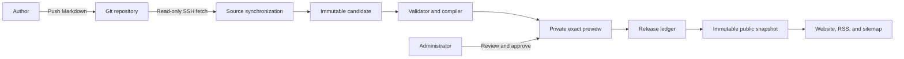
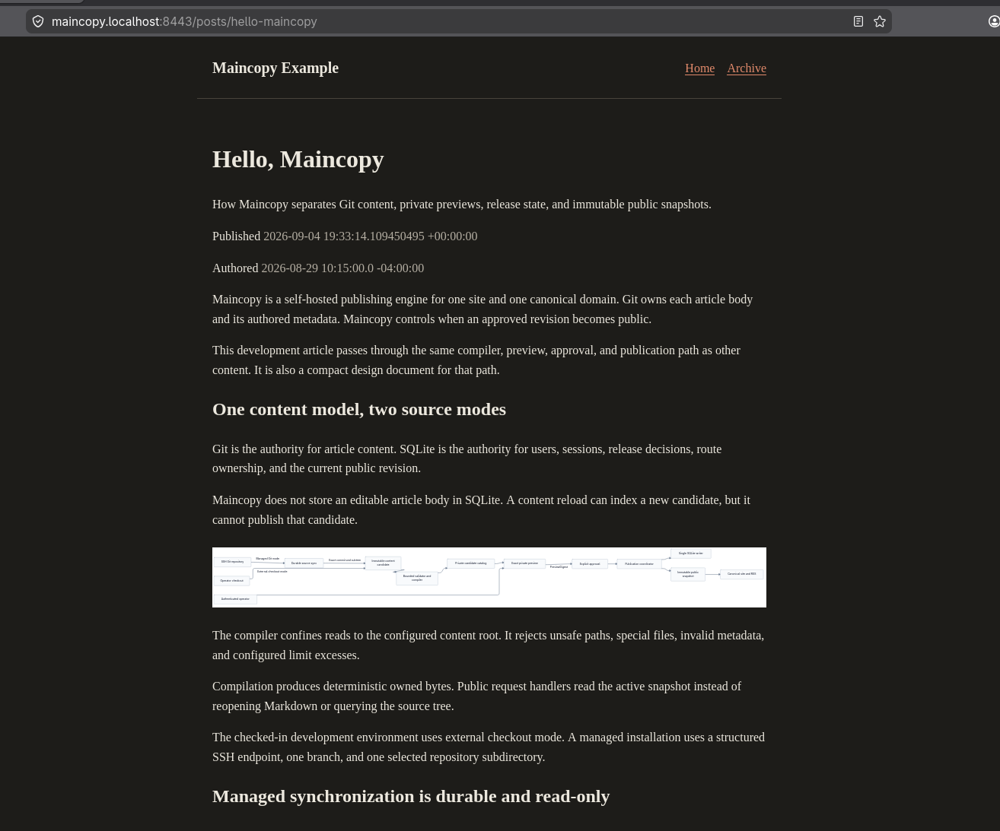
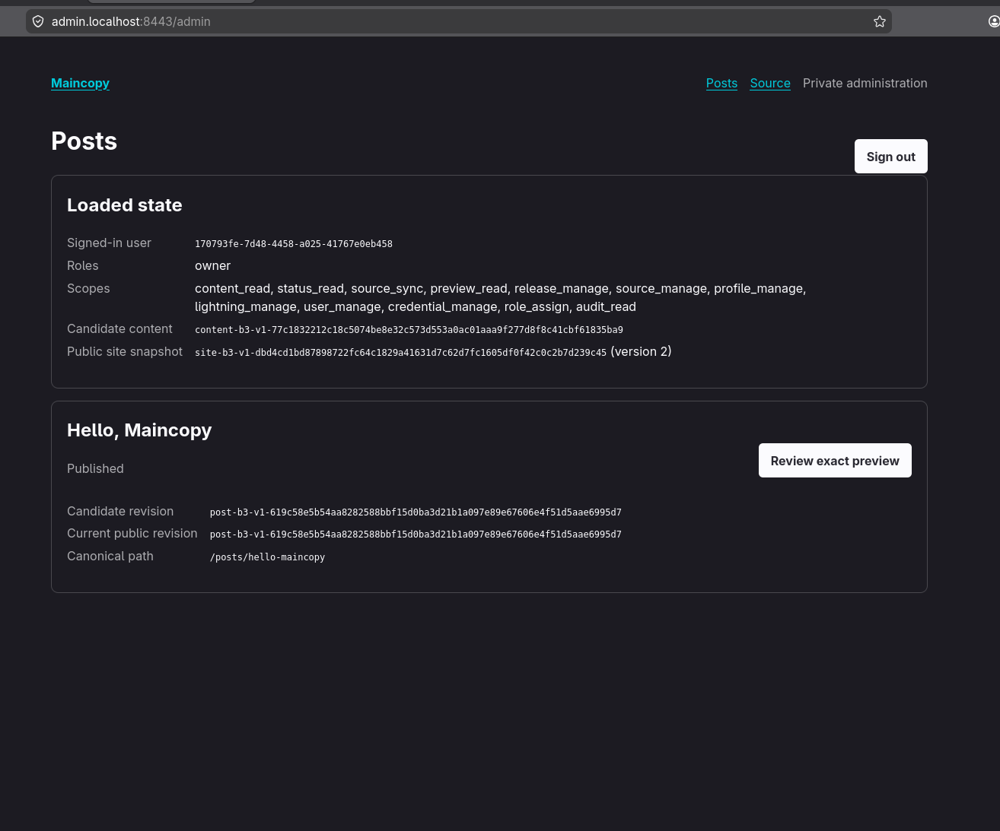
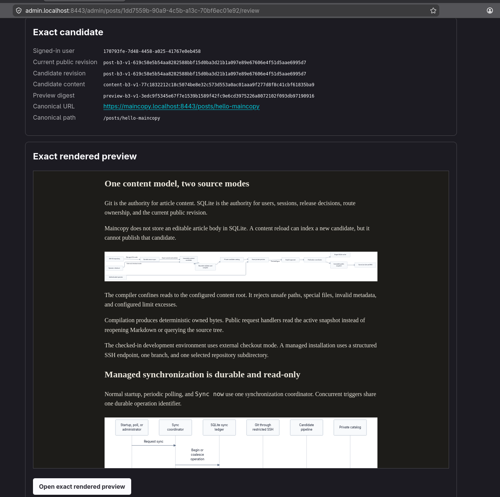

# Maincopy

**Markdown in Git. Live on your domain.**

Maincopy is a self-hosted publishing engine for one website. Git stores each
article and its authored metadata. Maincopy controls when an approved revision
becomes public.

An author pushes Markdown to one configured branch. Maincopy fetches that
branch, builds a private candidate, and presents an exact rendered preview.
Only an explicit release action can change the public website.

The [NixOS module](docs/deployment.md) packages the production gateway, metrics,
and encrypted backups. V1 acceptance and release preparation remain in progress;
see the [remaining work](docs/implementation.md). Use the local workflow below
to evaluate Maincopy.

## How publishing works



The synchronization and release paths are separate:

- A sync can add or update a private candidate.
- A sync cannot publish a new article or replace a live revision.
- A release binds the selected revision and its exact preview digest.
- Public requests read one immutable snapshot instead of mutable Markdown.
- Git access is read-only. Maincopy never commits, merges, or pushes.

Maincopy supports two source modes. Managed Git mode polls a remote repository
through restricted SSH. External checkout mode reads an operator-maintained
local tree and performs no Git network operation.

## Try Maincopy locally

Run this command from the repository root on Linux:

```console
just quickstart
```

`quickstart` enters the project Nix shell before it removes
`target/maincopy-dev/`. It keeps the development certificate authority (CA),
then installs browser trust and starts a fresh example.

If `just` is not installed outside Nix, run `nix develop -c just quickstart`.

Keep the launcher open. Save the generated `owner` password. Maincopy displays
it only once and stores only its Argon2id hash.

Then publish the included article:

1. Open `https://admin.localhost:8443/admin/login`.
2. Sign in as `owner` with the generated password.
3. Select **Review exact preview** for **Hello, Maincopy**.
4. Open and inspect the rendered preview.
5. Continue to confirmation and select **I reviewed and accept this exact preview**.
6. Select **Approve this exact revision**.
7. Open `https://maincopy.localhost:8443/posts/hello-maincopy`.

The included article is also a technical design document. It demonstrates
code rendering, Mermaid diagrams, previews, and the publication boundary.
Select **Enlarge diagram** to view a Mermaid diagram at full size. Select
**Close diagram** to return to the article.

The launcher preserves its database and candidate artifacts in
`target/maincopy-dev/`. Follow the
[local development runbook](docs/local-development.md) for command-line checks,
certificate removal, troubleshooting, and safe state reset.

After the first run, use `just start` to preserve publication state. Use
`just start-cli` when you do not want to change browser trust.

Press **Ctrl+C** in the launcher terminal to stop the server and gateway.

## Browser workflow

The published example uses the same article styles as its private preview.



<details>
<summary>See the admin and exact-preview screens</summary>

The posts screen shows candidate and public revisions. Select **Review exact
preview** to inspect a candidate before approving it.



The review screen binds the rendered article to an exact revision and preview
digest. Publication requires a separate confirmation.



</details>

## Write content

A content root contains site metadata and one Markdown file per article:

```text
content/
|-- publication.toml
`-- posts/
    `-- hello-maincopy.md
```

`publication.toml` defines the public site:

```toml
[site]
title = "Example Site"
base_url = "https://example.com"
description = "Notes from Example Author."

[author]
name = "Example Author"
```

Each article starts with strict TOML frontmatter:

```markdown
+++
id = "1dd7559b-90a9-4c5b-a13c-70bf6ec01e92"
title = "Hello, Maincopy"
slug = "hello-maincopy"
aliases = ["welcome"]
authored_at = 2026-08-29T10:15:00-04:00
description = "A short description for feeds and page metadata."
+++

Article Markdown starts here.
```

Keep `id` stable when you rename or move an article. Maincopy binds approved
slugs and aliases to that identity. A conflicting article cannot claim them.

The compiler supports CommonMark, declared code-language classes, Mermaid
diagrams, and sanitized Scalable Vector Graphics (SVG). See
[content rendering](docs/content-rendering.md) for supported languages and limits.
Public pages remain usable without JavaScript.

## Connect a Git repository

Managed mode requires one SSH repository, one branch, and a read-only deploy
key. Maincopy stores repository settings in SQLite and secret file references
in the host configuration.

Setup has three operator-controlled steps:

1. Register protected SSH credential paths in `maincopy.toml`.
2. Install the generated public key as a read-only deploy key.
3. Store the remote, branch, content directory, and poll interval offline.

Start `maincopyd` after setup. It validates the first fetch and compilation
before it opens network listeners.

For complete commands and file-permission rules, follow the
[managed Git runbook](docs/managed-source.md).

## Publish an update

After setup, article changes need no server restart:

1. Commit and push Markdown to the configured branch.
2. Wait for the next poll, or request **Sync now** in `/admin/source`.
3. Open **Posts** after the sync reports `applied`.
4. Review the exact rendered candidate.
5. Publish the selected revision after confirmation.

Use the command-line interface (CLI) for the same source operations.
Replace the example origin with the HTTPS origin used at login:

```console
maincopy --admin-origin https://admin.example.com source status
maincopy --admin-origin https://admin.example.com source sync --wait
```

Use `--json` for automation. Add `--idempotency-key UUID` when a caller must
safely retry one manual sync request.

If a fetch or compile fails, Maincopy keeps the previous private candidate and
public snapshot. Inspect the stable failure code with:

```console
maincopy --admin-origin https://admin.example.com --json source status
```

## Security boundaries

- Keep the public, administration, and metrics listeners separate.
- Put the administration listener behind the reviewed HTTPS gateway.
- Give each SSH deploy key read-only repository access.
- Store SSH, TLS, and backup secrets in protected host files.
- Never expose the loopback administration listener directly.

The SSH helper is an outbound client. It binds no listener and requests no
tunnel. The virtual private cloud and host firewall remain the ingress
boundary.

A dedicated loopback listener exposes [Prometheus metrics](docs/observability.md).
It shares neither the public nor the administration router.

## Documentation

| Task | Read |
| --- | --- |
| Run locally, use the CLI, or manage agent grants | [Local development](docs/local-development.md) |
| Author articles, diagrams, and images | [Content rendering](docs/content-rendering.md) |
| Connect and troubleshoot a Git source | [Managed Git](docs/managed-source.md) |
| Operate a home-server deployment | [Deployment](docs/deployment.md), [backup and restore](docs/backup-restore.md), [metrics](docs/observability.md) |
| Publish packages or install a release | [Releases](docs/release.md) |
| Develop Maincopy | [Design](docs/design.md), [engineering quality](docs/quality.md), [remaining work](docs/implementation.md) |
| Follow the unfinished mailing-list feature | [Email privacy and delivery plan](docs/email-delivery.md) |

## Development

The root manifest defines five Rust crates:

```text
crates/
|-- cli/                 # short-lived operator client
|-- diagram-renderer/    # isolated Mermaid renderer
|-- markdown-compiler/   # content validation and compilation
|-- server/              # daemon, application domains, and web surfaces
`-- shared/              # wire contracts shared by server and CLI
```

Run the workspace tests in the supported Nix environment:

```console
nix develop
cargo test --locked --workspace --all-targets --all-features
```

Run the canonical Linux checks and package build with:

```console
nix flake check --print-build-logs
nix build --print-build-logs
```

Sandboxed Cargo tests receive Git and OpenSSH explicitly. They run through
Bubblewrap (`LGPL-2.0-or-later`), a test dependency from the pinned Nixpkgs input.
The runner creates a filesystem root owned by the build user and preserves
the writable build workspace. Credential ownership and permission checks remain
enabled. Linux builders must permit nested unprivileged user namespaces.

The flake supports `x86_64-linux` and `aarch64-linux`. The default branch is
`master`.
