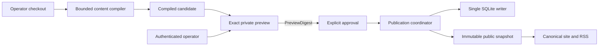
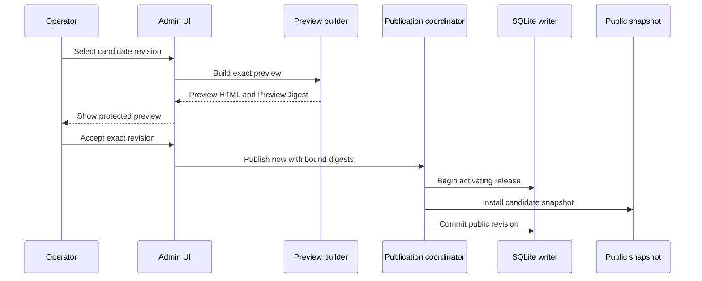

+++
id = "1dd7559b-90a9-4c5b-a13c-70bf6ec01e92"
title = "Hello, Maincopy"
slug = "hello-maincopy"
aliases = ["welcome"]
authored_at = 2026-08-29T10:15:00-04:00
description = "How Maincopy separates Git content, private previews, release state, and immutable public snapshots."
+++

# Hello, Maincopy

Maincopy is a self-hosted publishing engine for one site and one canonical
domain. Git owns each article body and its authored metadata. Maincopy controls
when an approved revision becomes public.

This local-alpha article passes through the same compiler, preview, approval,
and publication path as other content. The sections below separate implemented
behavior from remaining V1 work.

## One source, two kinds of state

Git is the authority for article content. SQLite is the authority for users,
sessions, release decisions, route ownership, and the current public revision.

Maincopy does not store an editable article body in SQLite. A content reload can
index a new candidate, but it cannot publish that candidate.



The compiler confines reads to the configured content root. It rejects unsafe
paths, special files, invalid metadata, and configured limit excesses.

Compilation produces deterministic owned bytes. Public request handlers read
the active snapshot instead of reopening Markdown or querying the source tree.

## Publication is an explicit state change

An operator reviews one production-faithful preview before publication. The
approval binds the selected revision and the exact rendered preview.



The `PreviewDigest` covers the post revision and presentation inputs. In this
immediate browser flow, Maincopy rejects publication when the reviewed
candidate, preview, or public site head becomes stale.

An update preserves the original publication time. A reload alone never
replaces the live revision.

The admin contract represents loaded post state with a closed enum:

```rust
pub enum PostPublicationState {
    Draft,
    Unpublished,
    UnpublishedChange,
    Published,
}
```

The browser labels `UnpublishedChange` as `Unpublished changes`. The previous
revision remains public until an approved update activates.

## Trust boundaries

- The content root contains authored Markdown and metadata. Compilation cannot
  escape the selected tree.
- SQLite contains operational and publication state. Article bodies do not
  become editable database records.
- The admin origin serves login, previews, and mutations. Authentication and
  scopes protect private operations; CSRF and exact Origin checks protect
  cookie-backed mutations.
- The public origin serves the canonical reading surface. Drafts, private
  previews, and admin routes return not found.
- The Mermaid helper converts diagrams. Bounded local rendering precedes strict
  SVG sanitization.

The local Caddy gateway terminates HTTPS for separate public and admin virtual
hosts. Both upstream listeners bind to loopback. The local gateway and its
development certificate authority are not a production deployment.

The opaque session token uses a host-only `Secure`, `HttpOnly`, and `SameSite`
cookie. SQLite stores the token digest instead of the raw token.

## Technical content is compiled, not executed

Known code fences receive application-owned language classes. Maincopy escapes
the source and performs no token-level syntax highlighting.

Exact lowercase `mermaid` fences use the supervised local renderer. Raw SVG
cannot enter an article directly from that renderer. A strict sanitizer grants
the capability to embed accepted SVG.

Public article reading does not require JavaScript. The built-in shell provides
server-rendered navigation and content-hashed application assets.

## What the local alpha implements

The current local alpha provides these foundations:

- An operator-maintained local checkout with automatic candidate reloads.
- Generated first-start owner credentials and password browser sign-in.
- Current and candidate revision inspection with exact private previews.
- Immediate initial publication and preview-gated updates.
- An immutable public snapshot with RSS, sitemap, robots policy, and aliases.
- A single SQLite writer with typed commands and bounded query readers.
- Semantic code classes, supervised Mermaid rendering, and sanitized SVG.
- A loopback-only HTTPS development gateway with separate origins.

## What remains before V1

Managed read-only Git synchronization is not implemented. V1 still needs SSH
source setup, periodic fetch, `Sync now`, and failure status.

The publication backend has scheduling foundations. The browser still needs the
complete schedule, edit, cancel, blocked-retry, profile, and account flows.

Favicon output, image metadata, and public-page Content Security Policy remain
planned. Production also needs NixOS, Caddy, Litestream, metrics, restore
evidence, security review, and release evidence.

Maincopy keeps the two authorities separate: Git defines what an article says,
and SQLite records when one exact revision is public.
