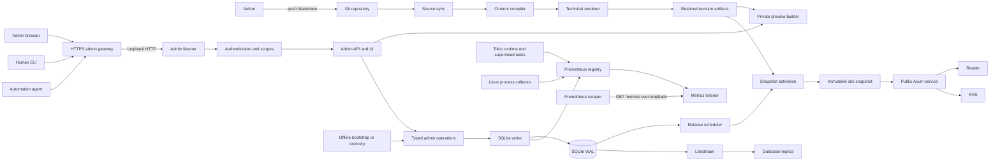
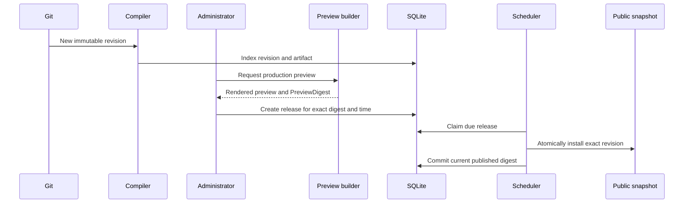
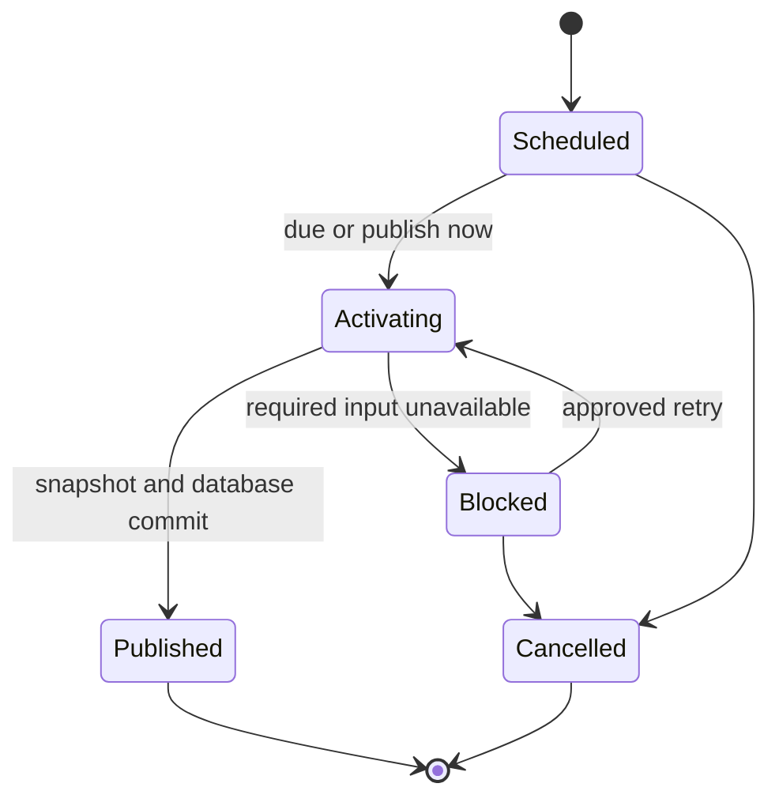
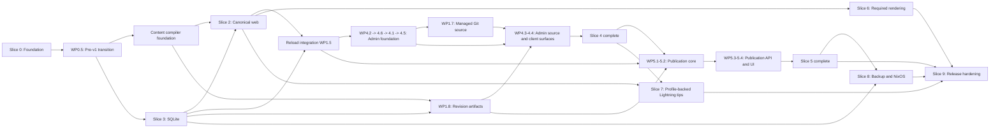
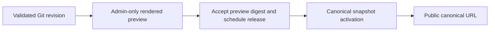
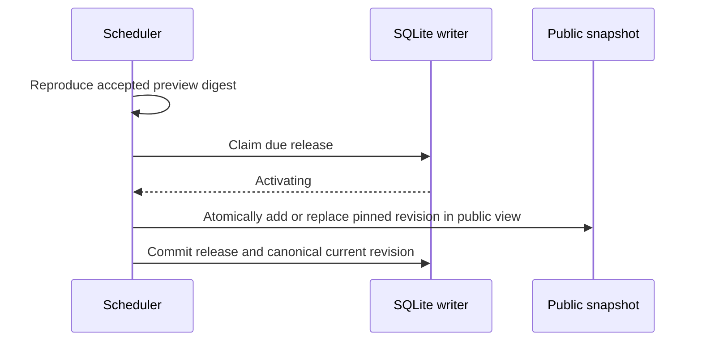
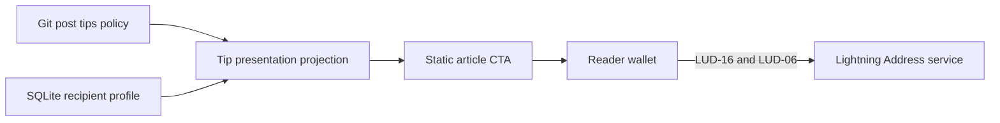
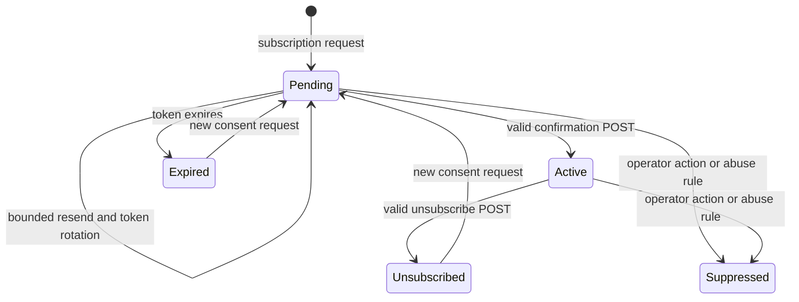

# Mermaid renderer selection corpus

```mermaid
flowchart LR
    Author[Author] -->|push Markdown| Git[Git repository]
    Git --> Sync[Source sync]
    Sync --> Compiler[Content compiler]
    Compiler --> Renderer[Technical renderer]
    Renderer --> Artifacts[Retained revision artifacts]

    Browser[Admin browser] --> Gateway[HTTPS admin gateway]
    HumanCli[Human CLI] --> Gateway
    Agent[Automation agent] --> Gateway
    Gateway -->|loopback HTTP| Listener[Admin listener]
    Listener --> Auth[Authentication and scopes]
    Auth --> Admin[Admin API and UI]
    Recovery[Offline bootstrap or recovery] --> Operations[Typed admin operations]

    Admin --> Preview[Private preview builder]
    Artifacts --> Preview
    Admin --> Operations
    Operations --> Writer[SQLite writer]
    Writer --> DB[(SQLite WAL)]
    DB --> Scheduler[Release scheduler]
    Scheduler --> Activate[Snapshot activation]
    Artifacts --> Activate
    Activate --> Snapshot[Immutable site snapshot]

    Snapshot --> Public[Public Axum service]
    Public --> Reader[Reader]
    Public --> RSS[RSS]

    DB --> Litestream[Litestream]
    Litestream --> Replica[Database replica]

    Runtime[Tokio runtime and supervised tasks] --> MetricsRegistry[Prometheus registry]
    Process[Linux process collector] --> MetricsRegistry
    Writer --> MetricsRegistry
    MetricsRegistry --> MetricsListener[Metrics listener]
    Prometheus[Prometheus scraper] -->|GET /metrics over loopback| MetricsListener
```

```mermaid
sequenceDiagram
    participant G as Git
    participant C as Compiler
    participant A as Administrator
    participant P as Preview builder
    participant D as SQLite
    participant S as Scheduler
    participant W as Public snapshot

    G->>C: New immutable revision
    C->>D: Index revision and artifact
    A->>P: Request production preview
    P-->>A: Rendered preview and PreviewDigest
    A->>D: Create release for exact digest and time
    S->>D: Claim due release
    S->>W: Atomically install exact revision
    S->>D: Commit current published digest
```

```mermaid
stateDiagram-v2
    [*] --> Scheduled
    Scheduled --> Activating: due or publish now
    Scheduled --> Cancelled
    Activating --> Published: snapshot and database commit
    Activating --> Blocked: required input unavailable
    Blocked --> Activating: approved retry
    Blocked --> Cancelled
    Published --> [*]
    Cancelled --> [*]
```

```mermaid
flowchart LR
    Author[Obsidian clients] <-->|End-to-end encrypted Sync| Remote[Obsidian Sync]
    Remote -->|One-shot mirror| Mirror[Disposable server mirror]
    Mirror -->|Completed generation| Compiler[Maincopy compiler]
    Compiler --> Artifact[Immutable revision artifact]
    Artifact --> Preview[Exact admin preview]
    Preview -->|Approved release| Public[Website and RSS]
```

```mermaid
flowchart LR
    S0[Slice 0: Foundation] --> T[WP0.5: Pre-v1 transition]
    T --> S1F[Content compiler foundation]
    T --> S3[Slice 3: SQLite]
    S1F --> S2[Slice 2: Canonical web]
    S3 --> S2
    S2 --> RI[Reload integration WP1.5]
    S3 --> RI
    RI --> S4F[WP4.2 -> 4.6 -> 4.1 -> 4.5: Admin foundation]
    S4F --> GS[WP1.7: Managed Git source]
    S1F --> AR[WP1.8: Revision artifacts]
    S3 --> AR
    GS --> S4R[WP4.3-4.4: Admin source and client surfaces]
    S4F --> S4R
    AR --> S4R
    S4R --> S4[Slice 4 complete]
    RI --> S5C[WP5.1-5.2: Publication core]
    AR --> S5C
    S4 --> S5C
    S5C --> S5A[WP5.3-5.4: Publication API and UI]
    S5A --> S5[Slice 5 complete]
    S2 --> S6[Slice 6: Required rendering]
    S2 --> S7[Slice 7: Profile-backed Lightning tips]
    S4 --> S7
    S3 --> S8[Slice 8: Backup and NixOS]
    S5 --> S8
    S5 --> S9[Slice 9: Release hardening]
    S6 --> S9
    S7 --> S9
    S8 --> S9
```

```mermaid
flowchart LR
    G[Validated Git revision] --> P[Admin-only rendered preview]
    P --> A[Accept preview digest and schedule release]
    A --> C[Canonical snapshot activation]
    C --> U[Public canonical URL]
```

```mermaid
sequenceDiagram
    participant S as Scheduler
    participant W as SQLite writer
    participant P as Public snapshot

    S->>S: Reproduce accepted preview digest
    S->>W: Claim due release
    W-->>S: Activating
    S->>P: Atomically add or replace pinned revision in public view
    S->>W: Commit release and canonical current revision
```

```mermaid
flowchart LR
    G[Git post tips policy] --> P[Tip presentation projection]
    U[SQLite recipient profile] --> P
    P --> C[Static article CTA]
    C --> W[Reader wallet]
    W -->|LUD-16 and LUD-06| L[Lightning Address service]
```

```mermaid
stateDiagram-v2
    [*] --> Pending: subscription request
    Pending --> Pending: bounded resend and token rotation
    Pending --> Active: valid confirmation POST
    Pending --> Expired: token expires
    Expired --> Pending: new consent request
    Pending --> Suppressed: operator action or abuse rule
    Active --> Unsubscribed: valid unsubscribe POST
    Active --> Suppressed: operator action or abuse rule
    Unsubscribed --> Pending: new consent request
```

```mermaid
flowchart LR
    Author[Obsidian clients] <-->|End-to-end encrypted Sync| Remote[Obsidian Sync]
    Remote -->|One-shot mirror| Mirror[Disposable server mirror]
    Mirror -->|Completed generation| Compiler[Maincopy compiler]
    Compiler --> Artifact[Immutable revision artifact]
    Artifact --> Preview[Exact admin preview]
    Preview -->|Approved release| Public[Website and RSS]
```
