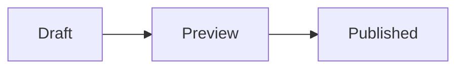

# Content rendering

Use this reference when authoring Markdown, diagrams, and images.
Maincopy compiles articles before publication; preview and public pages share the compiled article content.
Start with the [example post](../crates/server/examples/content/posts/hello-maincopy.md) for required frontmatter.

## Code fences

Use a language name immediately after the opening fence:

````markdown
```rust
fn main() {}
```
````

Language names are ASCII-case-insensitive. Use one value without extra whitespace or trailing options.

| Language | Accepted names |
| --- | --- |
| Bash | `bash`, `sh`, `shell` |
| C | `c` |
| C++ | `cpp`, `c++` |
| C# | `csharp`, `cs` |
| CSS | `css` |
| Diff | `diff`, `patch` |
| Dockerfile | `dockerfile` |
| Go | `go` |
| HTML | `html` |
| Java | `java` |
| JavaScript | `javascript`, `js` |
| JSON | `json` |
| Nix | `nix` |
| Python | `python`, `py` |
| Ruby | `ruby`, `rb` |
| Rust | `rust`, `rs` |
| SQL | `sql` |
| TOML | `toml` |
| TypeScript | `typescript`, `ts` |
| TSX | `tsx` |
| XML | `xml` |
| YAML | `yaml`, `yml` |

Recognized names select a language CSS class. V1 does not apply syntax highlighting.
Empty, `text`, `ascii`, unknown, and multi-token values produce plain escaped code.

## Mermaid diagrams

Use exact lowercase `mermaid`; `Mermaid` produces plain code.

````markdown

````

Maincopy renders diagrams before publication. Readers need no Mermaid script or external rendering service.
Render settings are fixed: `%%{...}%%` directives are rejected; ordinary `%%` comments are allowed.

Diagrams cannot include scripts, event handlers, foreign objects, or remote images.
HTTPS and root-relative navigation links are allowed.
Invalid diagrams reject the candidate; the active public snapshot remains unchanged.

## Images

Put local files below `assets/` in the content root, then reference them from Markdown:

```markdown

```

Use PNG, JPEG, GIF, WebP, AVIF, or ICO for browser image display.
Authored SVG and unrecognized file types are served as attachments.

Configure optional site images and allowed external origins in `publication.toml`:

```toml
[site]
title = "Example"
base_url = "https://example.com/"
description = "An example publication."
favicon = "assets/favicon.png"
image = "assets/site-cover.webp"

[author]
name = "Example Author"

[assets]
allowed_https_origins = ["https://images.example.com"]
```

Add an optional cover image to a post's existing TOML frontmatter:

```toml
image = "assets/article-cover.webp"
```

An allowed external URL, such as `https://images.example.com/article-cover.webp`, can replace the local path.
External URLs must use HTTPS and cannot contain credentials or fragments.
Allowlist entries must be exact origins: no path beyond `/`, query, fragment, credentials, or wildcard.
These origins permit images and media only. An oversized generated content security policy rejects the candidate.

The site image supplies Open Graph metadata for index, archive, and tag pages.
The post image supplies article Open Graph and `BlogPosting` metadata.
Missing images stay absent; the favicon is not a fallback.

Local public URLs identify the active snapshot. Preview-only files stay private, and local preview images omit public metadata URLs until release.
Remote image bytes can change independently of a release. Use local assets when exact image bytes must remain fixed.

## Enforced limits

Limits are inclusive. Simplify the content when compilation exceeds a limit.

| Boundary | Limit |
| --- | --- |
| Code blocks, including Mermaid | 256 per post |
| Final article HTML | 32 MiB per post |
| Mermaid source | 256 KiB per block; 64 blocks per post |
| Rendered SVG | 2 MiB per block; 16 MiB sanitized SVG per post |
| SVG structure | 20,000 elements; depth 64 |
| Diagram rendering | 5 CPU seconds; 10 seconds wall time per block |
| Generated content security policy | 16 KiB |

Detailed SVG budgets are defined in the [sanitizer](../crates/server/src/render/svg.rs).
Operators can inspect [renderer resource limits](../crates/diagram-renderer/src/protocol.rs).
