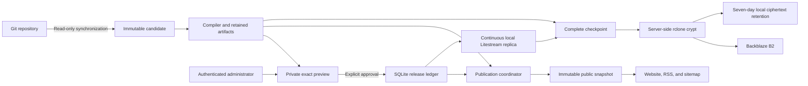
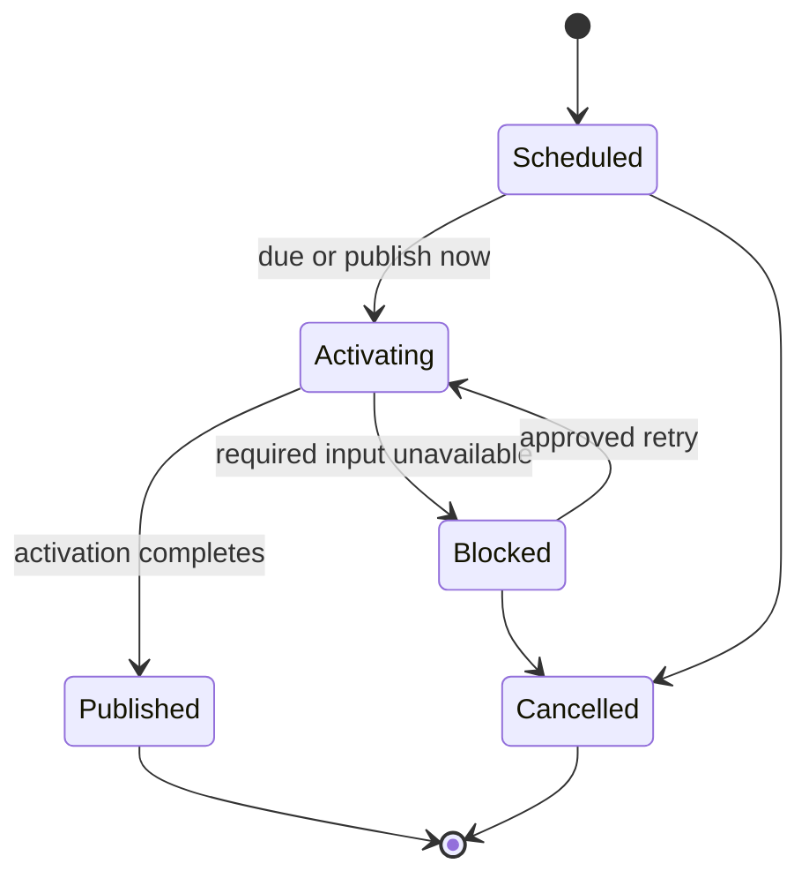

# Maincopy v1 system design

Maincopy serves one site and canonical domain from one Git repository, branch,
and content root. Git owns articles; Maincopy controls which reviewed revisions
are public. This document records the architecture and its essential invariants.

See [implementation](implementation.md) for remaining work,
[quality](quality.md) for engineering rules, and [deployment](deployment.md) for operations.

## System context

The daemon owns separate public, loopback administration, and loopback metrics
listeners. A separate HTTPS gateway protects the administration origin.
The public virtual host has no administration route or upstream.
The gateway has no direct database or content-file access.

## Data ownership

| Data | Authority | Constraint |
| --- | --- | --- |
| Article body, metadata, and tip enablement | Git | No editable article copy in SQLite; no Git write-back. |
| Releases, schedules, current public revisions, and route claims | SQLite | Sync and reload cannot grant visibility. |
| Managed remote, branch, content directory, and polling policy | SQLite | Credential names only; no secret paths or bytes. |
| Users, roles, profiles, tip recipient, sessions, and audit records | SQLite | Versioned mutations; passwords and session tokens are hashed. |
| Runtime paths, listeners, limits, and source mode | Host configuration | Reject unknown fields; store secret references only. |
| SSH, TLS, B2, and encryption secrets | Protected host files | Keep secret bytes out of Git, SQLite, logs, and the Nix store. |
| Human and agent Nostr private keys | Their devices | Maincopy receives public keys and signatures, never an `nsec`. |
| Public representation | Immutable memory snapshot | Construct from retained artifacts and the committed publication ledger. |
| Lightning payment execution | Reader wallet and address service | No payment or entitlement ledger in Maincopy. |

`publication.toml` contains public site metadata and asset policy. Article
frontmatter contains authored metadata. SQLite owns mutable administration state.
Host settings use built-in defaults, then the host file, then documented non-secret CLI overrides.

Email remains a separate, unfinished increment. Its data boundary is defined in
[email delivery](email-delivery.md); no subscriber capture is currently enabled.

## Content sources and retention

Managed mode uses one configured SSH remote and exact branch with a read-only
key and verified host keys. The restricted SSH helper permits only the selected
target and `git-upload-pack`; it creates no tunnel or listener.

The bare mirror is a bounded transport cache. Fetches follow no tags or submodules.
Each Git phase has process and time limits; cancellation terminates descendants.
A process lock prevents competing mirror owners.

Startup, polling, and **Sync now** share one coordinator. Concurrent requests
coalesce onto a durable operation. Failures preserve the last usable candidate
and public snapshot. A matching installed commit reports `no_change`.

External checkout mode reads an operator-maintained tree and performs no Git
network operation. Commit provenance is optional; content identity is required.
See [managed source](managed-source.md) for configuration, limits, and failure recovery.

The compiler confines reads to the content root and rejects links, special files,
unsafe paths, mount crossings, and excessive inputs. It captures owned bytes;
later compilation and serving do not reopen mutable source files.

Versioned digests bind authored content, resolved assets, renderer identity, and
output. Releases retain immutable artifacts and checksummed manifests for their
required inputs. The candidate store rejects new entries at capacity instead
of guessing which retained revisions can be deleted. Git remains the authoring authority.

## Article lifecycle

A revision is one immutable compiled article. A release makes one reviewed revision
public, immediately or at a scheduled time. A newer source revision appears as
**Unpublished changes** until separately approved.

`PreviewDigest` binds the revision, rendered article, renderer, shell, profile
projection, and canonical URL. The browser shows the preview before confirmation.
API clients must submit the same reproducible digest.

Each release is `Initial` or `Update`. The canonical publication retains the
original `published_at` and current published digest. Historical release rows
cannot grant visibility. Cancelled or blocked updates leave the prior revision public.

Accepted schedules reserve the revision's slug and authored aliases. Immediate
releases claim them during activation. The stable `PostId` owns those claims
permanently, including after cancellation or removal from the active revision.
Only that post can reuse a claim as its canonical slug or alias.
Reservations alone create no public routes. Activation rechecks ownership.

Git deletion or a draft flag cannot retract a live article. Explicit unpublish
and retraction are outside v1. Sync, reload, profile changes, and restart cannot
substitute for release approval.

## Public web contract

Handlers read the active immutable snapshot. They do not parse Markdown, inspect
Git, or read the source tree. Drafts, previews, scheduled revisions, and their
private assets remain unavailable on the public origin.

Canonical HTML, RSS summaries at `/feed.xml`, sitemap locations at `/sitemap.xml`,
and `/robots.txt` derive URLs from validated publication configuration.
Request authority and forwarding headers cannot change those URLs.
The sitemap lists canonical HTML locations only; robots permits public crawling
and identifies the sitemap. Neither is an access-control mechanism.

Only aliases authored in the active revision redirect. Exact `GET` and `HEAD`
requests receive `308`, an absolute canonical `Location`, and `Cache-Control: no-cache`.
Redirects drop query strings. Case and trailing-slash variants do not match.
Old slugs are not implicit aliases, and alias chains cannot form.

Public HTML includes canonical and Open Graph metadata. Articles also include
escaped JSON-LD `BlogPosting` metadata. Public `datePublished` comes from the
original canonical release; unpublished previews omit it. Error pages omit
canonical and structured metadata.

Sitemap and robots bytes are built with the snapshot and use strong ETags.
A construction failure rejects the candidate without replacing the working site.
Detailed encodings and bounds live beside their implementations in
[sitemap](../crates/server/src/render/sitemap.rs) and
[robots](../crates/server/src/render/robots.rs).

## Rendering and assets

Maud owns the built-in shell and navigation; compiled Markdown enters one
article-content slot. Public pages remain usable without JavaScript.
Private previews use the same article frame and retained bytes, with
`private, no-store` responses and authenticated asset access.

Operators change packaged CSS and JavaScript and rebuild Maincopy to customize
the shell. Article content cannot supply a template, stylesheet, script, event
handler, or executable expression. Runtime theme replacement is outside v1.

Raw HTML is escaped. Links, images, code-fence languages, and local Mermaid
output pass validated boundaries. Mermaid output must pass SVG sanitization;
invalid content rejects the candidate. See [content authoring](content-rendering.md)
for syntax, images, and limits.

Local public assets use `/assets/<site-snapshot-digest>/<asset-relative-path>`
and exact bytes selected by the active snapshot. Requests cannot access an
unreferenced file, retained private candidate, or source checkout.

Passive allowlisted types can display inline. Active, unknown, or unsanitized
generated formats remain inert downloads. Asset responses use exact-byte ETags,
immutable caching, `nosniff`, and a sandbox policy. Policy changes change snapshot identity.

External assets require allowlisted HTTPS origins. Maincopy does not fetch or
proxy them; their remote bytes can change independently of a Maincopy revision.
Public responses use `no-referrer`, `nosniff`, and the snapshot's Content Security
Policy. Only packaged, explicitly authorized enhancements can execute scripts.

## Administration and identity

Production requires an existing owner before listeners bind. Offline bootstrap
and recovery acquire exclusive process ownership, use typed commands, and bind
no listener. They provide no continuing authentication bypass or arbitrary SQL interface.

Development startup can generate a unique 256-bit owner password once, before
atomic identity creation. SQLite receives only its Argon2id hash. Production
requires offline initialization so generated passwords never enter the service journal.

The stable `InstanceId` survives restore. Discovery identifies the instance,
public origin, and supported contracts. CLI contexts pin those values and the
admin origin before loading credentials. Replacing identity invalidates old contexts.

Humans can use passwords or Nostr signatures. Browser sessions use opaque,
revocable server-side state and host-only `Secure`, `HttpOnly`, `SameSite` cookies.
Cookie-authenticated mutations require CSRF verification and the exact configured origin.
Human CLI sessions use the operating system credential store.

Agents use dedicated public keys and fresh, replay-protected NIP-98 proofs
bound to the request. Grants cannot exceed their issuer's current scopes.
Maincopy issues no reusable agent bearer token. NIP-98 does not authorize
Nostr article distribution.

| Capability | Owner | Administrator | Publisher |
| --- | --- | --- | --- |
| Content, sync, reload, preview, and release | Yes | Yes | Yes |
| Profiles, tips, users, credentials, and audit | Yes | Yes | No |
| Role assignment and source/instance configuration | Yes | No | No |

Only discovery and login entry points are unauthenticated. All other operations
require the appropriate principal and scope. The HTTPS gateway removes untrusted
identity headers; the daemon checks host and origin. Public routes never fall
back to administration. See [local workflows](local-development.md) for operator commands.

## Static Lightning Address tips

Git enables tips per post; SQLite selects one eligible recipient profile.
Maincopy derives the wallet link and QR code locally from its Lightning Address.
It performs no address lookup, invoice creation, or settlement check and stores
no payer, payment hash, preimage, amount, or entitlement.

## Database and lifecycle

One supervised Tokio task owns Maincopy's SQLx write connection. Typed mutations
pass through a bounded channel and enforce versions, idempotency, authorization,
and legal transitions. A successful writer reply follows transaction commit.
Reads use a separate bounded query-only pool. SQLite uses local storage and WAL.
Network and other unbounded work never hold a database transaction.

Litestream has separate connections for replication and checkpoint bookkeeping;
it performs no Maincopy domain mutations. Service isolation exceptions are
recorded in [deployment](deployment.md#service-identities-and-filesystem-boundaries).

Startup validates configuration, acquires ownership, verifies identity and
SQLite, reconciles interrupted work, verifies artifacts, and builds the public
snapshot before opening listeners and starting producers.
A required task failure marks readiness unavailable and initiates shutdown.
Shutdown closes ingress, drains listeners and producers, then drains the writer
before releasing database ownership and the process lock.

### Public request limits

| Boundary | Limit | At the limit |
| --- | --- | --- |
| TCP connections | 256 | Additional sockets wait in the OS backlog. |
| TCP lifetime | 60 seconds | Reads and writes time out, including idle connections. |
| Request target | 4096 bytes | HTTP 414 |
| Headers | 64 fields; 16 KiB total names and values | HTTP 431 |
| Body | 8 KiB | HTTP 413 |
| Concurrent handlers | 256 | HTTP 503 with `Retry-After: 1` |
| Body read and handler time | 10 seconds | HTTP 408 |

Parser rejection can precede router limits. Connection and request deadlines
remain active during shutdown. `/health/live` reports server liveness;
`/health/ready` returns 503 before readiness and during controlled shutdown.

`maincopy::public_access` events contain only method class (`GET`, `HEAD`, `OTHER`),
matched route template, status, and handler elapsed time. They omit raw paths,
queries, headers, bodies, and host values. Timing excludes final socket delivery.

Metrics use a separate loopback listener and bounded labels without identifiers,
paths, URLs, secrets, or raw errors. Its default is `127.0.0.1:3002`; public and
admin routers do not expose it. See [observability](observability.md) for scraping,
metric definitions, dashboard setup, and diagnosis.

## Backup and restore

Litestream maintains a continuous local replica. Complete checkpoints combine
an exact replica cutoff with all referenced revision artifacts. The server
verifies native replay and content, then encrypts with rclone crypt before B2 upload.
The encrypted completion manifest is published last. Local ciphertext is kept
for seven days; remote retention requires an explicit operator policy.

The default timer starts one minute after the previous job finishes. Recovery
lag includes replay, validation, encryption, and upload. Backup failure degrades
health without stopping public reads. Database replication alone is not a
complete recovery point.

Offline restore verifies database integrity, schema, artifacts, logical identity,
and reconstructed public output. It revokes restored sessions and agent grants,
clears outstanding login proofs, and creates a one-use acceptance marker.
Human password and Nostr login credentials remain usable. First startup consumes that marker before normal
writes and replication. Ordinary restarts require no new acceptance.
Never restore over a live database.

Keep independent copies of the Git source, compatible package, decryption keys,
and host secrets. Follow [backup and restore](backup-restore.md) for commands;
[deployment](deployment.md) defines services and credential provisioning.

## Workspace and compatibility

| Crate | Responsibility |
| --- | --- |
| `maincopy-cli` | Operator client |
| `maincopy-diagram-renderer` | Isolated Mermaid subprocess |
| `markdown-compiler` | Discovery, validation, compilation, and content identity |
| `maincopy-server` | Daemon and application domains |
| `maincopy-shared` | Wire contracts and shared defaults |

The Nix flake supplies packages, apps, checks, a development shell, and
`nixosModules.default`. [Release](release.md) covers all five crates and version-pinned flake use.

Pre-v1 databases are disposable development state. Incompatible migration
checksums fail before mutation; there is no legacy schema reader or fallback
administration transport. Archive or remove development state explicitly before
fresh initialization. The intended first contracts use `/api/admin/v1` and
versioned digest encodings.

Email is the current conditional first-release feature. Other deferred features
are listed once in [implementation](implementation.md#deferred-work); their
historical proposals remain in Git history.
