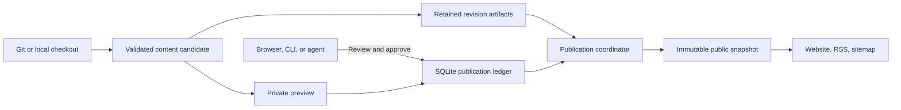
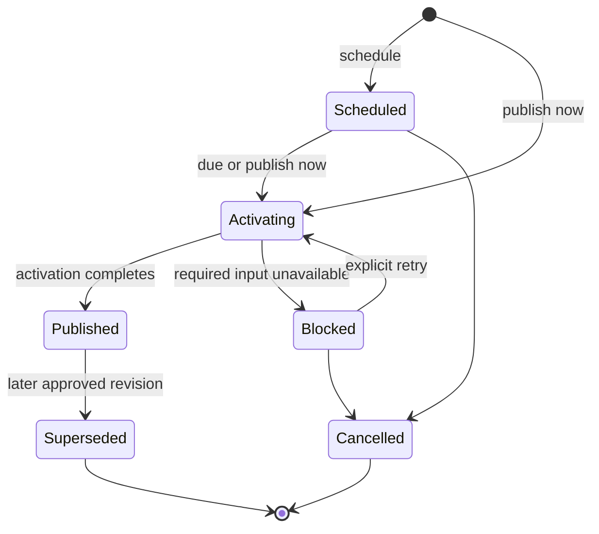

# Maincopy architecture

Maincopy runs one site from a Git repository or local checkout. Git owns authored
content; the application database controls accounts and which reviewed revisions
are public. [Quality](quality.md) defines engineering rules; [implementation](implementation.md)
records remaining work. Operator procedures live in the task guides linked below.

## Data and components

| Data | Authority |
| --- | --- |
| Article Markdown, frontmatter, site metadata, and authored assets | Git/content root |
| Release schedules, public revisions, slug and alias claims | Application SQLite database |
| Accounts, roles, profiles, sessions, agent grants, audit, and source settings | Application SQLite database |
| Subscriber consent, suppression, attempts, campaign approvals, and budgets | Dedicated tables in the same database |
| Listeners, paths, source mode, provider settings, and secret references | Host configuration |
| SSH, TLS, SES, mail control, and backup secrets | Protected host files |
| Human and agent Nostr private keys | Their devices or protected client credential store |
| Public responses | One immutable in-memory snapshot |

There is no editable article copy in SQLite and no Git write-back.
The server validates host defaults, file settings, and supported non-secret CLI overrides.
Private credentials, subscriber addresses, and bearer controls stay out of authored content and public audit text.

The five workspace crates separate the daemon (`maincopy-server`), client
(`maincopy-cli`), wire contracts (`maincopy-shared`), content compiler
(`markdown-compiler`), and isolated Mermaid renderer (`maincopy-diagram-renderer`).
No stable server embedding API is promised.

## Content and publication

Managed Git mode fetches one branch through restricted read-only SSH.
Startup, polling, and manual sync share a coordinator; overlapping requests
coalesce onto a durable operation. Fetch or compilation failure preserves the
last usable candidate and public snapshot. See [managed Git](managed-source.md).

The compiler confines reads to the content root and captures owned bytes.
It rejects links, special files, unsafe traversal, mount crossings, and excessive input.
Compilation and public requests do not reopen mutable source files.
Versioned digests bind content, assets, renderer identity, and output.
Retained artifacts preserve approved revisions after later Git changes.

Publication requires a selected revision and its exact preview digest.
The digest includes the rendered article, shell, profile projection, and canonical URL.
Source sync, reload, profile changes, and restart cannot substitute for approval.
Scheduled releases keep their approved revision even when a new candidate arrives.

An update retains the original publication timestamp. Blocked or cancelled updates
leave the prior public revision available. Historical release rows cannot grant visibility.

Scheduled approval reserves the slug and authored aliases; immediate publication
claims them during activation. Claims belong permanently to the stable post ID.
Reservations alone expose no routes. Only aliases in the active revision redirect;
old slugs do not become aliases automatically. Git deletion or a draft flag cannot
retract published content. Explicit retraction is outside v1.

## Rendering and public access

Public handlers read the active snapshot without reading Git or compiling Markdown.
Drafts, previews, scheduled revisions, and their private assets remain unavailable
on the public origin. Canonical URLs come from validated site configuration, not request headers.

Maud owns the built-in shell. Validated Markdown enters one article slot;
authored content cannot provide scripts, stylesheets, templates, or executable expressions.
Raw HTML is escaped and generated Mermaid SVG is sanitized. Public pages remain
usable without JavaScript. See [content rendering](content-rendering.md) for supported authoring syntax and limits.

Local assets expose only retained bytes referenced by the active snapshot.
Private previews use authenticated asset routes and `private, no-store` responses.
External assets require an allowed HTTPS origin; Maincopy does not fetch or proxy them.
Their remote bytes can change independently of a reviewed Maincopy revision.

Git enables tips per post; SQLite selects one eligible profile.
Maincopy generates Lightning Address links and QR codes locally. Wallets and
address services handle payment; Maincopy stores no payment or entitlement ledger.

## Identity and request boundaries

Public, administration, and metrics listeners remain separate. The production HTTPS
gateway serves public and private administration origins with distinct routing.
It has no direct database or content access. Host/origin checks and removal of
untrusted identity headers protect the administration boundary.

Production requires an initialized Owner before listeners bind. Offline bootstrap
and restore require exclusive process ownership and bind no listener.
Development can generate an Owner password once; SQLite stores its Argon2id hash.

Humans authenticate with passwords or Nostr signatures. Browser sessions use
revocable server-side records and host-only `Secure`, `HttpOnly`, `SameSite` cookies.
Cookie mutations require CSRF verification and the configured origin.
Human CLI sessions use the operating system credential store.

Agents authenticate with dedicated keys and fresh request-bound NIP-98 proofs.
Their grants cannot exceed current account authority. An agent receives no reusable
bearer token and no implicit email authority. See [local workflows](local-development.md)
for human and agent commands.

| Capability | Owner | Administrator | Publisher |
| --- | --- | --- | --- |
| Content, sync, preview, release | Yes | Yes | Yes |
| Profiles, tips, users, credentials, audit | Yes | Yes | No |
| Roles and source/instance configuration | Yes | No | No |
| Mail campaigns and consent recovery | Owner browser; fresh for mutations | No | No |

Account and credential changes also enforce authority over the target account.

The stable instance ID survives restore. CLI contexts bind the instance and admin
origin before loading credentials. Replacing identity invalidates old contexts.

## Persistence and lifecycle

One supervised Tokio task owns the SQLx domain write connection. Typed mutations
pass through a bounded channel and enforce authorization, versions, idempotency,
and legal transitions. Successful replies follow commit. Reads use a separate
bounded query-only pool; network work never holds a database transaction.
SQLite uses local storage, WAL, and `secure_delete`.

Startup acquires ownership, validates identity/database/artifacts, reconciles interrupted
work, and builds the public snapshot before opening listeners and starting producers.
A required task failure marks readiness unavailable and initiates shutdown.
Shutdown closes ingress, drains listeners and workers, then drains the writer
before releasing database ownership. External calls have bounded deadlines.

Public input, connections, handlers, and response lifetimes are bounded in
[request limits](../crates/server/src/web/request_limits.rs) and
[connection admission](../crates/server/src/web/server.rs).
Access logs record method class, matched route template, status, and handler duration.
They omit raw paths, queries, headers, and bodies. Metrics use bounded labels
without identifiers or secrets; see [observability](observability.md).

## Email and recovery

Mail uses the same sole writer to serialize consent removal with recipient admission.
The dispatcher records an attempt before transmission; uncertain outcomes never
become automatic retries. Authenticated feedback and explicit recovery protect
consent across failure and restart. [Email operations](email-delivery.md) owns the
consent, privacy, provider, and recovery contract.

Litestream continuously replicates SQLite locally. Complete checkpoints include
an exact replayable cutoff and required content artifacts, encrypted with rclone
crypt before B2 upload. Finite replica epochs, independent expiry, and a required
B2 lifecycle policy bound retention. [Backup and restore](backup-restore.md) owns
checkpoint ordering, physical deletion limits, and recovery procedures.

Offline restore verifies schema, integrity, artifacts, identity, and reconstructed
public output. It revokes restored sessions/grants, clears login proofs, discards
subscriber eligibility, and quarantines unfinished campaigns. A rotated mail epoch
and one-use acceptance marker prevent old consent or attempts from restarting.
Human password and Nostr credentials remain usable. First startup consumes acceptance
before normal writes or replication. Restore never overwrites a live database.
