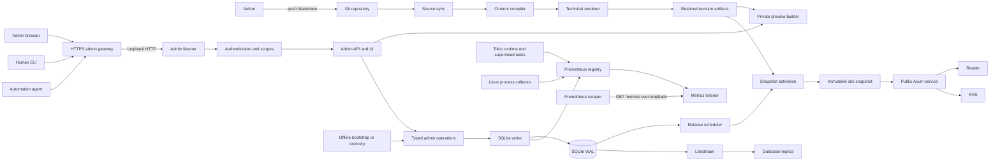
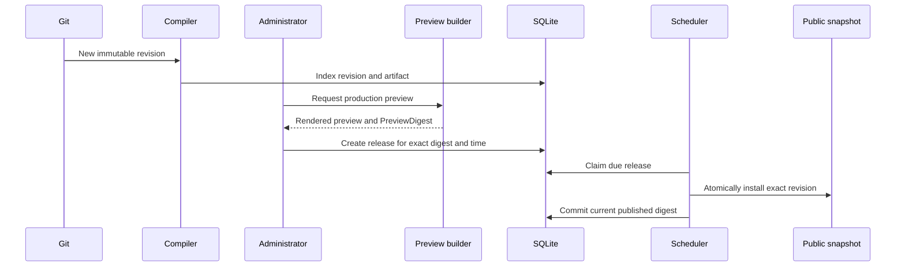
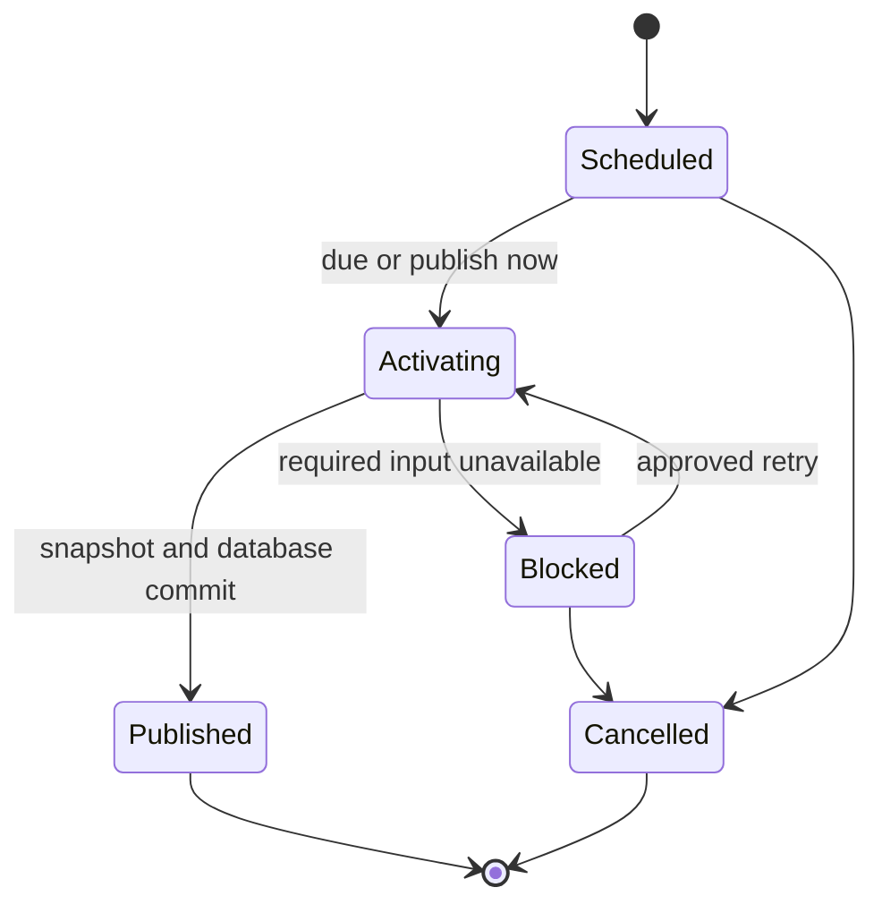

# Maincopy v1 system design

Status: target architecture; implementation is incomplete

Last reviewed: 2026-09-03

Related documents: [project overview](../README.md),
[implementation plan](implementation.md), and
[engineering style guide](quality.md).

## Purpose

Maincopy is a self-hosted publishing engine for one site and canonical domain.
The site can contain any number of articles. Git stores their canonical
Markdown and source history.

Maincopy controls when each approved article revision becomes public on the
author's domain.

This document defines the accepted V1 behavior and trust boundaries. The
[implementation plan](implementation.md) defines delivery work and acceptance
gates.

The implementation plan must conform to this design. A product decision must
update this document before it changes the plan.

> [!WARNING]
> Do not expose an admin listener before Maincopy authentication and
> authorization are active. Network isolation and JSON do not grant authority.

## V1 product boundary

V1 operates one site, one canonical domain, one repository, one branch, and one
content root. The repository can contain many articles.

| Included in V1 | Deferred until after V1 |
| --- | --- |
| Managed read-only Git synchronization | Browser article editor and Git write-back |
| Operator-managed external checkout | GitHub App, OAuth, and pull-request workflow |
| Production-faithful draft previews | Multiple publications and tenants |
| Scheduled initial and update releases | Explicit unpublish and retraction workflow |
| Canonical website, RSS, sitemap, and robots policy | Mailing-list capture and email delivery |
| Syntax highlighting, Mermaid, and sanitized SVG | X and Substack assisted distribution |
| Maincopy TOML frontmatter | Obsidian-first source and YAML Properties |
| Users, roles, profiles, and authenticated administration | Per-author publication identities |
| Static Lightning Address tip handoff | Paid articles and access entitlements |
| Local SQLite and Litestream replication | High-availability database failover |
| Prometheus metrics on a loopback-only `/metrics` endpoint | Public or multi-host metrics exposure |
| Nix package and NixOS module | Hosted multi-site control plane |

The canonical website and RSS are the only V1 article outputs. V1 captures no
subscriber data and sends no email.

V1 creates no X, Substack, or Nostr article payload. It stores no distribution
credential, provider job, delivery attempt, or delivery result.

## Terms

| Term | Meaning |
| --- | --- |
| Site | One Maincopy instance, canonical domain, and Git content source |
| Article | One Markdown post within that site |
| Revision | One immutable compiled version of an article |
| Release | A scheduled or immediate action that makes one revision public |

Use `site` for the complete website. Do not use `publication` when it could
mean either the site or one article release.

## Product principles

### Git owns articles

Git owns each article body and its authored metadata. Maincopy never stores an
editable article body in SQLite.

The admin interface can preview and release an indexed Git revision. It cannot
edit Markdown or commit to Git in V1.

### The author's domain is canonical

The complete article appears on the author's domain. RSS links to that
canonical URL.

### Preview precedes visibility

Every initial release and update binds one exact production preview. A sync
cannot make an article public or replace its live revision.

### External services cannot block reading

Website publication does not wait for a Lightning Address service or an
outbound distribution service.

### Public reading needs no JavaScript

Public pages use server-rendered HTML, CSS, and safe SVG. JavaScript can enhance
an admin or login flow.

Nostr extension login requires browser JavaScript. This exception does not
affect public article reading.

### Finite domains use strong types

Use an enum for each finite state, kind, mode, version, channel, or outcome.
Use a distinct type for each identifier, digest, token, and timestamp role.
Put variant-specific data in typed enum payloads instead of parallel booleans
or optional fields. Use typed errors at each fallible domain and application
boundary.

Parse external strings at their boundary. Domain functions accept only parsed,
validated values.

## System context



`maincopyd` serves public traffic, a loopback-only HTTP admin listener, and a
loopback-only metrics listener. A separate gateway provides the HTTPS admin
origin.

The public virtual host has no admin route or admin upstream. The loopback
admin listener is not a public recovery interface. The gateway has no direct
database or content-file access.

The metrics listener serves Prometheus scrapes at `/metrics`. `GET` returns the
body, and `HEAD` returns the same headers without a body. Other paths return
`404 Not Found`, and other methods return `405 Method Not Allowed`.

The public and admin routers do not mount `/metrics`.

The metrics listener does not use admin authentication. V1 relies on the
loopback bind and host access controls and provides no remote metrics gateway.

Offline bootstrap and repair are finite process invocations. They create no
recovery transport, recovery API, or continuing authentication bypass.

## Source-of-truth boundaries

| Data | Authority | Constraint |
| --- | --- | --- |
| Article body and authored metadata | Git repository | SQLite does not store an editable copy. |
| Post tip enablement | Git repository | The post cannot select a recipient. |
| Managed remote, branch, content root, and polling policy | SQLite | Host configuration selects managed mode. |
| Canonical release schedule and current public revision | SQLite | Sync and reload cannot advance visibility. |
| Approved slug and alias ownership | SQLite | A stable `PostId` keeps each claim permanently. |
| Users, roles, profiles, and active tip recipient | SQLite | Profile changes use resource versions. |
| Password credentials | SQLite | Store only versioned Argon2id PHC strings. |
| Nostr login and agent identities | SQLite | Store public keys and scoped metadata only. |
| Browser session and CSRF records | SQLite | Store fixed-length token digests only. |
| Runtime paths, listeners, limits, and source mode | Host configuration | Reject unknown configuration fields. |
| SSH, TLS, and Litestream secrets | Protected host files | Do not place secret bytes in Git, SQLite, or Nix. |
| Human and agent Nostr private keys | User or agent device | Maincopy never receives an `nsec` in V1. |
| Current public representation | Immutable memory snapshot | Build it from Git artifacts and SQLite state. |
| Lightning payment execution and truth | Reader wallet and address service | Maincopy keeps no payment ledger. |
| Operational database backup | Litestream replica | Git and revision artifacts need separate backups. |

## Configuration ownership

Maincopy uses three configuration layers.

`publication.toml` travels with the content repository. It contains public site
metadata, asset policy, tip defaults, and authored feature choices.

Post frontmatter contains article metadata and the optional tip enablement
flag. It does not contain a Lightning Address or V1 distribution settings.

SQLite contains mutable control-plane state. This state includes source
settings, users, profiles, releases, permanent route claims, sessions, and
audit records.

Host configuration contains runtime paths, listener settings, hard limits,
source mode, and named secret references. Secret values stay outside the host
document.

The effective precedence is built-in defaults, host file, then documented
non-secret command-line overrides.

## Content sources

### Managed Git mode

Managed mode uses one provider-neutral SSH remote and one branch. Maincopy owns
a local mirror and fetches with a read-only deploy key.

A periodic poll and an admin `Sync now` operation trigger fetch and reconcile.
A future webhook can trigger a fetch, but it cannot supply trusted content.

Managed mode requires the complete source commit. The database stores source
settings and the last accepted commit.

### External checkout mode

External checkout mode reads an operator-maintained local content root. It does
not fetch, pull, commit, or push.

Source commit metadata is optional in this mode. The content digest remains
required.

### First-run bootstrap

An empty managed installation starts in a restricted bootstrap state. It binds
no network listener.

An operator runs typed, offline `maincopyd` bootstrap commands on the host.
Each command acquires exclusive process ownership and uses domain transactions.
The commands do not provide a raw SQLite console or accept arbitrary SQL.

The identity step creates these records in one transaction:

- stable `InstanceId`;
- first owner and login credential; and
- initial audit event.

The source step then creates these records in one transaction:

- managed remote and branch;
- content root and polling policy; and
- SSH credential reference.

The source step validates the first fetch and compilation before it closes the
bootstrap state. The `maincopy` client never writes SQLite directly.

Offline recovery commands use the same typed invariant checks. They bind no
listener and refuse to run while the daemon owns the process lock. These
commands create no recovery transport or recovery API.

## Instance identity and discovery

Bootstrap generates one random `InstanceId` and stores it in SQLite. A restore
preserves the identifier. A new database receives a new identifier.

Unauthenticated admin discovery returns these bounded fields:

- `InstanceId`;
- expected public origin;
- admin API versions; and
- feature-contract versions.

A remote context pins the admin origin, `InstanceId`, and public origin. The
client loads a credential only after discovery matches all pins.

An explicit offline recovery command can replace the identifier. This action
invalidates every remote context and browser session.

## Content compilation and retention

The compiler confines all reads to the selected content root. It rejects links,
special files, unsafe paths, mount crossings, and configured limit excesses.

Compilation produces owned bytes in deterministic order. Later stages do not
reopen the mutable source tree.

Each revision uses a versioned, domain-separated digest. The digest binds
authored content, resolved assets, renderer identity, and deterministic output.

Maincopy retains an immutable artifact package for each current or non-terminal
release revision. The package contains these required materials:

- exact Markdown source bytes;
- referenced local asset bytes and normalized external references;
- effective typed metadata;
- renderer and presentation identities;
- deterministic rendered outputs; and
- a checksummed manifest.

The artifact package is operational retention, not an editable content store.
Git remains authoritative.

Write each package once under its content digest. Use an atomic rename after
the package and manifest reach durable storage.

Litestream does not back up this artifact store. The V1 backup procedure must
capture it at a recovery point compatible with SQLite.

## Article lifecycle

A sync or reload validates and indexes a candidate. It never changes the
current public article revision.

A newer revision of a live article appears as `UnpublishedChange`. The UI label
is `Unpublished changes`.



`PreviewDigest` binds the post revision, rendered article, renderer, page shell,
profile projection, and reviewed canonical URL.

The browser UI must show the preview before confirmation. An API client can
submit a reproducible digest without a prior preview request.

One stable canonical publication stores the original `published_at` and
`current_published_digest`. Historical release rows do not grant visibility.

Each accepted scheduled release reserves its revision's canonical slug and
authored aliases in SQLite. A successful immediate release makes the same
claims during activation. The stable `PostId` owns each claim permanently.

A reservation does not create a public route. Cancellation before activation
also does not release the route for use by another post.

Later releases can change a claimed route between canonical-slug and alias use
for the same `PostId`. They cannot transfer ownership to another post.

A route omitted from the active published revision stops serving. Its durable
claim remains, so another post cannot publish that value.

Activation checks route ownership before the snapshot swap. The serialized
writer checks it again while committing the published revision and route claims.

Each release has kind `Initial` or `Update`.



An update preserves the original `published_at`. A cancelled or blocked update
leaves the previous revision public.

A Git deletion or draft change cannot retract a live article in V1. It creates
an ineligible source change for administrator review.

## Public web contract

The public router serves the publication index, canonical articles, tags,
archive, RSS, sitemap, robots policy, immutable assets, and health resources.

Only an exact authored alias from the active published post revision creates a
public redirect. An alias that appears only in a candidate, draft, scheduled,
or unreleased revision remains unreachable.

`GET` or `HEAD` at `/posts/{alias}` returns `308 Permanent Redirect` with an
empty body and `Cache-Control: no-cache`. `Location` is the absolute URL for the
same revision's current canonical slug. Maincopy derives this URL only from
validated publication configuration.

The redirect drops the request query. It does not inspect the request authority
or forwarding headers. Alias matching is exact. Case variants and
trailing-slash variants return `404 Not Found`.

Maincopy does not synthesize an alias from an old slug. An omitted old slug
returns `404 Not Found`, but its durable ownership claim remains. Each active
alias maps directly to the current canonical URL, so redirect chains cannot
form.

Aliases count toward the inclusive 50,000-route snapshot ceiling. An active
route collision across mixed retained revisions rejects the candidate snapshot.
A durable claim owned by another `PostId` also rejects activation. Neither
failure changes the active snapshot.

RSS items, sitemap locations, canonical links, Open Graph URLs, and JSON-LD URLs
use only canonical paths. They never emit alias locations.

V1 serves one RSS 2.0 feed at `GET /feed.xml` and `HEAD /feed.xml`. The feed
contains summaries and absolute links to complete canonical articles.

V1 serves one sitemap only at `GET /sitemap.xml` and `HEAD /sitemap.xml`. The
public router has no sitemap alias or redirect.

The sitemap contains only canonical HTML locations. These locations are the
site root, archive, current public posts, and tags with at least one public
post. Maincopy sorts the absolute locations in ascending order.

The UTF-8 document contains an XML declaration and one `urlset` in the sitemap
namespace. Each `url` contains only one `loc`. Maincopy omits `lastmod`,
`changefreq`, and `priority`. The public projection does not contain the
truthful activation time for the current post revision.

Each `loc` contains fewer than 2,048 characters. Maincopy rejects duplicate
locations and XML 1.0-illegal characters. One sitemap accepts at most 50,000
locations and 40 MiB of output, with both project limits inclusive.

Maincopy generates the sitemap once during immutable snapshot construction.
The snapshot stores the exact bytes and a typed, sitemap-domain-separated
digest of those bytes. A sitemap build failure rejects the candidate snapshot
and preserves the active snapshot.

The handler serves `application/xml; charset=utf-8`, `Cache-Control: no-cache`,
and `X-Content-Type-Options: nosniff`. It uses the exact-byte digest as a strong
ETag. A matching `If-None-Match` returns an empty `304 Not Modified` response.

The sitemap follows the official
[Sitemaps protocol](https://www.sitemaps.org/protocol.html). Its media type and
UTF-8 declaration follow [RFC 7303](https://www.rfc-editor.org/rfc/rfc7303).

V1 serves one robots policy only at `GET /robots.txt` and `HEAD /robots.txt`.
The public router has no robots alias or redirect.

The UTF-8 policy has no byte order mark. It uses LF line endings and one final
LF. Its exact representation is:

```text
User-agent: *
Allow: /

Sitemap: https://example.com/sitemap.xml
```

Maincopy replaces the example origin with the configured canonical origin.
The sitemap URL contains fewer than 2,048 characters. Request `Host`,
`Forwarded`, and `X-Forwarded-*` headers cannot affect the policy.

The policy permits crawling of all public resources. It does not list admin,
preview, metrics, or other private paths. The robots policy is not an access
control mechanism.

Maincopy generates the policy during immutable snapshot construction. The
snapshot stores its exact bytes and a typed, robots-domain-separated digest.
A robots build failure rejects the candidate snapshot and preserves the active
snapshot.

The handler serves `text/plain; charset=utf-8`, `Cache-Control: no-cache`, and
`X-Content-Type-Options: nosniff`. It uses the exact-byte digest as a strong
ETag. Matching conditional GET and HEAD requests return an empty
`304 Not Modified` response.

The policy follows [RFC 9309](https://www.rfc-editor.org/rfc/rfc9309). The
absolute sitemap field follows the
[Sitemaps protocol](https://www.sitemaps.org/protocol.html#submit_robots).

Each successful canonical HTML page contains one self-referencing absolute
canonical link. The index, archive, and each nonempty tag page use Open Graph
type `website`. A current public post uses type `article`. Every one of these
pages emits its page title and description, configured site name, and canonical
URL as core Open Graph fields. Request `Host`, `Forwarded`, and
`X-Forwarded-*` headers cannot affect any metadata URL. Error pages emit no
canonical link or structured metadata.

Each post also contains one JSON-LD `BlogPosting`. It includes the authored
headline, description, tags, author, creation time, optional authored update
time, and canonical URL. A public post uses the original canonical SQLite
`published_at` for `datePublished`; an unpublished private preview omits that
field. `url` and `mainEntityOfPage` equal the canonical link. V1 treats the
required publication `author.name` as a person and emits a `Person`; supporting
an organization requires a later typed author-kind field.

JSON-LD passes through a JSON serializer and one private trusted-script sink.
That boundary escapes every character that could terminate or reinterpret the
HTML script text node. Ordinary metadata attributes remain Maud-escaped.

This is deliberately core, non-image Open Graph metadata. The
[Open Graph protocol](https://ogp.me/) also requires `og:image`, so Maincopy
does not claim complete Open Graph support yet and does not substitute the
favicon. Work package 2.5 adds Open Graph and JSON-LD image fields only after
it can project validated external images and snapshot-scoped local image URLs.
Feeds use stable post identifiers and absolute canonical URLs.

Request handlers read only the active immutable snapshot. They do not parse
Markdown, inspect Git, or query mutable source files.

Drafts, previews, scheduled revisions, and preview-only assets return `404 Not
Found` on the public origin.

The public router serves a local content asset only when the active snapshot
selected its exact logical path and bytes. Its canonical URL is
`/assets/<site-snapshot-digest>/<asset-relative-path>`. Parsing uses the raw
request path, accepts no decoded or normalized alias, and applies the content
tree's fixed maximum path and depth ceilings before lookup. A request cannot
address the source checkout or a retained non-public candidate.

An allowlisted passive authored type is served inline with its fixed media
type. Active document formats and unrecognized authored formats are served as
`application/octet-stream` attachments. Renderer-generated bytes have the
same inert attachment policy until a renderer-specific sanitizer grants a
separate trusted provenance. In particular, the future Mermaid boundary must
grant sanitized SVG capability to each accepted result; it must not make all
generated SVG active.

Content assets use their exact-byte digest as a strong ETag,
`Cache-Control: public, max-age=31536000, immutable`,
`X-Content-Type-Options: nosniff`, and a sandboxing CSP. Matching weak or strong
`If-None-Match` validators return an empty `304 Not Modified`. The asset MIME,
disposition, and security-header policy is version-bound into the site
snapshot identity so a policy change cannot reuse an immutable URL.

One active snapshot retains at most 50,000 distinct public content assets and
512 MiB of their exact bytes, with both limits inclusive. Repeated references
to the same identity, bytes, and provenance are charged once. A collision or
one-over-limit selection rejects the candidate before activation and preserves
the current snapshot.

Authenticated previews use the same authored-versus-generated delivery policy
and exact retained bytes. Preview responses remain `private, no-store`; active,
opaque, and unsanitized generated assets remain downloads even on the admin
origin. Files present in a candidate but not referenced by its validated site
or post model are not preview capabilities.

## Rendering and assets

Maud owns page structure. The Markdown renderer owns article content.

The renderer escapes raw HTML and validates each link or image destination.
Local assets use immutable snapshot URLs and are served from bytes owned by the
snapshot, never from a request-time filesystem lookup.

An external content asset must use an allowlisted HTTPS origin. Maincopy never
fetches, proxies, or checks that asset.

Code highlighting and Mermaid rendering happen during compilation. Mermaid
output crosses a strict SVG sanitization boundary.

Valid Mermaid blocks render through the selected local renderer. An invalid or
oversized diagram rejects the candidate and preserves the last good snapshot.

Known code languages use syntax highlighting. An unknown language uses safely
escaped plain-code output.

Public pages work without JavaScript. Application CSS and optional JavaScript
use deterministic content-hashed bundles.

## Admin control plane

`maincopyd` binds the admin router to a dedicated loopback TCP address. The
listener accepts HTTP only from the same host.

The retired Unix-socket and Windows named-pipe transport is not a compatibility
path. V1 rejects its former configuration and command-line options. No build
binds both transports or exposes an unauthenticated admin TCP listener.

A separate gateway terminates Transport Layer Security (TLS) for the canonical
admin origin. It forwards allowed paths to the loopback listener and removes
untrusted identity headers.

The public listener never mounts, forwards, or falls back to an admin route.
Maincopy validates the configured admin host and exact request origin.

Only pinned discovery, the login page, and login-session endpoints are
available without a principal. Every other operation requires authentication
and an allowed scope.

Human login can use username and password, Nostr, or both. Passwords use
Argon2id. Nostr login verifies a fresh signature without receiving a private
key.

The browser receives an opaque server-side session in a host-only `Secure`,
`HttpOnly`, and `SameSite` cookie. SQLite stores only the session-token digest.
V1 does not use a JSON Web Token (JWT) for a browser session.

Each cookie-authenticated mutation requires a separate Cross-Site Request
Forgery (CSRF) token. Maincopy also requires the exact configured `Origin`.

The human CLI obtains a revocable login session. It stores the session in the
operating system credential store, not in arguments, environment variables, or
context files.

Agent records contain one dedicated Nostr public key and typed scopes. Each
request requires a fresh, replay-protected NIP-98 proof.

NIP-98 authenticates admin requests only. It does not sign or distribute a
Nostr article in V1.

V1 does not issue a long-lived bearer API token. A scoped `AgentCredential`
fills the same integration niche as an app or robot credential. It uses
proof-of-possession for every request instead of a reusable secret.

V1 has three built-in roles. Each role maps to a fixed set of typed scopes.

| Scope family | Owner | Administrator | Publisher |
| --- | --- | --- | --- |
| Content and status, including sync and reload | Allow | Allow | Allow |
| Preview HTML and assets | Allow | Allow | Allow |
| Release scheduling and activation | Allow | Allow | Allow |
| Profiles and Lightning settings | Allow | Allow | Deny |
| Users and credentials | Allow | Allow | Deny |
| Role assignment | Allow | Deny | Deny |
| Audit records | Allow | Allow | Deny |
| Source and instance configuration | Allow | Deny | Deny |

An `AgentCredential` can contain only a subset of its issuer's current scopes.
A Publisher can trigger sync and reload, but cannot change source settings.
A role or agent scope never grants Git write permission. Repository access,
branch protection, and deploy permissions remain external to Maincopy.

Admin resource endpoints use JSON. The login and admin UI use HTML. Protected
preview endpoints return exact HTML and assets so the UI can render them.

The public origin returns `404 Not Found` for every admin API and UI path.
Network reachability alone grants no authority.

### Authentication security review

V1 requires a release-blocking review of the complete authentication boundary.
The review includes these areas:

- password hashing, verification, rate limits, and account enumeration;
- session creation, fixation resistance, expiry, rotation, and revocation;
- cookie flags, CSRF verification, and exact host and origin checks;
- Nostr login challenges and NIP-98 freshness, replay, URL, method, and body
  binding;
- role and agent-scope enforcement at each admin operation;
- public and admin route isolation; and
- gateway header removal, TLS termination, and credential storage.

Resolve each critical or high-risk finding before release. If a reviewed path
cannot meet this gate, remove that path from the V1 product surface.

## V1 distribution boundary

Maincopy serves the canonical website and RSS in V1. RSS is a pull-based public
resource, not an outbound delivery operation.

Maincopy does not collect subscriber details or send email in V1. It does not
prepare or submit X, Substack, or Nostr article content.

No V1 role or agent scope grants distribution authority. The database contains
no provider credential, delivery job, attempt, lease, or result for an article.

## Static Lightning Address tips

SQLite stores one active recipient `UserId`. The recipient profile stores a
versioned Lightning Address.

Git stores only the post's tip enablement flag. A tip call-to-action appears
when both the authored flag and active profile permit it.

Maincopy derives the LUD-16 URL and LNURL value locally. It renders the visible
address, wallet link, and QR code without an external QR service.

Maincopy does not resolve the address, create an invoice, or confirm payment.
It stores no payer, amount, invoice, hash, preimage, or settlement.

The reader's wallet and Lightning Address service complete the payment. Paid
article access requires a separate post-V1 entitlement design.

## Operational database

SQLite stores operational state. It does not store editable Markdown or
rendered article bodies.

Exactly one Tokio task owns one SQLx write connection. Every runtime mutation
uses one bounded command channel.

Read handlers use a separate bounded, query-only pool. The database uses local
storage and write-ahead logging.

A network call cannot hold a database transaction. A committed writer reply
means the transaction completed.

Typed commands enforce idempotency, resource versions, legal transitions, and
cross-table invariants. The schema enforces stable widths and basic integrity.

The CLI and admin UI never open SQLite directly.

## Prometheus metrics

`maincopyd` owns one explicit Prometheus registry. A dedicated loopback-only
HTTP listener exposes that registry at `/metrics`.

The host configuration owns the metrics bind address. It defaults to
`127.0.0.1:3002` and rejects every non-loopback address.

The metrics endpoint uses the Prometheus text exposition format. A successful
response uses `text/plain; version=0.0.4` as its content type.

The endpoint is not part of the public router, admin router, or OpenAPI
document.

V1 includes these Tokio runtime metrics from a five-second sampling interval:

| Metric | Type | Meaning |
| --- | --- | --- |
| `tokio_workers_count` | Gauge | Runtime worker thread count |
| `tokio_worker_busy_ratio` | Gauge | Worker busy time divided by available worker time |
| `tokio_total_busy_duration_ms` | Gauge | Total worker busy time during the latest sample |
| `tokio_worker_parks_total` | Counter | Cumulative worker park count |
| `tokio_live_tasks_count` | Gauge | Tasks that are alive at the sample time |
| `tokio_global_queue_depth` | Gauge | Tasks waiting in the runtime global queue |

Each runtime series uses only `service="maincopyd"` and `runtime="main"` as
labels. V1 does not require unstable Tokio metrics.

V1 also exports Linux process usage, database queue and pool pressure,
transaction latency, writer health, write-ahead log size, and checkpoint
outcomes.

Every label uses a closed, bounded value. Metrics never contain a user or post
identifier, slug, raw URL, request identifier, host path, secret, or error
message.

The Tokio collector and metrics listener are supervised application tasks.
They use the application cancellation token and stop during ordered shutdown.

## Startup and shutdown

`crates/server/src/main.rs` remains a small process entry point.
`crates/server/src/startup.rs` owns composition and lifecycle behavior.

Normal startup follows this order:

1. Validate host configuration and acquire process ownership.
2. Construct the Prometheus registry and registered metric instruments.
3. Open and verify SQLite through its instrumented single-writer bootstrap.
4. Verify instance identity and authentication compatibility.
5. Reconcile incomplete reloads and releases.
6. Verify required revision artifacts.
7. Build and install the canonical immutable snapshot.
8. Bind the public, loopback admin, and loopback metrics listeners.
9. Start the supervised Tokio collector, source polling, and release scheduler.

Bootstrap and recovery commands are offline process modes. They bind no network
listener.

Shutdown stops intake before workers. It drains accepted database work before
it closes SQLite and releases all listener addresses.

## Backup and restore

Litestream replicates the local SQLite database. It does not back up Git,
revision artifacts, host secrets, or runtime credentials.

Production recovery requires these independent inputs:

- Git repository backup or remote;
- Litestream database replica;
- compatible revision-artifact backup; and
- protected host secret backup.

Restore is an offline operation. Never restore over a non-empty live database.

The restore verifier checks SQLite integrity, schema compatibility, release
inputs, artifacts, profile state, and logical digests.

An accepted restore creates a one-use marker for that restored candidate. The
first normal startup verifies and consumes the marker before ordinary writes.

Ordinary restarts do not require a restore marker. Restored browser sessions
are invalidated before the admin origin becomes available.

## Workspace and deployment

The root `Cargo.toml` defines one workspace:

```text
crates/
|-- cli/                 # maincopy operator client
|-- markdown-compiler/   # content discovery, validation, and identity
|-- server/              # maincopyd and application domains
`-- shared/              # wire contracts and shared defaults
```

One Maincopy daemon owns one site with many articles. Production also runs an
HTTPS gateway and Litestream as separate, least-privilege processes.

The Nix flake provides packages, applications, checks, a development shell,
and a formatter. The NixOS module is a V1 release requirement.

## Pre-v1 state boundary

Maincopy has no deployed or supported database state. Every database created
before V1 is disposable development state. An operator must archive or remove
it and bootstrap a fresh database. Maincopy does not reset, migrate, convert,
or read that state. Rewritten embedded migrations cause the existing checksum
preflight to reject an older database before mutation.

The `/api/admin/v1` paths and `*-b3-v1-*` digest encodings are the first
intended product contracts. Earlier development builds do not create a
compatibility obligation. Current code recomputes all identities into fresh
V1 state; it has no old-schema reader, old-transcript parser, fallback, or
compatibility transport.

## Open design selections

These selections must finish before their owning work starts:

- revision-artifact backup and retention implementation;
- production HTTPS admin gateway;
- Mermaid renderer and SVG sanitizer;
- measured recovery point and recovery time targets.

## Required release evidence

V1 must prove these properties:

- Invalid content cannot replace a working snapshot.
- Sync cannot publish an initial article or update.
- Every release binds its exact preview and canonical URL.
- Draft and preview assets are absent from the public origin.
- Historical releases cannot grant current visibility.
- Each release-approved canonical slug and authored alias remains permanently
  owned by its stable `PostId`, including routes reserved by a cancelled
  schedule.
- Removing a route stops serving it without releasing its durable ownership.
- One post can change its own claimed route between canonical-slug and alias use.
- Public routing exposes no admin endpoint.
- The public router and an authenticated admin request return `404 Not Found`
  for `/metrics`.
- The loopback admin listener never serves an unprotected operation.
- The loopback metrics listener serves only Prometheus `GET /metrics` and
  standard `HEAD /metrics` requests.
- Tokio runtime, process, and database metric families appear with only the
  documented bounded labels.
- The authenticated cutover leaves no Unix-socket or named-pipe compatibility
  transport, configuration, service unit, or test.
- Remote users and agents receive only authorized results.
- A Publisher cannot access profiles, Lightning settings, users, credentials,
  audit records, or instance configuration.
- The authentication security review has no unresolved critical or high-risk
  finding.
- Bootstrap and recovery create no recovery transport, bind no listener, and
  accept no arbitrary SQL.
- Syntax highlighting uses bounded local work and a safe plain-code fallback.
- Mermaid uses a deterministic local renderer with bounded resources.
- Hostile SVG cannot cross the single reviewed sanitization boundary.
- Static tip rendering makes no LNURL request.
- No V1 operation creates a subscriber record, email task, share kit, provider
  payload, distribution job, or delivery result.
- Every runtime SQLite write uses the shared writer task.
- No network call holds a database transaction.
- Database and revision artifacts restore to one compatible recovery point.
- The NixOS virtual-machine test proves gateway isolation, service permissions,
  Litestream ordering, restart behavior, and restore behavior.
- A clean checkout passes the documented Nix and Rust checks.

The [implementation plan](implementation.md) contains the complete work-package
and failure-injection gates. The [engineering style guide](quality.md) defines
code conventions and the manual CRAP score budget.

## Post-v1 roadmap

Post-v1 work must preserve canonical publication independence. An outbound
service cannot block, roll back, or change a canonical website release.

### Mailing-list capture and email delivery

The first mailing-list increment can add first-party double opt-in. It must
also support unsubscribe, scoped export, and deletion.

SQLite will store subscriber consent and lifecycle state. These records contain
personally identifiable information (PII).

The writer must commit subscriber state and transactional email work together.
An email worker must perform network delivery outside the database transaction.

SQLite must store confirmation and control token digests only. Logs, metrics,
audit events, and errors must not contain raw addresses or tokens.

A confirmation or unsubscribe change must use `POST`. A `GET` request can show
a form without changing state.

Before implementation, select and document these items:

- one email transport for confirmation and control messages;
- a standards-safe email address comparison rule;
- retention for pending, unsubscribed, token, audit, and backup records; and
- secret ownership outside Git, SQLite, logs, and the Nix store.

Bulk newsletter campaigns are a separate increment. Their delivery state and
privacy review must not reuse transactional-email assumptions without review.

### Assisted X and Substack distribution

A future share kit can exist only after canonical publication commits. Its
source revision must equal `current_published_digest`.

The kit must be unavailable while an update is `Activating`. This rule prevents
a mismatch between SQLite and the public snapshot.

The first assisted channels can use these stable names:

- `x`; and
- `substack_note`.

Each entry can contain the first eligible prose paragraph and canonical URL.
The required article description is the fallback excerpt.

X can use a supported Web Intent. Substack can open its site for the user to
select `Create` and then `Note`.

Copy and Open actions are manual. Maincopy must not claim that either action
published content.

Assisted distribution must store no provider credential, schedule, attempt,
lease, completion, or delivery result. Share-kit generation must make no
provider request.

Before X support starts, select and pin a pure Rust weighted-text
implementation. Test it against official X fixtures. Record its rules version,
license, features, and Unicode behavior.

### Automatic provider delivery

Automatic X, Substack, or Nostr article delivery requires a separate design.
That design must define these boundaries:

- provider credential ownership and protected storage;
- Nostr signer custody that is separate from admin NIP-98 credentials;
- idempotency, retry, backoff, cancellation, and terminal delivery states;
- redacted audit and operator-visible failure data; and
- recovery behavior for a committed canonical release.

No provider network call can hold a SQLite transaction. A provider failure
cannot change the current public revision.

Maincopy must not automate a third-party website through browser scripting.

### Obsidian-first authoring

A post-v1 release can add `ObsidianSync` as an optional source mode. Git and
external local-checkout modes remain supported.

The adapter uses the official Obsidian Headless client and Obsidian Sync. It
does not use Obsidian Publish or an unofficial Sync protocol. Obsidian Headless
is currently open beta. A dependency spike must approve its stability, license,
Nix packaging, and pinned runtime before implementation. The current beta
requires Node.js 22 or later and an active Obsidian Sync subscription.

```mermaid
flowchart LR
    Author[Obsidian clients] <-->|End-to-end encrypted Sync| Remote[Obsidian Sync]
    Remote -->|One-shot mirror| Mirror[Disposable server mirror]
    Mirror -->|Completed generation| Compiler[Maincopy compiler]
    Compiler --> Artifact[Immutable revision artifact]
    Artifact --> Preview[Exact admin preview]
    Preview -->|Approved release| Public[Website and RSS]
```



A completed Sync operation creates a candidate. It never publishes or replaces
a public article.

The first source adapter has these boundaries:

- Use a dedicated publishing vault. Do not sync a personal vault to the server.
- Require end-to-end encryption for the remote vault.
- Run one bounded, one-shot mirror operation for each source sync.
- Use `mirror-remote` only on a disposable, service-owned server mirror.
- Configure the `conflict` strategy. Reject every reported or materialized
  conflict before generation completion.
- Create an immutable Maincopy generation only after Sync succeeds.
- Copy only `publication.toml`, `posts/`, `drafts/`, and `assets/` from the
  configured publication root.
- Keep `.obsidian`, templates, canvases, plugin data, and all other vault notes
  outside the completed generation.
- Keep Obsidian account state and encryption secrets outside Git, SQLite, logs,
  command arguments, and the Nix store.
- Expose only redacted source status through the admin API.

> [!WARNING]
> `mirror-remote` can revert local changes. Never point it at an author's
> working vault. Use only the disposable server mirror.

End-to-end encryption protects the remote vault and network transfer. It does
not encrypt the local server mirror. The NixOS module must protect the mirror
with a dedicated `maincopy-obsidian-sync` identity. The `maincopyd` identity can
read completed generations but cannot read Headless credentials or the mutable
mirror.

Obsidian documents limits in the cryptographic binding between remote paths and
content. The security review must include this boundary. Maincopy's manifest
binds the completed local generation, but it cannot strengthen the remote Sync
protocol.

Remote Sync is not cross-file transactional. The completed-generation boundary
prevents Maincopy from compiling a mirror while Headless changes it.

Maincopy creates its own content-tree digest after each completed Sync. This
digest replaces the Git commit as the source revision for this mode. The
revision artifact remains the input to preview, release, and restore.

The first Obsidian authoring increment supports both metadata formats:

- existing TOML frontmatter between `+++` delimiters; and
- strict YAML Properties between `---` delimiters.

Each article uses exactly one format. Both formats normalize into the same
typed metadata and identity transcript. A supplied Obsidian template contains
every required Maincopy property. The starter vault configures `assets/` as its
attachment directory.

The first compatibility contract supports deterministic article wiki links,
heading links, and image embeds below `assets/`. It can add a bounded callout
mapping. It does not execute community plugins, CSS snippets, scripts, or note
transclusions. Maincopy continues to render Mermaid itself.

Obsidian Sync history is editing history, not Maincopy release evidence. It
does not back up the complete authoring vault. Retained Maincopy artifacts cover
release inputs, not every draft or vault note. Require a separate one-way vault
backup and recovery drill.

### Other candidates

Other post-v1 candidates include browser editing, Git write-back, provider Git
integrations, explicit retraction, paid access, multiple sites, and database
high availability. Each candidate requires a separate product decision.

## References

- [SQLite write-ahead logging](https://sqlite.org/wal.html)
- [Litestream operation](https://litestream.io/how-it-works/)
- [Nostr HTTP Authentication, NIP-98](https://github.com/nostr-protocol/nips/blob/master/98.md)
- [Argon2 recommendations, RFC 9106](https://www.rfc-editor.org/rfc/rfc9106.html)
- [LNURL base specification, LUD-01](https://github.com/lnurl/luds/blob/luds/01.md)
- [LNURL-pay, LUD-06](https://github.com/lnurl/luds/blob/luds/06.md)
- [Lightning Address, LUD-16](https://github.com/lnurl/luds/blob/luds/16.md)
- [X Post button and Web Intent](https://docs.x.com/x-for-websites/post-button/overview)
- [Substack Notes workflow](https://support.substack.com/hc/en-us/articles/14564821756308-Getting-started-on-Substack-Notes)
- [Obsidian Headless](https://obsidian.md/help/headless)
- [Obsidian Headless Sync](https://obsidian.md/help/sync/headless)
- [Obsidian Properties](https://obsidian.md/help/properties)
- [Obsidian Sync security](https://obsidian.md/help/sync/security)
- [Obsidian Sync version history](https://obsidian.md/help/sync/version-history)
- [Back up Obsidian files](https://obsidian.md/help/backup)
