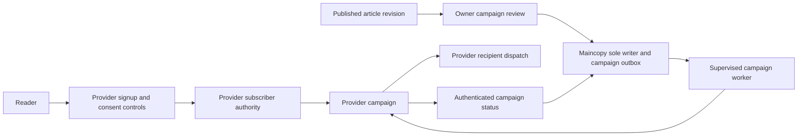

# Mailing-list privacy and dispatch plan

Status: active first-release work; subscriber capture and sending remain disabled.

Last reviewed: 2026-09-06

Related: [system design](design.md), [implementation plan](implementation.md), and
[engineering style](quality.md).

## Release boundary

Implement newsletter support before home-server deployment. Enable it only after
privacy, recovery, dispatch, and deliverability acceptance passes. Local fixtures
do not establish provider behavior or successful deployment.

Use a newsletter service to hold subscriber addresses, consent, suppression, and
recipient delivery state. The owner is choosing between Mailchimp and Brevo.
AWS email services and DynamoDB are excluded. Do not add a separate cloud database.

The first campaign announces one explicitly published article revision. An owner
reviews and authorizes its email separately from website publication. Automatic X,
Substack, and Nostr distribution remain outside this increment.

Current work includes public announcement preparation. It does not establish
a working subscription or removal service.
Keep capture and dispatch disabled until the complete provider integration passes.

## Data and access boundaries

Treat email addresses as personally identifiable information (PII). Keep subscriber addresses,
contact hashes, subscriber identifiers, consent records, and provider control tokens
out of Maincopy's SQLite database, WAL, Git content, and B2 checkpoints.
Do not retain recipient snapshots, subscriber exports, or raw webhook payloads.

Maincopy may persist reviewed public campaign content, provider campaign identifiers,
owner authorization, operation identifiers, and campaign dispatch state. Use typed
commands through the sole SQLite writer. The newsletter provider remains the
current authority for subscriber consent and recipient selection.

Prefer provider-hosted signup, double opt-in (DOI), unsubscribe, and preference
pages. Link to these pages without adding a general-purpose visitor tracker.
If an embedded form is selected, review its scripts, cookies, and content-security-policy requirements.
A provider-hosted form keeps submitted addresses outside Maincopy's request path.

If a provider API operation requires transient PII, validate and bound that input.
Use protected Maincopy-owned buffers and redact diagnostics. Do not retain raw
responses or copy PII into logs, traces, metrics, audit text, or error messages.
Framework JSON, HTTP, and TLS allocations have separate lifetimes; complete memory
wiping is not guaranteed.

Only an owner with fresh authentication may authorize campaigns or change provider
configuration through Maincopy. Publishers and existing agent scopes gain no email
authority implicitly. Subscriber export is outside the initial Maincopy interface.
Protect provider-console access and API credentials separately.

## Hosted consent and re-enrollment

Start with one site-wide newsletter audience. Publish its purpose, operator identity,
privacy notice, contact channel, and retention policy before enabling signup.
Do not collect additional profile fields without a defined need.

Require provider DOI before campaign eligibility. Record the provider's consent
settings and evidence fields during acceptance. Define retention for unconfirmed
requests and limits for repeated confirmations. Verify enumeration resistance,
list-bombing controls, confirmation expiry, replay, and scanner behavior.

Do not infer consent from a successful contact-create response or list membership.
Generic import and upsert operations can bypass DOI or change subscription status.
Do not expose these operations as Maincopy signup or recovery mechanisms.

Re-enrollment requires a new, deliberate subscription through the reviewed DOI
flow. Never reactivate contacts from a local checkpoint, stale webhook, or import.
Document the provider's behavior for unsubscribed, deleted, complained, and bounced
addresses before enabling re-enrollment.

Providers may remove suppression history during permanent deletion or permit
fresh consent afterward. Do not promise a permanent complaint or hard-bounce block
that the selected provider cannot enforce. Any restriction on legitimate
re-enrollment requires an explicit policy and a supported provider mechanism.

## Unsubscribe and permanent deletion

Unsubscribe stops future newsletter delivery. Permanent deletion removes personal
data according to the provider's deletion process. These are distinct operations.
Never describe an unsubscribe response as completed erasure.

Every campaign needs a visible **Unsubscribe and remove my address** control.
It must stop future sends and request permanent deletion, with accurate pending
and completion states. Provider unsubscribe alone does not complete this feature.
Do not require a Maincopy account, the original device, or an unsolicited goodbye email.

Require provider support for [RFC 8058 one-click unsubscribe](https://www.rfc-editor.org/rfc/rfc8058.html).
The authenticated HTTPS `POST` must work without login, cookies, redirects, or
additional confirmation. Verify DKIM coverage for both unsubscribe headers in a
real delivered message. Example protocol shape:

```text
List-Unsubscribe: <https://newsletter-provider.example/unsubscribe/OPAQUE_TOKEN>
List-Unsubscribe-Post: List-Unsubscribe=One-Click
```

Review browser controls separately from the mailbox one-click protocol. Test
scanner `GET` requests and the intended user confirmation action. Do not enable
provider settings that make automatic link inspection change consent unexpectedly.
Provider token expiry and replay behavior require external acceptance.

For permanent deletion, identify the exact operation and its coverage. Include
pending confirmations, contact history, queued recipients, event data, exports,
provider backups, and any documented exceptions. Record the provider's completion
window and how an operator verifies completion. An accepted cleanup request can
remain pending; report that state accurately.

Prefer the provider's authenticated removal workflow. Do not implement an automatic
Maincopy deletion retry from a cached address, contact hash, or subscriber identifier.
The reviewed APIs do not establish a conditional-delete guarantee tied to the
consent state originally observed.

A provider lookup followed by deletion leaves a race: the subscriber can give
fresh consent between those operations. A delayed retry can then delete the new
subscription. Maincopy's local writer cannot make these remote operations atomic.
Resolve this race before enabling combined unsubscribe-and-erase behavior.
Use a documented conditional operation or a provider-owned removal workflow.
If removal intentionally takes precedence over concurrent re-enrollment, define
that policy and communicate its completion boundary before accepting new consent.
A manual operator procedure can handle exceptions; it does not replace the requested control.

## Campaign review and dispatch

Use one concrete provider adapter. Keep the local outbox at campaign level;
the provider owns individual recipients, suppression, delivery retries, and bounces.
Do not rebuild a subscriber database or per-recipient sending engine in Maincopy.

An approved campaign binds its article revision, canonical public URL, rendered
content, template version, subject, sender identity, provider audience, and owner
authorization. Never select a private preview, draft, or later unreviewed revision.
Use readable plain text and email-compatible HTML.

Define when the provider selects the audience. A dynamic list may include people
who join after approval. If approval requires an audience cutoff, prove a supported
provider-side snapshot or filter without exporting recipients into Maincopy.
The provider must still apply current unsubscribe and suppression state when sending.



Create a provider draft without sending. Persist its provider campaign identifier
before requesting delivery. Read back content, sender, audience, and relevant
settings before approval. Reject unexpected differences, including provider-added
footers or tracking behavior that changes the reviewed result.
Recheck before transmission. If the provider lacks conditional send, document the
remaining remote-edit race and prohibit provider-console edits after approval.

Provider draft creation can also have an unknown outcome. Reconcile using a
supported correlation field or operator inspection. Do not create replacement
drafts automatically when the original outcome remains uncertain.

Use typed local states for preparation, review, queued work, submission, acceptance,
completion, cancellation, failure, and unknown outcomes. Commit operation identities,
leases, fencing versions, and admission before transmission. Perform network calls
outside database transactions. Check cancellation and admission expiry before sending.

A local cancellation stops work that has not crossed submission admission.
For scheduled or accepted provider work, request cancellation only where supported
and verify the result. An in-flight or delivered email cannot be reliably recalled.
Provider acceptance and campaign completion do not prove inbox delivery.

Disable automatic transport retries for non-idempotent campaign operations. After a
timeout, query the same provider campaign and preserve an unknown outcome when
evidence is insufficient. Transactional-email idempotency guarantees do not establish
campaign guarantees. Lease expiry must not authorize a duplicate campaign send.

Treat authenticated webhooks as notifications, not the subscriber authority.
Verify source authentication before applying effects. Bound payloads, deduplicate
where possible, and tolerate delayed or reordered events. Prefer campaign status
lookups when a webhook contains unnecessary subscriber PII. Never persist its raw body.

Respect provider quotas and cost limits. Use bounded retry policies only for
operations with established safe retry behavior. Pause campaigns on repeated
failures or excessive bounce and complaint rates.

The application owns, supervises, cancels, and awaits campaign workers. Shutdown
stops new claims and records recoverable outcomes. Provider failures remain typed
job outcomes. They must not block public reading or roll back website publication.

## Backups and restore

Site checkpoints must contain no subscriber addresses, contact hashes, consent
records, control tokens, or recipient lists. Verify that boundary across SQLite,
WAL, retained content, diagnostics, and exported backup bundles.
Subscriber deletion therefore does not depend on rewriting Maincopy's immutable
site backups. Provider retention and erasure remain separate acceptance obligations.

Persist email quarantine during restore before starting campaign workers. Quarantine
all restored campaign work, including drafts, queued sends, and previously unknown
operations. Never replay contact creation, consent changes, or confirmation requests
from a site checkpoint.

Reconcile each provider campaign against current provider state before permitting
further work. A campaign might have been accepted after the checkpoint cutoff.
A missing campaign, unavailable provider, or uncertain status must not cause an
automatic replacement or resend. Require owner review for any new campaign.

Hosted consent and removal controls can remain available independently of Maincopy.
Restoring the website must not overwrite the provider audience or its current
suppression state. Prove that restoring a pre-removal checkpoint cannot resurrect
an address or restart an old send.

## Newsletter service selection

The owner is choosing between Mailchimp and Brevo. MailerLite remains comparison
evidence. No provider account or paid plan has been configured by this work.
Official pricing and API documentation were checked on 2026-09-06.
Prices below are starting USD monthly prices, excluding taxes and overages.

| Provider | Relevant starting plan | Outstanding concern |
| --- | --- | --- |
| Mailchimp | Standard: $20/month, 500 contacts, 6,000 sends; custom HTML requires Standard or higher. | Verify permanent deletion, hosted re-enrollment, and residual provider link redirects. |
| Brevo | Starter: $9/month, 5,000 sends, 500 stored contacts. | Deletion removes blocklist history; verify fresh DOI, deletion races, and tracking controls. |
| MailerLite | Comfort: $12/month; Free excludes API sending. | API docs retain an older custom-HTML plan requirement; documented settings retain ordinary click tracking. |

Sources: [Mailchimp pricing](https://mailchimp.com/pricing/marketing/),
[custom HTML requirements](https://mailchimp.com/help/paste-in-html-to-create-an-email/),
[Brevo plans](https://help.brevo.com/hc/en-us/articles/208589409-About-Brevo-s-pricing-plans),
[MailerLite pricing](https://www.mailerlite.com/pricing), and
[MailerLite campaign API](https://developers.mailerlite.com/api/campaigns).

Review deletion separately from unsubscribe and archival. MailerLite's ordinary
delete retains information; its forget operation specifies a 30-day completion
window. Brevo warns that deletion removes protection against accidental re-import.
Do not import subscriber backups into either service.
[Mailchimp deletion](https://mailchimp.com/help/delete-contacts/),
[Brevo deletion](https://help.brevo.com/hc/en-us/articles/5313915904914-Delete-contacts),
[MailerLite deletion](https://www.mailerlite.com/help/how-to-delete-or-forget-a-subscriber).

Disable optional open tracking, click tracking, and analytics. Verify the selected
provider's actual behavior before promising that links remain unchanged.
MailerLite documents that ordinary clicks remain tracked. Brevo offers per-contact
tracking consent, but its documentation also describes limited deliverability
measurement. Record unavoidable processing and require an explicit policy decision
if the provider cannot meet the intended privacy boundary.
[Mailchimp link handling](https://mailchimp.com/help/enable-and-view-click-tracking/),
[MailerLite tracking](https://www.mailerlite.com/help/how-to-enable-and-disable-tracking),
[Brevo tracking controls](https://help.brevo.com/hc/en-us/articles/37113920427922-About-email-tracking-pixels-and-the-CNIL-recommendation-in-Brevo).

## Sending-domain and deliverability runbook

Complete this procedure with the selected provider and authorized test recipients.
Authentication and list hygiene reduce blocking risk; they do not guarantee inbox placement.

1. Select a sending subdomain, stable visible sender, and monitored reply address.
2. Complete provider domain verification and publish the exact required DKIM records.
3. Follow the provider's return-path and SPF instructions; do not invent DNS records.
4. Publish DMARC for the visible sender domain.
5. Verify SPF or DKIM alignment against the visible `From` domain in received headers.
6. Confirm provider handling of forward/reverse DNS and encrypted SMTP delivery.
7. Complete account approval and record sending quotas and credential permissions.
8. Configure provider suppression, event retention, DOI, and reviewed deletion procedures.
9. Inspect delivered content, sender information, plain text, tracking, and unsubscribe controls.
10. Verify DKIM-covered one-click headers through an actual HTTPS `POST`.
11. Test unsubscribe, complaint handling, deletion, re-enrollment, and cancellation during dispatch.
12. Start with a small confirmed audience and verify the campaign pause mechanism.

Do not send tests or campaigns without owner authorization for the recipients and launch.
Record DNS values, received authentication results, control outcomes, and verification dates.
Redact addresses and tokens from retained evidence.

Apply the stricter common sender baseline from the beginning:

| Receiving service | Published requirement or guidance |
| --- | --- |
| Personal Gmail | Around 5,000 messages/day triggers bulk requirements: SPF, DKIM, aligned DMARC, TLS, valid DNS, and one-click plus visible unsubscribe. Honor unsubscribe within 48 hours; keep reported spam below 0.3%. |
| Yahoo | No numerical bulk threshold is published. Bulk requirements include SPF/DKIM/DMARC alignment, easy unsubscribe within two days, and reported spam below 0.3%. |
| Outlook consumer services | Above 5,000 messages/day requires passing SPF and DKIM plus aligned DMARC, at least `p=none`. Visible unsubscribe and list hygiene are additional recommendations. |

Sources: [Gmail requirements](https://support.google.com/a/answer/81126),
[Gmail FAQ](https://support.google.com/a/answer/14229414),
[Yahoo requirements](https://senders.yahooinc.com/best-practices/?is_listing=false),
[Yahoo FAQ](https://senders.yahooinc.com/faqs/), and
[Microsoft sender requirements](https://techcommunity.microsoft.com/blog/microsoftdefenderforoffice365blog/strengthening-email-ecosystem-outlook%E2%80%99s-new-requirements-for-high%E2%80%90volume-senders/4399730).

## Implementation and acceptance order

1. Select Mailchimp or Brevo and confirm plan entitlements and privacy limits.
2. Approve hosted DOI, removal, retention, re-enrollment, and concurrent-deletion behavior.
3. Implement reviewed campaign preparation, the typed outbox, and provider reconciliation.
4. Prove that PII stays outside site storage and restore cannot resume old work.
5. Test campaign approval, cancellation, timeouts, duplicate events, and provider failures.
6. Complete the sender runbook with authorized recipients and the configured provider.
7. Enable signup and campaigns only after the combined acceptance passes.

Required evidence includes confirmation expiry and replay, scanner behavior,
enumeration resistance, repeated removal, deletion completion, and fresh re-consent
during cleanup. Exercise unsubscribe while the provider selects recipients and
while delivery is queued or active. Record the limits of cancellation accurately.

Test a crash before and after provider draft creation and send admission.
Restore a checkpoint taken before unsubscribe, deletion, complaint, and campaign
acceptance. Verify no subscriber import, replacement campaign, or automatic resend.
Confirm that provider outages leave public publication available.

If these gates do not fit the first release, ship core V1 with capture and dispatch
disabled. Retain the provider integration as the next owned release task.
