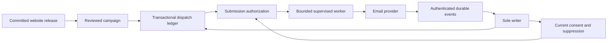

# Mailing-list privacy and dispatch plan

Status: conditional first-release scope; not implemented.

Last reviewed: 2026-09-06

Related: [system design](design.md), [implementation plan](implementation.md), and
[engineering style](quality.md).

## Release boundary

Complete the existing core V1 work before implementing subscriptions or email
delivery. Include this increment in the first release only after its own privacy,
recovery, dispatch, and deliverability gates pass.

Treat every email address as personally identifiable information (PII). Keep
subscription routes and sending disabled until unsubscribe and erasure work
through the complete storage and provider lifecycle. Do not collect addresses
as an early partial feature.

The first campaign type announces one explicitly published article revision.
An owner previews and authorizes the campaign separately from website publication.
Automatic X, Substack, and Nostr distribution remain outside this increment.

## Consent and subscriber lifecycle

Use first-party double opt-in. Store an address only for a defined subscription
purpose, with the consent text version, request time, and confirmation time.
Define bounded retention for unconfirmed requests before enabling signup.
Start with one site-wide list. Its removal control stops all newsletter campaigns.

Use a validated address type and an explicit comparison rule. Normalize domains
without silently applying provider-specific local-part rules, such as removing
dots or plus tags. Reject header injection and oversized input before storage.

Use cryptographically random, purpose-bound confirmation and control tokens.
Store token digests only. Bind tokens and queued work to a subscription generation;
old links cannot confirm a replacement subscription after erasure and re-enrollment.

| State | Allowed work | Exit condition |
| --- | --- | --- |
| Pending confirmation | Bounded confirmation delivery only | Valid confirmation, expiry, or removal |
| Active | Explicitly authorized campaign delivery | Unsubscribe, erasure, hard bounce, or complaint |
| Suppressed | No campaign delivery | Separately defined recovery or erasure policy |
| Erasure pending | Cleanup only; sending remains disabled | Cleanup verified and retained address copies expired or inaccessible |
| Erased | Minimal deletion evidence only | Fresh signup creates a new generation |

Signup and control responses must resist address enumeration. Rate-limit signup,
confirmation resends, token attempts, and campaign requests with bounded storage.
Prevent list bombing without making unsubscribe depend on login or a CAPTCHA.

## Unsubscribe and removal

Every marketing message needs a visible **Unsubscribe and remove my address**
control. The browser link opens a form; its `POST` revokes consent. A scanner's
`GET` request must never subscribe, confirm consent, or unsubscribe someone.

Also implement the mailbox-provider one-click protocol. Its HTTPS `POST` uses an
opaque control token. It requires no browser session, cookie, login, or additional
confirmation.
Accept the standard form encodings within strict byte and field limits. Cover
both unsubscribe headers with DKIM. See [RFC 8058](https://www.rfc-editor.org/rfc/rfc8058.html).

```text
List-Unsubscribe: <https://www.example.com/email/unsubscribe/OPAQUE_TOKEN>
List-Unsubscribe-Post: List-Unsubscribe=One-Click
```

Use a distinct opaque token for the intended subscription generation. Return
non-cacheable control pages with a no-referrer policy and no third-party resources.

The writer must atomically revoke consent, advance the subscription generation,
cancel work not admitted for submission, and record cleanup work.
Repeat requests must succeed idempotently. The user must not need an account or
access to the original device.

Remove the raw address from the active mailing list and all unnecessary copies.
Clean up pending confirmations, tokens, exports, cached payloads, provider contacts,
and provider event data according to the reviewed retention policy.

If remote cleanup needs asynchronous retries, expose a distinct erasure-pending
state. Keep any required cleanup locator protected and purpose-restricted until
that cleanup succeeds. Do not report complete erasure merely because a boolean
subscription flag changed. Do not send an unsolicited goodbye email.

Retain only the minimum evidence needed to prevent another send and prove cleanup.
If suppression needs an address-derived identifier, use a keyed digest with a
protected, independently managed key. An ordinary address hash is guessable.
Keyed identifiers remain pseudonymous personal data; specify their retention too.
Define which suppression reasons can be cleared by fresh consent. Deletion,
re-import, or re-enrollment must not silently clear a complaint or hard-bounce block.

## Data and access boundaries

Keep consent and dispatch state in typed domain records behind the sole writer.
Do not place addresses or recipient lists in Git or immutable content artifacts.
Jobs should reference subscriber identifiers and generations, rather than copying
raw addresses into every queued payload.

Use dedicated redacted address and token types with bounded reads and narrow
lifetimes. Keep raw addresses and tokens out of logs, traces, audit text, metrics,
error bodies, and provider correlation tags. Keep raw addresses out of URLs.
Purpose-bound confirmation and unsubscribe links may contain opaque tokens.
Request logging must retain route templates, never those token values.

Document the selected PII storage design here before collection.
Cover keys, rotation, host access, deletion, and recovery together. Use standard
cryptographic libraries if field encryption is selected; do not invent a format.

Only an owner with fresh authentication may export subscriber data, inspect PII,
or authorize bulk sends in the initial increment. Public readers, Publishers, and
existing agent scopes gain no mailing-list authority implicitly. Exports need
bounded generation, protected temporary storage, and explicit cleanup.

Disable open tracking and click rewriting by default. Define the operator identity,
privacy notice, contact channel, applicable jurisdiction, and required sender
information before enabling collection. This plan does not assert legal compliance.

## Deletion across backups and restore

Encrypted backups can still contain personal data. Deleting a live database row
does not remove earlier SQLite pages, WAL records, replica objects, or provider
copies. An erasure policy must account for those copies and their expiry.
The [ICO's backup guidance](https://ico.org.uk/for-organisations/uk-gdpr-guidance-and-resources/individual-rights/individual-rights/right-to-erasure/)
also distinguishes live deletion from retained backup data that cannot be reused.

The current B2 design keeps immutable remote objects without automatic deletion.
That policy cannot remain undefined once subscriber PII enters the ledger. Before
collection, implement a finite, documented retention policy or a separately
reviewed PII storage boundary that provides the required deletion behavior.

Before implementing collection, select and test a concrete deletion mechanism.
Use page sanitation plus reference-aware backup expiry, or a reviewed PII/key boundary.
For the key boundary, prove that erased keys cannot return from a site backup.
Finite checkpoint retention alone does not prove that later snapshots stop carrying
deleted page bytes.

Remote pruning must follow retained checkpoint references. Object age alone cannot
determine deletion: a recent manifest may reference an older LTX or artifact object.
Define SQLite page-remanence handling, backup expiry, temporary-file cleanup, and
provider retention explicitly. Seven-day local retention does not establish remote
or provider retention.

Keep deletion and suppression evidence durably recoverable independently of an old
site checkpoint. The recovery design must select a current external authority
or an independently anchored monotonic epoch. A timestamp, `latest.json`, or valid
older signature cannot prove that no later deletion occurred.

Distinguish immediate local revocation from externally durable cleanup completion.
Define the external durability boundary for acknowledged requests. Do not call
erasure complete while required evidence or backup expiry remains pending.

Persist restore quarantine before opening subscriber routes or starting workers.
After restore, keep subscriber access, export, and dispatch disabled until current
deletion and suppression evidence is reconciled. Missing or uncertain evidence must
fail closed. An old snapshot cannot restore consent or cause a confirmation campaign.
Define safe disposal of quarantined subscriber data when current state cannot be proven.

Cancel or quarantine every pre-restore campaign and attempt by default, including
previously queued work for subscribers whose consent remains active. Resumption
requires current external delivery evidence too. Otherwise an old checkpoint can
re-send a message accepted after its cutoff, beyond a provider's idempotency window.

Test restoration of a checkpoint taken before unsubscribe, erasure, and a provider
complaint. None may resurrect an address, queued send, or prior consent generation.
Explain retained-backup expiry honestly in the privacy notice and removal response.

## Durable dispatch foundation

Model subscriptions, campaigns, dispatch recipients, attempts, provider events,
and deletion work as separate typed capabilities. Use one concrete provider adapter
initially. Preserve domain boundaries without building a speculative plugin framework.

An approved campaign binds its source revision, canonical URL, rendered email,
template version, subject, sender identity, audience cutoff, and owner authorization.
Use plain-text and email-compatible HTML representations. Never send private preview
URLs, drafts, or a later unreviewed content revision.

Build the audience with bounded, resumable pagination. Exclude later signups from
the approved cutoff. A unique campaign/subscriber/generation key prevents duplicate
queue entries. Recheck consent and suppression at submission authorization; never
trust the earlier audience snapshot alone.



Commit work and state transitions together through typed writer commands. Claim
bounded batches with expiring leases and fencing versions. Perform provider calls
outside database transactions. Persist attempt identities before submission.

Separate `queued`, `leased`, `submitting`, `accepted`, `delivered`, `retryable`,
`unknown`, `failed`, and `cancelled` outcomes where their recovery behavior differs.
Provider acceptance is not inbox delivery. An expired lease must not turn an
uncertain previous submission into an automatic duplicate send.

The writer's submission-admitted transition is the ordering boundary. It checks
current consent and records the attempt before any HTTP transmission. Unsubscribe
cancels every job that has not crossed that boundary. An admitted attempt counts
as in flight even during the bounded handoff to the network client.

Workers must check cancellation and admission expiry before transmission, but
cannot promise to recall an already-admitted request. Lease fencing alone cannot
withdraw provider authority already held by a worker. Show that limitation
accurately, and stop later attempts even when an earlier outcome remains unknown.

Use stable idempotency keys when the provider supports them, within its documented
retention window. A timeout after request transmission has an unknown outcome.
Reconcile it through authenticated events or provider lookup before retrying.
If neither establishes the result, retain an explicit unknown state for operator
resolution. Do not claim exactly-once external delivery.

Disable automatic SDK or transport retries for non-idempotent submission unless
the adapter can prove the request was not accepted. The durable workflow owns
retry classification; a library default must not bypass that decision.

Authenticate provider events before parsing domain effects. Bound payloads, verify
their source, deduplicate event identities, and handle delayed or reordered events.
Hard bounces and complaints suppress further sends through the writer. Preserve
that suppression across retries, restarts, and restores.

Respect provider quotas, burst limits, retry guidance, and cost ceilings. Use
bounded exponential backoff with jitter, deadlines, attempt limits, and a campaign
pause mechanism. Prioritize consent-control and deletion work over newsletters.
Keep failure diagnostics actionable without exposing recipient data.

The application owns, supervises, cancels, and awaits dispatch workers. Shutdown
stops new claims and records recoverable attempt outcomes. Provider failure must
never block public reading, roll back publication, or make website release succeed
only after email delivery.
Provider errors are typed job outcomes; they must not escape as critical-task failures.

## Provider recommendation and cost assumptions

Provisional recommendation: Amazon SES, explicitly configured for its à-la-carte
plan, with Maincopy owning consent and dispatch. Validate the choice against the
owner's expected audience, frequency, region, and removal policy before implementation.

These official prices were checked on 2026-09-06. The comparison assumes USD,
four newsletters monthly per subscriber, shared sending IPs, and no attachments.
Taxes and optional features are excluded.

| Provider | 2,500 subscribers; 10,000 deliveries/month | 25,000 subscribers; 100,000 deliveries/month | Additional constraints |
| --- | --- | --- | --- |
| SES à-la-carte | $1 plus data and events | $10 plus data and events | Explicit plan selection; no required hosted contact list |
| SES Essentials | $1.60 plus data and events | $16 plus data and events | Current default for qualifying new/inactive account-region combinations |
| Resend Marketing | $40 on its 5,000-contact tier | $180 on its 25,000-contact tier | Broadcast pricing follows contacts, including unsubscribed contacts |
| Brevo Starter | Requires its 15,000-send tier for this stored audience | Its 100,000-send tier supports this audience | Obtain current quotes; exact applicable prices were not verified |

SES charges $0.12/GB for outgoing message data. At 50 KB per message, these
examples add approximately $0.06 and $0.60, before event-service costs. Essentials
became the default for qualifying accounts on 2026-07-21; do not assume the
à-la-carte price applies automatically. [SES pricing](https://aws.amazon.com/ses/pricing/)

Resend's free marketing tier supports up to 1,000 contacts and can cost less
for a small list. Its transactional API price is not an equivalent newsletter
quote: its guidance directs newsletters to Broadcasts. Compare the actual marketing
tier and retention costs. [Pricing](https://resend.com/docs/knowledge-base/what-is-resend-pricing),
[sending classification](https://resend.com/docs/knowledge-base/what-sending-feature-to-use),
[contact billing](https://resend.com/migrate/mailchimp)

Brevo starts at $9 for 5,000 sends and 500 stored contacts. Its 10,000-send tier
stores only 1,500 contacts, so frequency and list size affect the required plan.
Use a current account quote instead of an unverified calculator price.
[Brevo plan limits](https://help.brevo.com/hc/en-us/articles/208589409-About-Brevo-s-pricing-plans)

SES has the lowest verified paid sending cost in these examples. Its operating
cost includes production approval, event processing, quota management, and ambiguous
submission recovery. That work also establishes the requested dispatch foundation.

### Provider-specific design checks

- SES sandbox quotas are regional: 200 messages daily and one per second, with
  recipient restrictions. Request production access and record the granted quotas.
  [Production access](https://docs.aws.amazon.com/ses/latest/dg/request-production-access.html)
- SES `SendEmail` v2 documents no send idempotency key. Add an opaque attempt tag,
  correlate authenticated events, and preserve unknown outcomes without blind retry.
  [SendEmail API](https://docs.aws.amazon.com/ses/latest/APIReference-V2/API_SendEmail.html)
- Configure SES delivery, bounce, and complaint events. For SNS ingestion, verify
  signatures, the expected topic, and the certificate origin before applying effects.
  Do not fetch arbitrary certificate URLs from untrusted payloads. An authenticated
  queue consumer is another architecture option with its own retention policy.
  [SES events](https://docs.aws.amazon.com/ses/latest/dg/event-publishing-retrieving-sns-examples.html),
  [SNS verification](https://docs.aws.amazon.com/sns/latest/dg/sns-verify-signature-of-message.html)
- Resend's documented 24-hour idempotency window applies to transactional email
  endpoints. It is not a documented guarantee for Broadcast sends. Brevo's documented
  transactional batch window is 30 minutes; do not infer campaign-level deduplication.
  [Resend idempotency](https://resend.com/docs/dashboard/emails/idempotency-keys),
  [Brevo batch behavior](https://developers.brevo.com/docs/heterogenous-versions-batch-emails)
- Record every provider data location before collection. SES account suppression
  entries and copies in other AWS services need separate handling.
  [SES personal-data deletion](https://docs.aws.amazon.com/ses/latest/dg/deleting-personal-data.html)
- Resend normally retains message content, metadata, and events for 30 days.
  Disabling content storage is currently a $50/month option with eligibility conditions.
  [Retention](https://resend.com/docs/knowledge-base/account-quotas-and-limits),
  [storage option](https://resend.com/docs/knowledge-base/how-do-i-ensure-sensitive-data-isnt-stored-on-resend)
- Brevo contact deletion also removes blocklist state. Transactional logs and previews
  default to indefinite retention unless configured otherwise; deletion can take 72 hours.
  Provider deletion must not silently permit another send.
  [Contact deletion](https://help.brevo.com/hc/en-us/articles/5313915904914-Delete-contacts),
  [log retention](https://help.brevo.com/hc/en-us/articles/360021533839-Manage-your-transactional-logs-and-email-previews)

## Sending-domain and deliverability runbook

The provider-specific steps below assume the provisional SES choice.
Execute this runbook with controlled test recipients before enabling the list.
Authentication and list hygiene reduce blocking risk; they do not guarantee inbox placement.

1. Select a sending subdomain, a stable visible sender, and a monitored reply address.
   Keep marketing and critical operational mail separately identifiable.
2. Verify the domain in the chosen SES region. Publish every returned DKIM record
   exactly, then confirm SES reports successful verification.
3. Configure a custom MAIL FROM subdomain. Publish its SES-provided MX and SPF records.
   Select rejection when MAIL FROM verification fails, rather than silent fallback.
   [SES MAIL FROM setup](https://docs.aws.amazon.com/ses/latest/dg/mail-from.html)
4. Publish DMARC for the visible sender domain. Start with reporting, verify all
   legitimate senders, then evaluate a stricter policy. Confirm SPF or DKIM alignment
   against the visible `From` domain in actual received headers.
5. Confirm the sending provider manages valid forward/reverse DNS and encrypted SMTP
   delivery. Maincopy submits through the provider API; it does not operate a home-lab MTA.
6. Request production access. Record region-specific quotas, permitted sender identities,
   and narrowly scoped credential permissions in the deployment runbook.
7. Enable authenticated bounce, complaint, delivery, and rejection processing. Configure
   retention for event queues, dead letters, logs, exports, and any provider contact data.
8. Inspect a delivered test message. Verify SPF, DKIM, DMARC, aligned sender identity,
   a working reply address, required sender information, and plain-text readability.
9. Verify a visible removal control and signed one-click headers. Execute the HTTPS
   one-click `POST` without login, cookies, redirects, or additional confirmation.
10. Confirm that unsubscribe and complaint events cancel eligible queued work immediately.
    Test provider cleanup, replay, and suppression before sending another campaign.
11. Start with a small, recently confirmed audience. Increase volume gradually within
    provider quotas; never use bought, scraped, or unconfirmed addresses.
12. Monitor delivery failures, bounces, complaints, throttling, and unsubscribe lag.
    Configure an early pause threshold and verify the operator can stop a campaign.

Apply the stricter common sender baseline from the beginning:

| Receiving service | Published requirement or guidance |
| --- | --- |
| Personal Gmail | Bulk senders around 5,000 messages/day need SPF and DKIM, aligned DMARC, TLS, valid DNS, and one-click plus visible unsubscribe. Honor removal within 48 hours and keep reported spam below 0.3%. |
| Yahoo | No numerical bulk threshold is published. Bulk requirements include SPF/DKIM/DMARC alignment, easy unsubscribe within two days, and reported spam below 0.3%. |
| Outlook consumer services | More than 5,000 messages/day requires passing SPF and DKIM plus aligned DMARC, at least `p=none`. Visible unsubscribe and list hygiene are additional recommendations. |

Sources: [Gmail requirements](https://support.google.com/a/answer/81126),
[Gmail FAQ](https://support.google.com/a/answer/14229414),
[Yahoo requirements](https://senders.yahooinc.com/best-practices/?is_listing=false),
[Yahoo FAQ](https://senders.yahooinc.com/faqs/), and
[Microsoft sender requirements](https://techcommunity.microsoft.com/blog/microsoftdefenderforoffice365blog/strengthening-email-ecosystem-outlook%E2%80%99s-new-requirements-for-high%E2%80%90volume-senders/4399730).

Record DNS values, verification results, received authentication headers, one-click
results, provider event results, quota settings, and the verification date. Redact
recipient addresses and tokens from retained evidence. Do not treat a successful
API response as proof that a message reached an inbox.

## Implementation and acceptance order

1. Complete the existing core V1 gates and owner acceptance.
2. Select the provider, address comparison rule, storage protection, and retention policies.
3. Implement consent, unsubscribe, erasure, suppression, and recovery protection while capture remains disabled.
4. Prove removal across live state, queues, provider copies, and older backups.
5. Implement confirmation delivery and the durable dispatch state machine.
6. Add owner-reviewed article campaigns, cancellation, event processing, and monitoring.
7. Execute the sending-domain runbook with controlled test recipients.
8. Enable collection and campaigns only after the combined acceptance passes.

Required tests include duplicate signup, token replay, confirmation expiry,
enumeration resistance, scanner `GET`, one-click `POST`, and repeated erasure.
Exercise unsubscribe at audience selection, lease acquisition, submission, timeout,
retry, provider acceptance, process crash, and restore boundaries.

Test provider outage, quota exhaustion, ambiguous acceptance, duplicate or reordered
events, hard bounces, complaints, cancellation, and dead-letter cleanup. Verify
that secrets never enter captured diagnostics and public publication stays available.

If these gates do not fit the first release, ship core V1 with collection and
email dispatch disabled. Retain this increment as the next owned release task.
