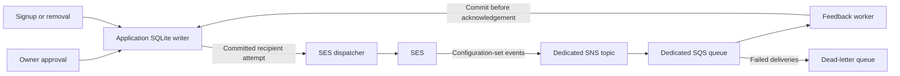

# Email operations and privacy

Status: implemented and locally validated. Production capture and sending remain disabled pending provider and privacy acceptance.

Use this guide to configure SES, operate the mailing list, and recover interrupted delivery.
[Implementation](implementation.md) records remaining acceptance. [Deployment](deployment.md) covers the host; [backup and restore](backup-restore.md) covers encrypted checkpoints.

## Scope and cost

The first campaign announces one explicitly published article revision. An Owner reviews and authorizes its email separately from website publication.
SES is the selected provider. DynamoDB is excluded; mail tables use the existing application SQLite database and sole writer.
Other providers can become concrete adapters when needed. There is no speculative adapter framework or SES contact-list dependency.

SES à-la-carte outbound delivery costs $0.10 per 1,000 recipient messages, checked on 2026-09-06.
Four monthly messages to 2,000 subscribers cost $0.80 before confirmation emails, message data, feedback processing, taxes, and optional services.
Select à-la-carte pricing and confirm actual account charges. Avoid unneeded paid packages or dedicated IP addresses.
See [SES pricing](https://aws.amazon.com/ses/pricing/).

## Configure mail

Keep mail disabled until provider and privacy acceptance pass with authorized test recipients.
For NixOS, configure public settings and protected file references through the module:

```nix
services.maincopy.mail = {
  mode = "ses";
  sender = "newsletter@example.com";
  region = "us-east-1";
  configurationSet = "maincopy";
  credentialFile = "/var/lib/maincopy-secrets/mail-ses.json";
  controlSigningKeyFile = "/var/lib/maincopy-secrets/mail-controls.key";
  maxCampaignRecipients = 2000;
  maxDailyMessages = 5000;
  maxDailyConfirmationMessages = 100;
  sendIntervalMilliseconds = 1000;
  subscriptions = {
    mode = "paused";
    operatorName = "Example publication";
    postalAddress = "REPLACE WITH YOUR PUBLIC POSTAL ADDRESS";
    purpose = "Email announcements of newly published articles.";
    privacyUrl = "https://example.com/privacy";
    contactAddress = "contact@example.com";
  };
  feedback = {
    queueUrl = "https://sqs.us-east-1.amazonaws.com/123456789012/maincopy-feedback";
    topicArn = "arn:aws:sns:us-east-1:123456789012:maincopy-feedback";
  };
};
```

Replace all example identities and disclosures. The postal address appears publicly in signup information and message footers.
Use a valid public mailing address appropriate for the operator. See the [FTC commercial-email requirements](https://www.ftc.gov/business-guidance/resources/can-spam-act-compliance-guide-business).

Supply secret paths as strings. Never use Nix path literals or `builtins.readFile` for secret material.
The module copies systemd credentials into private service-owned runtime files.
The server accepts owned regular files with mode `0400` or `0600`; it rejects symlinks and oversized files.

The SES credential file is bounded JSON with this shape:

```json
{"access_key_id":"REPLACE_WITH_ACCESS_KEY_ID","secret_access_key":"REPLACE_WITH_SECRET_ACCESS_KEY"}
```

Temporary credentials can include `session_token`. Provision replacements before expiration, then restart Maincopy.
The server does not discover credentials from the environment or refresh them through an AWS SDK.

Generate the control key once, without overwriting an existing key:

```sh
sudo install -d -m 0700 /var/lib/maincopy-secrets
sudo sh -c 'set -C; umask 077; head -c 32 /dev/urandom | od -An -v -tx1 | tr -d " \n" > /var/lib/maincopy-secrets/mail-controls.key'
```

The file contains 64 lowercase hexadecimal characters, optionally followed by one newline.
Retain an independently protected recovery copy. Changing the control key or publication origin can strand existing unsubscribe links.
Startup rejects that change while linked subscriber state remains. SES credential rotation does not change management-link signatures.

For direct server configuration, use `[mail] mode = "ses"` and the equivalent snake_case field names.
Use `credential_file`, `control_signing_key_file`, `configuration_set`, and `send_interval_milliseconds`.
Nested tables are `[mail.subscriptions]` and `[mail.feedback]`.
Omitting subscriptions enables campaign review only. Omitting mail selects disabled mode.
Once addresses exist, keep subscriptions configured as `paused` when stopping capture and sending; this preserves removal controls.

## Connect SES feedback

Use one AWS account and commercial region for the verified SES identity, configuration set, standard SNS topic, and standard SQS queues.
Maincopy makes signed HTTPS requests to fixed regional endpoints. It exposes no public feedback webhook.



Enable configuration-set events for sends, deliveries, bounces, complaints, rejects, and rendering failures.
Retain the SNS envelope: set the SQS subscription's `RawMessageDelivery` to `false`.
Use only the intended subscription and omit `FilterPolicy`; filtered delivery would silently discard required feedback.
Identity-level notifications without the required attempt tags cannot replace configuration-set events.
See [SES SNS event destinations](https://docs.aws.amazon.com/ses/latest/dg/event-publishing-add-event-destination-sns.html).

Create a dedicated source queue and dead-letter queue (DLQ) with these settings:

| Setting | Source queue | DLQ |
| --- | --- | --- |
| Queue type | Standard | Standard |
| Message retention | 3,600–86,400 seconds | Greater than source; at most 345,600 seconds |
| Maximum message size | 1,024–65,536 bytes | 1,024–65,536 bytes |
| Encryption | SQS-managed encryption enabled | SQS-managed encryption enabled |
| Redrive | Exact DLQ ARN; `maxReceiveCount` 3–10 | No chained DLQ |
| Redrive allow policy | Not used for admission | `byQueue`, containing only the exact source ARN |
| Resource policy | Exact policy below | No additional resource policy |

The source resource policy must contain exactly two statements, with version `2012-10-17`:

| Field | Allow statement | Deny statement |
| --- | --- | --- |
| `Effect` | `Allow` | `Deny` |
| `Principal` | `{"Service":"sns.amazonaws.com"}` | `"*"` |
| `Action` | `sqs:SendMessage` | `sqs:SendMessage` |
| `Resource` | Exact source queue ARN | Exact source queue ARN |
| `Condition.ArnEquals.aws:SourceArn` | Exact SNS topic ARN | Absent |
| `Condition.StringEquals.aws:SourceAccount` | Exact account ID | Absent |
| `Condition.ArnNotEquals.aws:SourceArn` | Absent | Exact SNS topic ARN |

The explicit Deny also rejects requests without `aws:SourceArn`. It prevents same-account identity grants from bypassing the SNS-only producer restriction.
Maincopy rejects extra statements, wildcard resources, different principals, and unsupported conditions.

Restrict the SNS topic separately. Allow `sns:Publish` only from `ses.amazonaws.com`, with the exact source account and configuration-set ARN.
Also explicitly deny `sns:Publish` when `aws:SourceArn` differs from that configuration-set ARN or is absent.
Remove default broad publishing grants. Maincopy validates the queue policy but does not retrieve the topic policy; verify effective topic permissions during deployment.

Give the runtime credential only the needed sending and feedback permissions:

- `ses:SendEmail` for the selected sender identity and configuration set, with appropriate sender conditions.
- `sqs:GetQueueAttributes` for the source queue and DLQ.
- `sqs:ReceiveMessage` and `sqs:DeleteMessage` for the source queue.

Keep this application the only consumer. Do not extend visibility or redrive arbitrary messages into its authenticated source queue.
Keep queue/topic administrative permissions outside the runtime credential.

Monitor the SES event destination, SNS subscription, and upstream delivery failures separately.
Healthy SQS polling cannot detect a disabled destination, filtered subscription, or feedback that never reached SQS.
The source queue's processing DLQ does not capture SNS delivery failures.
An SNS subscription DLQ is a separate provider resource; include any such resource in privacy retention and recovery procedures.
SNS failure metrics can report only exhausted retries, so they do not establish immediate detection of an upstream backlog.
See [SNS filtering](https://docs.aws.amazon.com/sns/latest/dg/sns-subscription-filter-policies.html), [subscription DLQs](https://docs.aws.amazon.com/sns/latest/dg/sns-dead-letter-queues.html), and [SNS monitoring](https://docs.aws.amazon.com/sns/latest/dg/sns-monitoring-using-cloudwatch.html).

## Consent, removal, and retention

Link readers to `/email/subscribe` after launch acceptance. Signup requires an explicit consent checkbox and email confirmation.
Addresses are matched case-insensitively; delivery preserves the supplied spelling.
Generic signup responses avoid revealing existing subscriptions. Confirmation requests have a one-hour cooldown and separate daily budget.

Pending consent expires 24 hours after signup. Confirmation links work once within that window; queued mail can arrive with less remaining validity.
Management links remain usable without that expiry. A fresh enrollment receives a new generation; old links cannot remove the new subscription.
Browser `GET` and `HEAD` never change consent. Explicit browser `POST` performs confirmation or removal.
Newsletter messages also support [RFC 8058 one-click unsubscribe](https://www.rfc-editor.org/rfc/rfc8058.html), without login, cookies, redirects, or another confirmation.

Removal clears the address, mailbox digest, and confirmation verifier in one writer transaction.
The same transaction prevents future recipient admission. Messages already admitted to delivery cannot reliably be recalled.
Maincopy sends no goodbye email. Hard bounces and complaints remove eligibility and create a bounded suppression digest.
Suppression expiry never reactivates consent; fresh voluntary enrollment is required.

| Local data | Retention rule |
| --- | --- |
| Pending address | Confirmation expires after 24 hours; supervised cleanup removes expired data in bounded batches |
| Active address | Until removal, suppression, or explicit consent reset |
| Minimized attempt correlation | Up to 14 days from its admission/creation retention boundary |
| Suppression digest | 30 days from local processing of the suppression event |
| Aggregate campaign and operation receipts | Retained without recipient addresses |

Cleanup runs while mail is disabled and needs no SES credential. Host downtime and cleanup backlog can delay physical processing.
Addresses, tokens, and provider payloads must stay out of logs, traces, metrics, audit text, Git, and public content.
Access logs record route patterns, not private token paths. Apply the same restriction to gateways and external observability systems.

SQLite uses `secure_delete`. This clears deleted logical database content; it does not guarantee immediate erasure of historical WAL, filesystem, or hardware copies.
Maincopy zeroizes its protected buffers. SQL drivers, HTTP, TLS, signing libraries, and framework allocations have separate lifetimes.
The [backup retention procedure](backup-restore.md) bounds retained replica/checkpoint copies through finite replica epochs and encrypted checkpoints.
Do not describe unsubscribe as immediate deletion from all storage or providers.

SES processes recipient addresses and message content. Account-level suppression can persist until separately removed; Maincopy never clears it to force delivery.
Global hard-bounce suppression can last up to 14 days. See [account suppression](https://docs.aws.amazon.com/ses/latest/dg/sending-email-suppression-list.html) and [global suppression](https://docs.aws.amazon.com/ses/latest/dg/sending-email-global-suppression-list.html).
SNS retries delivery to SQS for approximately 23 days during failures. This provider retention is separate from queue and Maincopy retention.
See [SNS retry policies](https://docs.aws.amazon.com/sns/latest/dg/sns-message-delivery-retries.html).

## Approve and operate campaigns

Open **Mail** in the private administration screen. Use a fresh session from a currently enabled Owner.
Publish the intended article revision first, then review its email. Review includes immutable content, sender settings, audience cutoff, and current readiness.
Approve sending separately. Only one campaign can be active.

Each recipient admission rechecks consent, suppression, Owner authority, cancellation, configuration, and budgets inside the existing sole writer.
The audience cutoff uses confirmation sequence, so later subscriptions and clock changes cannot enlarge an approved audience.
The dispatcher commits an attempt before calling SES. Confirmation messages share the total daily budget and have their own cap.
Default pacing permits one request per second; actual account quotas can require a slower setting.

Accepted means SES accepted the request, not that it reached an inbox.
A timeout or malformed response leaves an unknown outcome. Maincopy never automatically retries that attempt, including after restart.
Authenticated feedback can establish later acceptance. Silence cannot prove rejection.
SES has no documented client idempotency token for [SendEmail](https://docs.aws.amazon.com/ses/latest/APIReference-V2/API_SendEmail.html).

Use campaign cancellation to stop new recipients. Cancellation drains already admitted work before finalizing aggregate outcomes.
Use subscriptions mode `paused` for a host-wide pause while keeping confirmation and removal controls available.
Configuration changes require new approval for affected work. Never route an uncertain submission through another provider.

## Recover feedback or restored data

An unavailable feedback source stops new capture and sending. Removal remains available.
First inspect credentials, network access, queue policy, retention, backlog, and DLQ status without copying recipient payloads into logs.
An ordinary network interruption does not erase consent.

An interrupted receive request leaves a durable recovery lease. Maincopy waits until that signed request can no longer hide a message.
The maximum lease is 1,042 seconds from its signed timestamp, followed by a 180-second drain observation window.
This bound combines 900 seconds of signature validity, 20 seconds of long polling, 120 seconds of visibility, and two seconds of precision allowance.
See [SQS request expiration](https://docs.aws.amazon.com/AWSSimpleQueueService/latest/APIReference/CommonErrors.html) and [ReceiveMessage](https://docs.aws.amazon.com/AWSSimpleQueueService/latest/APIReference/API_ReceiveMessage.html).
The worker uses authenticated provider time, repeated long polls, and visible, in-flight, and delayed counts from both queues.
Missing or regressing provider time keeps mail unavailable. Additional deliveries restart the drain window.
These observations establish conservative operational readiness, not atomic proof that a distributed queue is empty.
See [SQS empty-queue guidance](https://docs.aws.amazon.com/AWSSimpleQueueService/latest/SQSDeveloperGuide/confirm-queue-is-empty.html).

A persistent reconciliation gap cannot clear through a later successful poll.
Lost retention, conflicting event correlation, rejected feedback, and an observed trust violation require operator review.
Do not bypass the gap by editing SQLite or marking the worker healthy manually.

If trustworthy consent/feedback continuity cannot be recovered:

1. Repair the feedback source and identify any old queued or retried events.
2. Open **Mail → Recover email delivery** with fresh Owner authentication.
3. Review the removal scope, then type `REMOVE SUBSCRIBERS` to execute the reset.
4. Retain the operation identity if the response is lost; retry the same form.
5. Keep subscriptions paused while isolating old source traffic and validating the repaired provider configuration.
6. Restart with enabled subscriptions only after the current source establishes healthy feedback readiness.

The reset removes all current enrollment and attempt eligibility, including arrivals after the review page opened.
It quarantines unfinished campaigns and preserves aggregate history, suppression digests, and daily budgets.
It rotates a non-PII delivery epoch. Authenticated events for known retired epochs cannot affect fresh consent.
Unknown epochs remain a conflict; timestamps cannot establish their provenance.
Readers must voluntarily subscribe again. Never email the old list to request renewed consent.

Offline restore acceptance also discards restored consent and rotates its delivery epoch before normal startup or replication.
An old checkpoint can lack epochs created after that checkpoint. Isolate old queue/topic traffic before admitting a fresh source baseline.
Do not replay restored confirmations, campaigns, or uncertain sends. Follow the complete [restore acceptance procedure](backup-restore.md).

## Provider acceptance before launch

Complete these checks with the selected SES account and explicitly authorized recipients:

1. Verify the sending identity and install the provider's exact Easy DKIM DNS records.
2. Configure custom MAIL FROM and SPF when selected; publish DMARC and verify sender alignment.
3. Request production access, then record actual account quotas and rate limits.
4. Verify effective bounce and complaint suppression, including configuration-set overrides.
5. Disable open/click tracking and unnecessary destinations or paid services.
6. Verify SNS/SQS policies, retained envelopes, tagging, and bounded queue retention against actual events.
7. Inspect delivered HTML, plain text, sender, postal footer, and DKIM coverage of both unsubscribe headers.
8. Exercise confirmation, scanner visits, one-click removal, suppression, cancellation, outages, restart, and old-checkpoint restore.
9. Verify gateway redaction, independent key recovery, encrypted B2 retention, and restored-data quarantine.
10. Begin with a small confirmed audience and inspect readiness and aggregate outcomes before expanding.

Use current [Google](https://support.google.com/a/answer/81126), [Yahoo](https://senders.yahooinc.com/best-practices/), and [Microsoft sender requirements](https://techcommunity.microsoft.com/blog/microsoftdefenderforoffice365blog/strengthening-email-ecosystem-outlook%E2%80%99s-new-requirements-for-high%E2%80%90volume-senders/4399730).
Authentication and list hygiene reduce blocking risk; they cannot guarantee inbox placement.
Local fixtures do not complete provider acceptance. If acceptance remains incomplete, release core v1 with capture and sending disabled.
