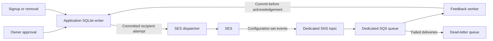

# Email operations and privacy

Status: email delivery is implemented. Newsletter details are managed in the admin portal. Production capture and sending remain disabled pending provider acceptance.

Use this guide to configure SES, operate the mailing list, and recover interrupted delivery.
[Implementation](implementation.md) records remaining acceptance. [Deployment](deployment.md) covers the host; [backup and restore](backup-restore.md) covers encrypted checkpoints.

## Scope and cost

When the newsletter is enabled, first publication queues an article update for all subscribers active at that moment. Website publication authorizes this notification.
SES is the selected provider. DynamoDB is excluded; mail tables use the existing application SQLite database and sole writer.
Other providers can become concrete adapters when needed. There is no speculative adapter framework or SES contact-list dependency.

See the [running cost examples](../README.md#running-costs) for SES rates and optional service charges.
Select à-la-carte pricing and confirm actual account charges. Avoid unneeded paid packages or dedicated IP addresses.

## Configure mail

Keep mail disabled until provider and privacy acceptance pass with authorized test recipients.
For NixOS, configure the SES connection and protected file references through the module:

```nix
services.maincopy.mail = {
  mode = "ses";
  sender = "newsletter@example.com";
  region = "us-east-1";
  configurationSet = "maincopy";
  credentialFile = "/var/lib/maincopy-secrets/mail-ses.json";
  controlSigningKeyFile = "/var/lib/maincopy-secrets/mail-controls.key";
  feedback = {
    queueUrl = "https://sqs.us-east-1.amazonaws.com/123456789012/maincopy-feedback";
    topicArn = "arn:aws:sns:us-east-1:123456789012:maincopy-feedback";
  };
};
```

Replace the example sender and provider resources. Configure newsletter details under **Admin → Mail → Newsletter settings**.

Supply secret paths as strings. Never use Nix path literals or `builtins.readFile` for secret material.
The module copies systemd credentials into private service-owned runtime files.
The server accepts owned regular files with mode `0400` or `0600`; it rejects symlinks and oversized files.

The SES credential file is bounded JSON with this shape:

```json
{"access_key_id":"REPLACE_WITH_ACCESS_KEY_ID","secret_access_key":"REPLACE_WITH_SECRET_ACCESS_KEY"}
```

Temporary credentials can include `session_token`. Provision replacements before expiration, then restart Maincopy.
The server does not discover credentials from the environment or refresh them through an AWS SDK.

Generate the control key once, without overwriting an existing key:

```sh
sudo install -d -m 0700 /var/lib/maincopy-secrets
sudo sh -c 'set -C; umask 077; head -c 32 /dev/urandom | od -An -v -tx1 | tr -d " \n" > /var/lib/maincopy-secrets/mail-controls.key'
```

The file contains 64 lowercase hexadecimal characters, optionally followed by one newline.
Retain an independently protected recovery copy. Changing the control key or publication origin can strand existing unsubscribe links.
Startup rejects that change while linked subscriber state remains. SES credential rotation does not change management-link signatures.

For direct server configuration, use `[mail] mode = "ses"` and the equivalent snake_case field names.
Use `credential_file`, `control_signing_key_file`, `configuration_set`, and the `[mail.feedback]` table.
Omitting mail selects disabled mode. With SES configured, the server loads subscriber controls even before newsletter details are saved.
Keep the provider and control key configured while addresses exist. Pause signup and sending in the administration portal to preserve removal links.

## Manage newsletter settings

1. Sign in with a fresh Owner session.
2. Open **Mail → Newsletter settings**.
3. Enter the public operator name, monitored contact email, and newsletter purpose.
   Leave the optional privacy notice URL blank to use `/email/privacy` on your public site.
   Maincopy serves this notice from the saved details, including while delivery is paused
   or provider credentials are not configured. Supply an HTTPS URL to use your own notice.
4. Enter a postal address only if you want or need to publish one.
5. Save with signup and sending **Paused** until provider acceptance is complete.
6. Select **Enabled** and save after acceptance.

The newsletter has no recipient or daily message caps. Transport pacing remains a host setting to accommodate provider throughput.
Legacy TOML recipient and daily caps are accepted during upgrades but do not restrict delivery.

You can save paused newsletter details before configuring the provider. Enabling signup requires the configured SES feedback source.
Sending also requires healthy feedback. Article publication queues the notification without a separate email approval.
Postal addresses are optional in Maincopy. Leave the field empty to omit it from signup information, delivery details, and email footers.
Supplied addresses must contain 1–500 bytes without surrounding whitespace or control characters.
Operators remain responsible for disclosures required for their messages. See the [FTC commercial-email requirements](https://www.ftc.gov/business-guidance/resources/can-spam-act-compliance-guide-business).

Settings are stored in SQLite and included in normal backups. Saving updates admission in the same transaction as the settings and audit receipt.
New requests and delivery work read the saved settings without a service restart. Transport pacing remains host configuration.
Feedback establishes readiness for the changed configuration before sending resumes. An already admitted message can finish with its previous settings.
Changed details apply to unsent article updates and retire unsent confirmation requests. Readers can submit a fresh signup request.
Legacy manually approved messages remain bound to their reviewed configuration.
Unsubscribe links remain valid. Stale admin edits and signup forms are rejected; reload the relevant page before submitting again.
Saving settings does not reset daily usage, suppressions, or consent. Recovery and restored-data quarantine also pause saved newsletter settings.

Existing `[mail.subscriptions]` remains the default until the first admin save.
After that save, stored newsletter settings take precedence across restarts. Provider identity, feedback endpoints, and secret files remain host configuration.
In legacy Nix configuration, omit `postalAddress` or set it to `null`. In legacy TOML configuration, omit `postal_address`.

Newsletter settings and automatic delivery use migrations `0011_mail_settings.sql` through `0013_article_notifications.sql`. Preserve a verified pre-upgrade backup before deployment.
An older binary cannot open the upgraded migration ledger; follow the normal restore acceptance procedure for rollback.

## Connect SES feedback

Use one AWS account and commercial region for the verified SES identity, configuration set, standard SNS topic, and standard SQS queues.
Maincopy makes signed HTTPS requests to fixed regional endpoints. It exposes no public feedback webhook.


```mermaid
flowchart LR
    Owner[Owner approval] --> Writer[Application SQLite writer]
    Reader[Signup or removal] --> Writer
    Writer -->|Committed recipient attempt| Sender[SES dispatcher]
    Sender --> SES
    SES -->|Configuration-set events| SNS[Dedicated SNS topic]
    SNS --> SQS[Dedicated SQS queue]
    SQS --> Worker[Feedback worker]
    Worker -->|Commit before acknowledgement| Writer
    SQS -->|Failed deliveries| DLQ[Dead-letter queue]
```

Enable configuration-set events for sends, deliveries, bounces, complaints, rejects, and rendering failures.
Retain the SNS envelope: set the SQS subscription's `RawMessageDelivery` to `false`.
Use only the intended subscription and omit `FilterPolicy`; filtered delivery would silently discard required feedback.
Identity-level notifications without the required attempt tags cannot replace configuration-set events.
See [SES SNS event destinations](https://docs.aws.amazon.com/ses/latest/dg/event-publishing-add-event-destination-sns.html).

Create a dedicated source queue and dead-letter queue (DLQ) with these settings:

| Setting | Source queue | DLQ |
| --- | --- | --- |
| Queue type | Standard | Standard |
| Message retention | 3,600–86,400 seconds | Greater than source; at most 345,600 seconds |
| Maximum message size | 1,024–65,536 bytes | 1,024–65,536 bytes |
| Encryption | SQS-managed encryption enabled | SQS-managed encryption enabled |
| Redrive | Exact DLQ ARN; `maxReceiveCount` 3–10 | No chained DLQ |
| Redrive allow policy | Not used for admission | `byQueue`, containing only the exact source ARN |
| Resource policy | Exact policy below | No additional resource policy |

The source resource policy must contain exactly two statements, with version `2012-10-17`:

| Field | Allow statement | Deny statement |
| --- | --- | --- |
| `Effect` | `Allow` | `Deny` |
| `Principal` | `{"Service":"sns.amazonaws.com"}` | `"*"` |
| `Action` | `sqs:SendMessage` | `sqs:SendMessage` |
| `Resource` | Exact source queue ARN | Exact source queue ARN |
| `Condition.ArnEquals.aws:SourceArn` | Exact SNS topic ARN | Absent |
| `Condition.StringEquals.aws:SourceAccount` | Exact account ID | Absent |
| `Condition.ArnNotEquals.aws:SourceArn` | Absent | Exact SNS topic ARN |

The explicit Deny also rejects requests without `aws:SourceArn`. It prevents same-account identity grants from bypassing the SNS-only producer restriction.
Maincopy rejects extra statements, wildcard resources, different principals, and unsupported conditions.

Restrict the SNS topic separately. Allow `sns:Publish` only from `ses.amazonaws.com`, with the exact source account and configuration-set ARN.
Also explicitly deny `sns:Publish` when `aws:SourceArn` differs from that configuration-set ARN or is absent.
Remove default broad publishing grants. Maincopy validates the queue policy but does not retrieve the topic policy; verify effective topic permissions during deployment.

Give the runtime credential only the needed sending and feedback permissions:

- `ses:SendEmail` for the selected sender identity and configuration set, with appropriate sender conditions.
- `sqs:GetQueueAttributes` for the source queue and DLQ.
- `sqs:ReceiveMessage` and `sqs:DeleteMessage` for the source queue.

Keep this application the only consumer. Do not extend visibility or redrive arbitrary messages into its authenticated source queue.
Keep queue/topic administrative permissions outside the runtime credential.

Monitor the SES event destination, SNS subscription, and upstream delivery failures separately.
Healthy SQS polling cannot detect a disabled destination, filtered subscription, or feedback that never reached SQS.
The source queue's processing DLQ does not capture SNS delivery failures.
An SNS subscription DLQ is a separate provider resource; include any such resource in privacy retention and recovery procedures.
SNS failure metrics can report only exhausted retries, so they do not establish immediate detection of an upstream backlog.
See [SNS filtering](https://docs.aws.amazon.com/sns/latest/dg/sns-subscription-filter-policies.html), [subscription DLQs](https://docs.aws.amazon.com/sns/latest/dg/sns-dead-letter-queues.html), and [SNS monitoring](https://docs.aws.amazon.com/sns/latest/dg/sns-monitoring-using-cloudwatch.html).

## Consent, removal, and retention

The home page and every article link to `/email/subscribe`. Signup requires an explicit consent checkbox and email confirmation.
Without a configured provider that page offers the RSS feed instead; while signup is paused it says so.
Addresses are matched case-insensitively; delivery preserves the supplied spelling.
Generic signup responses avoid revealing existing subscriptions. Confirmation requests have a one-hour cooldown per address. Other readers can continue subscribing.

Pending consent expires 24 hours after signup. Confirmation links work once within that window; queued mail can arrive with less remaining validity.
Management links remain usable without that expiry. A fresh enrollment receives a new generation; old links cannot remove the new subscription.
Browser `GET` and `HEAD` never change consent. Explicit browser `POST` performs confirmation or removal.
Newsletter messages also support [RFC 8058 one-click unsubscribe](https://www.rfc-editor.org/rfc/rfc8058.html), without login, cookies, redirects, or another confirmation.

Removal clears the address, mailbox digest, and confirmation verifier in one writer transaction.
The same transaction prevents future recipient admission. Messages already admitted to delivery cannot reliably be recalled.
Maincopy sends no goodbye email. Hard bounces and complaints remove eligibility and create a bounded suppression digest.
Suppression expiry never reactivates consent; fresh voluntary enrollment is required.

| Local data | Retention rule |
| --- | --- |
| Pending address | Confirmation expires after 24 hours; supervised cleanup removes expired data in bounded batches |
| Active address | Until removal, suppression, or explicit consent reset |
| Minimized attempt correlation | Up to 14 days from its admission/creation retention boundary |
| Suppression digest | 30 days from local processing of the suppression event |
| Aggregate campaign and operation receipts | Retained without recipient addresses |

Cleanup runs while mail is disabled and needs no SES credential. Host downtime and cleanup backlog can delay physical processing.
Addresses, tokens, and provider payloads must stay out of logs, traces, metrics, audit text, Git, and public content.
Access logs record route patterns, not private token paths. Apply the same restriction to gateways and external observability systems.

SQLite uses `secure_delete`. This clears deleted logical database content; it does not guarantee immediate erasure of historical WAL, filesystem, or hardware copies.
Maincopy zeroizes its protected buffers. SQL drivers, HTTP, TLS, signing libraries, and framework allocations have separate lifetimes.
The [backup retention procedure](backup-restore.md) bounds retained replica/checkpoint copies through finite replica epochs and encrypted checkpoints.
Do not describe unsubscribe as immediate deletion from all storage or providers.

SES processes recipient addresses and message content. Account-level suppression can persist until separately removed; Maincopy never clears it to force delivery.
Global hard-bounce suppression can last up to 14 days. See [account suppression](https://docs.aws.amazon.com/ses/latest/dg/sending-email-suppression-list.html) and [global suppression](https://docs.aws.amazon.com/ses/latest/dg/sending-email-global-suppression-list.html).
SNS retries delivery to SQS for approximately 23 days during failures. This provider retention is separate from queue and Maincopy retention.
See [SNS retry policies](https://docs.aws.amazon.com/sns/latest/dg/sns-message-delivery-retries.html).

## Article notifications

Open **Mail** in the private administration screen to inspect delivery history or cancel waiting notifications.
Set **Signup and sending** to **Enabled** after provider acceptance. First publication then queues one notification for the active subscriber list.
Publication and notification admission share one database transaction. A durable article marker prevents edits, replays, unpublishing, and restarts from creating another notification.
Upgrades mark existing articles without sending the archive. Articles first published while the newsletter is paused are not backfilled when it resumes.

Email contains the article title, a short description, and its public link. Long titles and descriptions are clipped at valid UTF-8 boundaries.
Multiple articles can wait in publication order. One dispatcher sends serially, with a default interval of one second between requests.
Confirmation emails and article updates take turns when both queues have work. Signup traffic cannot starve article delivery.
Each recipient admission rechecks current consent, suppression, cancellation, configuration, instance identity, and feedback readiness.
The audience cutoff uses confirmation sequence; later signups cannot enlarge the original audience. Unsubscribing before admission excludes the reader.

An explicit SES throttle or quota rejection returns that attempt to a durable queue with a 60-second delay.
Retry admission receives a new fence and checks consent again. Provider rejection retries continue across ordinary application restarts.
Accepted means SES accepted the request; it does not prove inbox delivery.
A timeout or malformed response leaves an unknown outcome. Maincopy never automatically retries that recipient, including after restart.
Authenticated feedback can establish later acceptance. Silence cannot prove rejection.
SES has no documented client idempotency token for [SendEmail](https://docs.aws.amazon.com/ses/latest/APIReference-V2/API_SendEmail.html).

Ordinary restarts resume unsent recipients for publication-triggered notifications. Already admitted requests become unknown and are excluded from repeat submission.
Restore acceptance and consent resets still quarantine notifications. Recipient-history expiry closes unfinished delivery before deleting deduplication records.
Legacy manual drafts and approvals remain readable and cancellable, with their original authority and configuration checks.

Use **Cancel article update** to stop new recipients. Cancellation drains admitted work before finalizing totals.
Select **Paused** in newsletter settings to stop new admission while keeping confirmation and removal controls available.
Changing public details updates unsent automatic notifications. Never route an uncertain submission through another provider.

## Recover feedback or restored data

An unavailable feedback source stops new capture and sending. Removal remains available.
First inspect credentials, network access, queue policy, retention, backlog, and DLQ status without copying recipient payloads into logs.
An ordinary network interruption does not erase consent.

An interrupted receive request leaves a durable recovery lease. Maincopy waits until that signed request can no longer hide a message.
The maximum lease is 1,042 seconds from its signed timestamp, followed by a 180-second drain observation window.
This bound combines 900 seconds of signature validity, 20 seconds of long polling, 120 seconds of visibility, and two seconds of precision allowance.
See [SQS request expiration](https://docs.aws.amazon.com/AWSSimpleQueueService/latest/APIReference/CommonErrors.html) and [ReceiveMessage](https://docs.aws.amazon.com/AWSSimpleQueueService/latest/APIReference/API_ReceiveMessage.html).
The worker uses authenticated provider time, repeated long polls, and visible, in-flight, and delayed counts from both queues.
Missing or regressing provider time keeps mail unavailable. Additional deliveries restart the drain window.
These observations establish conservative operational readiness, not atomic proof that a distributed queue is empty.
See [SQS empty-queue guidance](https://docs.aws.amazon.com/AWSSimpleQueueService/latest/SQSDeveloperGuide/confirm-queue-is-empty.html).

A persistent reconciliation gap cannot clear through a later successful poll.
Lost retention, conflicting event correlation, rejected feedback, and an observed trust violation require operator review.
Do not bypass the gap by editing SQLite or marking the worker healthy manually.

If trustworthy consent/feedback continuity cannot be recovered:

1. Repair the feedback source and identify any old queued or retried events.
2. Open **Mail → Recover email delivery** with fresh Owner authentication.
3. Review the removal scope, then type `REMOVE SUBSCRIBERS` to execute the reset.
4. Retain the operation identity if the response is lost; retry the same form.
5. Keep subscriptions paused while isolating old source traffic and validating the repaired provider configuration.
6. Select **Enabled** in newsletter settings only after the current source establishes healthy feedback readiness. Restart Maincopy if host provider settings changed.

The reset removes all current enrollment and attempt eligibility, including arrivals after the review page opened.
It quarantines unfinished campaigns and preserves aggregate history, suppression digests, and daily usage totals.
It rotates a non-PII delivery epoch. Authenticated events for known retired epochs cannot affect fresh consent.
Unknown epochs remain a conflict; timestamps cannot establish their provenance.
Readers must voluntarily subscribe again. Never email the old list to request renewed consent.

Offline restore acceptance also discards restored consent and rotates its delivery epoch before normal startup or replication.
An old checkpoint can lack epochs created after that checkpoint. Isolate old queue/topic traffic before admitting a fresh source baseline.
Do not replay restored confirmations, campaigns, or uncertain sends. Follow the complete [restore acceptance procedure](backup-restore.md).

## Provider acceptance before launch

Complete these checks with the selected SES account and explicitly authorized recipients:

1. Verify the sending identity and install the provider's exact Easy DKIM DNS records.
2. Configure custom MAIL FROM and SPF when selected; publish DMARC and verify sender alignment.
3. Request production access, then record actual account quotas and rate limits.
4. Verify effective bounce and complaint suppression, including configuration-set overrides.
5. Disable open/click tracking and unnecessary destinations or paid services.
6. Verify SNS/SQS policies, retained envelopes, tagging, and bounded queue retention against actual events.
7. Inspect delivered HTML, plain text, sender, footer disclosures, and DKIM coverage of both unsubscribe headers.
8. Exercise confirmation, scanner visits, one-click removal, suppression, cancellation, outages, restart, and old-checkpoint restore.
9. Verify gateway redaction, independent key recovery, encrypted B2 retention, and restored-data quarantine.
10. Begin with a small confirmed audience and inspect readiness and aggregate outcomes before expanding.

Use current [Google](https://support.google.com/a/answer/81126), [Yahoo](https://senders.yahooinc.com/best-practices/), and [Microsoft sender requirements](https://techcommunity.microsoft.com/blog/microsoftdefenderforoffice365blog/strengthening-email-ecosystem-outlook%E2%80%99s-new-requirements-for-high%E2%80%90volume-senders/4399730).
Authentication and list hygiene reduce blocking risk; they cannot guarantee inbox placement.
Local fixtures do not complete provider acceptance. If acceptance remains incomplete, release core v1 with capture and sending disabled.
