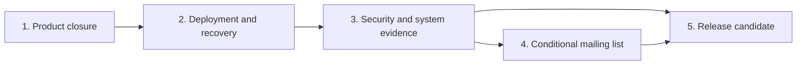

# Remaining Maincopy v1 work

Status: active backlog

Last reviewed: 2026-09-06

Related: [project overview](../README.md), [system design](design.md),
[managed Git runbook](managed-source.md),
[local development runbook](local-development.md), and
[engineering style](quality.md).

## Purpose

This document lists only unfinished work. Git history and tests provide the
record of completed implementation.

The [system design](design.md) remains the authority for V1 behavior, data
ownership, and trust boundaries. Each change must also follow the
[engineering style guide](quality.md).

## Execution order

1. Complete real-signer acceptance for the browser and human CLI.
2. Complete deployed-host acceptance and actual encrypted Backblaze B2 recovery.
3. Record representative production limits, backup lag, and recovery measurements.
4. Complete the security review, system matrix, documentation, and release dry run.
5. After core V1 passes, implement the conditional mailing-list increment if its
   full privacy and dispatch gates can pass before the first release.

Run independent product-closure workstreams in isolated checkouts. Review shared
API and router changes during integration. Remove completed backlog items after
the integrated batch passes its final quality checks.

Do not begin subscriptions while the existing core V1 work remains incomplete.
Keep capture and sending disabled until privacy, recovery, dispatch, and
deliverability acceptance pass together.
Automatic X, Substack, and Nostr delivery, multi-site hosting, and Git write-back
remain outside V1.

## 1. Product closure

### 1.1 Complete real-signer acceptance

Verify the implemented account workflows with the owner's real signing tools.
Test-signer automation does not complete this acceptance.

- Verify successful Nostr sign-in and cancelled signing with the owner's browser
  extension. Record extension and browser names, versions, and results.
- Complete human CLI Nostr sign-in with an external signer and confirm protected
  session storage. Record the signer and operating system used.

### Product-closure gate

- Browser and CLI users can complete every supported release transition.
- No sync, reload, profile edit, or restart grants publication approval.
- Every public response has the accepted metadata and security headers.
- Public routes expose no admin, metrics, draft, or preview capability.

## 2. Deployment and recovery acceptance

Use the [deployment runbook](deployment.md), [backup runbook](backup-restore.md),
and [system evidence](system-evidence.md) for these remaining checks.
Keep test transport evidence separate from actual B2 recovery.

### 2.1 Verify the deployed host

- Deploy the reviewed Nix outputs with protected runtime credentials and the owner's content.
- Verify public HTTPS, private administration, origin enforcement, and forwarded-header removal.
- Complete explicit owner initialization and verify restart behavior without journaled credentials.
- Scrape the loopback metrics endpoint from the intended Prometheus instance.
- Confirm state ownership, local database storage, service isolation, and protected key recovery.

### 2.2 Recover from actual B2 and retained local ciphertext

- Publish a complete encrypted checkpoint to the owner's dedicated B2 bucket.
- Restore that checkpoint with an independent protected copy of its encryption key.
- Recover a retained local ciphertext checkpoint without depending on the active object cache.
- Verify released pages, RSS, sitemap, profiles, tips, and rejected pre-restore credentials.
- Record the checkpoint identity, cutoff, compatible package, and off-site object identities.
- Confirm production backup failures degrade backup health while public reads remain available.

### 2.3 Measure the production recovery envelope

- Measure capture, native replay, content verification, encryption, upload, and restore separately.
- Record end-to-end recovery point and recovery time objectives with representative content and SQLite size.
- Verify disk capacity for temporary capture, replay, replica storage, and seven-day local encrypted retention.
- Review remote storage growth; immutable remote objects have no automatic deletion policy yet.

Litestream continuously maintains the local replica. Complete encrypted off-site
checkpoints use a one-minute scheduling target after each preceding job finishes.
Replay, validation, encryption, and upload add to the effective recovery-point lag.

### Operations acceptance gate

- Actual off-site and retained-local recovery preserve the operational ledger and required artifacts.
- The deployed service consumes restore acceptance before replication can modify the restored database.
- The owner accepts the measured recovery lag, recovery duration, storage budget, and key-recovery procedure.

## 3. Security and system evidence

### 3.1 Run the end-to-end matrix

Exercise one representative managed Git site through browser, human CLI, and
agent API workflows.

The matrix must cover startup, login, sync, preview, immediate release,
scheduled release, update, cancellation, blocked retry, tips, metrics, backup,
restore, and shutdown.

Inject failures at each startup stage, writer boundary, activation boundary,
Git phase, renderer phase, gateway route, and restore gate. Public readers must
retain the last committed snapshot whenever the design requires continuity.

### 3.2 Complete the security review

Review these boundaries before release:

- password hashing, enumeration resistance, and password-worker limits;
- session fixation, expiry, rotation, revocation, cookies, and CSRF;
- Nostr login and NIP-98 freshness, replay, URL, method, and payload binding;
- role, scope, actor, host, origin, and route isolation;
- gateway header removal and TLS termination;
- Git host verification and private-key handling;
- content traversal, HTML, SVG, asset-origin, and CSP policy;
- database corruption, queue saturation, backup failure, and restore acceptance;
- dependency licenses, advisories, and reproducible inputs.

Record representative latency, compilation, queue, WAL, backup-lag, runtime,
and shutdown measurements. Close every critical or high-risk finding.

### 3.3 Verify operator documentation

- Execute remaining documented CLI examples against an isolated authenticated fixture; help parsing alone does not complete this check.
- Complete browser trust, authenticated CLI credential storage, and real-signer examples on the owner's systems.
- Execute managed Git commands against the intended remote and host-key policy.
- Execute the deployment and B2 restore runbooks on the selected host without hidden steps.
- Execute the release runbook with the selected version, signing identity, and publisher account.
- Recheck examples and internal links after the final release metadata is frozen.

The [system evidence](system-evidence.md) records the completed local documentation
audit and package preparation rehearsal. Fixture results do not close these external checks.

## 4. Conditional first-release subscriptions and email

Implement this increment only after the existing core V1 gates pass. The owner
wants it in the first release if its complete acceptance can be achieved.
The [mailing-list and dispatch plan](email-delivery.md) defines the design boundary.

### 4.1 Complete privacy and removal before capture

- Treat addresses as PII, with explicit consent, double opt-in, and bounded retention.
- Select address comparison, storage protection, key recovery, and provider-data policies.
- Implement visible unsubscribe, mailbox-provider one-click `POST`, and address removal.
  Scanner `GET` requests must never change consent.
- Atomically revoke consent and cancel work not admitted for submission.
  Make repeated requests idempotent.
- Remove unnecessary address copies from live state, tokens, payloads, exports, and the provider.
  Expose pending cleanup honestly and keep it retryable without permitting sends.
- Define minimal pseudonymous suppression evidence, access control, and retention.
- Implement finite remote backup retention or a reviewed PII storage boundary.
  Reconcile erasure and suppression before restoring subscriber access or delivery.
- Prove that older backups cannot resurrect an address, prior consent, or queued email.
- Keep signup and sending disabled until privacy, recovery, dispatch, and
  deliverability acceptance all pass.

### 4.2 Build durable dispatch and owner-reviewed campaigns

- Keep consent, campaigns, recipients, attempts, events, and cleanup as typed capabilities.
- Use transactional outbox writes, bounded claims, leases, fencing, and unique delivery identities.
- Bind campaigns to reviewed public revisions, email bytes, sender, audience cutoff, and authorization.
- Recheck current consent before submission. Define the unavoidable in-flight delivery boundary.
- Model provider acceptance separately from delivery and ambiguous timeout outcomes.
  Respect provider idempotency windows; never blindly retry an uncertain submission.
- Handle quotas, backoff, budgets, cancellation, complaints, hard bounces, and event replay.
- Prioritize control and deletion work. Supervise workers and recover after crashes.
- Keep provider calls outside transactions and failures independent from public publication.

### 4.3 Choose transport and prove deliverability

- Compare current provider costs against expected subscribers and send frequency.
  Include minimum charges, data, events, retention, and operating effort.
- Record the chosen region, production access, sender identity, quotas, and credential permissions.
- Execute a documented SPF, DKIM, DMARC, and custom return-path setup.
- Verify signed one-click headers, a visible removal control, bounce and complaint processing,
  controlled volume ramp-up, and monitoring with real test mailboxes.
- Record provider and DNS evidence. Domain authentication reduces blocking risk;
  it cannot guarantee inbox placement.

### Mailing-list inclusion gate

Exercise confirmation expiry and replay, enumeration resistance, removal during
every dispatch stage, duplicate and reordered events, provider outage, restart,
and restoration of older backups. Verify PII redaction and full cleanup.

If these checks are incomplete, ship core V1 with subscriptions and email disabled.
Keep the mailing-list increment as the next release task; do not ship capture alone.

## 5. Release candidate

Prepare a candidate without publishing an artifact until the owner approves it.

Deliverables:

- Select a semantic version and finalize the [Unreleased changelog](../CHANGELOG.md#unreleased).
- Select distribution channels, advertised platforms, registry package names, and the authorized publishing identity.
- Update workspace and dependency versions together; refresh development-version text in crate READMEs.
- Repeat the clean source, Nix, and package checks for the selected release version and platforms.
- Generate final checksums and dependency inventory for those exact artifacts.
- Review dependency licenses and include required third-party notices in the selected distribution.
- Record the approved signing fingerprints under the [signed tag policy](release.md#sign-the-tag-and-stage-a-draft).
- Protect publishing credentials behind owner approval. If publishing is automated, pin each release action to an immutable commit.
- Test idempotent recovery after each publication step.

Required evidence:

- Run `cargo publish --dry-run --locked --workspace` on the exact candidate, or select the approved package subset explicitly.
- Run `nix flake check` and `nix build` from the release archive.
- Reject an unsigned tag, version mismatch, or untrusted signing key.
- Create a draft GitHub Release without making it public.
- Confirm that ordinary continuous integration cannot access release secrets.

## Definition of done

Use `cargo check` and Clippy during implementation. Defer full workspace tests
and CRAP measurement to the final pre-commit gate. Run the canonical Nix gates
before each code commit and push.

A work item is complete only when all applicable statements are true:

- Tests cover success, rejection, limits, transitions, restarts, and isolation.
- External failures map to stable typed codes without secret detail.
- Database structure and domain transitions enforce the same invariants.
- Long-running work is supervised, cancelled, and awaited.
- New limits are configured or documented as safe fixed constants.
- New dependencies have minimal features and recorded licenses.
- New project traits, trivial getters, unsafe blocks, lint exceptions, and
  public items have a documented production need.
- Operator behavior and configuration changes update their runbooks.
- Formatting, Clippy, workspace tests, Nix checks, and the CRAP budget pass.

## Deferred work

The following work remains outside V1:

- browser article editing and Git write-back;
- multiple sites or tenants;
- automatic X, Substack, Nostr, and other non-email provider delivery;
- X and Substack share kits;
- paid articles and access entitlements;
- Obsidian Sync as a managed source;
- replaceable themes and typed article widgets;
- sandboxed article code execution; and
- crawler or archive workers.

External archive systems can continue to use canonical links, sitemap,
`BlogPosting` metadata, RSS, and ordinary HTTP caching metadata.
