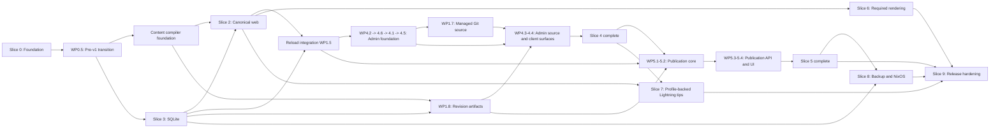
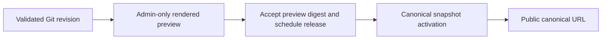
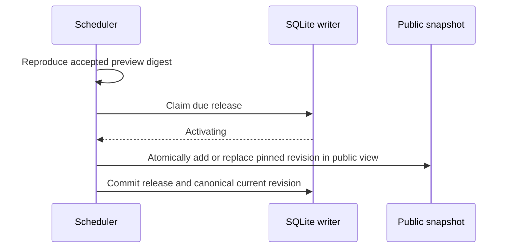
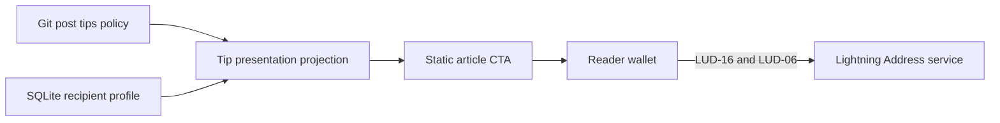
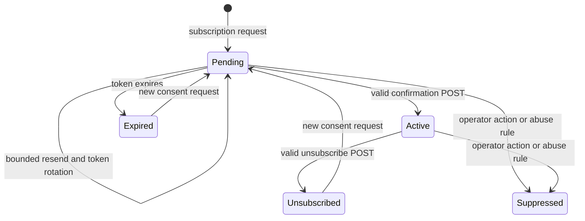

# Maincopy v1 implementation plan

Status: target delivery plan with open design gates

Last updated: 2026-09-03

Related documents: [project overview](../README.md), [system design](design.md),
[local alpha runbook](local-alpha.md), and [engineering style guide](quality.md).

## Document role

This plan converts the accepted [design](design.md) into reviewable work. Each
work package must produce a working increment with tests.

The design defines product behavior. This plan defines delivery order and
acceptance evidence. The plan must not silently override the design.

This document is not a completion tracker. A work package is complete only
after its implementation and exit gate pass review.

Use the [engineering style guide](quality.md) for Rust, testing, documentation,
and quality conventions.

## Current implementation audit

This table describes the implementation reviewed on 2026-09-03. It is not a
release claim.

| Area | Reviewed status |
| --- | --- |
| Cargo workspace, locked Nix build, and CI | Implemented |
| Content discovery, baseline rendering, and immutable snapshots | Implemented foundation |
| SQLite bootstrap, single writer, and query pool | Implemented foundation |
| Admin discovery, OpenAPI, request IDs, and post reads | Implemented foundation |
| Users, roles, profiles, password and Nostr login, sessions, CSRF, and NIP-98 authentication | Implemented foundation |
| Generated first-start owner identity and explicit offline identity bootstrap | Implemented foundation |
| Initial publication, private previews, and local CLI commands | Implemented foundation |
| Preview-gated update releases and complete release management | In progress |
| Managed Git synchronization and restricted source bootstrap | Planned |
| Snapshot-backed RSS feed, sitemap, robots policy, and HTML autodiscovery | Implemented foundation |
| Canonical links, core non-image Open Graph fields, and `BlogPosting` JSON-LD | Implemented foundation |
| Built-in public theme shell, packaged CSS, stable `maincopy-*` hooks, and previous/next navigation | Implemented |
| Alias redirects, durable route ownership, snapshot-scoped content assets, and conditional application assets | Implemented |
| Semantic code language classes, Mermaid rendering, and SVG sanitization | Implemented; Slice 6 gate passed |
| Favicon and image metadata and page CSP | Planned |
| Local HTTPS development gateway and explicit CLI CA trust | Implemented development harness; see the [runbook](local-alpha.md) |
| Production HTTPS admin gateway and admin web interface | Planned; see work packages [4.5](#work-package-45-https-admin-gateway-contract) and [8.2](#work-package-82-nixos-module-and-admin-gateway) |
| Profile-backed static Lightning Address tips | Implemented foundation |
| Prometheus registry, loopback `/metrics`, and runtime dashboard | Planned |
| NixOS module, Litestream, artifact backup, and restore | Planned |
| Outbound distribution, subscription, and email delivery | Deferred until after v1 |
| Distribution frontmatter and target-job schema | Removed from v1 |

## Immediate execution order

The successful local end-to-end alpha fixes the next implementation order:

| Order | Outcome | Included work |
| --- | --- | --- |
| 1 | Make the existing local workflow obvious from a browser and a clean checkout | Land the first useful [publication admin UI](#work-package-54-canonical-publication-admin-ui): sign in, inspect the current and candidate revisions, open the exact rendered preview, and publish the initial article or an update. Simplify the supported CLI path where it reduces operator steps. Put the root-level quick start and preview-to-publish walkthrough ahead of the exhaustive reference documentation, and test every documented command from the repository root. This UI does not edit Markdown. |
| 2 | Replace manual checkout management with one safe article-source workflow | Implement [managed read-only Git synchronization](#work-package-17-managed-read-only-git-source), including SSH source setup, startup and periodic fetch, `Sync now`, immutable candidate preparation, failure status, and the source-facing admin and CLI surfaces. Keep external local-checkout mode available. Maincopy never commits, merges, or pushes. |
| 3 | Close the remaining product gaps | Complete the [publication commands, coordinator, API, and full admin surface](#slice-5-canonical-publication-and-required-previews), including update, schedule, cancel, blocked-retry, profile, and account flows. Finish the [public-listener lifecycle](#work-package-24-public-listener-lifecycle), [favicon, image metadata, and CSP](#work-package-25-favicon-asset-output-and-csp), and the [Lightning-tip gate](#slice-7-profile-backed-lightning-address-tips). |
| 4 | Close the operational V1 release gates | Add [metrics and health](#work-package-35-prometheus-metrics-database-health-and-fault-reporting); complete the production admin gateway and [NixOS, Caddy, Litestream, backup, and restore](#slice-8-litestream-nixos-and-restore); then complete the [security, documentation, system-test, and release evidence](#slice-9-release-hardening). |

Managed Git synchronization is the last large article-source feature. After
orders 1 and 2, V1 still has the bounded product-finish work in order 3; it is
not accurate to classify all of that work as deployment. Order 4 is
observability, deployment, recovery, security review, and release engineering.
X and Substack handoffs, mailing lists, automatic distribution, Obsidian
authoring, replaceable themes, typed widgets, and article-supplied JavaScript
remain post-v1 work.

The `development-gateway` flake check validates the development Caddy
configuration and launcher scripts. This evidence does not complete the
production gateway or NixOS work packages.

> [!WARNING]
> Do not expose the loopback admin TCP listener directly. Keep it loopback-only
> and behind the reviewed HTTPS gateway. Network isolation and JSON are
> insufficient.

> [!CAUTION]
> Keep the metrics listener loopback-only. Prometheus metrics can reveal
> workload, resource use, and failure timing.

Do not expose the remote gateway until its authentication, authorization, route
isolation, and security-review prerequisites pass their tests.

## Navigation

| Section | Purpose |
| --- | --- |
| [Delivery rules](#delivery-rules) | Cross-cutting implementation constraints |
| [Architecture invariants](#architecture-invariants) | Rules every slice preserves |
| [Dependencies](#slice-dependencies) | Required work order |
| [Decisions](#implementation-decisions-and-remaining-gates) | Fixed choices and open gates |
| [Slice 0](#slice-0-foundation-and-continuous-integration) | Foundation and pre-v1 transition |
| [Slice 1](#slice-1-content-model-and-compiler) | Content model, compiler, source sync, and artifacts |
| [Slice 2](#slice-2-canonical-web-service) | Canonical public web service |
| [Slice 3](#slice-3-single-writer-sqlite-core) | SQLite writer and read core |
| [Slice 4](#slice-4-user-accounts-admin-control-plane-and-remote-clients) | Accounts and administration |
| [Slice 5](#slice-5-canonical-publication-and-required-previews) | Preview and release |
| [Slice 6](#slice-6-release-quality-rendering) | Release-quality rendering |
| [Slice 7](#slice-7-profile-backed-lightning-address-tips) | Static profile-backed tips |
| [Post-v1 assisted distribution](#post-v1-assisted-distribution-specification) | X and Substack handoff contracts |
| [Post-v1 subscriptions and email](#post-v1-subscription-and-email-specification) | Mailing-list state, privacy, and delivery contracts |
| [Post-v1 Obsidian authoring](#post-v1-obsidian-first-authoring-specification) | Headless Sync source and authoring compatibility |
| [Post-v1 replaceable themes](#post-v1-replaceable-theme-specification) | Validated template packages and typed page contexts |
| [Post-v1 typed widgets](#post-v1-typed-theme-widget-specification) | Safe article widgets implemented by packaged theme assets |
| [Later post-v1 article code](#later-post-v1-article-code-sandbox-decision) | Separate trust and sandbox decision for arbitrary article JavaScript |
| [Slice 8](#slice-8-litestream-nixos-and-restore) | Packaging, deployment, and restore |
| [Slice 9](#slice-9-release-hardening) | End-to-end and release evidence |
| [V1 release definition](#v1-release-definition) | Owner approval boundary |

## V1 outcome

Maincopy v1 is complete when Slice 9 passes its release gate.
Crate and flake publication require a separate owner approval.

V1 runs one server instance on one host. Operators, agents, and browser users
can manage that instance from another machine through the authenticated admin
control plane.

Maincopy v1 uses a one-site administration model. One instance owns
one canonical domain, one repository, one branch, and one content root. The
repository can contain many articles. The admin UI indexes and operates their
immutable Git revisions.

Git and Markdown own article bodies and authored metadata. SQLite owns
schedules, publication transitions, users, and mutable profiles. An admin
schedule change never edits or commits Git content.

Before any article revision can become public, its release must bind the exact
production-rendered preview digest. The browser workflow shows that preview
before it permits confirmation. A Git sync or reload indexes a change to a
published article as an unpublished revision; it does not silently replace the
live revision. The canonical site and RSS are the only article outputs in v1.
V1 contains no outbound distribution or subscription-delivery feature.

`maincopyd` exports Prometheus process, Tokio runtime, and database metrics from
a dedicated loopback-only `/metrics` endpoint.

The managed source uses a provider-neutral read-only SSH deploy key and local
mirror. External local-checkout mode remains available for operator-managed
deployments.

## Delivery rules

- Keep v1 in one Cargo workspace with four Rust crates and one Maincopy daemon.
  The HTTPS gateway and Litestream run as separate processes.
- Keep each pull request small enough for one focused review.
- Merge infrastructure only when a product slice needs it.
- Add each dependency in the pull request that first uses it.
- Pin Rust dependencies in `Cargo.lock`.
- Pin Nix inputs in `flake.lock`.
- Run continuous integration on pull requests and pushes to `master`.
- Keep the repository private until the owner approves public release.
- Treat remote administration as the normal production workflow.
- Complete automatic first-owner creation before listener binding.
- Keep explicit bootstrap and recovery commands as offline, no-listener process
  modes.
- Keep `/metrics` on its dedicated loopback-only listener.
- Keep Git write permission outside every Maincopy role and credential.
- Do not add a browser content editor in v1.
- Do not store an editable article body in SQLite.
- Do not host multiple sites, repositories, or tenant control planes in v1.
- Do not add OAuth, a GitHub App, repository write-back, pull-request creation,
  merge-conflict UI, or webhook ingestion in v1.
- Treat canonical web publication and RSS as the only article outputs in v1.
- Defer X, Substack, Nostr article distribution, newsletter capture, and email
  delivery until after v1.
- Do not add provider credentials, outbound jobs, delivery state, subscriber
  data, or email-control tokens in v1.

A pull request can split one work package when review risk is high.
It must not combine unrelated work packages for convenience.

## Non-negotiable code boundaries

The root `Cargo.toml` must define a workspace only. The workspace contains
`maincopy-server`, `maincopy-cli`, `markdown-compiler`, and `maincopy-shared`
under `crates/`.

`crates/server/src/main.rs` must stay tiny. Its asynchronous Tokio `main` uses
`maincopy_server::startup::run_until_stop` and calls `run_until_stop().await`.
It must not load configuration, bind a listener, open SQLite, or spawn a task.

The final two lines of `crates/server/src/main.rs` must remain:

```rust
    run_until_stop().await
}
```

Keep `crates/server/src/main.rs` below 20 non-blank lines.

Keep `crates/markdown-compiler/src/main.rs` below 10 non-blank lines. Its
synchronous `main` delegates once to the exported `markdown_compiler::run`. It
contains no argument parsing, file access, validation, serialization,
reporting, or exit-policy logic. `crates/markdown-compiler/src/startup.rs`
owns that process behavior, while the private
`crates/markdown-compiler/src/cli.rs` module owns the standalone validator's
typed command-line inputs and output records.

`crates/server/src/startup.rs` owns server wiring and lifecycle behavior. It
must:

- parse typed `ServerArguments`;
- load and validate host configuration;
- construct concrete dependencies;
- acquire the process lock;
- construct the owned Prometheus registry and metric instruments;
- start the database components;
- compile the initial site snapshot;
- bind the public, admin, and metrics listeners;
- start the Tokio runtime collector with the other supervised tasks;
- supervise background tasks;
- coordinate readiness;
- handle termination signals; and
- perform ordered shutdown.

`crates/server/src/startup.rs` defines the `run_until_stop` composition
boundary. The `#[tokio::main]` macro in the server entry point creates the
runtime first.

The free `run_until_stop` function parses server arguments and builds one
`Application`. `Application` owns all supervised components and cleanup
guards.

`crates/cli` parses operator commands independently. It constructs the concrete
`AdminClient`, sends an HTTPS request, and exits. It never constructs server
state or opens SQLite.

`crates/markdown-compiler` discovers and validates authored content. It produces
deterministic compiled representations and has no server runtime wiring.

`crates/shared` contains wire contracts. It does not contain runtime wiring,
listener defaults, or application-domain behavior.

Organize server business features as vertical slices under
`crates/server/src/domain`. A domain slice contains its models, concrete store
operations, and domain-specific public or admin handlers. Keep SQL next to the
business operation that owns its invariant. Do not create table-shaped
repository traits or a global query catalog.

The top-level infrastructure modules have narrow responsibilities:

- `database` owns SQLite startup, the query-only pool, the bounded mutation
  channel, and the sole writer lifecycle.
- `web` owns public listener state, health endpoints, and router composition.
- `admin` owns the loopback listener, authentication, authorization, actor
  context, OpenAPI assembly, and admin router composition.
- `observability` owns structured logging, the Prometheus registry, metrics
  instruments, the Tokio collector, and metrics listener composition.
- A domain `store.rs`, `web.rs`, or `admin.rs` owns domain-specific SQL and
  endpoint behavior.

`DatabaseStore` is a concrete aggregate of concrete domain stores. It is not a
service locator and it does not expose SQLx connections. Domain reads use the
private query-only pool. Domain mutations enqueue a closed mutation command to
the sole writer. The CLI reaches these operations only through typed admin API
requests.

Startup can call component constructors. No handler can construct a database,
network client, scheduler, or renderer.

`crates/server/src/lib.rs` exposes testable components and the startup boundary.
Domain components accept explicit values and concrete dependencies where tests
need control. Add a trait only when production needs substitutable behavior.

The library must not perform work during import. Avoid process-wide mutable
singletons and hidden service locators.

Use this compile-time dependency direction:

```text
maincopy CLI ---- uses ----> maincopy-shared <---- uses ---- server crate
                                                    |
                                                    v
                                          markdown compiler crate
```

Use this runtime request direction:

```text
browser, human CLI, or agent ---> HTTPS admin gateway
                                           |
                                           v
                                loopback TCP admin listener
                                           |
                                           v
                                authentication and scopes
                                           |
                                           v
                                      admin router
                                           |
                                           v
                                   server domain modules

offline bootstrap or recovery ---> typed domain operations ---> SQLite writer

fresh normal startup ---> generated owner identity ---> SQLite writer

Prometheus scraper ---> loopback TCP metrics listener ---> GET /metrics
```

The public virtual host has no admin route or upstream. The HTTPS gateway uses
a separate admin origin and forwards to a loopback-only HTTP listener.
Maincopy authenticates each request after forwarding.

The public and admin routers do not mount `/metrics`. A separate loopback-only
router serves that operation without adding it to OpenAPI.

`maincopy-cli` must not depend on `maincopy-server`.

The startup tests must inject listeners, shutdown signals, and task failures.
Component tests must not start the production process composition root.

## Architecture invariants

Every slice must preserve these invariants:

1. Git owns article source and presentation metadata.
2. SQLite owns canonical scheduling and activation state.
3. Request handlers read an immutable `SiteSnapshot`.
4. A failed compilation cannot replace the active snapshot.
5. The public router cannot serve an admin route.
6. `maincopyd` exposes the admin router only through a dedicated loopback TCP
   listener behind the authenticated HTTPS admin origin.
7. Exactly one Tokio task owns the runtime SQLx write connection.
8. Every runtime database write uses one bounded command channel.
9. Read connections use a bounded, query-only SQLx pool.
10. No network call can hold a database transaction.
11. A canonical article never waits for an external service.
12. Every activation, including an update to a published article, binds an
    accepted preview digest for the exact post revision, renderer identity,
    page-shell identity, profile projection, and reviewed canonical URL.
13. The live SQLite database always uses local storage.
14. Public reading and navigation do not require JavaScript. Article content
    cannot supply scripts, event handlers, or executable expressions.
15. Maincopy never fetches or proxies an external content asset.
16. V1 stores no outbound provider credential, distribution job, delivery
    state, subscriber data, email address, or email-control token.
17. V1 starts no distribution worker, email worker, or subscriber route.
18. Canonical `published_at` comes only from a committed SQLite activation.
19. Finite domains use enums, and non-interchangeable primitives use distinct
    wrappers.
20. Git owns only the authored post `tips` policy. Git does not own a Lightning
    Address or a payment recipient.
21. SQLite owns users, login identities, roles, profiles, sessions, agent
    credentials, and the active tip recipient.
22. A v1 tip CTA appears only when the authored policy is enabled and the
    active recipient has an enabled profile with a valid Lightning Address.
23. Maincopy performs no LNURL network request, invoice creation, payment
    tracking, or settlement confirmation for v1 tips.
24. Admin clients use an HTTPS gateway on a separate admin origin. The gateway
    connects to the loopback-only HTTP admin listener.
25. Maincopy authorizes every remote admin operation from a verified actor and
    typed scopes. Network reachability alone grants no authority.
26. The public virtual host has no route, fallback, or upstream connection to
    the admin listener.
27. `UserId` is the stable user identity. A Nostr public key is an optional,
    unique login identity and never replaces `UserId`.
28. V1 never receives or stores a user's Nostr private key. Nostr login remains
    public-key verification and does not authorize article distribution.
29. At least one human login provider is enabled. Every enabled user retains
    at least one credential that an enabled provider can verify.
30. A password credential stores only a uniquely salted, policy-versioned
    Argon2id v19 PHC string. Nostr credentials use signature verification.
31. Browser session and Cross-Site Request Forgery (CSRF) tokens are independent
    256-bit random values. SQLite stores only fixed-length lookup digests for
    them and never applies Argon2.
32. An agent credential contains a unique Nostr public key. Maincopy verifies a
    fresh NIP-98 proof for each agent request and never receives or stores the
    agent private key.
33. A profile or recipient change uses a resource version and installs a new
    public presentation snapshot without changing a Git post revision.
34. Sync and reload can index a changed live article only as
    `UnpublishedChange`. Only a preview-gated initial or update release can
    change public article visibility.
35. Browser sessions are opaque server-side records in host-only `Secure`,
    `HttpOnly`, and `SameSite` cookies. V1 does not use JWT browser sessions.
36. Human CLI sessions are revocable and remain in operating-system credential
    storage. Context files, arguments, and environment variables contain none.
37. V1 issues no long-lived bearer API token. Each `AgentCredential` uses a
    fresh, replay-protected NIP-98 proof for every request.
38. `Owner`, `Administrator`, and `Publisher` are built-in roles backed by
    fixed typed scopes.
39. A `Publisher` has content, status, sync, reload, preview, and release scopes.
    It has no profile, Lightning, user, credential, audit, or instance scope.
40. Maincopy roles and agent scopes grant no Git write permission.
41. Mermaid rendering runs during compilation. Only sanitized SVG can enter a
    candidate, and a rendering or sanitization failure rejects that candidate.
42. Fresh-state normal startup creates the generated owner through one typed
    transaction before listener binding. Explicit bootstrap and recovery
    commands remain offline, bind no listener, accept no arbitrary SQL, and
    require exclusive process ownership.
43. `maincopyd` serves `/metrics` only from a dedicated loopback listener. The
    public and admin routers do not mount this route.
44. An accepted scheduled release or successful immediate release permanently
    assigns each canonical slug and authored alias to its stable `PostId`. A
    reservation does not create public visibility, and cancelling the release
    does not release its routes.

### Strong-type policy

Use an enum for every finite set of states, kinds, modes, versions, targets,
commands, and outcomes. Do not pass a raw string or integer through application
code when the set of valid values is known.

Use separate enums or newtype wrappers for values that serialize to the same
primitive but have different meanings. Examples include API versions, feature
contract versions, post IDs, publication IDs, preview digests, revision
digests, and idempotency keys.
Use `UnpublishedChange` for the typed admin projection and `Unpublished
changes` for its human-facing UI label.

Use `time::OffsetDateTime` directly for operational timestamps. Normalize
constructed values to `UtcOffset::UTC`, and annotate Serde fields with
`time::serde::rfc3339`. Do not add a custom timestamp wrapper, parser, error,
or module.

Parse external strings at the boundary. Domain and application functions must
receive the parsed type. Define explicit Serde and SQLx names for wire and
storage compatibility. Do not use `String` as an escape hatch for a state that
the compiler can make exhaustive.

Every new enum must have contract tests for its stable serialized form. Every
state-machine enum must have exhaustive legal-transition and illegal-transition
tests. Add an intentional `Unknown` variant only when an external protocol
requires forward compatibility and the application has defined safe behavior
for it.

Every fallible domain, application, storage, and transport operation must
return a typed error. Do not encode an error category in `String`, a raw status
code, or an unstructured map. Keep conversion to stable API and CLI error
envelopes exhaustive and at the owning boundary.

## Slice dependencies



The pre-v1 transition must finish before another persistent contract lands.
The content compiler foundation and SQLite core can then run in parallel.
WP1.5 runs after the canonical web and SQLite core.
The Slice 4 foundation adds automatic first-owner creation during fresh-state
normal startup and retains an explicit offline identity command. WP1.7 then
adds the offline source-settings bootstrap transaction and managed Git
synchronization.
WP4.2 builds a fail-closed router without binding a listener. WP4.6 supplies
the identity and session state. WP4.1 is the first package that can bind the
protected loopback listener.
WP1.8 adds durable revision artifacts after the content and SQLite foundations.
Work packages 4.3 and 4.4 need both source sync and artifact retention.
Lightning tip rendering requires Slice 2 and the Slice 4 user-profile
projection. Rendering work that does not use profiles can start after Slice 2.
Publication work packages 5.1 and 5.2 require the Slice 4 principal, profile,
and preview contracts plus retained revision artifacts.

## Review stacks

Use a formal GitHub pull request (PR) stack when a slice has dependent work
packages. Use one branch and one PR for each layer.

The bottom PR targets `master`. Each higher PR targets the branch directly
below it.

```text
master <- work-package branch 1 <- branch 2 <- branch 3
```

Each PR body must name its slice, layer number, base PR, and dependent PRs.
Each PR must also link the complete slice acceptance gate.

Do not target every layer at `master`. This would show cumulative diffs instead
of the isolated layer diff.

Do not start a dependent slice stack until its prerequisite slice has merged.
Slices 1 and 3 use separate stacks after Slice 0 merges.

| Stack | Bottom-to-top PR layers | Prerequisite |
| --- | --- | --- |
| Foundation and transition | 0.1 -> 0.2 -> 0.3 -> 0.4 -> 0.5 | None |
| Content compiler | 1.1 -> 1.2 -> 1.3 -> 1.6 -> 1.4 | Slice 0 |
| SQLite core | 3.1 -> 3.2 -> 3.3 -> 3.4 -> 3.5 | Slice 0 |
| Canonical web | 2.1 -> 2.2 -> 2.3 -> 2.4 -> 2.5 | Content compiler and SQLite core |
| Reload coordination | 1.5 | Content compiler, SQLite core, and canonical web |
| Managed Git source | 1.7 | Reload coordination and Accounts and admin foundation |
| Revision artifact retention | 1.8 | Content compiler and SQLite core |
| Accounts and admin foundation | 4.2 -> 4.6 -> 4.1 -> 4.5 | Reload coordination |
| Admin source and client surfaces | 4.3 -> 4.4 | Managed Git source, revision artifacts, and Admin foundation |
| Canonical publication core | 5.1 -> 5.2 | Reload coordination, revision artifacts, and Slice 4 |
| Publication admin surfaces | 5.3 -> 5.4 | Publication core and Admin control plane |
| Rendering | 6.1 -> 6.2 -> 6.3 -> 6.4 | Slice 2 |
| Profile-backed Lightning tips | 7.1 -> 7.2 | Slices 2 and 4 |
| NixOS and restore | 8.1 -> 8.2 -> 8.3 -> 8.4 -> 8.5 | Slices 3 and 5 |
| Release hardening | 9.1 -> 9.2 -> 9.3 -> 9.4 | All v1 slices |

Run focused tests on each layer. Run the full slice gate on the top layer.

If a lower layer changes, cascade that change through each higher branch.
Verify the isolated diff and full stack again before review.

Planning these stacks does not authorize remote pushes, PR creation, rebases,
or merges. Obtain the required authority before each external action.

Before creating a stack, verify the installed `gh stack` commands. Preserve
formal stack metadata, linear branch history, and the exact base for each PR.

## Dependency register

The lock files select exact versions. Each selection must support the active
Rust toolchain and the project license.

| Concern | Expected dependency or decision | First slice |
| --- | --- | --- |
| Async runtime and channels | Tokio | 0 |
| Command-line parsing | Clap with derive-based typed subcommands | 0 |
| Serialization and TOML | Serde and a TOML parser | 0 |
| Errors and diagnostics | Typed library errors and startup context | 0 |
| Secret memory | Pin `zeroize` 1.9.0; wipe Maincopy-owned fixed secret buffers on drop | 0 |
| Tracing | `tracing` 0.1.44 with `tracing-subscriber` 0.3.23 and only its `fmt` feature | 0 |
| Prometheus metrics | Pin `prometheus` 0.14.0 with its `process` feature and `tokio-metrics` 0.4.9 with `rt` | 3 |
| UUIDs | `uuid` with only the features used by typed identifiers | 0 and 1 |
| Operational time | `time::OffsetDateTime` with `serde-well-known`; no custom timestamp type | 0 and 1 |
| Revision digests | BLAKE3 | 1 |
| Managed Git source | Provider-neutral Git and SSH executables from the Nix closure | 1 |
| Tree walking | Linux `rustix` `openat2` with strict resolve flags | 1 |
| Asset URLs and origins | Select one standards-compliant URL parser | 0 and 1 |
| Markdown | Pin `pulldown-cmark` 0.13.4 with only its `html` feature | 1 |
| Snapshot activation | Pin `arc-swap` 1.9.2 without optional features | 2 |
| HTTP service | Axum and Tower | 0 and 2 |
| HTML templates | Maud | 2 |
| XML feeds and discovery documents | Pin `quick-xml` 0.42.0 without optional features; use its event writer instead of string interpolation | 2 |
| Frontend asset build | Deterministic `crates/server/build.rs`; Lightning CSS 1.0.0-alpha.72 for V1 CSS; add a reviewed JavaScript minifier only with the first JavaScript input | 2 |
| SQLite | Pin SQLx 0.9.0 with embedded migrations and bundled SQLite 3.51.3 | 3 |
| Process lock | Use standard-library file locks for runtime and database ownership | 3 |
| OpenAPI | `utoipa` and `utoipa-axum` with stable path/schema ordering | 0 and 4 |
| Nostr identity | Select maintained Schnorr and NIP-98 primitives without private-key custody | 4 |
| Password credentials | Pin the direct RustCrypto `argon2` crate; use explicit Argon2id v19 PHC strings and no convenience authentication wrapper | 4 |
| Browser session and CSRF secrets | Generate independent 256-bit random values and store only fixed-length digests | 4 |
| Agent authentication | Verify NIP-98 per request against a scoped Nostr public-key record; keep the signer and private key outside Maincopy | 4 |
| Code-language metadata | Use one application-owned closed fence-alias table and static canonical language classes; add no highlighter, syntax-grammar, or token-theme dependency; see [ADR 0002](decisions/0002-code-language-classes.md) | 6 |
| Mermaid | Pin `mermaid-rs-renderer` 0.3.1 behind the supervised `maincopy-mermaid` helper; see [ADR 0001](decisions/0001-mermaid-renderer.md) | 6 |
| SVG sanitization | Use an explicit SVG allowlist boundary | 6 |
| Lightning Address | A typed SQLite profile value and deterministic LUD-16/LUD-01 projection | 4 |
| LNURL encoding | Select a small local Bech32 encoder with no network behavior | 7 |
| QR generation | Select a deterministic local component with a compatible license | 7 |
| Database replication | Litestream executable from the Nix closure | 8 |
| Reproducible build | Nix, Crane, and the project flake | 0 and 8 |

Do not add a library only because a later slice might need it.
Record the license and feature flags for each direct dependency.

These selected direct dependencies have explicit feature and license records.
License values come from upstream crate metadata. They do not select a
Maincopy package license.

| Dependency | Exact selected version | Features | Upstream license expression | Declared MSRV |
| --- | --- | --- | --- | --- |
| `arc-swap` | 1.9.2 | Default features disabled; no optional features | `MIT OR Apache-2.0` | Not declared |
| `bech32` | 0.11.1 | Default features disabled; `alloc` | `MIT` | 1.48 |
| `maud` | 0.27.0 | Default features disabled; no optional features | `MIT OR Apache-2.0` | Not declared |
| `quick-xml` | 0.42.0 | Default features disabled; no optional features | `MIT` | 1.86 |
| `blake3` build edge | 1.8.7 | Default features disabled; `std` | `CC0-1.0 OR Apache-2.0 OR Apache-2.0 WITH LLVM-exception` | Not declared |
| `lightningcss` | 1.0.0-alpha.72 | Default features disabled | `MPL-2.0` | Not declared |
| `rustix` build and test edge | 1.1.4 | Default features disabled; `fs`, `std`; Linux and macOS only | `Apache-2.0 WITH LLVM-exception OR Apache-2.0 OR MIT` | 1.63 |
| `thiserror` build edge | 2.0.20 | Default features | `MIT OR Apache-2.0` | 1.71 |
| `zeroize` | 1.9.0 | Default features disabled; `alloc` | `Apache-2.0 OR MIT` | 1.85 |
| `argon2` | 0.6.0 | Default features disabled; `alloc`, `getrandom`, `password-hash`, `zeroize`; do not enable `kdf` or `parallel` | `MIT OR Apache-2.0` | 1.85 |
| `prometheus` | 0.14.0 | Default features disabled; `process` | `Apache-2.0` | 1.81 |
| `sqlx` | 0.9.0 | Default features disabled; `macros`, `migrate`, `runtime-tokio`, `sqlite-bundled` | `MIT OR Apache-2.0` | 1.94 |
| `tokio-metrics` | 0.4.9 | Default features disabled; `rt`; do not enable unstable Tokio metrics | `MIT` | 1.70 |
| `libsqlite3-sys` | 0.37.0 | Default features disabled; `bundled` | `MIT` | Not declared |
| `mermaid-rs-renderer` | 0.3.1 | Default features disabled; no optional features | `MIT` | Not declared |

The repository root `LICENSE` records Maincopy's license and retains the
Mermaid renderer's MIT notice. This dependency register records selected
upstream metadata; it does not make a broader legal-completeness claim.

`libsqlite3-sys` 0.37.0 bundles SQLite 3.51.3. SQLite places its bundled source
in the public domain. Maincopy rejects an older linked SQLite version at
startup because 3.51.3 fixes the accepted WAL-reset race.

`walkdir` is not part of the frontend build. Its path-based iterator cannot
provide the required descriptor-relative traversal boundary.

The locked Nix toolchain is Rust 1.98. SQLx 0.9.0 declares Rust 1.94, and
`argon2` 0.6.0 declares Rust 1.85. Several direct dependencies do not declare a
minimum supported Rust version (MSRV). Therefore, `Cargo.toml` does not declare
`rust-version` yet. Set that field only after one complete locked dependency
graph establishes the package MSRV. Keep the package-license decision separate
from this work.

## Implementation decisions and remaining gates

A fixed row is binding. Resolve each selection row before its due work starts.

| Decision | Required resolution | Status | Due before |
| --- | --- | --- | --- |
| Pre-v1 state | Discard all pre-release databases and bootstrap fresh state. Rewrite baseline migrations in place. Keep `/api/admin/v1` and `*-b3-v1-*` as the first intended product contracts. Add no migration, converter, fallback, or legacy reader. | Fixed | 0.5 |
| Git metadata | Require the full commit in managed mode. Keep it optional in external checkout mode. Always require the content digest. | Fixed | 1.7 |
| First-owner bootstrap | On fresh-state normal startup, generate an instance-unique 256-bit password for `owner`, write it once to standard output before atomic persistence, and continue startup. Retain the typed offline identity command for automation and recovery. Neither path binds a listener before the identity transaction commits. | Fixed | 4.1 and 4.6 |
| Managed-source bootstrap | Use an offline typed source-settings command that binds no listener. Create source settings before the first accepted managed fetch, compile, public listener, or admin listener. | Fixed | 1.7 and 4.1 |
| Instance identity | Generate a stable random `InstanceId` during the atomic identity transaction. Store it in SQLite and advertise it with the expected public origin through unauthenticated bounded discovery. A restore preserves it. | Fixed | 4.2 |
| Pinned revision retention | Store a content-addressed immutable artifact package for each current or non-terminal release revision. Treat unexpected loss as `revision_unavailable`. | Fixed | 1.8 and 5.1 |
| Revision-artifact backup | Select a backup and retention implementation that restores artifact packages at a recovery point compatible with SQLite. Litestream alone is insufficient. | Select | 8.4 |
| Preview precondition | Require an accepted preview digest plus the expected post and site revision for every first-publication or update schedule and publish-now action. | Fixed | 5.1 and 5.3 |
| Preview evidence | Treat `PreviewDigest` as an exact content and presentation binding, not proof that a person viewed it. The browser UI must show the preview before confirmation; API clients can submit a reproducible correct digest without a prior preview operation. | Fixed | 4.3 and 5.1 |
| V1 unpublish boundary | A Git deletion or draft change cannot silently retract a live article. Keep its current revision public and show the ineligible source change. Defer an explicit unpublish/retraction workflow. | Fixed | 1.5 |
| Publication route ownership | Permanently bind each approved canonical slug and authored alias to its stable `PostId`. Scheduled reservations create no public route and survive cancellation. Stop serving routes omitted by the active revision, but never reassign them. Permit route-kind changes only for the same post. | Fixed | 2.3 and 5.2 |
| V1 outbound boundary | Defer assisted and automatic article distribution, subscription capture, and email delivery. Store no provider credential, job, delivery state, subscriber data, or email-control token. | Fixed | 0.5 and 3.1 |
| OpenAPI generator | Use `utoipa` schemas plus one `utoipa-axum` registry that creates routes and operations together. | Fixed | 0.1 |
| Managed source | Use one read-only SSH remote, one branch, one local mirror, polling, and admin `Sync now`. | Fixed | 1.7 |
| Source authority | Host config owns mode, filesystem bounds, and the credential registry. SQLite owns the active remote, branch, content root, credential name, and poll setting. | Fixed | 1.7 |
| Source secret | Reference an SSH private-key file outside SQLite and the Nix store. Expose only its public key and fingerprint. | Fixed | 1.7 |
| External checkout | Retain an operator-managed local content-root mode without remote Git synchronization. | Fixed | 1.7 |
| Git write features | Defer OAuth, GitHub App, write-back, pull requests, conflict UI, and multi-repository operation. No Maincopy role or scope grants repository write access. | Fixed | Post-v1 |
| Git webhook | Defer it. A future webhook can trigger fetch only and cannot supply trusted content or revision state. | Fixed | Post-v1 |
| Obsidian authoring | Add the official Obsidian Headless client as an optional source only after its dependency and security spike passes. Preserve immutable revision artifacts, exact previews, and explicit release approval. | Fixed | Post-v1 |
| Admin access topology | Bind one loopback-only HTTP admin listener. Use a separate authenticated HTTPS gateway and admin origin for all normal clients. Never mount admin routes on the public router. | Fixed | 4.2 and 4.5 |
| Admin actor contract | Resolve `AdminPrincipal` in Maincopy from a verified human session or a fresh NIP-98 proof for an active scoped `AgentCredential`. Offline recovery is not a network principal. | Fixed | 4.2 and 4.6 |
| Built-in roles | Map `Owner`, `Administrator`, and `Publisher` to fixed typed scopes. A Publisher has content, status, sync, reload, preview, and release authority only. | Fixed | 4.2 and 4.6 |
| CLI context contract | Store a signer reference, pinned instance identity, and transport policy. Load the signer only after unauthenticated discovery matches the pin. | Fixed | 4.4 |
| Gateway implementation | Select the supported gateway and its NixOS integration. Preserve the Slice 4 actor contract. | Select | 8.2 |
| User identity | Use stable `UserId`. Keep the canonical Nostr public key optional and unique. Store no Nostr private key in v1. | Fixed | 4.6 |
| Human login providers | Permit Nostr, username/password, or both. Reject an empty provider set and any change that strands an enabled user. | Fixed | 4.6 |
| Password hashing | Apply the direct RustCrypto `argon2` 0.6.0 crate only to human password credentials. Use explicit Argon2id v19 parameters, unique random salts, PHC strings, and rehash after a successful login when policy increases. | Fixed | 4.6 |
| Password work factor | Use `m=19456 KiB`, `t=2`, and `p=1` as the floor. Benchmark and pin a versioned release default that is not weaker. | Fixed | 4.6 |
| Password pepper | Do not require a pepper in v1. A future pepper must be an explicit, recoverable host-secret policy. | Deferred | Post-v1 |
| Browser token lookup | Generate session and CSRF tokens with 256 bits of randomness and store fixed-length digests for indexed lookup. Use an opaque server-side cookie session, not a JWT. Do not use Argon2 for these tokens. | Fixed | 4.6 |
| Human CLI session | Store a revocable login session in operating-system credential storage. Keep it out of context files, arguments, environment variables, diagnostics, and JSON output. | Fixed | 4.4 and 4.6 |
| Agent key separation | Recommend one dedicated operational Nostr key for each agent. Do not reuse a human login or authorship key. | Fixed | 4.4 and 4.6 |
| Automation credential | Use a scoped `AgentCredential` public key with a fresh NIP-98 proof on every request. It fills the app or robot integration niche without a long-lived bearer token. | Fixed | 4.4 and 4.6 |
| Tip recipient | Store one active recipient `UserId` in SQLite. Render a CTA only for an enabled user, profile, and Lightning Address. | Fixed | 7.1 |
| V1 payment boundary | Use a static wallet handoff. Do not create invoices, query LNURL services, or store payment state. | Fixed | 7.1 |
| Paid article access | Defer access control until the post-v1 settlement and entitlement contract is implemented. | Fixed | Post-v1 |
| Code-language policy | Use one closed ASCII-case-insensitive alias table. Emit escaped source with only Maincopy-owned canonical language classes. Add no token highlighter, syntax-grammar corpus, or token-theme dependency. See [ADR 0002](decisions/0002-code-language-classes.md). | Fixed and verified | 6.1 |
| Token-level code highlighting | Defer it. A future ADR must select the dependency and corpus and define deterministic output, resource limits, package notices, identity changes, and upgrades. | Deferred | Post-v1 |
| Mermaid engine | Use exact `mermaid-rs-renderer` 0.3.1 through a supervised, resource-limited helper. Treat raw SVG as untrusted. See [ADR 0001](decisions/0001-mermaid-renderer.md). | Fixed and verified | 6.2 and 6.3 |
| Metrics export | Serve Prometheus text for `GET /metrics` and standard empty-body `HEAD /metrics` on a dedicated loopback-only listener. Keep both off the public and admin routers and out of OpenAPI. | Fixed | 3.5 |
| Recovery targets | Set measurable recovery point and recovery time targets. | Select | 8.4 |
| Restore marker | Use a one-use marker bound to one offline-verified restored candidate. Consume it on the first accepted startup. Ordinary restarts do not require it. | Fixed | 8.4 |

The canonical publication scheduler controls first public visibility and each
later public revision change. It uses the SQLite schedule and a post revision
pinned at release creation. Git sync and reload never approve an article
revision for public visibility.

The admin API and UI can preview, schedule, cancel, inspect, or publish now.
They expose no outbound distribution or subscription operation in v1.

### Operator workflow language

The CLI and admin UI must use these terms consistently:

| Term | Operator meaning |
| --- | --- |
| Deploy | Update the external local checkout. This action stays outside the admin API. |
| Sync | Fetch the managed branch, prepare its immutable candidate, and reload it when changed. |
| Reload | Validate and index the current local candidate. Rebuild the site snapshot only from already approved public article revisions. |
| Publish | Make one previewed post revision canonically visible now or at a scheduled time, either initially or as an update. |

Do not report a committed schedule as published. Do not report a reload as a
new canonical publication. Human views can group these resources into one
release workflow, but the durable operations remain distinct.

## Test strategy

Use the smallest test that can prove a property.

| Test level | Purpose |
| --- | --- |
| Unit | Validate domain rules, state transitions, and error codes. |
| Component | Test a module with real storage or a controlled concrete substitute. |
| Router | Call Axum services without a network listener. |
| Process | Start the applicable executable with temporary paths and local endpoints. |
| Fault injection | Force failures at commit, task, network, and shutdown boundaries. |
| Golden fixture | Protect HTML, XML, JSON, digest, and rendering contracts. |
| Property test | Explore normalization, path, time, and state-machine inputs. |
| Gateway integration | Prove TLS, sessions, agent NIP-98 proofs, scopes, and route isolation. |
| NixOS virtual machine | Prove service permissions, gateway wiring, ordering, backup, and restore. |

Tests must pass explicit instants for pure schedule behavior. Async timing tests
must use Tokio's paused time when possible.
Tests must use temporary local directories for SQLite and generated state.
Tests must not use a developer's home directory or real credentials.

### Router and transport harness

`crates/server/src/lib.rs` must export pure `public_router`, `admin_router`, and
`metrics_router` constructors. Each constructor must accept explicit state and
return an Axum router.

Router tests must call `tower::ServiceExt::oneshot` without binding a listener.
Use these tests for routes, middleware, bodies, headers, and error contracts.

Provide one `TestServer` only for behavior that needs a transport. It must use
`127.0.0.1:0` or an injected listener.

`TestServer` must expose its selected address and an explicit shutdown handle.
Its shutdown method must await listener and task completion.

Use a loopback TCP process harness for listener lifecycle tests. Do not use
`TestServer` when `ServiceExt::oneshot` can prove the property.

Use an HTTPS gateway harness for remote CLI and browser tests. Use separate
public and admin origins. The public origin must return `404 Not Found` for
each admin API and UI path.

Use the router harness to prove that `/metrics` exists only in
`metrics_router`. Use an authenticated request when checking the admin router.

The gateway harness must allow only the login allowlist without a principal.
It must remove untrusted actor, role, scope, and forwarding headers.
It must prove that the loopback listener never exposes an unprotected resource.

## Slice 0: Foundation and continuous integration

### Goal

Create a reproducible crate with a tested process boundary.
Establish checks that every later pull request must pass.

### Work package 0.1: Workspace and composition roots

Create the workspace crates and preserve their process boundaries.

Deliverables:

- A workspace-only root `Cargo.toml` with `crates/server`, `crates/cli`, and
  `crates/shared` members.
- A tiny async Tokio `crates/server/src/main.rs` that calls
  `maincopy_server::startup::run_until_stop`.
- A server `run_until_stop` function that builds `Application` directly.
- Typed server argument parsing in `crates/server/src/cli.rs`.
- A `crates/server/src/startup.rs` composition root with documented stages.
- An `Application::run_until_stop` method that supervises tasks and shutdown.
- A `crates/server/src/lib.rs` that exposes testable components.
- A short-lived `maincopy` binary with its own concrete admin client.
- A contract-only shared crate for versioned wire types and shared defaults.
- Empty module boundaries for configuration, errors, content, web, admin,
  database, publication scheduling, and rendering.
- A startup result that maps typed failures to a process exit code.
- Typed status and version enums for the first public and admin contracts.
- `utoipa` schemas and one `utoipa-axum` registry that generates the admin
  routes and OpenAPI operations together.

Tests:

- Assert that `--help` exits successfully without opening runtime state.
- Reject an unknown server argument without opening runtime state.
- Run CLI help and a failed client request without constructing `Application`.
- Verify that Tokio constructs the runtime before `run_until_stop` runs.
- Inject an early startup failure and verify that later stages do not run.
- Inject a termination signal and verify one ordered shutdown request.
- Check that `crates/server/src/main.rs` contains no listener, storage,
  scheduler, or worker wiring.
- Check that `crates/markdown-compiler/src/main.rs` contains only its delegated
  synchronous startup boundary.
- Check that `maincopy-cli` has no dependency on `maincopy-server`.
- Verify the stable JSON names of every foundation status and version enum.
- Parse the generated OpenAPI document and verify the same enum values.

### Work package 0.2: Configuration, errors, and observability

Implement layered configuration without a listener or database dependency.

Deliverables:

- A typed, closed `maincopy.toml` loader with a 1 MiB source bound.
- Publication validation from the exact descriptor-pinned content-tree
  candidate. Do not add an independent publication-file read.
- Typed content-tree limits for all seven discovery resources. The documented
  defaults are also the v1 hard maxima.
- Command-line overrides for the documented host paths, listeners, database,
  and all seven content-tree limits.
- A typed `[metrics].bind` setting and `--metrics-bind` override. Use
  `127.0.0.1:3002` by default and accept only loopback addresses.
- A distinct `MetricsBind` type and `MetricsBindInvalid` diagnostic. Do not
  reuse the admin bind type across this boundary.
- A closed host source mode: provider-neutral managed SSH mirror or external
  local checkout.
- Host-owned filesystem paths, mirror size and process bounds, and a named SSH
  credential registry. Each credential points to deploy-key and known-hosts
  files outside the Nix store.
- No managed remote, branch, repository content root, active credential name,
  or poll interval in `maincopy.toml`.
- A non-empty closed set of enabled human login providers: Nostr,
  username/password, or both.
- A versioned password-hash policy with explicit Argon2id algorithm, v19
  version, memory, iteration, parallelism, salt-length, output-length, and PHC
  input ceilings.
- Password input bounds of 15 through 128 Unicode scalar values and at most
  1,024 UTF-8 bytes. Do not normalize, silently truncate, or apply composition
  rules to a password.
- Bounded password-verification concurrency, a bounded pending queue, and
  global, source, and canonical-username rate-limit settings.
- Built-in-default, file, and command-line precedence with explicit path bases.
- Secret references that never print their values.
- Stable error categories for configuration, validation, availability,
  conflict, and internal failure.
- Structured process and task tracing with task correlation fields. Add
  request correlation with the first request middleware that consumes it.
- Process logging reads `RUST_LOG` as one case-insensitive level. It accepts
  `trace`, `debug`, `warn`, or `error`; all other values select `info`.
- Explicit timestamps at pure domain boundaries and Tokio time for async retry
  behavior.

Tests:

- Reject an invalid effective configuration before startup advances.
- Verify default, file, and command-line precedence for every override.
- Verify every host table rejects unknown fields.
- Reject a wildcard, public, multicast, or otherwise non-loopback metrics bind.
- Snapshot the stable `MetricsBindInvalid` configuration diagnostic.
- Reject a managed source without a safe local mirror root, process bounds, and
  at least one valid named SSH credential.
- Reject an empty or unknown human login provider set.
- Reject an Argon2 policy below `m=19456 KiB`, `t=2`, or `p=1`, above its
  verification ceilings, or with zero worker, queue, or rate-limit bounds.
- Reject inconsistent password-length and PHC-string bounds.
- Reject a secret value embedded in TOML, SQLite, a command-line flag, or a Nix
  store path.
- Reject zero, over-limit, and inconsistent content-tree limits.
- Prove one injected discovery receives the exact effective root and limits.
- Prove the validated publication and retained content tree come from the same
  owned candidate, even when the source path changes later.
- Reject removed host payment-provider, node-credential, and Lightning Address
  settings as unknown configuration.
- Prove that authored tip policy does not resolve a credential or open a
  network connection.
- Snapshot redacted diagnostics that contain secret references.
- Verify all accepted timestamp inputs contain a UTC offset.

### Work package 0.3: Locked flake and CI baseline

Complete the dedicated flake outputs needed before feature development.

Deliverables:

- Locked Rust and Nix dependency graphs.
- `packages.default`, `apps.default`, `devShells.default`, `checks`, and
  `formatter` outputs for supported Linux systems.
- Formatting, Clippy, unit-test, build, and Nix-format checks.
- GitHub Actions for pull requests and pushes to `master`.
- Read-only workflow permissions and pinned action revisions.
- No release credential in the ordinary CI workflow.

Tests:

```sh
nix flake check --print-build-logs
nix build --print-build-logs
nix run . -- --help
nix develop -c cargo test --all-targets --all-features
```

Each command must succeed from a clean checkout.

### Work package 0.4: Fixtures and decision spikes

Create reusable fixtures before their production implementations.

Deliverables:

- A minimal valid publication repository.
- Invalid frontmatter, duplicate identity, traversal, and symlink fixtures.
- Public HTML, feed, sitemap, Markdown, code, and Mermaid fixtures.
- Local and allowlisted external favicon, image, and file fixtures.
- Rejected HTTP, user-information, fragment, and unlisted-origin fixtures.
- A temporary SQLite process harness and local-transport test harnesses.
- Exported pure `public_router` and `admin_router` test constructors.
- A transport-only `TestServer` with an injected listener.
- Explicit `TestServer` shutdown that awaits all owned tasks.
- Explicit instants, paused Tokio time, controlled DNS answers, HTTP servers,
  and private rendered previews.
- Short decision records for each resolved blocking decision.

Tests:

- Verify that all fixtures are hermetic.
- Verify that network fakes reject unplanned external connections.
- Verify that process tests clean their local endpoints and child processes.
- Bind `TestServer` to `127.0.0.1:0` and verify explicit shutdown.

### Work package 0.5: Pre-v1 contract transition

Remove superseded experiments before another persistent V1 contract lands.

Deliverables:

- A fixed clean break: every pre-release database is unsupported and must be
  archived or removed before a fresh bootstrap.
- Baseline migrations rewritten directly to the V1 schema. The existing
  checksum preflight rejects an older database before mutation. Maincopy adds
  no reset, migration, conversion, fallback, or old-schema reader.
- `/api/admin/v1` and the `*-b3-v1-*` digest encodings retained as the first
  intended product contracts. Current code recomputes identities without the
  removed fields; it does not parse or resolve identities from earlier
  development state.
- Removal of provider-backed tip configuration, dependencies, runtime tasks,
  and payment modules from the V1 composition root.
- Removal of provider-specific distribution frontmatter from parsing,
  validation, rendering, and digest transcripts.
- Removal of `publication_jobs` and every other external-target table from the
  rewritten baseline schema.
- Closed-schema rejection of subscription configuration until the post-v1
  contract starts.
- No subscriber table, email outbox, email worker, or subscription route.
- The existing typed migration-checksum error for an older database and the
  ordinary stable `unknown_field` content diagnostic for removed authored
  tables. Do not add legacy-specific inspection or parsing.

Tests:

- Scan the dependency graph, host schema, source tree, migrations, API, and
  OpenAPI document for removed provider and target-job contracts.
- Prove that a fresh bootstrap contains no removed table and that an older
  migration checksum fails before mutation.
- Prove that `[subscriptions]` and `[distribution.*]` fail with the exact
  closed-schema field path and `unknown_field` code.
- Freeze current V1 digest goldens after removing the superseded transcript
  fields.
- Prove that the OpenAPI document contains no removed resource or operation.
- Run the current publication slice after the cleanup without resurrecting a
  removed target or payment contract.

### Slice 0 exit gate

- All work packages have merged through focused pull requests.
- A clean checkout passes the four Nix commands above.
- CI runs on `master` and pull requests.
- `crates/server/src/main.rs` remains below 20 non-blank lines.
- `crates/server/src/startup.rs` owns all server wiring and lifecycle behavior.
- `crates/markdown-compiler/src/main.rs` remains below 10 non-blank lines, and
  its `startup.rs` owns standalone-validator process behavior.
- No feature module performs process-wide initialization.

## Slice 1: Content model and compiler

### Goal

Compile Git content into a deterministic catalog and public `SiteSnapshot`.
Filter public posts through explicit canonical publication state.

The work-package numbers identify review units, not execution order. Implement
the resolver core from WP1.6 after WP1.3 and before WP1.4. WP1.4 must consume
real resolver output for every final post revision.

WP1.5 is a cross-slice integration package. Implement it after SQLite and the
production site shell. The compiler foundation can support Slice 2 before
WP1.5 completes.

### Work package 1.1: Publication and post domain model

Implement the TOML frontmatter contract from the design.

Deliverables:

- Typed publication and post settings. V1 has no provider-specific
  distribution frontmatter.
- Required offset-aware `authored_at` metadata.
- Optional `updated_at` that is not earlier than `authored_at`.
- UUID, slug, tag, alias, draft, and tip-policy validation.
- Stable validation codes with path and field context.
- Aggregation of independent validation failures.
- Explicit normalization rules with golden fixtures.
- Required site title, HTTPS canonical origin, site description, and author
  name in `publication.toml`.
- Canonical lowercase hyphenated UUID text.
- Route-safe ASCII slugs, aliases, and normalized tags, each with an inclusive
  1,024-byte limit.
- An inclusive 8 KiB limit for each derived canonical article URL used by
  preview and metadata contracts.
- Authored UTC-offset preservation for authored metadata.
- A fixed renderer policy that is not authored configuration in v1.
- Publication-default tip policy with an explicit per-post `tips` override.
- A rule that authored tip policy never selects a recipient or proves payment.
- A rule that the existing `[distribution.*]` shape is not a v1 content
  contract. A future distribution feature must derive its input after
  compilation and cannot treat frontmatter as an automatic publishing command.
- A rule that `[subscriptions]` is not a v1 publication contract.

Tests:

- Parse every documented field and default.
- Reject a canonical base URL with user information, a query, a fragment, or a
  non-root path.
- Normalize the canonical base URL to one trailing slash.
- Reject a publication origin and slug combination whose derived canonical
  article URL exceeds 8 KiB.
- Reject malformed delimiters and unknown unsafe values.
- Reject duplicate IDs, slugs, tags, and aliases.
- Reject `published_at` in frontmatter as an unsupported policy field.
- Reject a Lightning Address, recipient, amount, price, invoice, or provider in
  `publication.toml` and post frontmatter.
- Reject provider-specific distribution configuration in
  `publication.toml` and post frontmatter.
- Reject subscription configuration in `publication.toml`.
- Reject `updated_at` values earlier than `authored_at`.
- Prove that `authored_at` does not control public visibility.
- Prove stable error ordering across repeated runs.
- Prove stable error ordering across input permutations.
- Preserve authored tag and alias order after normalization.

### Work package 1.2: Safe content-tree walk

Load one bounded content candidate without escaping its pinned content root.

The configured root is an operator-trusted deployment boundary. The loader
follows that path once and pins the opened directory for one discovery. A root
symbolic-link swap affects only the next discovery.

V1 content discovery supports Linux in Nix development and deployment
environments. Use fd-relative `rustix` `openat2` lookups for every descendant.
Set `BENEATH`, `NO_SYMLINKS`, `NO_MAGICLINKS`, and `NO_XDEV` on each lookup.
Return a typed failure when the platform, kernel, or flag set cannot enforce
this contract. Do not use a weaker fallback.

Manage only `publication.toml` and the optional `posts/`, `drafts/`, and
`assets/` directories. Ignore other top-level entries. Reject ASCII case
variants of each reserved managed name.

Use these configurable and inclusive defaults:

| Limit | Default | Scope |
| --- | ---: | --- |
| Publication file | 256 KiB | `publication.toml` |
| Post file | 4 MiB | Each file below `posts/` or `drafts/` |
| Asset file | 32 MiB | Each file below `assets/` |
| Total file bytes | 256 MiB | All managed logical file paths |
| Entries | 10,000 | All managed entries except the pinned root |
| Path depth | 16 components | Relative to the pinned root |
| Path length | 1,024 bytes | Full logical path with `/` separators |

One kibibyte (KiB) is 1,024 bytes. One mebibyte (MiB) is 1,024 KiB.

Deliverables:

- Typed configuration for every content-tree limit.
- A pinned root directory descriptor for each discovery.
- Strict fd-relative descendant lookup with no fallback path.
- Stable typed errors for platform, path, entry, collision, and limit failures.
- A required regular UTF-8 `publication.toml` file.
- Recursive discovery in each optional managed directory.
- Exact lowercase `.md` post and draft suffixes.
- Opaque asset bytes with ASCII-case-insensitive `.svg` and `.svgz` rejection.
- Portable ASCII descendant path components.
- Logical paths that preserve spelling and use `/` separators.
- Exact duplicate and ASCII case-collision detection for all path prefixes.
- Typed source collections for `posts/` and `drafts/`.
- Validation that each typed source collection matches its logical path prefix.
- One shared portable-path grammar for tree discovery and direct post-source
  validation.
- Effective `Draft` status for every file below `drafts/`.
- Owned configuration, Markdown, and asset bytes after discovery.
- Deterministic lexical ordering by logical path bytes.

Each descendant component can contain only `A-Z`, `a-z`, `0-9`, `.`, `_`,
and `-`. Reject empty components, `.` components, and `..` components. Also
reject non-UTF-8, non-ASCII, percent signs, backslashes, controls, absolute
paths, Windows drive prefixes, and encoded traversal forms.

The case-collision key converts only ASCII letters to lowercase. Preserve the
accepted spelling in the logical path. Apply duplicate and collision checks to
directories and files.

Reject descendant symbolic links and all special entries. Special entries
include FIFOs, sockets, and devices. Accept regular-file hard links. Count each
hard-link path as one entry and count its full bytes in the tree total.

Enforce each byte limit while reading with a bounded extra-byte check. Do not
trust metadata as the only size check. Before returning a candidate, verify the
pinned root and every loaded directory and file against their discovery
fingerprints. Reject the complete candidate if any entry changes before,
during, or after its individual read. Later compiler stages must use the owned
bytes and must not reopen a source path.

Acceptance tests:

- Load a repository that contains only a valid `publication.toml` file.
- Treat absent `posts/`, `drafts/`, and `assets/` directories as empty.
- Ignore unrelated top-level files and directories.
- Follow and pin an operator-configured root symbolic link once.
- Swap the configured root link during discovery and read only one target.
- Read the new root-link target during the next discovery.
- Discover nested post, draft, and asset files.
- Accept exact lowercase `.md` post and draft suffixes.
- Force every file below `drafts/` to effective `Draft` status.
- Honor `draft = true` for a file below `posts/`.
- Preserve accepted component spelling in each logical path.
- Preserve opaque non-UTF-8 bytes inside an asset file.
- Accept a value exactly equal to each configured limit.
- Accept regular-file hard links.
- Count each hard-link path and its full bytes separately.
- Produce the same lexical order across different creation orders.
- Produce the same error order across repeated discoveries.
- Validate a discovered candidate after the source tree becomes unavailable.

Failure tests:

- Fail with a typed error when strict `openat2` resolution is unavailable.
- Reject a missing root or a root that does not resolve to a directory.
- Reject a missing or non-regular `publication.toml` entry.
- Reject invalid UTF-8 in `publication.toml` or a Markdown file.
- Reject a reserved top-level name with different ASCII case.
- Reject a managed directory name that resolves to a non-directory.
- Reject internal, external, broken, and magic descendant symbolic links.
- Reject a descendant that changes to a symbolic link before its open.
- Reject a descendant mount or other cross-device lookup.
- Reject FIFOs, sockets, devices, and other special entries.
- Reject non-UTF-8 and non-ASCII descendant names.
- Reject percent signs, backslashes, and control characters in logical paths.
- Reject empty, `.`, and `..` path components.
- Reject absolute, Windows drive-prefixed, and encoded traversal forms.
- Reject a post or draft file without the exact `.md` suffix.
- Reject `.svg`, `.SVG`, `.svgz`, and case variants below `assets/`.
- Reject an explicit `draft = false` value below `drafts/`.
- Reject a typed `Posts` or `Drafts` collection that does not match the logical
  path prefix.
- Reject duplicate logical paths and ASCII case collisions.
- Reject a collision in any directory prefix.
- Reject each file that exceeds its type-specific byte limit by one byte.
- Reject a tree that exceeds the total byte limit by one byte.
- Reject a tree that exceeds the entry limit by one entry.
- Reject a path that exceeds the depth limit by one component.
- Reject a path that exceeds the byte-length limit by one byte.
- Reject a file that grows past its limit while the loader reads it.
- Reject a file that changes after its individual read but before discovery
  completes.
- Preserve deterministic diagnostics when input enumeration order changes.

### Work package 1.3: Revision identity and immutable assets

Implement post and site digest calculation.

Use full versioned BLAKE3 identities with these exact lowercase wire prefixes:
`asset-b3-v1-`, `post-b3-v1-`, and `site-b3-v1-`. Follow each prefix with 64
lowercase hexadecimal characters. Git metadata uses `git-sha1:` or
`git-sha256:` and a complete lowercase object ID.

Use separate BLAKE3 derive-key contexts for assets, posts, and sites. Encode a
fixed kind marker and schema version before the payload. Length-frame every
byte string and sequence with fixed-width big-endian integers. Encode options
and enums with explicit discriminants. Do not hash Serde, TOML, JSON, debug
output, host paths, native-width integers, or map iteration.

Hash exact Markdown source bytes. Encode authored timestamp instants and their
authored offsets. Normalize operational publication timestamps to UTC before
encoding them. Sort semantic path-keyed sets by validated logical bytes.
Preserve authored tag and alias order.

The final post and site calculators must accept complete, non-`Default` input
records. Do not expose a `ValidatedContent` shortcut that omits resolved asset,
renderer, rendered-output, frontend, shell-output, or public-ledger inputs.
Later work packages build those required components and call the calculators.

Use opaque resolver-owned `ResolvedPostAssets` and `ResolvedSiteAssets` inputs.
Bind each input to a private complete-source fingerprint, including unresolved
authored asset syntax, and reject a binding for different post or publication
content. Keep this binding fingerprint outside the final public identity.
Exclude unresolved authored image, favicon, and allowlist strings from the
canonical component. Require the resolver-owned value to supply normalized
role-aware references and the full effective CDN allowlist. Represent the
rendered article and site shell with separate pre-injection wrapper types whose
constructors remain content-internal until WP1.4 gives ownership to the
renderer.

Also bind post and site resolver capabilities to the normalized effective
allowlist. The content-internal post finalizer requires both capabilities and
rejects a policy mismatch. Only the WP1.4 renderer can call this raw-component
finalizer; public callers receive an opaque `RenderedPost`. Keep the private
policy binding outside the post transcript, so a policy-only change does not
change the historical post digest.

Deliverables:

- A canonical binary transcript that is independent from presentation
  serializers.
- Strict typed parsing and serialization for every digest kind.
- Canonical typed frontmatter and exact Markdown components.
- Final BLAKE3 post revision calculators with every required component.
- Final BLAKE3 site snapshot calculators with every required component.
- Resolver-owned asset capabilities bound to their canonical source content.
- Raw-byte asset digests and snapshot-scoped immutable asset paths.
- Content-owned revision and source-commit types reused by previews and
  canonical publication.
- Optional typed Git provenance that does not affect digest validity and does
  not claim that an unchecked mutable worktree exactly matches the commit.

Tests:

- Lock hard-coded canonical transcript and digest goldens for each domain.
- Reject abbreviated, uppercase, wrong-kind, wrong-version, and non-hexadecimal
  identity strings.
- Produce different identities for the same bytes in different digest domains.
- Prove that length framing distinguishes ambiguous component boundaries.
- Produce the same content component for reordered TOML keys, comments,
  quoting, and explicit documented defaults.
- Change each required post or site component and verify a new final digest.
- Preserve authored tag and alias order as identity-bearing input.
- Reverse every semantic set input and retain the same digest.
- Change a referenced asset path or bytes and require a new parent digest.
- Reject a resolved asset capability that was created for different source
  content.
- Change an unreferenced asset and retain an unrelated post digest.
- Change renderer identity without output and rendered output without identity;
  require a new revision in both cases.
- Change a public activation timestamp or post revision and require a new site
  digest.
- Verify exact snapshot-scoped public and storage asset paths.
- Keep all draft, unpublished, and scheduled assets out of public path
  construction.
- Compile without `.git` and retain valid content identity.
- Change only Git provenance and retain the same content identities.
- Preserve the publication state-machine and idempotency-key wire contracts
  while replacing unchecked identity strings.

### Work package 1.4: Baseline Markdown renderer and immutable catalog

Add the safe baseline renderer needed by the canonical web slice.

Deliverables:

- CommonMark parsing with raw HTML disabled.
- Escaped code and ASCII blocks without token-level syntax highlighting.
- A typed Mermaid placeholder used before Slice 6 and removed when WP6.3
  installed sanitized inline SVG.
- `pulldown-cmark` `Options::empty()` with no CommonMark extensions.
- Escaped block and inline raw-HTML events.
- Rebuilt and validated link and image events.
- Absolute HTTPS and same-site root-relative navigation only.
- Recognition only when the complete CommonMark-decoded fence-info value is
  exact lowercase `mermaid`, with no trailing info tokens.
- No V1 heading anchors and no class copied from authored code-fence text.
- Inclusive limits of 32 MiB rendered HTML, 256 KiB per Mermaid block, and 64
  Mermaid blocks per post.
- One opaque render product that binds the source, resolved assets, renderer
  identity, rendered bytes, and generated outputs.
- A complete immutable content catalog with resolved posts and rendered assets.
- Candidate-scoped catalog ownership. `(PostId, PostRevisionDigest)` is an
  exact lookup identity, not a cross-candidate authorization or cache key.
- One private catalog projection capability that binds the current site policy
  and exact local byte store. Projection checks policy and every local asset
  digest before it emits asset URLs.

WP2.1 creates the production Maud shell capability and frontend bundle
identity. It also owns the typed snapshot-builder input that requires the real
shell and explicit publication-ledger state. It performs the first production
snapshot build and activation. WP1.4 must not create a fake shell or an empty
frontend identity.

Tests:

- Verify that raw HTML cannot enter rendered article HTML.
- Escape block HTML, inline HTML, comments, style elements, script elements,
  and SVG text.
- Reject unsafe, protocol-relative, credential-bearing, control-containing,
  backslash-containing, and traversal-like destinations.
- Produce identical escaped plain-code output for empty, `text`, `ascii`, and
  unknown code-fence labels.
- Enforce each renderer limit at its boundary and one unit past it.
- Lock exact HTML goldens and repeated-build byte equality.
- Reject every Markdown image or file destination that has no matching
  resolver-approved occurrence.
- Reject a render product that belongs to different source or asset inputs.
- Reject an old same-digest render product after the effective asset policy
  changes; accept a freshly rendered product for the current policy.
- Reject a rendered product against a candidate store whose same logical path
  contains different bytes; accept it against its original exact store.
- Reject a resolver bundle with a different publication or post set before the
  catalog takes ownership of any bytes.
- Drop the source tree after compilation and retain a usable catalog.
- Require both `PostId` and `PostRevisionDigest` for catalog lookup.

### Work package 1.5: Reload and publication filtering

Implement explicit reload coordination without article-publication side
effects.

Deliverables:

- A reload coordinator invoked only by the admin operation after startup.
- One snapshot-transition primitive that owns atomic snapshot swaps. The reload
  coordinator uses it here; WP5.2 extends the same primitive with
  preview-gated article activation.
- One operation ID shared by requests coalesced into the same reload.
- No implicit file watcher.
- Serialized candidate compilations.
- Coalescing for repeated reload requests.
- A published-revision reload view that selects only
  `canonical_publications.current_published_digest` values. Historical
  `Published` release rows grant no visibility.
- A retained revision catalog for scheduled pinned revisions.
- Indexing of a changed published post as an `UnpublishedChange` without
  changing its public route, feed entry, assets, or current published digest.
- Retention of the current published revision even when a newer Git candidate
  is a draft, is removed, or fails publication eligibility. V1 does not treat
  a Git change as an unpublish command.
- A typed `ReloadState` with durable `Applying`, `Applied`, and `Failed`
  variants for installed catalog and eligible site-presentation updates.
- An `Applying` record that pins the expected current site digest, candidate
  site digest, and each observed post digest. It cannot authorize a changed
  article digest for public visibility.
- Candidate-input retention until the operation reaches a terminal state.
- One complete snapshot swap followed by one writer transaction that commits
  the installed catalog and permitted site-presentation changes as `Applied`.
  Published article routes continue to resolve only the SQLite-approved
  current digests.
- Initial public-snapshot construction from the canonical ledger.
- Reconciliation of every `Applying` reload before listener binding.
- Deterministic recovery of retained `Applying` candidates followed by one
  final canonical snapshot. WP5.2 extends this startup sequence after the
  durable activation workflow exists.
- An `UnpublishedChange` admin projection for each published post with a newer
  indexed revision.
- Readiness state for initial and later compilation.

Failure tests:

- Fail initial startup when the first snapshot is invalid.
- Keep serving the prior snapshot after a failed pre-swap reload.
- Coalesce a reload storm under one operation ID.
- Reload a scheduled post and keep every revision publicly hidden.
- Reload a published post and keep the current revision public while exposing
  the new valid revision only as an admin `UnpublishedChange`.
- Change only authored metadata, a same-path asset byte sequence, or the
  renderer policy for a live article. In each case, index a new
  `UnpublishedChange` and require a preview-gated update release.
- Crash after the `Applying` commit and before the snapshot swap; reconcile the
  exact candidate before listener binding.
- Crash after the snapshot swap and before the `Applied` commit; reconcile the
  same candidate and digest transaction before listener binding.
- Fail the final writer command after a swap and require readiness failure and
  controlled shutdown instead of a success response.
- Reject startup when an `Applying` operation's retained candidate is missing
  or corrupt.
- Preview and activate the changed revision through Slice 5 before it becomes
  public, then preserve the first canonical `published_at`.
- Reload a published-to-draft change and keep the prior published revision
  live while marking the candidate ineligible.
- Keep a scheduled publication pinned to its original digest after reload.

### Work package 1.6: Local and external asset references

Add one typed asset-reference model for site and post content.

Implement the resolver core before WP1.4. CSP generation, HTTP asset serving,
and other web integration remain in their later work packages.

Deliverables:

- Publication configuration for exact allowlisted HTTPS CDN origins.
- A typed local-path or external-URL choice for each asset reference.
- A private policy binding shared by site and post resolver capabilities.
- Site favicon, image, and downloadable-file references.
- Post image and downloadable-file references.
- Markdown image and file links resolved through the same validator.
- Direct external URLs without server fetching or proxying.
- Normalized origin and URL values for rendering and digests.

Local post digests must include the normalized path and file bytes.
Post digests must include each normalized external URL.
The site digest must include every normalized local site-asset path and byte
digest, each normalized external site-asset URL, and the effective CDN
allowlist.

Maincopy cannot digest bytes that remain on an external CDN. A remote byte
change does not create a new Maincopy revision unless its URL changes.

Failure tests:

- Accept a local favicon, post image, and downloadable file.
- Change local favicon bytes at the same path and require a new site digest and
  immutable URL.
- Accept an external asset from an exact allowlisted HTTPS origin.
- Reject HTTP, user information, invalid ports, raw controls, backslashes, and
  malformed URLs.
- Reject URL fragments.
- Reject a sibling subdomain that is not explicitly allowlisted.
- Reject an external origin that differs only after normalization.
- Reject an unlisted external image in Markdown.
- Warn when an external URL does not appear immutable or versioned.
- Change local bytes and verify a new revision digest.
- Change an external URL and verify a new post revision digest.
- Change the allowlist and verify a new site snapshot digest.
- Revoke an allowed origin and reject a post capability from the prior policy
  during public snapshot construction.

### Work package 1.7: Managed read-only Git source

Add one provider-neutral source synchronization path after reload coordination.
Keep the compiler input as a local, immutable content-tree candidate.

Deliverables:

- One versioned SQLite source configuration with the SSH remote, exact branch,
  content subdirectory, named SSH credential reference, and poll interval.
- A bootstrap-only source-settings command after automatic or explicit
  identity bootstrap has created the first owner. This offline `maincopyd`
  mode binds no listener and uses the same typed writer operations. The CLI
  never writes SQLite directly.
- No public, admin, or metrics listener, source fetch, or normal content compile
  before the first owner and source settings commit.
- A first successful fetch and compile that closes bootstrap state before
  normal listener binding.
- Startup never imports ambiguous source values from `maincopy.toml`.
- One local mirror for each Maincopy instance.
- A read-only SSH remote without GitHub-specific or forge-specific APIs.
- Private deploy-key and known-hosts file references outside SQLite and the Nix
  store.
- An owner-visible SSH public key and fingerprint for the selected credential.
  These values are public and can be copied into a Git forge deploy-key form.
- An offline `maincopyd` recovery command that can generate a dedicated
  keypair, write the private key to an explicit owner-only file, and print only
  the public key and fingerprint.
- No private key, passphrase, credential, or remote URL with embedded
  credentials in logs, errors, metrics, OpenAPI, or admin activity.
- A bounded poll interval and an operator-triggered `Sync now` operation.
- One sync coordinator used by startup, polling, and `Sync now`.
- Coalescing for concurrent sync requests and one durable operation ID.
- A fetch of only the configured remote and branch.
- Full commit identity resolution before content discovery.
- An immutable local candidate for the fetched commit and configured content
  subdirectory.
- Invocation of the existing reload coordinator only after a successful fetch
  and candidate preparation.
- A no-change result when the remote branch still resolves to the installed
  commit.
- Retention of each commit candidate required by a non-terminal release or
  current published revision.
- A required source commit on managed-source post revisions and releases.
- The existing optional source commit in external local-checkout mode.
- Typed sync states, bounded diagnostics, timeouts, cancellation, and ordered
  shutdown.
- No automatic merge, local commit, push, branch creation, pull request, or
  conflict-resolution workflow.
- No webhook listener. A future webhook can request the same fetch operation
  but cannot provide trusted content or a trusted commit identity.
- An owner-only source-configuration mutation with fresh human
  re-authentication. A typed offline recovery command can repair the
  configuration while the daemon is stopped.
- No source operation edits `maincopy.toml`. Host mode, filesystem bounds, and
  the credential registry remain operator-owned host configuration.
- No API request or response field for a private key, passphrase, known-hosts
  content, or credential-file path. The API can return only the configured
  credential name, public key, and fingerprint.

Tests:

- Sync a local SSH Git fixture without a forge API.
- Fetch only the configured branch and content subdirectory.
- Reject an embedded remote credential, missing key file, unsafe mirror path,
  unknown host, and invalid branch name.
- Coalesce a poll and `Sync now` into one operation.
- Return no change without compiling when the full commit identity is equal.
- Fetch a new commit, compile its immutable candidate, and run one reload.
- Change a live article through startup sync, polling, `Sync now`, and external
  local-checkout reload fixtures. Each path creates only an
  `UnpublishedChange` and leaves the current public digest unchanged.
- Keep the prior snapshot after fetch, checkout, validation, or reload failure.
- Force-move the remote branch and retain every commit pinned by a release.
- Prove that a release pins an immutable commit and post revision.
- Run external local-checkout mode without a Git remote or deploy key.
- Reject source reconfiguration without owner scope and fresh human
  re-authentication.
- Prove that a host configuration reload cannot replace the active SQLite
  remote, branch, content root, credential name, or poll setting.
- Prove that source API and audit records contain no key bytes or credential
  file paths, except for the explicitly public key and fingerprint fields.
- Generate a bootstrap keypair with owner-only private-key permissions and
  copy the returned public key into a test forge fixture.
- Confirm that no sync path can commit, merge, push, or edit Markdown.
- Redact the deploy-key path and every SSH diagnostic that can contain a
  credential.

### Work package 1.8: Immutable revision artifact retention

Retain every revision required by current visibility or non-terminal work.

Deliverables:

- A content-addressed artifact package under the configured local state root.
- Exact Markdown source bytes, referenced local asset bytes, normalized
  external references, effective typed metadata, renderer identities,
  deterministic output, and one checksummed manifest.
- One write-once package per complete content digest.
- Descriptor-relative staging, durable file and directory synchronization, and
  atomic rename into the final digest path.
- Validation of every package before preview, activation, or startup use.
- Database references from the current public revision and each non-terminal
  release.
- Garbage collection only after no durable reference needs the package.
- Identical retention behavior for managed Git and external checkout modes.
- A bounded `revision_unavailable` result for missing or corrupt packages.
- No claim that Litestream backs up the artifact store.

Tests:

- Retain and reopen an artifact after the source checkout changes or disappears.
- Reproduce the exact preview and public representation from the retained
  package after a renderer upgrade.
- Reject an incomplete package, changed manifest, changed file, path escape,
  link, special file, or digest mismatch.
- Crash before and after the atomic rename and retain either the old complete
  state or the new complete package.
- Keep packages referenced by a current revision or non-terminal release.
- Remove only packages with no durable reference.
- Restore a database without its matching artifact and fail closed with
  `revision_unavailable`.

### Content compiler foundation gate

- The compiler aggregates stable and actionable validation errors.
- All post revision digests are deterministic.
- The immutable catalog owns every rendered post and required local asset byte.
- Local and allowlisted external assets use one validation model.
- No production code can construct a final snapshot without a rendered site
  shell and explicit publication ledger state.

### Content and reload integration gate

- The compiler aggregates stable and actionable validation errors.
- All snapshot and revision digests are deterministic.
- Request-facing state is immutable.
- Draft, unpublished, and scheduled content cannot leak through snapshot APIs.
- A pre-swap reload failure cannot replace a valid snapshot; a post-swap
  finalization failure enters fail-closed reconciliation without returning
  success.
- The reload contract is documented and tested.
- Managed mode fetches one read-only branch into a local mirror and preserves
  immutable commits required by schedules.
- External local-checkout mode remains available without remote credentials.
- Local and allowlisted external assets use one validation model.

## Slice 2: Canonical web service

### Goal

Serve the canonical publication from immutable snapshots.
Keep public and admin routing separate.

At steady state, public article selection comes only from
`canonical_publications.current_published_digest`. Historical `Published`
release rows do not grant visibility. The activation coordinator can install
one claimed `Activating` revision at its atomic visibility point. An
`Activating` row without that swap stays hidden, and startup reconciles all
such rows before listener binding.

### Work package 2.1: Public router and Maud page shell

Implement the public router as a library component.

Deliverables:

- An exported pure `public_router` constructor.
- Index, post, tag, archive, liveness, and readiness routes.
- One built-in, opinionated Maud theme shell with the document and head,
  server-rendered header and footer, article metadata and frame, home and
  archive links, and chronological previous-post and next-post navigation.
- One explicit compiled-article content slot. The shell controls page context,
  metadata, surrounding structure, and stable `maincopy-*` class and
  `data-maincopy-*` hooks; compiled Markdown controls only the escaped or
  capability-checked article fragment placed in that slot.
- Body context hooks `maincopy-site` plus exactly one of
  `maincopy-page-index`, `maincopy-page-archive`, `maincopy-page-tag`,
  `maincopy-page-post`, or `maincopy-page-error`; shell hooks
  `maincopy-site-header`, `maincopy-site-title`,
  `maincopy-site-navigation`, `maincopy-site-main`, and
  `maincopy-site-footer`; and post hooks `maincopy-post-page`,
  `maincopy-post`, `maincopy-post-header`, `maincopy-post-content`, and
  `maincopy-post-navigation`.
- Canonical adjacent-post links with `maincopy-post-navigation-link` and the
  application-owned `maincopy-post-navigation-previous` or
  `maincopy-post-navigation-next` direction class, plus standard `rel="prev"`
  or `rel="next"` semantics.
- Maud templates that remain ordinary Rust modules and are not concatenated by
  the asset build.
- Dedicated first-party application and theme input roots for CSS and optional
  JavaScript. Content-repository favicons, post images, attachments, and CDN
  references do not enter this build.
- Required, reviewed `crates/server/frontend/css/site.css` and
  `crates/server/frontend/js/site.js` inputs. An operator edits these packaged
  whole-server theme assets and rebuilds Maincopy. Public reading remains
  complete without the JavaScript enhancement. V1 does not load arbitrary
  templates, CSS, or JavaScript from an article repository or at runtime.
- `crates/server/build.rs` normalizes and sorts declared input paths, combines
  them in that order, minifies each output, and computes content hashes.
- Descriptor-relative, no-follow input and output access on Linux and macOS.
  Other build hosts fail with a typed unsupported-host error.
- Fingerprint checks at discovery, open, read completion, and output commit.
  The checks reject input replacement, growth, and in-place mutation.
- Nonblocking input opens before regular-file verification. FIFO and device
  replacements cannot block a build read.
- Exclusive same-directory temporary outputs, file synchronization, and atomic
  replacement. Existing hard-linked output files fail the build.
- Build failure on every input read, minification, metadata generation, or
  output write error. There is no silent skip or unminified fallback.
- Bundles and generated Rust metadata written only under `OUT_DIR`. A build
  does not modify the source tree.
- Complete `cargo:rerun-if-changed` declarations for input roots, input files,
  and build logic.
- A generated `FrontendAssetManifest` with one required CSS `FrontendAsset`
  and one optional JavaScript `FrontendAsset`. Runtime code does not assemble
  asset paths, MIME types, or cache policy from raw strings.
- Full `frontend-b3-v1-<64 lowercase hex>` bundle identities and distinct
  typed per-asset content identities. The application route uses the bundle
  identity; the strong ETag uses the selected asset identity.
- Inclusive frontend limits: 256 discovered entries, 16 path segments, 4 MiB
  per input, and 8 MiB emitted CSS. The combined parser stream is also 8 MiB.
  That stream includes one inserted newline for each input file.
- Portable path limits: 1,024 bytes per logical path and 255 bytes per segment.
- Embedded bundle bytes and exact manifest lookup through the application
  asset handler.
- One opaque rendered-site-shell capability bound to publication settings,
  resolved site assets, frontend identity, and the selected public ledger.
- A `FrontendBundleDigest` included in `SiteShellRendererIdentity` and the
  `SiteSnapshot` digest inputs.
- A snapshot build function that accepts only the opaque shell capability and
  an explicit publication-ledger projection.
- Complete route, chronology, tag, and public-asset indexes in one immutable
  `SiteSnapshot`.
- Inclusive limits of 40 MiB for one complete page, 50,000 public routes, and
  512 MiB of retained public HTML in one snapshot.
- One `Arc<ArcSwap<SiteSnapshot>>` with separate reader and activation
  capabilities. Public handlers receive only the reader capability.
- Canonical URLs from validated publication configuration.
- Canonical `published_at` values supplied by SQLite activation records.
- Git `authored_at` and `updated_at` values presented as author metadata.
- Accessible navigation and error pages.
- Snapshot injection through explicit router state.
- A private preview builder that renders one retained revision with the same
  renderer, page shell, metadata, profile projection, and resolved assets as
  the public page. It returns a typed preview document and asset capability;
  it cannot add the revision to `SiteSnapshot`.
- The preview page uses the same article frame but omits previous-post and
  next-post links. Those links depend on the active public ledger and remain
  outside the schedule-independent article preview identity.

WP2.1 accepts a typed, database-neutral public-ledger projection. It has no
default and cannot infer visibility from the catalog. Production startup now
loads the durable projection, builds and installs the initial snapshot, and
serves it through the public listener. WP5.2 still owns initial and update
activation workflows and their crash recovery.

Tests:

- Call every route with `ServiceExt::oneshot` and no listener.
- Consume a compiled snapshot after the source tree is removed.
- Escape titles, descriptions, tags, and route parameters.
- Derive previous and next links from exact chronological snapshot neighbors.
  Prove home, archive, article, first-post, last-post, and one-post contexts
  expose only their applicable navigation.
- Omit adjacent-post navigation from a private preview and keep its compiled
  article region byte-equal to the corresponding public article region.
- Insert compiled content only through the explicit article slot and prove
  article bytes cannot replace the head, header, footer, wrapper, or page
  context.
- Randomize frontend input discovery order and require identical combined
  bytes, manifest metadata, and digest.
- Change emitted CSS or JavaScript bytes and require a new bundle digest,
  immutable URL, renderer identity, and site snapshot digest. Permit a source
  edit that minifies to identical emitted bytes to retain the same identities.
- Remove or corrupt an input and require a failed build.
- Build from a clean checkout through Cargo and Nix. Require every generated
  bundle in the binary closure and no generated source-tree changes.
- Return not found for scheduled posts and an activating post before its swap.
- Render the claimed activating revision after its atomic snapshot swap.
- Render canonical publication time from the injected ledger view.
- Keep drafts, unpublished posts, scheduled posts, and their private assets out
  of every public index and asset path.
- Reject a site shell that belongs to different publication, asset, frontend,
  or ledger inputs.
- Reject a rendered post whose private asset-policy binding differs from the
  current site policy.
- Keep the historical post digest unchanged when only the site allowlist
  changes.
- Fail a candidate build without changing the active snapshot.
- Let concurrent readers observe one complete old or new snapshot, never mixed
  fields.
- Return stable not-found and method-not-allowed responses.
- Verify that no public route can resolve an admin path.
- Render an unpublished revision through the private builder without adding a
  public route or public asset.
- For identical bound inputs, compare the preview article region with the
  public article region after activation.

### Work package 2.2: Feeds and discovery documents

Implement RSS, sitemap, robots, canonical metadata, Open Graph groundwork, and
JSON-LD output.

The first vertical slice serves one RSS 2.0 resource at `GET /feed.xml` and
`HEAD /feed.xml`. Do not add feed aliases or redirects in this slice.

Generate the feed once during immutable site snapshot construction. Store its
exact UTF-8 bytes and content digest in that snapshot. The request handler must
not query SQLite, inspect Git, parse Markdown, or serialize XML.

The RSS channel contains the publication title, canonical site root,
publication description, and an Atom self-link to the absolute feed URL. Each
item contains these fields in deterministic chronology order:

- the authored title;
- the absolute current canonical post URL;
- the authored description as escaped plain text, not full article HTML;
- the stable lowercase post UUID as `guid` with `isPermaLink="false"`; and
- the canonical SQLite `published_at` in RFC 2822 UTC form with `+0000`.

Order items by descending `published_at`, then ascending post UUID. Preserve
the GUID and publication date across revisions and allowed slug changes. A
slug change updates only the canonical item link.

Carry the first successful publication time through update candidates and all
publication responses, including idempotent replay. During startup, recover it
from the successful release linked to the earliest monotonic site-revision
version, never by comparing wall-clock timestamps. Reject missing links,
timestamp disagreement, duplicate activation versions, multiple current
releases, or a current release that is not the latest successful activation.

RSS readers treat item description values as HTML. Encode each authored post
description as an HTML text node before the XML writer escapes the document.
This preserves literal text without permitting authored markup. Encode the
channel description as ordinary XML character data.

Emit an XML 1.0 UTF-8 declaration and reject XML-forbidden scalar values. Omit
`lastBuildDate`, full article content, author email, images, and wall-clock
values. Follow the [RSS 2.0 specification](https://www.rssboard.org/rss-specification),
the [RSS Best Practices Profile](https://www.rssboard.org/rss-profile), and the
[RSS Autodiscovery specification](https://www.rssboard.org/rss-autodiscovery).

Add one absolute RSS autodiscovery link to every public HTML page. Serve the
feed with `application/rss+xml; charset=utf-8`, `Cache-Control: no-cache`,
`X-Content-Type-Options: nosniff`, and a strong digest of the exact XML bytes.
Honor matching `If-None-Match` values with an empty `304 Not Modified`.

Apply the inclusive 40 MiB per-document output limit to the feed. A feed build
failure must reject the candidate snapshot and preserve the active snapshot.

The second vertical slice serves one sitemap only at `GET /sitemap.xml` and
`HEAD /sitemap.xml`. Do not add sitemap aliases or redirects in this slice.

Generate the sitemap once during immutable site snapshot construction. Store
its exact UTF-8 bytes and typed content digest in that snapshot. The request
handler must not query SQLite, inspect Git, parse Markdown, or serialize XML.

Include only these canonical HTML locations:

- the site root;
- the archive page;
- each current public post page; and
- each tag page that contains at least one current public post.

Exclude RSS, assets, health resources, errors, drafts, previews, scheduled
posts, and pre-swap activating posts. Sort the final absolute URLs in ascending
order before serialization.

Emit an XML 1.0 UTF-8 declaration and one `urlset` in the standard sitemap
namespace. Emit one `url` per location and only one `loc` inside each `url`.
Do not emit `lastmod`, `changefreq`, or `priority`. The current public
projection does not contain the truthful activation time for the selected post
revision.

Require each `loc` value to contain fewer than 2,048 characters. Reject
duplicate locations and XML 1.0-illegal scalar values. Accept at most 50,000
locations and 40 MiB of serialized output, with both project limits inclusive.

Compute a versioned, sitemap-domain-separated digest from the exact emitted
bytes. Include those bytes in the site snapshot identity and presentation
identity. A sitemap build failure must reject the candidate snapshot and
preserve the active snapshot.

Serve `application/xml; charset=utf-8`, `Cache-Control: no-cache`, and
`X-Content-Type-Options: nosniff`. Use the exact-byte digest as a strong ETag.
Return an empty `304 Not Modified` for a matching `If-None-Match` value.

Follow the official [Sitemaps protocol](https://www.sitemaps.org/protocol.html)
for the document shape and location limits. Follow
[RFC 7303](https://www.rfc-editor.org/rfc/rfc7303) for the XML media type and
UTF-8 declaration.

The third vertical slice serves one policy only at `GET /robots.txt` and
`HEAD /robots.txt`. Do not add robots aliases or redirects in this slice.

Generate the policy once during immutable site snapshot construction. Store
its exact UTF-8 bytes and typed content digest in that snapshot. The request
handler must not query SQLite, inspect Git, parse Markdown, or build policy
text.

Emit these exact lines with LF separators and one final LF. Do not emit a byte
order mark.

```text
User-agent: *
Allow: /

Sitemap: https://example.com/sitemap.xml
```

Replace the example origin with the configured canonical origin. Build the
absolute sitemap URL through `CanonicalSiteUrl`, not from request authority or
forwarding headers. Require the sitemap URL to contain fewer than 2,048
characters.

Permit crawling of all public resources. Do not name admin, preview, metrics,
or other private paths in the policy. Robots rules are crawler guidance, not
an authorization or confidentiality boundary.

Compute a versioned, robots-domain-separated digest from the exact emitted
bytes. Include the path and bytes in the site shell and presentation
identities. A robots build failure must reject the candidate snapshot and
preserve the active snapshot.

Serve `text/plain; charset=utf-8`, `Cache-Control: no-cache`, and
`X-Content-Type-Options: nosniff`. Use the exact-byte digest as a strong ETag.
Return an empty `304 Not Modified` for matching conditional GET and HEAD
requests.

Follow [RFC 9309](https://www.rfc-editor.org/rfc/rfc9309) for the robots policy.
Follow the
[Sitemaps protocol](https://www.sitemaps.org/protocol.html#submit_robots) for
the absolute sitemap field.

The fourth vertical slice renders canonical links, core non-image Open Graph
fields, and post JSON-LD while constructing the immutable page shell. It does
not derive metadata from an HTTP request.

Emit one self-referencing absolute canonical link on the index, archive, each
nonempty tag page, and each current public post. Emit no canonical link on the
not-found or method-not-allowed page. For every canonical page, emit exactly
one each of `og:title`, `og:type`, `og:url`, `og:description`, and
`og:site_name`. Use `website` for index, archive, and tag pages and `article`
for posts. `og:url` must equal the canonical link. Derive both only from the
validated publication base URL and a typed public path. Ignore request `Host`,
`Forwarded`, and `X-Forwarded-*` headers.

For a post, also emit the canonical SQLite `published_at` as
`article:published_time` when it exists, the authored `updated_at` as
`article:modified_time` when it exists, and one `article:tag` per authored tag.
An unpublished private preview uses its future canonical post URL but omits
publication time. A preview of an already-published post uses the preserved
canonical publication time.

Emit exactly one JSON-LD `BlogPosting` on each post page and private post
preview. Its fields are `@context`, `@type`, `headline`, `description`, `url`,
`mainEntityOfPage`, `dateCreated`, optional `datePublished`, optional
`dateModified`, `author`, and `keywords`. The required V1 `author.name`
represents a person, so the author object uses type `Person`. The two URL fields
must equal the canonical link. Use Git-authored values for creation,
modification, text, and tags. Use only SQLite's original canonical
`published_at` for publication time. This shape follows the
[Schema.org `BlogPosting` type](https://schema.org/BlogPosting) and
[Google Article structured-data guidance](https://developers.google.com/search/docs/appearance/structured-data/article).

Serialize JSON-LD with `serde_json`. Before inserting it through the sole
trusted Maud script sink, escape literal `<`, `>`, `&`, U+2028, and U+2029 so
authored text cannot close or reinterpret the script element. A timestamp or
serialization failure is a typed candidate-build failure and cannot replace an
active snapshot. Authored metadata and the canonical URL participate in the
preview identity. The preview digest deliberately excludes a supplied
publication time because activation owns that value. Exact public metadata
bytes participate in the site-shell and presentation identities.

Do not emit `og:image`, a JSON-LD `image`, or a favicon fallback in this work
package. The [Open Graph protocol](https://ogp.me/) defines `og:image` as a
required property, so this vertical slice is explicitly groundwork rather than
complete Open Graph support. Work package 2.5 owns validated external image
projection, immutable snapshot-scoped local image URLs, and both image metadata
fields.

Deliverables:

- The snapshot-backed `/feed.xml` contract defined above.
- The snapshot-backed `/sitemap.xml` contract defined above.
- The snapshot-backed `/robots.txt` contract defined above.
- Absolute canonical URLs in RSS, sitemap, core Open Graph, and JSON-LD output.
- Stable post UUIDs as feed GUIDs.
- XML-safe RSS and sitemap serialization through the selected XML writer.
- `BlogPosting` JSON-LD.
- Core non-image Open Graph and canonical-link metadata.

Tests:

- Validate XML fixtures with a strict parser.
- Snapshot metadata containing hostile punctuation and Unicode.
- Require byte-identical RSS and feed digests for identical snapshot inputs.
- Verify empty feeds and the inclusive 40 MiB feed bound.
- Verify `GET`, `HEAD`, MIME type, cache policy, `nosniff`, strong ETags, and
  conditional `304` responses.
- Exclude draft, scheduled, cancelled, and pre-swap activating posts.
- Include the claimed activating revision in feeds and discovery immediately
  after the same atomic snapshot swap that makes its page visible.
- Use canonical SQLite `published_at` for feeds and structured data.
- Preserve the feed GUID after an allowed slug change while changing its
  canonical item link.
- Require byte-identical sitemap bytes and digests for identical snapshot
  inputs.
- Verify root, archive, current post, and nonempty-tag inclusion in ascending
  absolute URL order.
- Exclude empty tags and every noncanonical or non-HTML public resource.
- Verify the XML declaration, sitemap namespace, `loc`-only entries, and the
  absence of optional metadata.
- Reject duplicate locations, XML-illegal characters, and a `loc` value with
  2,048 characters.
- Accept 50,000 locations and reject 50,001 locations.
- Prove the inclusive 40 MiB output limit through bounded-writer and exact
  renderer-boundary tests.
- Verify sitemap `GET`, `HEAD`, MIME type, cache policy, `nosniff`, strong
  ETags, and conditional `304` responses.
- Return `404 Not Found` for sitemap aliases and `405 Method Not Allowed` for
  unsupported methods at the canonical path.
- Fail a candidate sitemap build without changing any active page, feed, or
  sitemap bytes.
- Require byte-identical robots bytes and digests for identical snapshot
  inputs.
- Verify the exact allow-all policy, LF line endings, final LF, and absent byte
  order mark.
- Derive the absolute sitemap URL only from the configured canonical origin.
- Ignore hostile request authority and forwarding headers.
- Reject a sitemap URL with 2,048 characters.
- Verify robots `GET`, `HEAD`, MIME type, cache policy, `nosniff`, strong ETags,
  and conditional GET and HEAD `304` responses.
- Return `404 Not Found` for robots aliases and `405 Method Not Allowed` for
  unsupported methods at the canonical path.
- Keep admin, preview, metrics, and other private path names out of the policy.
- Fail a candidate robots build without changing the active snapshot.
- Require one canonical link and one core Open Graph field set on every
  successful canonical HTML page, with no structured metadata on error pages.
- Parse complete post-page JSON-LD and require its URL fields to equal the
  canonical link.
- Verify canonical SQLite publication time, authored modification time, and
  repeated article tags in both Open Graph and JSON-LD output.
- Keep `datePublished` absent from unpublished previews and require exact
  preview/public head parity when their publication state is equal.
- Keep hostile punctuation, mixed-case script terminators, Unicode separators,
  quotes, and backslashes inside the decoded JSON values.
- Ignore hostile request authority and forwarding headers when serving page
  metadata.
- Require identical inputs to render byte-identical metadata. Bind authored
  metadata changes into preview identity and exact public metadata changes into
  site-shell and presentation identities.

### Work package 2.3: Redirects, assets, and HTTP caching

Serve aliases and immutable assets with explicit cache behavior.

Current status: implemented. The active `SiteSnapshot` owns every serving alias
route. SQLite owns permanent claims for every approved slug and alias. The
snapshot also owns the exact bytes for every selected local site or
published-post asset. The public content-asset route accepts only its canonical
snapshot-scoped raw path and never reads the source tree. It serves allowlisted
passive authored media inline. Active, unknown, and unsanitized generated
formats are inert downloads. The authenticated preview route applies the same
trust decision with `private, no-store` caching. Content and application assets
support GET, HEAD, strong ETags, weak validator comparison, and immutable
caching. Content assets also carry `nosniff` and a sandboxing CSP. The content
delivery-policy version is an input to the site snapshot identity.

Deliverables:

- Exact authored aliases from each active published revision. An alias that
  appears only in a candidate, draft, scheduled, or unreleased revision creates
  no public route.
- Each accepted schedule reserves its canonical slug and aliases without
  creating a public route. Cancelling the release does not release those
  reservations. A successful immediate release claims its routes during
  activation.
- Inactive claims retained after a route leaves the active revision. The route
  stops serving but cannot be reassigned to another post.
- Canonical-slug to alias and alias to canonical-slug transitions for the same
  stable post. A route-kind change never changes its owner.
- Route-ownership validation before the snapshot swap and again inside the
  serialized publication commit.
- Alias requests under `/posts/{alias}` return a direct `308 Permanent Redirect`
  for `GET` and `HEAD`. They include `Cache-Control: no-cache` and an empty body.
- An absolute `Location` derived only from validated publication configuration
  and the active revision's current canonical slug.
- No request-query propagation, automatic old-slug alias, or redirect chain.
- Exact alias matching. Case variants and trailing-slash variants return
  `404 Not Found`.
- Alias routes included in the inclusive 50,000-public-route ceiling.
- Snapshot rejection for a slug or alias collision across selected retained
  revisions. Reject a durable claim owned by another stable post. The active
  snapshot remains unchanged.
- Canonical-only RSS items, sitemap locations, canonical links, Open Graph URLs,
  and JSON-LD URLs.
- Content-asset routes scoped to the active compiled snapshot, with exact bytes
  retained independently of the source checkout.
- An application-asset route scoped to the generated frontend manifest.
- Immutable asset cache headers, strong content ETags, and conditional GET and
  HEAD behavior.
- Raw canonical path parsing with the inclusive 1,024-byte logical path and
  16-component content-tree ceilings.
- A closed authored-asset allowlist for passive image, audio, video, and font
  media types. Active documents and opaque types use an octet-stream attachment
  response.
- An inert default for renderer-generated bytes. Mermaid SVG uses a separate
  sanitized-inline capability before entering the reviewed article HTML sink;
  an extension alone never grants that capability.
- `X-Content-Type-Options: nosniff` and a sandboxing CSP on public content
  assets. Preview assets use the same content type and disposition policy with
  private no-store caching.
- A delivery-policy version in the site renderer identity whenever MIME,
  disposition, or security-header behavior changes.
- Inclusive active-snapshot limits of 50,000 distinct content assets and 512
  MiB of retained asset bytes. Exact duplicate references count once; a
  conflicting identity, bytes, or provenance at one path rejects the snapshot.

Tests:

- Return a direct `308 Permanent Redirect` for `GET` and `HEAD` on each exact
  authored alias of an active published revision.
- Return an absolute current canonical URL in `Location`, the
  `Cache-Control: no-cache` policy, and an empty response body.
- Drop the request query and ignore hostile request authority and forwarding
  headers when constructing `Location`.
- Return `404 Not Found` for case variants, trailing-slash variants, unknown
  aliases, and aliases that appear only in candidate, draft, scheduled, or
  unreleased revisions.
- Reserve scheduled slug and alias ownership atomically. Roll back every new
  reservation if one route conflicts.
- Remove a route from the active revision and return `404 Not Found` while its
  durable claim remains owned by the same stable post.
- Do not synthesize an old-slug alias or follow an alias through another alias.
- Reject another post that attempts to publish a previously claimed inactive
  route. Preserve this rejection across restart.
- Permit one post to change its own claimed route from canonical slug to alias
  and from alias to canonical slug.
- Keep alias locations out of RSS, sitemap, canonical links, Open Graph, and
  JSON-LD output.
- Count aliases toward the inclusive route limit. Reject one route over the
  limit without replacing the active snapshot.
- Reject slug and alias collisions across mixed retained revisions without
  replacing the active snapshot.
- Reject unknown snapshot digests, malformed paths, encoded or literal
  traversal attempts, over-limit paths, and unsupported methods.
- Serve identical snapshot-owned bytes after removing the authored source tree.
- Exercise GET and HEAD for inline and attachment content assets, including
  content type, disposition, content length, immutable caching, ETag,
  `nosniff`, and sandbox headers.
- Return the typed CSS or JavaScript MIME type, content ETag, and immutable
  cache headers for each application bundle, including HEAD and conditional
  requests.
- Return `404` for an unknown bundle digest, filename, malformed path, or
  traversal-like application-asset path.
- Prevent draft-only assets from public retrieval.
- Return `404` for an asset referenced only by an unpublished revision.
- Return `404` for an asset retained only by a scheduled pinned revision.
- Return an empty `304` for matching strong, weak, or wildcard validators and
  `200` with exact bytes for a nonmatching validator.
- Keep unreferenced candidate files out of both public and preview asset
  capabilities.
- Prove that an authored PNG can render inline while renderer-generated bytes
  at the same extension remain an inert download.
- Accept the exact public-asset count and retained-byte limits, then reject one
  more without installing a partial candidate.
- Change the ETag when the relevant snapshot output changes.
- Never expose a host path in an error response.

### Work package 2.4: Public listener lifecycle

Connect the public router through `crates/server/src/startup.rs`.

Current status: startup binds the concrete Axum public server after the durable
snapshot install. The supervisor drains it before the database writer stops.
Request limits, access logs, and active-request drain tests remain.

Deliverables:

- Configured bind address and request limits.
- Graceful connection draining.
- Liveness independent from readiness.
- Readiness based on snapshot and required core-subsystem health. An absent tip
  recipient is a valid presentation state and cannot fail this route.
- Structured access logs without secret data.
- No `/metrics` route. Metrics remain on their dedicated loopback listener.

Failure tests:

- Fail startup cleanly when the public address cannot bind.
- Release earlier resources after a later startup failure.
- Drain an active request during termination.
- Fail readiness after a supervised required task exits.
- Verify that `GET /metrics` returns `404 Not Found` from the public router.

### Work package 2.5: Favicon, asset output, and CSP

Render validated local and external assets with a least-privilege Content
Security Policy (CSP).

Deliverables:

- Favicon links for local or allowlisted external assets.
- Site and post image metadata.
- Immutable local image and file URLs.
- Direct external image and file URLs.
- CSP origins derived only from validated publication configuration.
- A restrictive default, script, style, object, frame, and connection policy.
- `Referrer-Policy: no-referrer` on public responses.
- No `unsafe-inline` or `unsafe-eval` CSP source.
- Documentation that external CDN bytes can change independently.

Tests:

- Render each local and external favicon and image fixture.
- Serve local files with safe content types and disposition rules.
- Link external files without fetching them from Maincopy.
- Allow configured image origins and reject all other origins in CSP.
- Prevent configuration text from injecting a CSP directive or header.
- Keep scripts, frames, and object content disallowed by default.
- Snapshot the exact CSP and referrer headers.
- Verify canonical and Open Graph image URLs.

### Slice 2 exit gate

- Every documented public route has a contract test.
- Public handlers never parse Markdown or read mutable content files.
- Draft, unpublished, and scheduled data stay absent from public output.
- Caching behavior has deterministic tests.
- Frontend bundles build deterministically under `OUT_DIR`, are embedded in the
  binary, and use only typed generated metadata.
- A frontend bundle change updates its immutable URL, renderer identity, and
  site snapshot digest.
- Favicon, images, files, and CSP have local and external contract tests.
- The production page shell and renderer are available through a private
  preview builder that has no public-snapshot activation capability.
- An unpublished preview and all preview-only assets remain unreachable from
  the public router.
- The public router contains no admin route.

## Slice 3: Single-writer SQLite core

### Goal

Add durable operational state without weakening content ownership.
Serialize every runtime write through one task.

### Work package 3.1: Schema and connection bootstrap

Add embedded migrations and the initial operational schema.

Deliverables:

- Core migrations for content and reload state.
- No v1 payment, invoice, settlement, or payment-event table.
- No user, profile, session, agent-credential, subscription, outbox, or audit
  table before its owning feature slice.
- No v1 article-distribution, remote-publication, social-credential, remote
  attempt, delivery-lease, or completion table.
- `site_revisions`, one explicit singleton `site_state`, `post_revisions`, and
  `publication_routes`.
- Permanent `publication_routes` ownership by exact route value and stable
  `PostId`. Approved canonical slugs and aliases share this namespace.
- Retention of inactive route claims. A later revision can stop serving a route
  but cannot release its ownership to another post.
- Same-post route-kind changes between canonical slug and alias. The writer
  changes the kind without changing the stable owner.
- A `reload_operations` ledger for the `Applying`, `Applied`, and `Failed`
  catalog and permitted site-presentation reload states.
- A `reload_post_changes` ledger with expected and candidate post digests.
- Persisted `publishable` and `draft` revision eligibility. Draft revisions
  cannot become current public routes.
- Expected-current and candidate site/post digests for reload reconciliation.
- One explicit `site_state` head for current-site comparisons. Do not infer the
  head from insertion order or the greatest version.
- UUID identifiers stored as 16-byte `BLOB` values.
- BLAKE3 digests stored as 32-byte `BLOB` values.
- Git object IDs stored as raw 20-byte or 32-byte `BLOB` values.
- `STRICT` tables, required columns, foreign keys, ordinary uniqueness
  constraints, and schema versioning.
- No application triggers or state-dependent indexes.
- `CHECK` constraints only for fixed binary widths and the `site_state`
  singleton. The writer owns domain and workflow validation.
- Embedded transactional SQLx migrations. Reject any migration that uses
  `-- no-transaction`.
- SQLx 0.9.0 with `macros`, `migrate`, `runtime-tokio`, and
  `sqlite-bundled` only.
- An exact `libsqlite3-sys` 0.37.0 pin and a SQLite 3.51.3 runtime floor.
- A database-identity ownership lock acquired before database inspection. Hold
  it until the writer connection closes.
- Read-only preflight for each existing nonempty database. Validate the
  application ID and complete migration history before writer access.
- Typed rejection for foreign, future, missing, modified, and incomplete
  migration state.
- Startup configuration for WAL and `synchronous=NORMAL`.
- Per-connection foreign keys and busy timeout.
- Migration and integrity stages before listener binding. An incompatible
  database must leave all network listener endpoints absent.

Tests:

- Create the database from an empty local directory.
- Complete each empty intermediate version in the first migration batch.
- After the first release, upgrade a populated checked-in fixture for every
  shipped schema version.
- Reject foreign, future, missing, modified, and incomplete migration state
  during read-only preflight.
- Reject a migration file that disables its transaction.
- Reject a second owner for one database, including with another runtime root.
- Verify WAL, synchronous mode, foreign keys, busy timeout, and defensive
  schema pragmas.
- Verify that the application schema contains no triggers or speculative query
  indexes.
- Verify that the schema contains no legacy target-job, social-credential,
  remote-publication, delivery-attempt, lease, or completion table.
- Verify 16-byte UUID and 32-byte BLAKE3 storage.
- Reject fixed-width binary values with another width.
- Verify that migrations cannot run after listeners bind.
- Verify that incompatible startup does not create a listener endpoint.
- Persist and recover every reload state without inferring the current site
  head from row order.
- Reject a draft revision as a public-route candidate.
- Persist canonical-slug and alias ownership through revision changes and
  restart.
- Reject reassignment of an inactive claim to another stable post.
- Permit a route-kind change when the stable post owner does not change.
- Reject malformed route values, kinds, owners, and revision digests while
  loading startup state.
- Prove that the Slice 3 schema contains no release actor field before the
  Slice 4 user and principal schema exists.

### Work package 3.2: Typed writer task

Implement one writer owner and one bounded command channel.

Deliverables:

- A private write connection owned by one Tokio task.
- Typed commands with idempotency keys.
- One transaction per command.
- One `oneshot` committed result per command.
- Explicit queue-full and writer-closed errors.
- Ordered writer drain during shutdown.

Failure tests:

- Decode the persisted preview binding and reject a missing, malformed, or
  mismatched digest before activation.
- Drop a caller after enqueue and verify command completion.
- Retry the same idempotency key and create one action.
- Force a transaction error and verify complete rollback.
- Fill the queue and verify bounded backpressure.
- Stop the writer and verify readiness failure.
- Crash before and after commit and verify durable semantics.

### Work package 3.3: Query-only read pool

Implement bounded direct reads against the local WAL database.

Deliverables:

- A SQLx pool with read-only mode and `query_only=ON`.
- Bounded pool size and wait-time instrumentation.
- Short snapshot transactions for multi-query reads.
- No checkpoint before an ordinary read.
- A private API that cannot return a write-capable connection.

Tests:

- Attempt a write through every read API and receive a failure.
- Run many readers during sustained serialized writes.
- Verify readers observe committed WAL data without a checkpoint.
- Hold a long read and observe WAL growth diagnostics.
- Verify database integrity after the concurrency test.

### Work package 3.4: Process ownership and startup integration

Protect the single-daemon topology and connect storage through startup.

Deliverables:

- A runtime-root process lock before database bootstrap begins.
- Integration with the database-identity ownership lock from WP3.1.
- Safe stale-lock handling.
- Database startup ordering that matches the accepted design.
- Read-only restore-marker, schema, and digest verification before the write
  connection opens when a restore marker is required or present.
- Cleanup after any partial startup failure.
- Shutdown ordering that closes readers and writer safely.

Failure tests:

- Start a second daemon and fail before database mutation.
- Refuse a lock path that is an unsafe file type.
- Fail each startup stage and verify reverse-order cleanup.
- Terminate during a write and verify the accepted command drains.
- Reject new commands after shutdown begins.
- Start with a valid database and expose its read and write capabilities only
  after every database startup check succeeds.

### Work package 3.5: Prometheus metrics, database health, and fault reporting

Add bounded observability and fail-closed storage behavior.

Deliverables:

- An explicit `prometheus::Registry` owned by `Application` and constructed
  before database startup. Pass registered instruments into database owners.
- Metric constructors or `*_with_registry` macros that use the owned registry.
  Do not use the default registry or its `register_*` macros.
- A dedicated loopback-only metrics listener with `GET /metrics` and
  `HEAD /metrics`. Keep both operations out of OpenAPI.
- No Maincopy admin authentication on the metrics listener. The handler reads
  only the owned registry and performs no database query or outbound request.
- Prometheus text encoding with the encoder content type, `200 OK` on success,
  and a generic `500 Internal Server Error` after an encoding failure.
- A five-second collector built with `tokio_metrics::RuntimeMonitor`. Run it on
  the supplied runtime handle as a supervised application task.
- Add `MetricsServer` and `RuntimeMetricsCollector` to `CriticalTaskName`.
  Supervise, cancel, and await both tasks with the other runtime tasks.
- Add `StartupStage::Observability` for registry or metric registration
  failures. Preserve the stable startup-stage display contract.
- Initialize the fixed Tokio label set before readiness. The first scrape must
  contain all six Tokio metric families.
- `tokio_workers_count`, `tokio_worker_busy_ratio`,
  `tokio_total_busy_duration_ms`, `tokio_live_tasks_count`, and
  `tokio_global_queue_depth` gauges.
- Compute `tokio_worker_busy_ratio` as total busy time divided by elapsed time
  and worker count. Emit zero when that denominator is zero.
- A cumulative `tokio_worker_parks_total` counter. Add each sampled interval
  delta instead of exporting the reference interval value as a gauge.
- Static `service="maincopyd"` and `runtime="main"` labels for Tokio metrics.
  Do not enable unstable Tokio metrics.
- On Linux, register `ProcessCollector::for_self()` explicitly with the owned
  registry. Do not rely on default-registry process registration.
- `process_cpu_seconds_total`, `process_resident_memory_bytes`,
  `process_virtual_memory_bytes`, `process_open_fds`, `process_max_fds`,
  `process_start_time_seconds`, and `process_threads` on Linux.
- Queue depth and enqueue latency.
- Transaction and pool wait latency.
- Writer task health.
- WAL size and checkpoint outcomes.
- A checked-in `crates/server/dashboards/tokio-runtime.json` dashboard for
  worker busy ratio, live tasks, global queue depth, interval busy time,
  worker count, and worker park rate.
- Dashboard legends that use only `service` and `runtime`. Do not retain the
  reference dashboard's Kubernetes-only `pod` legend.
- A park-rate query that uses
  `rate(tokio_worker_parks_total[$__rate_interval])` with the dashboard's
  `service` and `runtime` filters. All PromQL must match emitted types and names.
- Metrics labels that never contain identifiers, URLs, paths, secrets, user
  input, or error messages.
- Typed disk-full and corruption failures.

Failure tests:

- Build isolated application registries in one process without duplicate
  registration or cross-test series.
- Scrape `GET /metrics` and verify its status, content type, help text, types,
  and required Tokio families. Exercise database instrumentation before
  checking its families. Verify process families on Linux.
- Send `HEAD /metrics` and verify matching headers with an empty body. Return
  `404 Not Found` for other paths and `405 Method Not Allowed` for other
  methods on `/metrics`.
- Unit-test the pure busy-ratio and counter-update helpers with constructed
  values. Do not use wall-clock timing for these assertions.
- Prove on a separate supplied runtime that the collector advances, cancels,
  and terminates within a short real-time bound.
- Fail the metrics bind and verify cleanup before readiness.
- Exit the metrics server or collector unexpectedly and verify controlled
  shutdown.
- Check every label key and seeded value for bounded cardinality and sensitive
  data.
- Parse the Grafana dashboard and verify that each query uses an emitted
  metric with compatible counter or gauge semantics. Reject a `pod` legend.
- Inject disk exhaustion and stop new mutations.
- Open a corrupt fixture and preserve diagnostic context.
- Fail a checkpoint without failing ordinary committed reads.
- Verify that diagnostics redact paths when they reach public errors.

### Slice 3 exit gate

- Exactly one task owns the runtime write connection.
- Module visibility prevents handlers from opening another writer.
- Every successful write reply means SQLite committed.
- Direct readers remain available during sustained writes.
- No live database file uses a network filesystem in tests or examples.
- The writer failure path causes controlled shutdown.
- Prometheus can scrape the loopback metrics listener during representative
  database reader and writer load.
- The metrics router contains no route other than `/metrics`.

## Slice 4: User accounts, admin control plane, and remote clients

### Goal

Expose one stable automation contract without direct database access.
Make remote operation the normal production workflow.
Keep the admin plane outside the public listener.
Persist the minimum user, profile, login, and agent-credential model needed by
the admin API and UI.

### Work package 4.1: Authenticated loopback listener and offline lifecycle

Bind the protected admin service through `crates/server/src/startup.rs`.
This work package follows WP4.2 and WP4.6 in the review stack.

Deliverables:

- `[admin].bind` and `maincopyd --admin-bind` configuration for one loopback
  TCP address.
- One atomic cutover from the pre-v1 Unix socket and Windows named pipe to the
  protected loopback listener.
- Deletion of `AdminSocket`, its platform listener implementations, and all
  socket or pipe client adapters.
- Deletion of `--admin-socket`, `--socket`, `[admin].socket`, path defaults,
  pipe defaults, validators, transport errors, and platform gates.
- Deletion of Unix-socket or named-pipe service-unit wiring and native transport
  tests. Do not retain a compatibility transport.
- No intermediate build with both admin transports or an unauthenticated admin
  TCP listener.
- A required canonical HTTPS admin origin for host, origin, cookie, and NIP-98
  validation.
- A dedicated supervised admin listener that never mounts the public router.
- A router construction boundary that requires initialized authentication and
  authorization state.
- No production constructor that can bind the admin router without the
  security state.
- Graceful listener shutdown and address release.
- No gateway access to the database, content, state, or secret directories.
- A `BootstrapRequired` identity state that normal startup resolves through the
  WP4.6 generated-owner transaction before it binds a network listener.
- Typed offline bootstrap and recovery modes that acquire the process lock,
  use invariant-preserving domain operations, and accept no arbitrary SQL.
- Offline modes create no recovery transport, recovery API, or continuing
  authentication bypass.
- Normal listener binding only after the WP4.6 identity transaction and first
  managed fetch and compile succeed.
- A startup failure when the admin bind is not loopback.

CAUTION: Do not run the gateway with the `maincopyd` service identity. A
gateway compromise must not grant access to the database or daemon secrets.

Failure tests:

- Reject a wildcard, public, multicast, or otherwise non-loopback admin bind.
- Refuse to bind an occupied loopback address.
- Release the address after graceful shutdown and startup failure.
- Prove that no unprotected router can reach the listener constructor.
- Search admin transport code, server and CLI configuration, service units, and
  transport tests. Require no retired identifier or path default.
- Include `AdminSocket`, `--admin-socket`, `--socket`, `[admin].socket`,
  `unix_socket`, `windows_named_pipe`, and `DEFAULT_WINDOWS_ADMIN_PIPE` in the
  removal search.
- Keep special-file rejection fixtures in content and frontend build tests.
  These fixtures do not provide an admin transport.
- Prove that no build supports both the retired transport and admin TCP.
- Deny the gateway service access to daemon state and secret files.
- Send an authenticated `GET /metrics` request to the admin router and receive
  `404 Not Found`.
- Prove that automatic identity bootstrap completes before listener binding
  and creates no recovery transport.
- Prove that explicit bootstrap and recovery modes bind no listener.
- Refuse an offline command while the daemon owns the process lock.
- Reject arbitrary SQL, raw database paths, and unknown recovery operations.
- Prove that the public router returns `404 Not Found` for every admin path.

### Work package 4.2: API discovery and authorization middleware

Implement the version-neutral discovery resource and the `/api/admin/v1`
contract foundation.

Deliverables:

- An exported pure `admin_router` constructor that requires explicit security
  state and cannot produce an unprotected production router.
- `utoipa::ToSchema` on request, response, error, enum, and newtype contracts.
- `utoipa::path` metadata on each admin handler.
- One central `utoipa::OpenApi` derive for document metadata and shared
  components.
- One `utoipa_axum::router::OpenApiRouter` registry that adds every admin
  operation with `routes!` and creates both runtime routing and documentation.
- No raw Axum `.route` call in the admin API registry.
- `GET /api/admin/capabilities` for version-neutral API discovery.
- `GET /api/admin/v1/openapi.json` from the generated document.
- One unauthenticated route allowlist containing only pinned discovery, login
  HTML, and login challenge or session creation.
- Authentication on the versioned capabilities document, OpenAPI document,
  preview HTML, preview assets, resource reads, and every mutation.
- A stable random `InstanceId` generated by the identity transaction and stored
  in SQLite.
- Supported API versions, feature-contract versions, `InstanceId`, and the
  expected public origin in bounded discovery output.
- A discovery contract that remains forward-compatible when a server
  advertises an unknown later API or feature-contract version.
- Request IDs on every response.
- The stable JSON error envelope.
- RFC 3339 UTC timestamp serialization.
- Cursor pagination types.
- Body, timeout, and concurrency limits.
- One typed `AdminPrincipal` for authenticated human users and agents.
- Stable `UserId`, `AdminSessionId`, and `AgentCredentialId` types in API and
  audit contracts.
- Typed scopes for content and preview reads, source syncs, reloads,
  publication mutations, profile changes, user administration, credential
  management, audit reads, and instance management.
- Built-in `Owner`, `Administrator`, and `Publisher` roles with fixed
  role-to-scope mappings.
- Publisher authority limited to content, status, sync, reload, preview, and
  release operations.
- Authorization at each admin operation boundary.
- A closed authentication result that accepts only a verified Maincopy session
  or a fresh NIP-98 proof for an active `AgentCredential`.
- No trusted client-supplied actor, role, or scope header.
- No network form of bootstrap or recovery authority.
- Audit context for `UserId`, principal kind, credential, scopes, and request
  identity.
- A redacted durable admin-audit schema owned by the admin boundary.
- A writer command for accepted and rejected domain mutations after
  authentication.
- A bounded activity query that never exposes credentials or request bodies.

Tests:

- Call contract tests with `ServiceExt::oneshot` and no listener.
- Parse the generated document as OpenAPI 3.1.
- Exercise every operation produced by the shared admin route registry.
- Validate representative responses and enum wire values against OpenAPI.
- Fail code review and the registry guard when an admin API operation uses a
  raw Axum `.route` call instead of the shared registry.
- Snapshot every stable error category.
- Reject oversized and malformed request bodies.
- Preserve a supplied valid request ID policy or create a new one.
- Confirm that public routing cannot reach these endpoints.
- Reject a missing, invalid, expired, revoked, or incorrectly scoped remote
  principal.
- Reject a forged actor or scope header.
- Prove that offline bootstrap and recovery authority cannot enter through an
  HTTP request.
- Prove that a `Publisher` can read content and status, trigger sync and reload,
  render previews, and manage releases.
- Reject a `Publisher` at profile, Lightning, user, credential, audit,
  source-configuration, and instance operations.
- Commit an accepted mutation and its audit event in the same writer
  transaction.
- Record a redacted audit event for each rejected authenticated mutation.
- Preserve mutation success if a separate external audit exporter is
  unavailable.
- Return the same `InstanceId` across restarts and after a database restore.
- Give a new database a new `InstanceId`.
- Reject a remote context when either its pinned `InstanceId` or public origin
  differs from discovery.
- Prove that an explicit offline identity reset invalidates browser sessions
  and requires every remote context to be pinned again.

### Work package 4.3: Read and rendered-preview resources

Expose discovery, durable source syncs, post revisions, reload operations, and
production-faithful article previews on the admin origin.

Deliverables:

- `GET /api/admin/capabilities` and `GET /api/admin/v1/capabilities`.
- JSON request and response bodies for resource API operations.
- `GET /api/admin/v1/posts` with cursor pagination.
- `POST /api/admin/v1/source-syncs` for managed-source `Sync now`.
- `GET /api/admin/v1/source-syncs` with cursor pagination.
- `GET /api/admin/v1/source-syncs/{id}` for fetch, candidate, and reload status.
- `GET /api/admin/v1/source` for the redacted source configuration.
- `PATCH /api/admin/v1/source` for owner-only, version-checked source settings
  after fresh human re-authentication.
- The owner-scoped source setup resource can include the selected SSH public
  key and fingerprint. Other source resources omit them. No resource includes
  private key material or secret-file paths.
- `POST /api/admin/v1/reloads` for the only post-startup reload trigger.
- `GET /api/admin/v1/reloads` with cursor pagination.
- `GET /api/admin/v1/reloads/{id}` for status and recovery.
- `GET /api/admin/v1/activity` with cursor pagination and scope checks.
- `POST /api/admin/v1/previews` for one exact retained post revision.
- A protected preview document resource and protected preview-asset resources
  under the admin API. They use the production renderer, theme, page shell,
  metadata, and current SQLite-owned profile projection.
- Exact HTML for each preview document and exact bytes for each preview asset.
  JSON is not a replacement for these renderable protected resources.
- A typed `PreviewDigest` that binds the post revision, rendered article,
  renderer identity, page-shell identity, profile projection version, and the
  exact reviewed canonical URL. The schedule time is a separate operational
  value and does not change this digest.
- `Cache-Control: private, no-store` on every preview response.
- An explicit `Not public` status, source commit, post revision, and proposed
  publication time outside the production-rendered document.
- No preview document or preview-only local asset in `SiteSnapshot`, public
  routes, RSS, sitemap, indexes, search, or public cache keys.
- Schedule eligibility, canonical state, current published revision, and any
  newer unpublished revisions in post summaries.
- Snapshot and post revision fields for later preconditions.
- No raw article body in SQLite or admin audit records.

Tests:

- Paginate without duplicates across a stable snapshot.
- Preview an effective draft and an unpublished publishable revision through
  the authenticated admin origin.
- Reject a stale or unavailable revision preview.
- Coalesce a poll and `Sync now` for the same source state.
- Recover a source sync by operation ID after a lost response.
- Reject `Sync now` in external local-checkout mode with a typed unsupported
  result.
- Reject a source sync when the principal lacks source-sync scope.
- Return no private key, passphrase, credential-file path, or unsafe SSH
  diagnostic in source resources.
- Coalesce concurrent reload calls and return one operation ID.
- Recover a reload by operation ID or idempotency key after a lost response.
- Poll a reload operation through a terminal state.
- Keep the prior snapshot active after validation or any other pre-swap reload
  failure.
- Report post-swap finalization failure as unavailable and reconcile its
  durable `Applying` operation before the next listener bind.
- Reload scheduled content without adding it to any public route.
- Keep the current published revision live when Git supplies a newer draft or
  removes the source. Report the newer draft as ineligible and do not interpret
  either change as an unpublish command.
- Return deterministic preview output and the same preview digest for identical
  revision, renderer, shell, profile, and canonical-URL inputs.
- Change any bound input and require a different preview digest.
- Change only the canonical origin or article path and require a new preview
  before scheduling or activation.
- Compare the production-rendered article region with the eventual public
  article for the same inputs. Permit only the documented change from intended
  to actual activation metadata.
- Return `404 Not Found` for every preview document and preview-only asset on
  the public origin.
- Keep visible admin status and controls outside the production-rendered
  preview document.
- Prevent a preview from mutating operational state.

### Work package 4.4: Remote CLI transport for people and agents

Implement a short-lived client that uses the authenticated HTTPS admin origin.

Deliverables:

- Human output and machine JSON output.
- Typed admin subcommands in the separate `maincopy-cli` crate.
- One concrete `AdminClient` with no server-process driver abstraction.
- Stable documented exit-code categories.
- Exit code `77` for remote permission failures. Machine errors distinguish
  `authentication` from `authorization`.
- Named CLI contexts for production and staging targets.
- An HTTPS admin endpoint, expected `InstanceId`, expected public origin,
  display timezone, and signer reference in each agent context.
- HTTPS certificate validation and no automatic redirect following.
- A provider-configurable human-login flow that receives a revocable Maincopy
  session through Nostr signing or username/password.
- A protected session reference for human CLI contexts. Store the revocable
  session only in operating-system credential storage, never in context data.
- Protected interactive password input. Do not accept a password in a command
  argument, environment variable, context file, diagnostic, or machine-output
  field. Noninteractive agents use NIP-98 signing instead.
- Revocable and scoped agent credential records. Each record contains a unique
  operational Nostr public key and no bearer secret.
- No long-lived bearer API token. A scoped `AgentCredential` fills the app or
  robot integration niche through per-request proof-of-possession.
- A signer reference for a protected key file, credential helper, hardware
  signer, or agent signer service. Contexts never contain an `nsec` or raw
  private key.
- An unauthenticated instance-discovery request before signer access. Validate
  TLS, pinned `InstanceId`, and pinned public origin before loading or invoking
  the configured signer.
- One serialized request-body byte sequence. Hash, sign, and send the same
  bytes without reserialization.
- A NIP-98 proof over the exact configured URL, HTTP method, and serialized-body
  hash. Each mutation proof includes
  `["idempotency", "<exact Idempotency-Key header value>"]`.
- A short configured proof-freshness window. Retry an idempotent mutation with
  the same idempotency key and a new event ID.
- Redirect handling disabled for every agent request. Proxy discovery from the
  environment is disabled by default. An explicit proxy opt-in names the trusted
  proxy and appears in diagnostics before signer access.
- Guidance to create a dedicated agent Nostr key. Do not reuse a human login or
  content-authorship key.
- A `source sync --wait` command that calls
  `POST /api/admin/v1/source-syncs` and follows its durable operation.
- A `source sync --async` command that returns the accepted operation ID.
- A reload command that calls `POST /api/admin/v1/reloads`.
- `--wait` and `--async` behavior for durable operations.
- Explicit request and idempotency identifiers.
- A capability handshake before the first mutation in a process.
- Expected `InstanceId` and public-origin checks before each mutation.
- An explicit noninteractive mode that never prompts.
- Actionable service-unavailable diagnostics.
- Separate diagnostics for DNS, TLS, authentication, authorization, gateway,
  and daemon failures.
- No direct SQLite write fallback.

Tests:

- Snapshot JSON output without color or progress text.
- Snapshot each stable exit-code category.
- Connect from a separate machine namespace through the HTTPS gateway.
- Reject plain HTTP for every CLI admin endpoint.
- Reject a remote redirect before it can receive a credential.
- Refuse to load or invoke the agent signer until unauthenticated discovery,
  TLS validation, and pinned instance identity checks succeed.
- Reject an agent proof after any change to the configured URL, method,
  serialized-body bytes, body hash, or idempotency key.
- Reject an expired or replayed agent event ID. Retry with a new proof and the
  original idempotency key without duplicating the mutation.
- Keep redirects disabled. Ignore environment proxy settings unless the
  context contains an explicit trusted-proxy opt-in.
- Confirm that contexts, process arguments, environment variables, diagnostics,
  JSON, and HTTP requests contain no agent `nsec` or private key.
- Confirm that context data contains no raw human session token. Confirm that
  session storage uses the operating system credential facility.
- Confirm that diagnostics never contain a credential or authorization header.
- Confirm that password login does not expose a password through process
  arguments, environment variables, terminal echo, diagnostics, or JSON.
- Confirm that machine output contains no prompts or progress text.
- Stop the service and verify no database file opens for writing.
- Send concurrent read requests through cloned clients.
- Prove server configuration and resources are not linked or loaded for
  `--help` or a client command that fails before transport.
- Cross-compile the remote HTTPS client for Windows.
- Run HTTPS client contract tests on a Windows runner.

HTTPS is the only normal CLI transport on every supported client platform.
Full content discovery remains Linux-only.

### Work package 4.5: HTTPS admin gateway contract

Define and test the gateway contract before the admin UI or publication API
uses it. Work package 8.2 packages this contract for NixOS.

Deliverables:

- A separate HTTPS admin origin with no public-origin route.
- A private-network exposure mode as the production default.
- An explicit opt-in mode for an Internet-reachable authenticated admin origin.
- An unauthenticated allowlist for pinned-instance discovery, the login page,
  and human login-session endpoints only. Maincopy authenticates all other
  admin routes.
- Forwarding to the loopback-only HTTP admin listener without a
  gateway-created user identity.
- Host-only `Secure`, `HttpOnly`, and `SameSite` cookies containing opaque
  server-side session tokens. V1 uses no JWT browser session.
- Exact admin `Host` and `Origin` validation.
- No cross-origin resource sharing by default.
- Removal of inbound actor, role, scope, and untrusted forwarding headers.
- A configured canonical admin origin for Nostr HTTP Authentication (NIP-98)
  verification of every agent request and each enabled Nostr human-login flow.
  Maincopy does not reconstruct this origin from client headers.
- Request and trace correlation without credential or request-body logging.
- No automatic gateway retry for admin mutations.
- Protected HTML and asset forwarding for production-faithful previews.
- JSON forwarding for admin resource API requests and responses.

Tests:

- Return `404 Not Found` for each admin path on the public origin.
- Allow only pinned-instance discovery, the login page, and human login-session
  endpoints without a principal.
- Reject every other unauthenticated admin API and UI request in Maincopy.
- Reject unauthenticated preview HTML and preview-asset requests.
- Authenticate a browser session and an agent NIP-98 request independently in
  Maincopy.
- Reject a spoofed actor, scope, forwarding, `Host`, or `Origin` header.
- Preserve one idempotent mutation when the client loses the first response.
- Verify that gateway logs contain no cookie, token, or authorization header.

### Work package 4.6: Users, configurable login, profiles, and agent credentials

Implement the minimum SQLite-owned account model before the publication API or
admin UI depends on a human identity.

For human Nostr login and agent requests, implement the authoritative NIP-98
contract. Verify event kind, method, exact URL, payload hash, timestamp, and
signature. Add origin pinning and replay protection. Human login also uses a
one-time challenge. A prior extractor can inform the security review, but it
is not a contract and must not be copied without these checks.

Use this fixed v1 role-to-scope mapping:

| Scope family | Owner | Administrator | Publisher |
| --- | --- | --- | --- |
| Content, status, sync, and reload | Allow | Allow | Allow |
| Preview HTML and assets | Allow | Allow | Allow |
| Releases | Allow | Allow | Allow |
| Profiles and Lightning settings | Allow | Allow | Deny |
| Users and credentials | Allow | Allow | Deny |
| Role assignment | Allow | Deny | Deny |
| Audit records | Allow | Allow | Deny |
| Source and instance configuration | Allow | Deny | Deny |

Deliverables:

- A UUID-backed `UserId` that remains stable when login identities or profile
  fields change.
- A closed `UserStatus` with `Enabled` and `Disabled`.
- A closed `UserRole` with `Owner`, `Administrator`, and `Publisher`.
- One fixed role-to-scope mapping. `Publisher` includes only content, status,
  sync, reload, preview, and release scopes.
- No Publisher scope for profiles, Lightning settings, users, credentials,
  audit records, source configuration, or instance management.
- An agent public-key credential can receive only an explicit subset of the
  issuing user's current scopes.
- A closed `HumanLoginProvider` with `Nostr` and `Password`. Host configuration
  enables either provider or both and must enable at least one.
- A `users` table with `UserId`, status, resource version, `created_at`, and
  `updated_at`. A login identifier is never the user primary key.
- A `user_nostr_credentials` table keyed by `UserId`, with one canonical Nostr
  public key, resource version, and timestamps. The public key is globally
  unique.
- A `user_password_credentials` table keyed by `UserId`, with one canonical
  unique username, an Argon2 PHC string, `PasswordHashPolicyVersion`, resource
  version, and timestamps.
- An `agent_credentials` table with `AgentCredentialId`, a unique canonical
  Nostr public key, label, scope set, owner `UserId`, issuer `UserId`, expiry,
  version, creation time, last-used time, and revocation time. It contains no
  bearer secret or private key. V1 issues no long-lived bearer API token.
- A typed canonical v1 username with a documented comparison rule and a unique
  database constraint. Keep the mutable display name separate.
- A writer invariant that every `Enabled` user has at least one credential for
  an enabled provider. Create, enable, remove-credential, and provider-migration
  operations preserve this invariant in one transaction.
- A startup compatibility check after SQLite opens and before remote admin
  readiness. Reject a provider configuration that strands an enabled user.
- A `user_roles` table with a uniqueness constraint on each user and role.
- A `user_profiles` table keyed by `UserId`. It stores an optional display
  name, optional typed `LightningAddress`, tip-enabled flag, version, and
  `updated_at`.
- A 320-byte v1 project limit for a complete Lightning Address.
- A non-empty lowercase LUD-16 username with `a-z0-9-_.` and `+` only.
- A canonical lowercase DNS domain. Reject IP literals, ports, paths, queries,
  fragments, whitespace, control characters, trailing dots, and empty labels.
- Clearnet HTTPS addresses only. Reject LUD-16 default-identifier shorthand and
  Onion identifiers in v1.
- A normal `maincopyd` startup path that detects fresh identity state before
  listener binding and creates the first owner with username `owner`.
- An instance-unique initial owner password generated from exactly 32 bytes of
  operating-system cryptographic randomness. Encode it as a copyable value
  that satisfies the password-input bounds without reducing its 256-bit source
  entropy.
- One dedicated standard-output credential block containing the initial
  username and password. Write and flush it exactly once before the atomic
  identity transaction begins. Never send it through tracing or diagnostics.
- Fail before identity persistence when credential output or flushing fails.
  If persistence fails after output, leave identity bootstrap required. The
  next attempt must generate and display a different credential.
- No shared default owner password and no automatic redisplay on restart. V1
  does not require a password change on first login.
- An explicit offline `maincopyd` identity command for automation, controlled
  provisioning, and recovery. It can create the first owner with a Nostr or
  password credential accepted by its selected provider set. It binds no
  listener, and the CLI never writes SQLite directly.
- Protected terminal input for an offline bootstrap or recovery password. Do
  not accept the password in arguments, environment variables, or diagnostics.
- One atomic identity-bootstrap transaction that creates the `InstanceId`,
  first owner, first login credential, and initial audit event. The WP1.7
  source-bootstrap transaction follows it. A partial transaction leaves the
  instance in `BootstrapRequired` state.
- No network bootstrap route. Remote first-owner and source bootstrap are
  unavailable.
- Owner and Administrator user creation, disablement, and login-credential
  management under their fixed scopes. Only Owner can change roles. V1 has no
  open registration.
- A login page on the separate admin origin that shows only configured
  providers. The Nostr option asks a browser extension to sign without giving
  Maincopy a private key. The password option posts a username and password
  directly to Maincopy over the admin HTTPS origin.
- `POST /api/admin/v1/auth/challenges` for a short-lived one-time challenge.
- `POST /api/admin/v1/auth/sessions` with a closed provider-tagged proof. A
  Nostr proof binds the canonical admin URL, HTTP method, challenge payload,
  and request body. A password proof contains the canonical username and the
  bounded password input.
- Freshness, event-kind, signature, exact URL, exact method, payload-hash,
  challenge-consumption, and event-replay checks.
- A trusted configured admin origin. Do not derive the signed URL from
  `Host`, `Forwarded`, or `X-Forwarded-*` client headers.
- Direct use of RustCrypto `argon2` 0.6.0. Do not add the `password-auth`
  convenience wrapper.
- Explicit `Algorithm::Argon2id`, `Version::V0x13`, and `Params` construction.
  Do not rely on crate defaults even when they have the same values.
- An Argon2 policy floor of `m_cost=19456 KiB`, `t_cost=2`, and `p_cost=1`.
  Benchmark the supported deployment class and pin an initial release policy
  that is no weaker than this floor.
- A 16-byte unique cryptographically random salt and a 32-byte hash output for
  every password creation, rotation, and rehash.
- One stored PHC string in the form `$argon2id$v=19$m=...,t=...,p=...$...$...`.
  The string carries algorithm, version, parameters, salt, and hash. The
  separate policy version controls migrations.
- A known legacy-policy allowlist and resource ceilings for PHC length,
  memory, iterations, parallelism, salt, and output before verification. A
  malformed or excessive stored string fails safely without starting Argon2.
- Rehash-on-login after successful verification when the active policy version,
  algorithm, Argon2 version, parameters, salt length, or output length is newer
  or stronger than the stored credential. Use a fresh salt and a version-checked
  writer command. Never rehash after failed authentication.
- Password bounds of 15 through 128 Unicode scalar values and at most 1,024
  UTF-8 bytes. Preserve the submitted bytes without normalization or silent
  truncation. Do not impose composition rules.
- Exactly one policy-bounded Argon2 verification for each accepted password
  attempt. Unknown usernames, disabled users, and missing password credentials
  use a valid dummy PHC string at the active policy.
- One generic external authentication error for unknown username, wrong
  password, disabled user, missing credential, and invalid proof. Keep the
  detailed cause only in redacted internal counters and audit categories.
- A semaphore acquired before dispatch to a dedicated blocking password worker,
  a bounded pending queue, and global, source, and canonical-username rate
  limits. Bound worst-case password memory by the worker count and active
  Argon2 memory policy.
- No required password pepper in v1. Do not add an implicit host secret. A
  future pepper policy must define generation, backup, rotation, and recovery.
- A cryptographically random 256-bit session token in a host-only `Secure`,
  `HttpOnly`, and `SameSite` cookie. SQLite stores only its fixed-length digest
  for indexed lookup and never applies Argon2 to it.
- An opaque server-side session contract. V1 does not encode browser authority
  in a JWT.
- An independent cryptographically random 256-bit CSRF token bound to the
  browser session. SQLite stores only its fixed-length digest and never applies
  Argon2 to it.
- Session expiry, logout, revocation, bounded cleanup, and immediate rejection
  when the user becomes disabled.
- Fresh human re-authentication with a currently configured credential for
  sensitive source configuration and password changes. An agent credential
  cannot satisfy this proof.
- CSRF protection for every cookie-authenticated mutation.
- Agent credential registration, listing, scope update, expiry, and revocation.
  Registration accepts only the operational Nostr public key and metadata.
- An explicit statement that `AgentCredential` fills the app or robot
  integration niche without a reusable bearer secret.
- NIP-98 verification on every agent request. Bind the proof to the configured
  external admin URL, exact method, and exact serialized-body hash.
- A required `["idempotency", "<exact Idempotency-Key header value>"]` tag for
  each agent mutation. A retry uses the same idempotency key and a new NIP-98
  event.
- A short proof-freshness window and a bounded event-ID replay store. Reject a
  reused event ID before the request reaches authorization or an operation.
- Scope, expiry, revocation, user-status, and signature checks on every agent
  request. Resolve the agent principal from the stored public-key record.
- Redacted agent audit events that identify `AgentCredentialId`, public-key
  fingerprint, actor `UserId`, action, outcome, and request ID. Do not record
  the signed authorization event or request body.
- Guidance to generate and protect a dedicated operational Nostr key outside
  Maincopy. Do not reuse a human login or content-authorship key.
- Profile read and version-checked update operations for the current user.
- Owner and Administrator profile and account operations under their fixed
  scopes. Only Owner can assign roles or change instance configuration.
- Redacted audit events for login, logout, failed authentication, user changes,
  profile changes, and agent credential lifecycle operations.
- Owner or typed offline-recovery password rotation. V1 has no public or
  self-service password-reset flow.
- Do not make initial startup depend on a completed admin UI or a forced
  first-login rotation gate.
- No raw password, browser session token, CSRF token, Nostr private key, or
  encrypted `nsec` field in v1 SQLite, logs, metrics, errors, traces, or audit
  events. PHC strings stay in the password credential table and never enter
  diagnostics. V1 has no outbound Nostr signer; authentication stores only the
  required public keys and metadata.

Tests:

- Keep `UserId` unchanged after profile, role, status, and Nostr-key changes.
- Reject duplicate Nostr public keys and non-canonical key encodings.
- Accept Nostr-only, password-only, and combined provider configuration. Reject
  an empty or unknown provider set.
- Prevent an enabled user from losing its last credential accepted by an
  enabled provider. Reject startup when a provider change strands one.
- Preserve global uniqueness for canonical usernames and Nostr public keys.
- Start against fresh state and capture exactly one generated `owner`
  credential block before the identity transaction commits.
- Verify that the generated password derives from 32 random bytes, satisfies
  the password policy, and persists only as its Argon2id PHC string.
- Restart the initialized instance and produce no credential block, no second
  owner, and no new `InstanceId`.
- Inject standard-output write and flush failures. Persist no identity and bind
  no listener.
- Inject an identity-transaction failure after successful output. Preserve
  bootstrap-required state and generate a different password on retry.
- Complete explicit offline identity bootstrap before normal startup. Produce
  no automatic credential and preserve the offline-selected owner identity.
- Refuse open registration and remote first-owner bootstrap.
- Verify a valid NIP-98 login proof against the configured admin origin.
- Reject the wrong kind, method, URL, payload hash, signature, or public key.
- Reject an expired, reused, unknown, or already-consumed login challenge.
- Reject replay of a previously accepted NIP-98 event.
- Prove that human and agent Nostr verification never invokes Argon2 and that
  those authentication flows never receive or store a Nostr private key.
- Create two password credentials from the same password and prove that their
  salts and PHC strings differ.
- Parse a stored password credential and assert Argon2id, v19, the explicit
  parameters, the 16-byte salt, and the 32-byte output.
- Assert that the direct dependency graph contains `argon2` 0.6.0 with only the
  selected features and contains no `password-auth`, `kdf`, or `parallel` edge.
- Reject an active policy below `m=19456 KiB`, `t=2`, or `p=1`. Benchmark and
  snapshot the selected release policy at or above that floor.
- Verify the correct password and reject a wrong, malformed, over-limit,
  truncated, or out-of-bounds password or PHC string.
- Exercise both password-length boundaries and reject one scalar value or byte
  beyond either boundary without truncation.
- Return the same status and response body for an unknown username, wrong
  password, disabled user, and missing credential. Prove that each path runs
  exactly one real or dummy Argon2 verification.
- Raise the password policy, complete a successful login, and replace the PHC
  string with a fresh-salt current-policy value through a version-checked write.
  Do not rehash after a failed login.
- Saturate the password worker and pending queue. Enforce global, source, and
  canonical-username rate limits while public reads and non-password admin work
  remain responsive.
- Prove that raw passwords and PHC strings do not enter process arguments,
  environment variables, SQLite statement diagnostics, logs, metrics, errors,
  traces, audit events, or API responses.
- Reject sensitive source configuration or password change with only an old
  browser session or an agent credential. Accept a fresh configured Nostr or
  password proof.
- Prove that request headers cannot change the URL used for signature checks.
- Store no raw browser session or CSRF token in SQLite, logs, errors, or audit
  events.
- Generate independent 256-bit session and CSRF values. Reject reuse of either
  value in the other token role.
- Prove that browser session and CSRF lookup uses indexed fixed-length digests
  and never invokes Argon2.
- Revoke one session without revoking another session for the same user.
- Disable a user and reject its sessions and agent credentials immediately.
- Reduce a user's roles and remove the lost authority on the next request.
- Prove the exact scope mapping for Owner, Administrator, and Publisher.
- Permit a Publisher to use content, status, sync, reload, preview, and release
  operations.
- Reject a Publisher at profile, Lightning, user, credential, audit,
  source-configuration, and instance operations.
- Reject an agent scope outside the issuer's current scopes.
- Register an agent credential with only its unique canonical Nostr public key
  and metadata. Reject a duplicate agent public key.
- Accept a fresh agent NIP-98 proof for the exact configured URL, method, body
  bytes, body hash, and mutation idempotency key.
- Reject an agent proof with a wrong event kind, signature, public key, URL,
  method, body hash, idempotency key, timestamp, scope, or instance identity.
- Reject a replayed agent event ID. Accept a retry with a new event ID and the
  same idempotency key without duplicating the mutation.
- Prove that agent request verification uses NIP-98 and never invokes Argon2 or
  a browser session-token lookup.
- Expire or revoke an agent credential and reject its next request.
- Prove that agent registration, authentication, audit, API output, and CLI
  output never contain an `nsec` or private key.
- Prove that no login or agent flow creates or accepts a long-lived bearer API
  token.
- Reject a stale user, profile, session, or credential resource version.
- Accept documented LUD-16 addresses and reject every unsupported address
  form before the profile write commits.
- Reject cookie-authenticated mutations without a valid CSRF value and Origin.

### Slice 4 exit gate

- The HTTPS gateway forwards only to a loopback-only admin TCP listener.
- The public router has no admin route, fallback, or upstream.
- The admin listener cannot bind before authentication and authorization state
  is ready.
- The legacy Unix-socket and Windows named-pipe deletion set lands atomically
  with the protected loopback listener.
- Fresh-state normal startup displays one instance-unique 256-bit `owner`
  password before atomic identity persistence and listener binding. Restart
  displays no credential.
- Explicit bootstrap and recovery modes create no recovery transport, bind no
  listener, and accept no arbitrary SQL.
- A laptop user can manage a remote instance without an interactive host login.
- Every remote operation has an authenticated principal and typed scopes.
- Every human principal resolves to a stable `UserId`.
- Nostr, username/password, or both can be enabled. Every enabled user has at
  least one credential accepted by the configured provider set.
- Nostr public keys are optional unique login identities, not database keys.
- Password credentials use explicit policy-versioned Argon2id v19 PHC strings.
- Browser session and CSRF tokens are revocable 256-bit random secrets. SQLite
  stores their fixed-length digests and does not apply Argon2 to them.
- Browser sessions use opaque server-side cookies, not JWTs.
- Human CLI sessions remain in operating-system credential storage.
- Agent credentials store unique Nostr public keys and scoped metadata. Each
  agent request requires a fresh, exact, replay-protected NIP-98 proof.
- V1 issues no long-lived bearer API token.
- Maincopy never receives, stores, or transmits an agent private key.
- Publisher authority is limited to content, status, sync, reload, preview, and
  release operations.
- Maincopy roles and agent scopes grant no Git write permission.
- A user can update a versioned Lightning Address profile without editing Git.
- OpenAPI describes all implemented admin routes.
- Agents can consume stable JSON without parsing tables.
- The CLI never opens SQLite for writes.
- No admin endpoint exists on the public router.

## Slice 5: Canonical publication and required previews

### Goal

Let operators render and review the exact selected revision, then control when
that revision first becomes visible or replaces an older public revision on
the canonical site. Require the accepted preview digest for every activation.
Index immutable Git revisions for one site. Store schedule and publication
state in SQLite without editing Markdown or
committing Git.



The transition of a revision into the public canonical URL is the only
scheduled canonical release event in v1.

### Work package 5.1: Preview-gated canonical publication commands

Implement the durable canonical state machine through typed writer commands.

Deliverables:

- Slice 5 migrations for `canonical_publications` and
  `publication_releases`, after the Slice 4 user, profile, principal, and audit
  schemas exist.
- One `canonical_publications` row per stable post. It stores the original
  `published_at` and current canonically published revision digest.
- One `publication_releases` row per initial or update release. It stores the
  kind, pinned post digest, accepted preview digest, accepting principal and
  time, optional source commit, requested schedule, actual activation time,
  state, creator, and last mutator.
- Foreign keys from release actor fields to the owning Slice 4 identity and
  audit records. No untyped actor identifier is permitted.
- A fixed-width, versioned `PreviewDigest` that binds the post revision,
  rendered article, renderer identity, page-shell identity, profile projection
  version, and exact reviewed canonical URL.
- Database constraints for one canonical record and at most one non-terminal
  release per stable post. The writer owns state-dependent transition checks.
- Scheduled, activating, blocked, published, and cancelled release states.
- One stable canonical publication record and at most one non-terminal release
  per stable post ID.
- A closed release kind: `Initial` or `Update`.
- A required typed creator and last-mutator principal for each release. Human
  and agent principals include their stable `UserId`.
- A required pinned post digest. The source commit is required in managed mode
  and optional in external checkout mode.
- A required `PreviewDigest`, `preview_accepted_by` principal, and
  `preview_accepted_at` time for every release. These fields record who bound
  the release to the digest; they do not claim that the actor opened or viewed
  the preview resource.
- A required offset-aware scheduled UTC instant.
- A current published digest that can advance only through an `Update` release.
- Canonical `published_at` assigned by the first successful `Initial`
  activation and preserved by every `Update` release.
- A stateless preview operation. It returns a digest but creates no publication
  or release state.
- Atomic creation of an initial or update schedule with the accepted preview
  binding.
- Atomic cancellation of an eligible scheduled release. Cancelling an update
  keeps the current public revision unchanged and preserves every route
  reservation created when the release was accepted.
- A version-checked schedule-time update while the record is `Scheduled`.
- Retention of the accepted preview binding when only the schedule time
  changes.
- A version-checked preview-binding refresh for the same pinned revision while
  a release is `Scheduled` or blocked by stale presentation inputs. Record the
  new accepting actor and time.
- Retry of a blocked activation without changing its pinned revision or
  release kind.
- Cancel-and-replace behavior when the operator selects a new revision. The
  replacement requires a preview digest for that revision.
- Resource versions and idempotency keys for every mutation.
- Retention of each pinned revision and its preview inputs while its release is
  non-terminal or it is the current public revision.

Tests:

- Create and migrate the Slice 5 schema only after its identity dependencies.
- Reject an actor identifier that does not resolve to a valid principal.
- Reject two canonical-publication rows or two non-terminal releases for one
  stable post.
- Verify fixed-width preview-digest storage and reject another width.
- Exhaustively accept each legal release transition.
- Reject every illegal transition without changing rows.
- Reject scheduling a post with `draft = true`.
- Reject schedule creation or editing without publication-mutation scope.
- Reject initial-publication and update scheduling or publish now without a
  preview digest.
- Accept a correct reproducible digest from an authorized API client even when
  that client did not first call the preview operation. This test fixes the
  digest-as-binding semantics; the browser UI still enforces its preview step.
- Reject a digest for another post, revision, renderer, page shell, or profile
  projection.
- Update a scheduled time without changing its accepted preview binding.
- Refresh a stale preview binding for the same pinned revision and reject a
  refresh that attempts to change the revision.
- Reject editing after activation starts.
- Keep each scheduled release pinned to its selected post digest.
- Reject an `Initial` release for an already-published post and an `Update`
  release for a post without a canonical publication.
- Publish an update only after preview acceptance, replace the current public
  revision atomically, and preserve original `published_at`.
- Cancel an update and keep the prior public revision in pages, RSS, sitemap,
  indexes, and asset routes.
- Move a release with an unavailable revision to `Blocked` with
  `revision_unavailable`.
- Block before the snapshot swap when the accepted preview inputs are missing
  or no longer reproduce the stored preview digest.
- Retry a blocked release after its pinned revision becomes available.
- Cancel a blocked release and create a replacement for a new revision.
- Cancel a scheduled or blocked release, restart, and reject another `PostId`
  that requests any retained route reservation.
- Keep canonical `published_at` absent for scheduled or cancelled initial
  releases. Preserve it while an update release is scheduled, blocked, or
  cancelled.

### Work package 5.2: Activation coordinator and recovery

Implement due initial and update release selection with an explicit current
instant.



Deliverables:

- An atomic release `Scheduled` to `Activating` writer command.
- A durable activation timestamp for public rendering and reconciliation.
- A pre-claim check that reproduces the accepted preview digest from the
  retained revision and current bound presentation inputs.
- A pre-swap check that rejects any canonical slug or alias claimed by another
  stable post.
- An atomic `Arc` snapshot swap that adds an initial revision or replaces the
  current public revision with an approved update.
- A later writer command that commits the release as `Published`, updates the
  canonical current digest, assigns original `published_at` only for the
  initial release, and releases no external work.
- Route-claim validation inside that serialized writer command. The command
  creates new claims, advances same-post claim metadata, and never reassigns an
  owner.
- Retention of claims omitted by an update. Those routes become inactive after
  the swap but remain reserved to the stable post.
- A publish-now command that uses the same activation workflow.
- An `Activating` to `Blocked` command for unavailable activation inputs. A
  blocked update leaves the prior public revision active.
- A documented late or missed schedule policy.
- Immediate activation of an overdue schedule with requested and actual times.
- Startup reconciliation of every `Activating` release before listener
  binding.
- Extension of the WP1.5 startup recovery sequence so retained `Applying`
  reloads are reconciled first, claimed `Activating` releases are
  reconciled second, and one final canonical snapshot is installed last.
- Serialization between reload and activation transitions through the shared
  snapshot-transition primitive.
- Bounded activation concurrency and ordered shutdown.

The snapshot swap must happen before the `Published` commit. V1 releases no
outbound work.

Failure tests:

- Activate one scheduled initial release and one scheduled update at their
  exact UTC boundaries.
- Reject activation before the snapshot swap when the stored preview binding
  cannot be reproduced.
- Fail the snapshot swap without creating an outbound side effect.
- Block an unavailable initial activation without exposing the post. A blocked
  update keeps the prior public article available.
- Keep the prior public revision live until an update's snapshot swap succeeds.
- Reject another post's durable route claim before the snapshot swap.
- Reject a conflicting claim during the serialized finish command if ownership
  changed after the pre-swap check.
- Publish same-post canonical-slug and alias transitions without transferring
  route ownership.
- Stop serving a removed route after activation. Preserve its claim through
  restart and reject reassignment to another post.
- Crash after `Activating` and before the swap.
- Crash after the swap and before the `Published` commit.
- Restart and reconcile both crash positions before listener binding.
- Apply the documented missed-schedule policy after downtime.
- Display and preserve the delay between requested and actual times.
- Reject cancellation after release activation starts.
- Stop the scheduler without losing an accepted writer command.

### Work package 5.3: Canonical publication API

Expose complete operations to the CLI, agents, and admin UI.

Deliverables:

- `GET /api/admin/v1/publications`.
- `GET /api/admin/v1/publications/{id}`.
- `POST /api/admin/v1/releases` for an `Initial` or `Update` release.
- `GET /api/admin/v1/releases` with cursor pagination and state filters.
- `GET /api/admin/v1/releases/{id}`.
- `PATCH /api/admin/v1/releases/{id}` for a version-checked schedule-time
  change or same-revision preview-binding refresh while eligible.
- `POST /api/admin/v1/releases/{id}/cancel`.
- `POST /api/admin/v1/releases/{id}/publish-now`.
- Create-time schedule or immediate-release selection.
- Expected post, site, canonical-publication, release, and preview-digest
  preconditions.
- Publication scope checks at each operation boundary.
- Typed creator and last-mutator fields in publication resources.
- Redacted audit events for each accepted or rejected mutation. Each event
  identifies the principal, credential, scopes, request, and idempotency key.

`202 Accepted` means the release-creation transaction committed. It does not
mean that the canonical snapshot is already active.

Tests:

- Retry duplicate scheduling and create one release.
- Edit a scheduled time with its expected resource version.
- Reject a stale edit and an edit after activation starts.
- Create an immediate initial release and an immediate update through the same
  canonical activation coordinator.
- Exercise scheduled initial, immediate initial, scheduled update, and
  immediate update flows with the same preview and activation contracts.
- Return `202` only after the writer commits a schedule.
- Reject a stale post digest or resource version.
- List scheduled, activating, blocked, published, and cancelled releases.
- Publish now through the same coordinator as a due schedule.
- Use publish-now to approve retry of an eligible blocked release.
- Cancel and replace a blocked release to select a new pinned revision.
- Cancel a scheduled update without changing the current public revision.
- Reject each mutation when the principal lacks its required scope.
- Return `503` with retry guidance when the writer queue is full.
- Validate every response and error against OpenAPI.

### Work package 5.4: Canonical publication admin UI

Serve the UI only from the protected loopback admin listener. Production
access uses the HTTPS gateway and separate admin origin.

Deliverables:

- An overview page for the live site revision, latest reload, upcoming
  releases, blocked releases, and unpublished changes to live posts.
- A Source page with the configured branch, content root, last installed
  commit, current sync status, last failure, next poll, and `Sync now`.
- Owner-only copy controls for the selected SSH public key and fingerprint
  during source setup. These public values remain visible without JavaScript.
- An owner-only source settings form that requires fresh human
  re-authentication with a configured provider before remote, branch, content
  root, or credential-reference changes.
- Only the configured SSH public key and fingerprint can appear in Source HTML
  or JSON. Private keys, passphrases, known-hosts content, and file paths stay
  absent.
- A signed-in account menu with the current user, roles, and active scopes.
- Login controls for only the configured human providers and account controls
  for adding, rotating, or removing credentials without stranding the user.
- A profile page for the mutable display name, tip-enabled flag, and Lightning
  Address.
- Owner and Administrator user, status, and agent-credential pages under their
  fixed scopes. Only Owner can assign roles. Agent registration accepts a
  public key, label, scopes, and expiry. It never asks for a private key.
- A post page for deployed revisions, schedule eligibility, and a full
  production-faithful rendered preview.
- A clear `Unpublished changes` state when Git contains a newer revision than
  the current public revision. Sync and reload never remove that approval
  requirement.
- A scope-protected preview frame with `Not public`, pinned revision, source
  commit, and preview-digest context outside the rendered document.
- A required scheduling flow: select one revision, open its rendered preview,
  return to the same revision, choose publish now or a schedule time, review
  the exact revision, canonical URL, timezone, and UTC instant, and then
  confirm with the accepted preview digest.
- A clear stale-preview conflict that requires another preview when the
  selected revision or a bound presentation input changes.
- A same-revision `Accept refreshed preview` action for an eligible release.
  Selecting another article revision still requires cancel and replace.
- Canonical-publication and release list and detail pages.
- `Publish article`, `Publish update`, schedule-time, and publish-now controls.
- A version-checked edit-schedule control for eligible scheduled releases.
- Cancellation for an eligible scheduled release. Cancelling an update leaves
  the prior public revision live.
- Pinned source and post digest display.
- Release kind, state, activation error, original `published_at`, and current
  public revision display.
- Blocked retry and cancel-and-replace controls.
- An activity summary with actor, action, time, outcome, and request ID. Hide
  it when the principal lacks audit scope.
- Creator and last-mutator identity on release detail pages.
- Explicit operator timezone and UTC confirmation.
- CSRF tokens and Origin checks for browser mutations.
- Host-only `Secure`, `HttpOnly`, and `SameSite` cookies containing opaque
  server-side sessions. Do not use a JWT.
- Same-origin UI and API requests with no CORS requirement.
- Core password-authenticated admin reads and mutation forms that do not
  require client-side JavaScript. Nostr extension login is the documented
  exception because the browser must invoke the extension.
- No content editor, host configuration editor, secret editor, or raw database
  interface.

Tests:

- Preview and schedule first publication through an HTML form.
- Sync an edit to a live post, show `Unpublished changes`, preview that exact
  revision, and publish the update through the same form.
- Reject the scheduling form when the accepted preview digest is absent or no
  longer matches the selected revision.
- Run `Sync now` and index the fetched immutable revision before scheduling it.
- Reject source reconfiguration without owner scope or fresh re-authentication.
- Edit an eligible schedule and preserve its creator identity.
- Reject a stale schedule edit without overwriting the newer schedule.
- Publish now and observe canonical visibility.
- Keep an edited live post unchanged until its preview-gated update release
  activates, then preserve its original canonical `published_at`.
- Cancel a schedule and keep its post publicly hidden.
- Display activating recovery and sanitized failure details.
- Retry the same blocked revision or replace it with a selected revision.
- Require a new preview before a replacement selects another revision.
- Reject a missing CSRF token or invalid Origin.
- Reject an unauthenticated session and an insufficiently scoped session.
- Update the current user's profile without a Git change.
- Reject profile or user administration without the required scope.
- Permit a Publisher to use content, status, sync, reload, preview, and release
  UI.
- Hide and reject profile, Lightning, user, credential, audit,
  source-configuration, and instance controls for a Publisher.
- Reject a session cookie on the public origin.
- Display a resource conflict without overwriting newer state.
- Keep preview actions free of publication-state mutations.
- Verify that the public listener returns not found for every UI route.

### Slice 5 exit gate

- Operators and agents control first visibility and every later public article
  revision change.
- A scheduled or activating initial revision remains hidden until its snapshot
  swap. For an update, the prior approved revision remains public until that
  swap.
- Every release pins a required post digest. Managed mode also pins the exact
  source commit; external checkout mode can omit it.
- Every activation carries a valid accepted preview digest for its exact
  pinned revision and presentation identities.
- Drafts and unpublished revisions can be previewed only through the admin
  origin. Their preview documents and assets remain absent from public routes.
- The schedule form shows the production-faithful preview before final
  confirmation.
- A sync or reload of an edited live post produces `Unpublished changes` and
  cannot replace the public revision without a preview-gated update release.
- Blocked releases support retry or cancel-and-replace behavior.
- Restart reconciles every `Activating` release before listener binding.
- The UI uses only the same application commands as the API.
- Every mutation is durable, idempotent, and version checked.
- V1 stores no outbound provider credential, distribution job, or delivery
  state. It starts no outbound article-distribution worker.

## Post-v1 assisted-distribution specification

This specification is not a v1 dependency or release gate. It preserves the
selected X and Substack Note contracts for a later version.

### Post-v1 dependency and decision gates

| Concern | Required selection |
| --- | --- |
| X share length | Select a pure Rust implementation of the pinned official X weighted-text rules. Use no provider SDK, browser script, or runtime network request. |

| Decision | Required resolution | Status |
| --- | --- | --- |
| Assisted distribution | Support credential-free X and Substack Note handoffs. Defer every automatic adapter, including Nostr article distribution. | Fixed |
| Share copy | Derive the first prose paragraph with the description as fallback. Provide excerpt-and-link and link-only values. | Fixed |
| Share timing | Generate a share kit only after canonical publication. Store no external-platform schedule or delivery state. | Fixed |
| X weighted text | Select and pin a pure Rust implementation against official X fixtures. Record its rules version, license, features, and Unicode behavior. | Select |

### Post-v1 share-kit API and client contract

Deliverables:

- `GET /api/admin/v1/publications/{id}/share-kit` only after canonical
  publication commits `current_published_digest` and no release is
  `Activating` for that publication.
- Exactly two typed entries: `x` and `substack_note`.
- A versioned channel-neutral package with the post ID, current published
  digest, selected excerpt, description fallback, canonical HTTPS URL, and
  package digest.
- `excerpt_and_url` and `url_only` values for both entries.
- A closed X result with `Full`, `Truncated`, and `LinkOnly`.
- A supported X Web Intent. Open Substack without claiming a direct Notes
  composer or prefilled state.
- `requires_human = true` and `completion_observable = false` in each entry.
- No mutation, delivery status, remote attempt, completion operation, or
  external account resource.
- Matching CLI commands that print exact copy and handoff URLs. Machine JSON
  never opens a browser or changes a clipboard.

Tests:

- Return a typed not-ready result before canonical publication or during an
  `Activating` release.
- Generate identical bytes for repeated reads of one published revision and
  canonical URL.
- Keep the bytes stable while another revision is indexed, scheduled, blocked,
  or cancelled. Switch only after the update commits.
- Exclude Markdown syntax, raw HTML, destinations, headings, code blocks,
  images, and empty blocks from excerpts.
- Preserve inline text, link labels, and inline-code text.
- Fall back to the description and always provide `url_only`.
- Include the canonical URL in the package digest without a tracking parameter.
- Exercise each X weighted-length result without inventing a Substack limit.
- Make no X, Substack, or Nostr network request during generation.
- Reject a read without its typed scope.

### Post-v1 share-kit admin UI contract

Deliverables:

- A panel with X and Substack Note sections, exact copy values, and selectable
  text.
- Progressive-enhancement Copy controls with a no-JavaScript fallback.
- `Open in X` through the supported X Web Intent and `Open Substack` through an
  ordinary Substack link.
- No provider SDK, widget, script, iframe, embed, tracking pixel, provider
  asset, preflight, probe, or availability request.
- `rel="noopener noreferrer"` and a no-referrer policy on external links.
- An unsaved browser-only text area for one-off edits.
- No shared, delivered, failed, retrying, or remotely scheduled claim.
- No Copy or Open completion event.

Tests:

- Show the panel only after canonical visibility.
- Keep Copy and Open actions free of publication and delivery-state mutations.
- Discard a browser-only edit on refresh without writing SQLite, audit, log, or
  metric state.
- Exercise selectable copy and external links without JavaScript.
- Verify the external-link relationship and referrer-policy boundary.

### Post-v1 assisted-distribution boundary

Prove that assisted distribution is a local, credential-free handoff.

Deliverables:

- A closed `ManualShareChannel` enum with only `X` and `SubstackNote`.
- A deterministic plain-text extractor that selects the first nonempty
  top-level prose paragraph. It normalizes to NFC, collapses whitespace, and
  retains visible text, inline-code text, and link labels. It skips headings,
  lists, code blocks, images, raw HTML, and link destinations.
- The required article description as fallback when no eligible paragraph
  exists, plus a link-only value that is always available.
- An inclusive 4 KiB UTF-8 limit for the normalized channel-neutral excerpt.
  Truncate only at a valid text boundary, prefer a word boundary, append an
  ellipsis when it fits, and expose `excerpt_truncated = true`. This is a
  Maincopy response bound, not a claimed platform limit.
- A bounded channel-neutral package and deterministic package digest.
- A closed excerpt-source enum with `FirstParagraph` and
  `DescriptionFallback`. The versioned package digest covers the post ID,
  current published revision, source enum, exact normalized excerpt, and exact
  canonical URL. It excludes generation time.
- An inclusive 16 KiB limit for the canonical `SharePackageV1` transcript.
  Reject one byte beyond it with `share_package_too_large`; do not silently
  omit an identity-bearing field.
- An X projection that uses the official
  [weighted-length policy](https://docs.x.com/fundamentals/counting-characters)
  and supported
  [Post button](https://docs.x.com/x-for-websites/post-button/overview).
  Pin the first-contract fixtures to the documented 280 weighted-unit maximum,
  23-unit URL
  weight, and NFC normalization rule. A future policy change requires a
  projection-version change.
  The local `excerpt_and_url` value has the exact bytes `excerpt`, one blank
  line, and the canonical URL. The intent passes `text=excerpt` and
  `url=canonical_url`; X controls its composer presentation. Truncation is
  visible and occurs only at a safe text boundary.
- A Substack Note projection that provides copyable text and opens Substack so
  the user can choose `Create` and then `Note`, as documented in the
  [Notes workflow](https://support.substack.com/hc/en-us/articles/14564821756308-Getting-started-on-Substack-Notes).
  Do not depend on an undocumented prefilled composer URL or invent a platform
  character limit.
- A selected inclusive bound for each generated browser handoff URL. When an X
  Web Intent would exceed that bound, return a typed `CopyThenOpen` fallback
  with the copy value and fixed X origin instead of an oversized URL.
- Fixed handoff origins: `https://x.com/intent/tweet` for X and
  `https://substack.com/` for Substack. Git, SQLite, and requests cannot
  override these destinations in this contract.
- A generic Copy action for reuse on another service without calling that
  service a supported channel.
- A requirement that the linked public page already exposes its canonical URL
  and core Open Graph metadata from WP2.2, plus the configured preview image
  from WP2.5 when one exists, before the kit is returned. Maincopy does not
  claim that a platform will consume that metadata or render a particular link
  preview.
- No OAuth grant, API token, provider credential, account connection, browser
  automation, target schedule, delivery worker, lease, retry, remote attempt,
  or completion state.
- No Nostr article signature, managed signing credential, or relay submission
  exists in this contract. Nostr login and agent NIP-98 authentication remain
  separate inbound authentication mechanisms.

Tests:

- Reject or omit every share kit when the canonical publication has no
  committed `current_published_digest` or while its release is `Activating`.
- Generate exactly X and Substack Note entries after publication.
- Extract and normalize representative CommonMark prose deterministically.
- Exercise the excerpt limit at the boundary and one byte beyond it without
  splitting a UTF-8 sequence or hiding truncation.
- Exercise the complete package limit at the boundary and one byte beyond it.
- Fall back to the required description when no eligible prose paragraph
  exists, and provide link-only independently of the excerpt.
- Verify exact whitespace and canonical URL placement in the local copy value.
- Percent-encode X intent parameters and prove that hostile excerpt text cannot
  change the fixed origin or create an unintended query parameter.
- Exercise the handoff-URL bound and prove that one byte beyond it selects
  `CopyThenOpen` without truncating the canonical article URL.
- Exercise Unicode boundaries and each documented X length result.
- Retain the full bounded Substack Note excerpt without applying an invented
  Substack limit.
- Repeat generation without a database write or changed output.
- Make the kit unavailable during an activating update and switch to the new
  kit only after the new canonical current digest commits.
- Before returning a kit in the integration test, read the canonical URL
  through the in-process public router and verify that it serves the same
  current digest plus canonical and Open Graph metadata. Do not add a runtime
  loopback request or availability probe.
- Prove that generation and UI rendering make no outbound request.
- Prove that Copy or Open does not create a durable completion claim.
- Return a stable unsupported result for every unnamed channel.
- Simulate failed user-initiated browser navigation without a DNS, HEAD, GET,
  redirect, polling, or availability request from Maincopy. Keep the canonical
  article readable and the local copy selectable.
- Prove that OpenAPI contains no article-distribution credential, adapter,
  attempt, lease, retry, completion, or outbound Nostr article-signing
  operation.
- Prove that startup registers no article-distribution background task or
  social-provider client.

### Post-v1 assisted-distribution acceptance gate

- Share kits are unavailable when the canonical publication has no committed
  `current_published_digest` or while its release is `Activating`.
- The first assisted-distribution contract exposes only X and Substack Note as
  named channels.
- Repeated generation for one published revision produces identical output.
- Copy and Open actions create no delivery or completion state.
- Maincopy stores no provider credential and runs no automatic adapter.
- Nostr article signing and relay distribution require a separate later
  contract.

## Slice 6: Release-quality rendering

### Goal

Render technical content during compilation within strict security limits.
Keep one reviewed HTML trust boundary.
Full Mermaid rendering and SVG sanitization are required for v1.

### Work package 6.1: Code-language rendering

Status: complete

Add deterministic language metadata and safe code-block behavior without
token-level syntax highlighting. [ADR
0002](decisions/0002-code-language-classes.md) records the exact output policy.

V1 uses no syntax-highlighting dependency, syntax-grammar corpus, runtime
language parser, or token-color theme data. One application-owned enum and
alias table convert author-declared language metadata into static canonical
classes.

The complete, ASCII-case-insensitive fence value selects one of these
canonical languages:

| Canonical value | Accepted fence aliases |
| --- | --- |
| `bash` | `bash`, `sh`, `shell` |
| `c` | `c` |
| `cpp` | `cpp`, `c++` |
| `csharp` | `csharp`, `cs` |
| `css` | `css` |
| `diff` | `diff`, `patch` |
| `dockerfile` | `dockerfile` |
| `go` | `go` |
| `html` | `html` |
| `java` | `java` |
| `javascript` | `javascript`, `js` |
| `json` | `json` |
| `nix` | `nix` |
| `python` | `python`, `py` |
| `ruby` | `ruby`, `rb` |
| `rust` | `rust`, `rs` |
| `sql` | `sql` |
| `toml` | `toml` |
| `typescript` | `typescript`, `ts` |
| `tsx` | `tsx` |
| `xml` | `xml` |
| `yaml` | `yaml`, `yml` |

Exact lowercase `mermaid` remains reserved for diagram rendering. Empty,
unknown, non-ASCII, or multi-token fence values use escaped plain-code output.
Authored fence text never becomes an HTML class.

A known alias emits escaped source inside
`<pre class="article-code"><code class="language-CANONICAL">`. `CANONICAL`
comes only from the closed enum. Empty, `text`, `ascii`, unknown, non-ASCII,
and multi-token values emit escaped source inside `<pre><code>`. Neither path
emits token spans, inline style, or JavaScript.

The inclusive limit of 256 code blocks per post applies before either the
Mermaid or plain-code path. Every block also remains inside the content-tree
and 32 MiB final rendered-HTML limits. This path performs no grammar work, so
it has no parser-line, region-count, per-language-source, or aggregate
highlighted-source limit.

Deliverables:

- An explicit language-name policy.
- Escaped source for every code-block path.
- Deterministic canonical language classes and output.
- No token-level highlighter, runtime syntax corpus, or token-color theme.
- Bounded block count and final output.
- Plain code fallback for an unknown language.

Tests:

- Render every canonical language and alias family.
- Accept ASCII-case variants and reject non-ASCII, multi-token, and
  whitespace-padded aliases.
- Escape hostile code text.
- Produce identical plain-code structure for empty, `text`, `ascii`, and
  unknown fence values.
- Prove no authored fence value becomes an HTML class.
- Exercise the configured code-block limit at its boundary and one block past
  it.
- Produce stable output and snapshot digests.

The release corpus exercises every canonical language, every alias family,
hostile HTML text, ASCII case variants, unknown and multi-token fallbacks,
inclusive limits, stable canonical classes, exact HTML output, and renderer
identity changes.

### Work package 6.2: Mermaid implementation spike

Status: complete

Use exact `mermaid-rs-renderer` 0.3.1 through the supervised
`maincopy-mermaid` helper. [ADR 0001](decisions/0001-mermaid-renderer.md)
records the 2026-09-03 selection and measured evidence.

The spike rendered all ten Mermaid fences in the current repository. Each
diagram also produced identical bytes in two fresh processes under one fixed
host environment. This result covers six flowcharts, two sequence diagrams,
and two state diagrams.

The implementation uses a deterministic fontless metric environment rather
than packaged host fonts. One application-owned `ContentCompiler` is created
during startup and shared by startup recovery and live content synchronization;
its single renderer admission slot bounds the process to one Mermaid helper at
a time. The helper clears its environment, installs its process limits before
rendering, uses a fixed protocol, and is terminated and reaped at the parent
deadline.

The complete ten-diagram corpus runs through the supervised helper. Fixed
raw-SVG BLAKE3 values make a renderer change visible in clean builds. Invalid
syntax, initialization directives, oversized and deeply recursive input,
resource signals, output overflow, protocol mismatch, and wall timeout have
stable typed failure classes.

Deliverables:

- Compatibility results for the fixture corpus.
- Measured startup, render, memory, and output costs.
- Input, output, time, and concurrency limit support.
- A deterministic failure contract.
- The recorded renderer selection remains version-bound to its helper,
  fontless metric policy, options, limits, and sanitizer policy.

Tests:

- Render every representative valid diagram.
- Reject invalid, oversized, and deeply nested diagrams.
- Terminate a renderer that exceeds its time limit.
- Bound concurrent renderer processes or tasks.
- Run without an external network connection.

### Work package 6.3: SVG sanitization and trust boundary

Status: complete

Implement `DiagramRenderer` and the single audited HTML boundary.

The concrete `MermaidDiagramRenderer` now composes the supervised renderer with
a `quick-xml` parser and renderer-version-specific allowlist. The sanitizer
bounds document structure and bytes, validates element-specific attributes and
value grammars, rewrites IDs and local references into deterministic post/block
namespaces, permits only safe navigation URLs, and accepts only the two pinned
C4 PNG payloads shipped by renderer 0.3.1. Markdown can insert only the private
`SanitizedSvg` capability; raw helper output cannot reach the article writer.
Approved renderer style declarations are canonicalized into SVG presentation
attributes or one scoped stylesheet class. This removes the known inline-style
CSP mismatch. All ten selected renderer outputs cross the sanitizer and have
separate namespace-sensitive BLAKE3 goldens. Every byte, element, depth,
total/per-element attribute, ID, reference, and total/per-node text limit
accepts its boundary and rejects one step beyond it.

Deliverables:

- One concrete `DiagramRenderer` implementation independent from Markdown
  parsing. Use a closed renderer enum only if v1 retains more than one
  production implementation.
- Image and file output resolved only from validated `AssetRef` values.
- An explicit SVG element and attribute allowlist.
- Rejection of script, event, foreign-object, and remote references.
- Sanitized SVG embedded through one reviewed unescaped `ArticleWriter` sink
  that accepts only the private `SanitizedSvg` capability.
- Normal Maud escaping for all other strings.

Failure tests:

- Reject each dangerous SVG fixture.
- Reject links or references to unapproved schemes.
- Sanitize renderer output before it reaches a snapshot.
- Reject a rendered asset URL that bypasses the configured CDN allowlist.
- Search for and review every `PreEscaped` use.
- Keep the prior snapshot after renderer or sanitizer failure.

### Work package 6.4: Rendering corpus and asset limits

Status: complete

Promote rendering fixtures into a release gate.

The application-owned compiler composes the closed code-language policy and
one shared Mermaid admission capability. Initial content, retained recovery
candidates, and live synchronized candidates use that same concrete compiler.
The release corpus fixes representative Markdown, plain ASCII, every supported
code-language class, raw Mermaid SVG, and sanitized Mermaid SVG output. Preview
and canonical projection reuse one identity-bound `RenderedPost`; an explicit
mixed code/ASCII/Mermaid test requires their article regions to be byte-equal.

`PostRendererIdentity` stores and encodes each frozen CommonMark, raw-HTML,
code, Mermaid, renderer-version, and sanitizer-version value. Tests mutate
each field independently and require new post, preview, and downstream site
digests. Output bytes remain separate identity inputs.

The Nix output installs the repository root `LICENSE`, which records
Maincopy's license and retains the Mermaid renderer's MIT notice. The package
check compares the installed file byte-for-byte with the reviewed repository
copy. V1 ships no syntax-grammar or token-color theme corpus.

Deliverables:

- Golden Markdown, code, ASCII, and Mermaid outputs.
- Documented input, output, time, and concurrency defaults.
- Frozen renderer-policy and implementation-version tags included in revision
  digests through opaque renderer identities.
- The private preview builder uses the same selected renderer identities,
  sanitizers, limits, and generated assets as canonical publication.
- Digests of deterministic rendered fragments and generated asset bytes before
  snapshot-URL injection included in the post or site digest that serves that
  output.
- The reviewed root `LICENSE` in the packaged output, including its retained
  Mermaid MIT notice.

Tests:

- Run the full corpus in `nix flake check`.
- Prove fixed-golden output in clean Nix builds and identical Mermaid output
  across repeated fresh renderer processes.
- Fail compilation when any configured limit is exceeded.
- Verify that renderer changes produce a new site digest.
- Change only a renderer identity or rendered output and require a new digest.
- Change a renderer identity or output and require a new preview digest.
  Pre-release renderer upgrades may invalidate retained schedules at startup;
  there is no legacy database or artifact compatibility path before v1.

### Slice 6 exit gate

Status: passed

- The complete representative corpus passes.
- Rendering uses no external network service.
- Hostile SVG cannot cross the reviewed boundary.
- The selected Mermaid renderer produces sanitized SVG for the complete corpus.
- Every compiler, sanitizer, and accepted-output byte or structural limit has
  deterministic boundary evidence. The code-language path has exact block
  count and final-output boundary evidence. The helper's fixed OS ceilings
  additionally have hostile resource-containment evidence.
- Preview and public article regions use the same release renderer for the same
  bound inputs.
- The release closure contains the reviewed repository root `LICENSE`,
  including the retained Mermaid MIT notice. It contains no syntax-grammar or
  token-color theme corpus.

The canonical `nix flake check` runs the code-language goldens, supervised
Mermaid goldens, sanitizer goldens, hostile fixtures, typed limit tests,
identity tests, and preview/public projection equality. Rendering has no
network client or request-time rendering path; public pages require neither
JavaScript nor an external rendering service.

## Slice 7: Profile-backed Lightning Address tips

### Goal

Render a voluntary tip call to action from one SQLite-owned user profile.
Hand the reader to a regular Lightning wallet without a payment provider,
wallet credential, node connection, or Maincopy payment ledger.

Git controls only whether a post requests a tip call to action. SQLite controls
the current recipient and profile. Both inputs must permit the call to action.



Maincopy creates the projection and CTA without a network request. The reader's
wallet contacts the Lightning Address service.

### Work package 7.1: Recipient profile and public projection

Connect the Slice 4 user profile to the immutable public snapshot.

Deliverables:

- The Slice 4 typed `LightningAddress` consumed without a second parser or
  storage representation.
- One versioned SQLite site setting that selects the active tip-recipient
  `UserId`.
- Exactly one active recipient for a v1 site. Do not add per-post recipient
  fields or a multi-recipient split.
- An effective-recipient rule that requires all of these conditions:
  - the selected user exists and has `UserStatus::Enabled`;
  - the selected profile has tips enabled;
  - the selected profile contains a valid Lightning Address; and
  - the Git-owned effective post `tips` policy is enabled.
- No validation failure for a Git post only because no recipient is active.
  Maincopy omits the CTA until the runtime recipient becomes effective.
- Version-checked profile and active-recipient mutations through the admin
  writer.
- A public `TipRecipientProjection` that contains only the display fields
  needed by the CTA. It contains no role, session, credential, or private data.
- Startup construction of the recipient projection from SQLite before the
  initial public snapshot install.
- A shared snapshot-transition lock for reload, canonical activation, profile
  changes, and recipient changes.
- A new public presentation snapshot after an accepted profile or recipient
  change. The transition does not change a Git `PostRevisionDigest`.
- A presentation identity and ETag that change when the rendered recipient
  changes.
- Admin profile and recipient resources that expose resource versions and
  `updated_at`.
- An Owner or Administrator operation that selects or clears the site tip
  recipient under the fixed profile and Lightning scopes.
- No public tip-invoice route and no provider route.
- Removal of the provider adapter, provider queue, payment subscriber,
  reconciliation worker, payment readiness, and payment health.
- Removal of provider credentials, node configuration, SDK cache configuration,
  provider-specific dependencies, and BOLT11 dependencies.
- No `tip_intents`, invoices, settlements, payment cursors, or payment-event
  tables in the v1 schema.
- No network dependency in the profile mutation or snapshot transition.

Tests:

- Accept documented LUD-16 username characters and a canonical DNS domain.
- Reject uppercase usernames, unsafe delimiters, IP literals, ports, paths,
  malformed DNS names, default identifiers, and over-limit addresses.
- Round-trip an optional profile address without treating it as a secret.
- Reject a stale profile or active-recipient resource version.
- Hide the CTA when the user, profile, address, recipient selection, or authored
  post policy is not enabled.
- Enable the CTA after an eligible recipient mutation without a Git reload.
- Change the address and install a new presentation snapshot and ETag.
- Preserve each Git post revision when the profile or recipient changes.
- Serialize profile changes against reload and canonical activation.
- Crash after the SQLite profile commit and reconstruct the effective
  projection before the next listener bind.
- Prove that a public snapshot contains no user role, session, private
  credential metadata, or agent private key.
- Prove that the removed provider and payment tasks do not start.
- Prove that startup and profile updates make no outbound connection.

### Work package 7.2: Static LNURL wallet handoff

Render one accessible handoff from the effective recipient projection.

Deliverables:

- The visible and selectable Lightning Address as the primary recipient label.
- A copy control as progressive enhancement. The address remains copyable
  without JavaScript.
- The LUD-16 endpoint
  `https://<domain>/.well-known/lnurlp/<username>` derived locally.
- Deterministic LUD-01 Bech32 encoding of the endpoint URL.
- An uppercase LNURL payload for the QR code.
- A `lightning:LNURL...` wallet link derived from the same LNURL value.
- A deterministic QR artifact generated locally during snapshot construction.
- Accessible link text, QR alternative text, keyboard operation, and visible
  focus.
- A voluntary-tip explanation. Do not claim that Maincopy created, observed, or
  confirmed a payment.
- Wallet-selected amounts under the Lightning Address service's LUD-06 limits.
  Maincopy does not author or validate an amount in v1.
- No JavaScript requirement for the wallet link or visible address.
- No third-party QR image, browser-side LNURL fetch, or new Content Security
  Policy origin.
- No paid-content gate or entitlement check in the v1 tip path.
- Operator documentation for setting the profile address, selecting the site
  recipient, disabling tips, and testing a wallet handoff.

Tests:

- Lock known address-to-endpoint and endpoint-to-LNURL vectors.
- Decode the generated QR and obtain the exact uppercase LNURL payload.
- Verify that the wallet link and QR represent the same endpoint.
- Snapshot tipped and untipped article HTML.
- Render no CTA for an ineffective recipient projection.
- Escape the visible address and every accessible label.
- Use the visible address and wallet link without JavaScript.
- Change the profile address and remove the old address from new public output.
- Keep Content Security Policy output unchanged by the selected address domain.
- Run with outbound networking unavailable and retain complete tip rendering.
- Confirm that no public request creates an invoice or writes SQLite.
- Scan public HTML, OpenAPI, logs, and diagnostics for removed provider data.
- Restore SQLite and reproduce the same active recipient projection.

### Slice 7 exit gate

- An enabled post and eligible recipient produce one accessible tip CTA.
- The recipient can update a Lightning Address without changing Git content.
- A regular Lightning wallet can open the LNURL handoff.
- Maincopy makes no LNURL request and stores no invoice or payment state.
- V1 has no payment-provider or Lightning-node dependency.
- No wallet, node, provider, session token, or agent private key enters public
  output.
- Disabling the user, profile, recipient, or authored policy removes the CTA.
- Profile changes preserve Git post revisions and update public presentation
  identity.
- The no-JavaScript path remains usable.
- Paid article access remains outside v1.

### Deferred post-v1 paid article access

Do not extend the v1 tip handoff into a content gate. Paid access needs a
separate payment-intent and entitlement design.

A future paid-article slice must implement all of these requirements:

- Withhold the protected article body on the server. Do not send hidden content
  to an unauthenticated or unpaid browser.
- Bind each intent to the exact article ID, immutable revision, required amount,
  Lightning invoice, payment hash, reader account or session, and expiry.
- Resolve the Lightning Address through LUD-16 and LUD-06 only in this future
  server-side flow.
- Parse and validate the returned BOLT11 invoice. Verify the amount, payment
  hash, expiry, network, and expected LNURL metadata binding.
- Require a LUD-21 `verify` URL in the callback response for an external-wallet
  QR or deep-link flow.
- Poll the LUD-21 URL with bounded timeouts and SSRF controls.
- Accept LUD-21 settlement only when `settled` is true, `pr` is the exact
  bound invoice, and the preimage matches the invoice payment hash.
- Permit WebLN or Nostr Wallet Connect (NWC) as an alternative in-app proof
  path when its successful pay response returns the preimage.
- Verify `SHA-256(preimage) == payment_hash` for every proof path.
- Commit one idempotent server-side entitlement before releasing protected
  content.
- Bind the entitlement to the reader account or session and the immutable
  article revision.
- Reject a browser redirect, client success flag, amount claim, or unverified
  Nostr zap receipt as settlement proof.
- Prevent proof replay across readers, articles, revisions, amounts, and
  expired intents.
- Keep a provider capability matrix as test evidence. Do not hard-code provider
  names as authorization policy.
- Classify any valid Lightning Address as tip-capable. Classify an
  external-wallet paid flow as supported only when that exact invoice response
  contains a valid LUD-21 `verify` URL.
- Offer a WebLN or NWC-only paid flow without LUD-21 only when Maincopy controls
  the payment request and receives a verifiable preimage.
- Add payment failure, expiry, retry, reconciliation, retention, privacy,
  refund, and restore policies before the paid feature enters a release gate.

LUD-21 is optional in LNURL. Therefore, a Lightning Address that works for tips
does not automatically support external-wallet paid articles.

## Post-v1 subscription and email specification

### Goal

Capture first-party newsletter consent with double opt-in in a later version.
This specification is not a v1 dependency or release gate.

The selected email transport sends confirmation and subscription-control
messages only. A future release can add bulk sending through a separate plan.

### Post-v1 work package S.1: Subscription contract and transport decision

Record the accepted transport and define privacy behavior before storage.

Deliverables:

- One selected concrete email transport.
- A narrow injected send function and deterministic in-memory implementation
  for default tests. Add a project-owned trait only if the accepted product
  requires multiple production transports.
- A documented email comparison and normalization rule.
- Pending, active, expired, unsubscribed, and suppressed states.
- Configured consent-policy version and public privacy text.
- Pending, token, unsubscribed, audit, and backup retention periods.
- A generic public subscription response contract.
- A list of consent metadata with a purpose for every field.

The minimum consent metadata is subscriber ID, normalized email, consent-policy
version, source, request time, confirmation time, and unsubscribe time.

Do not store a raw client address for consent evidence. Use a short-lived,
keyed abuse-control value only when the accepted rate-limit design needs it.



Tests:

- Approve a standards-valid address without provider-specific rewriting.
- Reject malformed addresses before transport use.
- Snapshot the consent and retention configuration.
- Return the same status and body for new and existing addresses.
- Prove that default tests cannot reach a real email transport.

### Post-v1 work package S.2: Subscriber schema and writer commands

Store subscriptions through the sole database writer.

Deliverables:

- Subscriber, token-digest, and durable `email_outbox` migrations.
- A typed `EmailOutboxKind` with confirmation and subscription-control variants.
- Unique comparison identity based on the accepted normalization rule.
- Cryptographically random confirmation and unsubscribe tokens.
- Token digests in SQLite instead of raw tokens.
- Single-use token expiry and bounded confirmation-token counts.
- Invalidation of every outstanding confirmation token after first success.
- Typed subscribe, confirm, unsubscribe, suppress, export-audit, and delete
  commands.
- Atomic subscriber activation plus creation of one control-message outbox item.
- Privacy-safe audit events keyed by opaque subscriber ID.

Raw tokens can exist only in process memory and the addressed email message.
Raw email addresses can exist in the subscriber table and authorized exports.

Failure tests:

- Inspect SQLite and find no raw confirmation or unsubscribe token.
- Inspect audit rows and find no raw email address.
- Repeat a subscription request and keep one subscriber identity.
- Commit pending consent and one durable outbox item in one transaction.
- Create a token digest during a worker claim and return raw token memory only.
- Bound valid tokens after repeated worker-claim crashes.
- Confirm one token and invalidate every other confirmation token.
- Commit `Active` state and one control-message outbox item together.
- Create an unsubscribe-token digest only when a control worker claims work.
- Unsubscribe once and invalidate every other control token.
- Use a token once and reject its reuse.
- Roll back each failed transition without partial consent state.
- Prove that each mutation passed through the shared writer channel.

### Post-v1 work package S.3: Public routes and confirmation delivery

Add subscription, confirmation, and unsubscribe routes to `public_router`.

Deliverables:

- `POST /subscriptions`.
- `GET /subscriptions/confirm` and `POST /subscriptions/confirm`.
- `GET /subscriptions/unsubscribe` and `POST /subscriptions/unsubscribe`.
- `202 Accepted` with one generic subscription response.
- A durable `email_outbox` claim with a short lease transaction.
- Confirmation-token or unsubscribe-token digest creation inside the claim
  transaction, selected by the typed outbox kind.
- Raw token return only to the claiming worker's memory.
- Bounded additional valid tokens after a crashed claim.
- An email send outside every database transaction.
- A sanitized outcome, retry time, and attempt count recorded through writer.
- Startup recovery for expired outbox leases.
- `Cache-Control: no-store` and `Referrer-Policy: no-referrer` on token pages.
- Route-template logging that never records token-bearing URLs.
- A hidden bot field and strict browser Origin checks.
- Disabled public capture when no email transport is configured.

GET requests must not confirm or unsubscribe an address. This rule protects
users from email scanners that follow links automatically.

The subscribe transaction must commit pending consent and durable email work
together. A process restart must not lose committed confirmation work.

The confirmation transaction must commit `Active` state and durable
subscription-control email work together. A process restart must not leave an
active subscriber without recoverable unsubscribe delivery.

Tests:

- Call route contracts with `ServiceExt::oneshot` and no listener.
- Return one generic result for new, existing, and suppressed data.
- Confirm only after a valid POST with an unexpired token.
- Unsubscribe only after a valid POST with an unexpired token.
- Follow a GET link and verify that subscriber state does not change.
- Delay the fake email transport and prove no transaction stays open.
- Crash after outbox commit and deliver after restart.
- Crash after an outbox claim and recover after lease expiry.
- Confirm a subscriber and deliver a control message with an unsubscribe link.
- Request again as an active subscriber and enqueue a rate-limited control
  message without changing the generic response.
- Consume one unsubscribe token and invalidate every other control token.
- Fail email delivery without exposing whether the address exists.
- Disable the form and reject capture when no transport is configured.
- Capture all logs and find no raw email or token.

### Post-v1 work package S.4: Admin export and deletion

Add personally identifiable information (PII) operations only to
`admin_router` and authenticated admin clients.

Deliverables:

- `GET /api/admin/v1/subscriptions` and a matching CLI command.
- `POST /api/admin/v1/subscriptions/export` and a matching CLI command.
- `POST /api/admin/v1/subscriptions/{id}/suppress` and a matching command.
- `DELETE /api/admin/v1/subscriptions/{id}` and a matching command.
- Explicit state filters and an active-only default export.
- A version-checked, idempotent delete endpoint and CLI command.
- Separate typed scopes for subscriber reads, exports, suppression, and
  deletion.
- CSV and JSON export contracts with safe escaping.
- Audit events for export and deletion without exported PII.
- A redacted deletion audit event keyed by opaque subscriber ID.
- No subscriber operation on the public router.

Tests:

- Export active subscribers and exclude other states by default.
- Suppress pending and active records through the writer.
- Escape spreadsheet formulas and delimiters in CSV output.
- Delete through the writer and remove live email and token data.
- Retry a delete idempotently.
- Reject a stale resource version.
- Reject a `Publisher` principal at every subscriber route.
- Audit the actor, request, action, and count without raw addresses.
- Verify that public routes cannot reach export or delete operations.

### Post-v1 work package S.5: Abuse, retention, backup, and privacy tests

Prove the complete subscriber-data lifecycle.

Deliverables:

- Per-source, per-address-key, and global subscription limits.
- Bounded resend frequency and daily transport limits.
- Expired-token cleanup through writer commands.
- Pending and unsubscribed record retention cleanup.
- A disclosure that historical SQLite replicas contain PII until expiry.
- A restore privacy check for deletion audits and retained records.
- No analytics, tracking pixel, or bulk-send behavior.

CAUTION: A recovery point from before a deletion can contain the deleted email.
Apply the privacy review before using an older production recovery point.

Failure tests:

- Exceed each rate limit and keep the anti-enumeration response generic.
- Expire pending, token, and unsubscribed fixtures with explicit instants.
- Run concurrent subscribe requests and create one subscriber identity.
- Restore a current replica and preserve consent timestamps and state.
- Restore after deletion and verify no live email remains at that recovery point.
- Use a shortened test retention and verify historical PII ages out.
- Verify replica and export file permissions in the NixOS test.
- Search application logs, traces, metrics, and audit rows for seeded PII.

### Post-v1 subscription acceptance gate

- Subscription capture uses a tested double-opt-in state machine.
- All public subscription outcomes use the generic response contract.
- Confirmation and unsubscribe require explicit POST actions.
- Every subscriber mutation uses the sole writer task.
- Scoped admin users can list, export, suppress, and delete through the
  authenticated admin API.
- Raw addresses and tokens stay out of logs, metrics, and audit records.
- Backup retention and restore behavior for PII have direct test evidence.
- This contract contains no bulk newsletter sending feature.

## Post-v1 Obsidian-first authoring specification

### Goal

Offer Obsidian Sync as an optional source for writers who do not want a Git
workflow. Keep managed Git and external local-checkout modes supported.

Use the official Obsidian Headless client. Do not use Obsidian Publish, an
unofficial Sync protocol, or a community plugin as the server integration.

```mermaid
flowchart LR
    Author[Obsidian clients] <-->|End-to-end encrypted Sync| Remote[Obsidian Sync]
    Remote -->|One-shot mirror| Mirror[Disposable server mirror]
    Mirror -->|Completed generation| Compiler[Maincopy compiler]
    Compiler --> Artifact[Immutable revision artifact]
    Artifact --> Preview[Exact admin preview]
    Preview -->|Approved release| Public[Website and RSS]
```



A completed Sync operation creates a source candidate. It never publishes or
replaces a public article.

### Post-v1 work package O.1: Headless dependency and source contract

Select and package the supported Obsidian integration before persistent state
or network behavior lands.

Deliverables:

- A closed source-mode enum with `ManagedGit`, `ExternalCheckout`, and
  `ObsidianSync` variants. Exactly one mode is active for a site.
- The official `obsidian-headless` package and its `ob` executable in the Nix
  closure. Runtime installation from npm is forbidden.
- A pinned Obsidian Headless version, supported Node.js runtime, package digest,
  license record, and upgrade policy.
- An explicit acceptance decision for the client's open-beta stability,
  platform support, output contract, and credential storage.
- The current beta requirement for Node.js 22 or later recorded as a lower
  bound. Recheck and pin the supported runtime during the dependency spike.
- A requirement for an active Obsidian Sync subscription and a dedicated
  publishing vault.
- End-to-end encryption required for the remote publishing vault.
- A provisioning verifier that establishes the configured remote vault uses
  end-to-end encryption. Block implementation if the pinned client cannot expose
  reliable evidence for this check.
- One configured publication root inside the dedicated vault.
- Offline, interactive `ob login` and `ob sync-setup` provisioning under the
  dedicated `maincopy-obsidian-sync` identity. Do not pass a password or
  multi-factor code through a command argument.
- Protected Headless credential state owned only by
  `maincopy-obsidian-sync`. Keep it outside Git, SQLite, diagnostics, and the Nix
  store.
- A separate `maincopyd` identity that cannot read Headless credentials or the
  mutable mirror. It can read completed generations only.
- No Obsidian account password, encryption password, session value, or remote
  vault credential in the Maincopy admin API.
- No secret in child-process arguments, environment variables, process
  metadata, crash output, or command diagnostics.
- No Obsidian Publish command, unofficial provider request, browser automation,
  desktop Obsidian process, or community-plugin runtime.
- Deterministic in-process substitutes for default tests. Default tests make no
  Obsidian network request.

Tests:

- Build the pinned client and runtime from the locked Nix inputs.
- Run the packaged `ob` executable without a source-tree or global npm path.
- Reject multiple active source modes.
- Reject Obsidian mode without the pinned package and provisioned credential
  state.
- Reject a standard-encryption remote vault.
- Verify that configuration and API output contain no raw account or vault
  secret.
- Verify that the `maincopyd` identity cannot read credential state or the
  mutable mirror.
- Prove that default tests cannot reach Obsidian Sync.

### Post-v1 work package O.2: Secure mirror and completed generation

Create an atomic handoff between remote synchronization and content discovery.

Deliverables:

- A replaceable server mirror under a fixed path owned by
  `maincopy-obsidian-sync`.
- One source-sync lock for every Headless process and generation handoff.
- A bounded one-shot `ob sync` operation for each poll or `Sync now` request.
  The first adapter does not use `ob sync --continuous`.
- A bounded NixOS-managed request handoff from `maincopyd` to the one-shot Sync
  service. The handoff grants no access to Headless credentials.
- `ob sync-config --mode mirror-remote --conflict-strategy conflict` on the
  replaceable mirror.
- A pinned success and status contract for the selected Headless version. A zero
  process exit alone is insufficient evidence of a conflict-free Sync.
- Direct child-process invocation with fixed arguments. Do not invoke a shell.
- Bounded execution time, output bytes, diagnostics, and termination behavior.
- Redaction of command output before logs, audit events, or admin resources.
- A new staging generation only after the process succeeds and status checks
  report no conflict.
- Rejection of each reported or materialized conflict artifact before the
  completed marker.
- Descriptor-relative copying of the configured publication root into that
  staging generation.
- The Slice 1 traversal, symlink, file-count, and byte limits applied during the
  copy.
- Copying of only `publication.toml`, `posts/`, `drafts/`, and `assets/` from the
  configured publication root.
- Exclusion of `.obsidian`, templates, canvases, plugin data, and every other
  vault note from the manifest and digest.
- A canonical path-and-content manifest, generation digest, final filesystem
  synchronization, and atomic completed marker.
- Read-only group access for `maincopyd` to completed generations. The mutable
  mirror is never a compiler input.
- A source change for a legitimate remote deletion. `mirror-remote` removes the
  stale mirror file before the next generation.
- The existing ineligible-source behavior for a deleted live article. Its
  current public revision remains live.
- Retention of the last good generation after authentication, network,
  conflict, timeout, process, copy, manifest, or storage failure.

> [!WARNING]
> `mirror-remote` can revert local changes. Never point it at an author's
> working vault. Use only the replaceable server mirror.

Tests:

- Kill the Headless process during download and expose no partial generation.
- Time out the process and terminate its complete process group.
- Exceed the output limit without exposing output or changing the candidate.
- Simulate authentication, network, reported-conflict, and materialized-conflict
  failures.
- Return a zero process exit with a reported conflict and reject completion.
- Delete a remote draft and remove the stale mirror and generation copies.
- Delete a live article remotely and retain its current public revision under
  the existing ineligible-source rule.
- Change files while the staging copy runs and reject an unstable generation.
- Reject a symlink, traversal, device, socket, or out-of-root path.
- Verify that `.obsidian`, templates, canvases, and unrelated vault notes never
  enter a manifest.
- Repeat one remote state and produce the same generation digest.
- Preserve the installed source generation and public snapshot after every
  failure.

### Post-v1 work package O.3: Obsidian metadata and Markdown compatibility

Make the Obsidian workflow pleasant without accepting ambiguous syntax.

Deliverables:

- Existing TOML frontmatter between `+++` delimiters remains supported.
- Strict YAML Properties between `---` delimiters become an alternate metadata
  syntax. One article cannot contain both formats.
- One selected YAML parser with pinned features, version, and license.
- A closed YAML schema with a root string-key mapping and the existing Maincopy
  metadata fields.
- Rejection of duplicate keys, aliases, anchors, merge keys, custom tags,
  nested mappings, unknown fields, and implicit values outside the selected
  schema.
- Required offset-aware `authored_at` metadata in both formats. The Obsidian
  template stores this value as an explicit quoted string.
- One typed normalization path after either parser. Equivalent TOML and YAML
  metadata produce the same canonical identity transcript.
- A supplied Obsidian article template with every required property, documented
  optional properties, an article heading, and a Mermaid example.
- Deterministic `[[article]]`, `[[article|label]]`, and
  `[[article#heading|label]]` links.
- Exact normalized relative-path resolution first. A unique article stem is the
  fallback. An ambiguous stem fails compilation.
- A versioned heading-anchor policy for Obsidian heading links.
- Local attachment embeds through `![[relative/path.ext]]` and the existing
  `AssetRef` validation and limits.
- No Markdown note transclusion, block reference, canvas, base, script, CSS
  snippet, or community-plugin syntax in the first compatibility contract.
- A typed diagnostic for each unsupported Obsidian construct.
- Maincopy Mermaid rendering for every `mermaid` fence. Do not reuse Obsidian
  preview HTML or generated SVG.

Tests:

- Parse the complete article template through Obsidian and Maincopy fixtures.
- Normalize equivalent TOML and YAML metadata to the same typed values and
  identity transcript.
- Reject each forbidden YAML construct and each unknown property.
- Preserve offset-aware authored timestamps exactly.
- Resolve path, label, heading, Unicode, case, and ambiguous-stem link fixtures.
- Reject links and embeds that escape the publication root.
- Resolve attachment embeds through the same local-asset digest contract as
  ordinary Markdown images.
- Return actionable diagnostics for note transclusion and other unsupported
  constructs.
- Render the Mermaid corpus identically for Git and Obsidian source modes.

### Post-v1 work package O.4: Publication, NixOS, security, and recovery

Connect completed Obsidian generations to the existing publication ledger.

Deliverables:

- Polling and `Sync now` use the same durable source-sync operation as managed
  Git.
- A typed Obsidian source provenance value with the completed generation digest,
  redacted remote identity, and pinned Headless client version.
- An immutable revision package created before a candidate becomes available to
  preview or release.
- The same `PreviewDigest`, update-release, and activation contracts used by Git
  revisions.
- A sync edit to a live article becomes `Unpublished changes`. It cannot replace
  the public revision.
- Admin status for last attempt, last success, installed generation, client
  version, and redacted failure category.
- NixOS options for the pinned package, protected credential-state directory,
  disposable mirror, publication root, polling, limits, and service ownership.
- Restrictive permissions for the plaintext local mirror and completed
  generations.
- An authentication and supply-chain review for the Headless child process,
  credential state, environment, update policy, and redacted output.
- Offline credential rotation and source disable procedures.
- Recovery from SQLite and revision artifacts without Obsidian availability.
  Re-provision Sync separately after the restored site becomes healthy.
- Documentation that Obsidian Sync and its version history do not replace the
  Maincopy database and revision-artifact backups.

Tests:

- Use one completed generation for the exact preview and public release.
- Sync a changed live article and retain the current public revision until a new
  preview-gated release activates.
- Restart during generation installation and reconcile before listener binding.
- Restore the database and revision artifacts while Obsidian Sync is unavailable.
- Re-provision the Headless client without changing restored publication state.
- Verify mirror, generation, and credential permissions in a NixOS virtual
  machine.
- Verify that Maincopy cannot publish `.obsidian` data or an unselected note.
- Search configuration, SQLite, OpenAPI, logs, metrics, and audit events for
  seeded Obsidian credentials.
- Simulate a Headless upgrade with changed output and require compatibility
  evidence before activation.

### Post-v1 Obsidian acceptance gate

- Git, external checkout, and Obsidian Sync remain exclusive source modes.
- Only the official pinned Headless client communicates with Obsidian Sync.
- A failed or partial Sync operation cannot create a completed generation.
- Every candidate has a deterministic content digest and immutable revision
  package before preview.
- A completed Sync never publishes without the exact preview and release gate.
- YAML Properties and supported Obsidian links normalize deterministically.
- Unsupported Obsidian syntax fails with an actionable diagnostic.
- Remote Sync uses end-to-end encryption. The local mirror has restrictive
  service permissions.
- No Obsidian credential enters Git, SQLite, the Nix store, logs, metrics,
  OpenAPI, or audit events.
- Litestream and revision-artifact restore work without Obsidian availability.

## Post-v1 replaceable theme specification

This specification preserves the concrete future template boundary. It is not
a V1 dependency or release gate. V1 ships one built-in opinionated Maud shell.

The future model is inspired by Ghost's separation of a base layout,
page-context templates, reusable partials, and one article-content slot. This
plan does not select Handlebars or another engine, crate, library, or template
syntax. A future architecture decision record must compare and pin that choice,
its features, license, execution model, deterministic behavior, resource
controls, and upgrade policy before implementation.

### Post-v1 work package T.1: Theme contract and engine decision

Deliverables:

- A versioned `ThemeManifest` with a stable theme ID, theme version, required
  theme-contract version, required engine version, supplied templates and
  partials, registered helper requirements, and declared CSS and JavaScript
  inputs.
- A closed `PageContext` enum with `Post`, `Index`, `Archive`, `Tag`, and
  `Error` variants. Each variant exposes one purpose-built immutable view model
  rather than a generic object graph.
- Required base or default layout and context-template slots. Reusable partials
  resolve only by validated manifest names below the theme root.
- A single `content` value that accepts the private compiled-article
  capability. No other slot or helper accepts trusted article HTML, and the
  engine never reparses article bytes as template source.
- Server-derived chronological previous-post and next-post values in the
  `Post` view model. Templates cannot query or reorder the publication ledger.
- A closed, versioned helper registry. Each helper has typed input and output,
  deterministic behavior, and no authority to read SQLite, a source checkout,
  process environment, credentials, arbitrary files, clocks, randomness, or
  the network.
- An engine-selection ADR with fixture evidence for escaping, partial
  resolution, cycle handling, deterministic output, error stability, Rust and
  Nix packaging, maintenance, features, license, and upgrade compatibility.

Tests:

- Prove that each context exposes only its documented fields and applicable
  navigation.
- Reject an unknown context, helper, partial, manifest field, engine version,
  or contract version with a typed diagnostic.
- Keep compiled article HTML opaque and accepted only by the sole `content`
  slot. Escape every ordinary template value.
- Deny attempts to access secrets, SQLite, filesystem paths outside the theme,
  environment variables, clocks, randomness, process execution, or network
  clients.
- Render the same manifest, typed context, article, and assets to identical
  bytes across fresh processes in the locked Nix environment.

### Post-v1 work package T.2: Theme validation, assets, and activation

Deliverables:

- Descriptor-relative, no-follow discovery for every declared template,
  partial, and asset input. Reject undeclared files, duplicate normalized
  paths, path escapes, symlinks, non-regular files, and mutation during read.
- Documented inclusive ceilings for template and partial count, nesting and
  recursion depth, path length and depth, source bytes per file and package,
  compiled-template bytes, emitted page bytes, asset bytes, and render time.
  Exercise every boundary and one unit beyond it.
- Cycle detection for layout and partial expansion before the theme becomes a
  preview candidate.
- Theme-owned CSS and JavaScript fed into the existing deterministic frontend
  build. Their exact emitted bytes receive content-hashed URLs and enter the
  `SiteShellRendererIdentity` and site snapshot identity.
- A complete immutable candidate that binds the manifest, engine and contract
  versions, templates, partials, helper registry, frontend assets, page-context
  projection, and rendered page bytes.
- An authenticated preview of the exact candidate before activation. Theme
  activation requires the accepted preview identity and uses the same
  fail-closed snapshot swap as other presentation changes.
- Preservation of the active shell after discovery, validation, compilation,
  render, preview, or activation failure.

Tests:

- Render base, post, index, archive, tag, error, partial, first-post,
  middle-post, last-post, and one-post fixtures.
- Reject each path, mutation, cycle, count, depth, byte, and time failure at its
  boundary and one unit beyond it.
- Change the manifest, engine version, helper registry, one template, one
  partial, CSS, JavaScript, page context, and emitted output independently and
  require the applicable candidate, shell, preview, and site identity changes.
- Prove that a failed candidate cannot alter the current public shell and that
  the same bound page context renders byte-equal shell output in theme preview
  and activation.
- Build the selected engine and a complete fixture theme in the canonical Nix
  check without an external network connection.

### Post-v1 replaceable-theme acceptance gate

- The selected engine and syntax have an accepted ADR and locked package
  closure.
- Every page context, helper, trusted slot, template, partial, and asset is
  manifest-bound and versioned.
- `content` remains the only compiled-article HTML slot.
- Themes receive no database, secret, arbitrary filesystem, process, or network
  authority.
- Server-derived previous and next values agree with the active snapshot's
  chronology.
- The exact theme and content-hashed assets pass preview before activation.
- Failed theme work preserves the active built-in or previously activated
  shell.

Theme JavaScript is operator-reviewed whole-server code. Arbitrary
article-supplied JavaScript remains a separate trust and sandbox design and
cannot reuse this theme capability.

## Post-v1 typed theme widget specification

This specification is not a V1 dependency or release gate. V1 keeps the
built-in theme shell and compiled article body fully usable without JavaScript.

### Goal

Allow a bounded authored widget to request one prepackaged theme behavior
without granting an article authority to supply code, selectors, or page-shell
markup.

### Post-v1 work package W.1: Typed button directive

Add the exact `:::maincopy-button` directive only after its first action and
no-JavaScript behavior are selected.

Deliverables:

- A closed `ArticleWidget` enum whose first variant is `MaincopyButton`, plus
  distinct typed action, target, presentation-variant, and size-limited label
  values. Raw strings do not pass beyond directive parsing.
- One bounded directive grammar with a closed attribute schema. Reject unknown
  widget names, duplicate or unknown attributes, invalid enum values,
  unresolved targets, nested widgets, and any input over its documented limit.
- Application-selected semantic HTML with escaped label content. The selected
  native link, form control, disclosure, or other control must perform its
  meaningful base operation without JavaScript; do not emit an inert button as
  the only fallback.
- Only validated, application-owned `maincopy-*` class tokens and inert
  `data-maincopy-action` and `data-maincopy-target` values. Map authored enum
  choices to canonical tokens; never copy authored names or values into an
  attribute name, class, selector, URL, function name, or script body.
- One event-delegated handler in the operator-edited build input
  `crates/server/frontend/js/site.js`. It maps the closed packaged action IDs
  to prepackaged functions and treats an absent, unknown, or mismatched hook as
  inert. It performs no `eval`, dynamic function construction, inline event
  handling, dynamic script import, or article-controlled selector execution.
- Presentation only from the operator-edited build input
  `crates/server/frontend/css/site.css`. Article repositories cannot supply a
  stylesheet, script, event-handler attribute, or theme asset.
- The existing deterministic frontend build, content hashes, shell identity,
  preview binding, and CSP apply to both packaged files. An operator rebuilds
  Maincopy after changing either file.
- The same compiled widget bytes in the exact private preview and public
  article. A widget-policy, CSS, JavaScript, action-map, or rendered-output
  change produces a new applicable renderer or shell identity.

Tests:

- Parse every accepted enum value and reject each unknown, duplicate,
  unresolved, nested, oversized, and malformed form with a typed diagnostic.
- Escape hostile label and attribute text. Prove that no authored token becomes
  a class, attribute name, selector, URL, or executable source.
- Verify the exact native no-JavaScript behavior for each action before testing
  its enhancement.
- Dispatch each packaged action through one delegated listener. Keep unknown,
  removed, cross-widget, and forged action/target combinations inert.
- Search emitted article HTML and bundles for inline scripts, inline event
  handlers, `eval`, dynamic function construction, and article-supplied code.
- Change `site.css`, `site.js`, the action map, directive policy, and rendered
  bytes independently and require the documented identity changes.
- Require byte-equal widget regions in the private preview and public article.

### Post-v1 widget acceptance gate

- The widget remains useful when JavaScript is unavailable or fails to load.
- Article Markdown can select only closed typed behavior and cannot supply
  executable code.
- CSS and JavaScript behavior comes only from the two reviewed packaged theme
  inputs and changes only after an operator rebuild.
- The page shell retains ownership of the document, head, header, footer,
  article frame, navigation, and page context.

General theme or template replacement is a separate post-v1 design. Arbitrary
article-supplied JavaScript is also a separate, stronger trust boundary. It
requires an explicit sandbox, capability, origin, CSP, data-access, navigation,
storage, network, preview, audit, and failure-isolation design and cannot reuse
the trusted compiled-article slot or typed-widget capability.

### Later post-v1 article-code sandbox decision

This is a decision route, not authorized implementation work. Before Maincopy
accepts arbitrary article JavaScript, a dedicated ADR must define and prove:

- reviewed code provenance, ownership, update, revocation, and audit rules;
- isolation from the canonical page, trusted article slot, operator theme,
  admin origin, sessions, and credentials;
- the selected execution and iframe sandbox, isolation origin, CSP, cookies,
  storage, network, navigation, downloads, and typed message protocol;
- inclusive source, bundle, memory, CPU, message, and lifetime limits with
  boundary and containment evidence;
- exact preview and activation behavior plus fail-closed runtime recovery; and
- a release-blocking security review for every granted capability.

Begin evaluation with a sandboxed opaque-origin frame that has no ambient
credential, storage, top-level-navigation, or network authority. Do not add an
article script, inline event handler, `eval`, same-origin frame, or trusted
theme hook as an interim path.

## Slice 8: Litestream, NixOS, and restore

### Goal

Run Maincopy reproducibly on one NixOS server host.
Permit authenticated operators and agents to manage that host remotely.
Restore the complete operational ledger from Litestream.

### Work package 8.1: Runtime flake closure

Complete the production package and application outputs.

Deliverables:

- Maincopy, migrations, static assets, renderers, Git, and SSH in one closure.
- Litestream available to development and service configurations.
- Supported `x86_64-linux` and `aarch64-linux` outputs.
- Reproducible release-mode build.
- Package metadata and license files.

Tests:

- Build every supported output in CI where runners permit.
- Run the packaged binary without source-tree paths.
- Verify that the closure contains all required render tools.
- Verify that managed sync uses only Git and SSH from the closure.

### Work package 8.2: NixOS module and admin gateway

Implement `nixosModules.default` before v1.

Deliverables:

- Service enable and package options.
- Explicit content, state, runtime, and configuration paths.
- A local managed-mirror directory with ownership separate from public assets.
- Local state directory for SQLite.
- A loopback-only `maincopyd` admin bind option.
- A loopback-only `maincopyd` metrics bind option and optional local Prometheus
  scrape configuration.
- A gateway upstream that targets only the loopback admin address.
- Firewall rules that prevent direct non-loopback access to the daemon's admin
  and metrics listeners.
- Separation between the gateway identity and the `maincopyd` identity.
- Public listener options.
- A separate admin origin and private-network exposure mode.
- An explicit opt-in Internet-reachable admin mode.
- Private-interface and firewall options for the admin gateway.
- Litestream replica and credential-file options.
- The Slice 4 HTTPS gateway and Maincopy authentication contract.
- Protected TLS private-key files or systemd credentials.
- Systemd credential references for the read-only SSH private key and
  known-hosts file. No private key bytes enter a Nix expression or store path.
- No secret value in a Nix expression or Nix store path.
- Systemd ordering and hardening settings.
- No Unix-socket or named-pipe activation unit, endpoint option, compatibility
  service, or generated transport path.

Tests:

- Evaluate the module with minimal and complete configurations.
- Reject a remote admin configuration without TLS and authentication.
- Reject a live database path on a configured network mount.
- Verify the loopback bind and gateway upstream in a NixOS virtual machine.
- Scrape `/metrics` from the configured local Prometheus job in the NixOS
  virtual machine.
- Verify that module evaluation emits no Unix-socket or named-pipe unit or
  option.
- Reject direct access to the daemon's admin listener from another namespace.
- Reject direct access to the metrics listener from another namespace.
- Verify mirror ownership and read-only remote access in a NixOS virtual
  machine.
- Verify that the gateway cannot read database, content, state, or daemon
  credential files.
- Verify that Maincopy returns `401 Unauthorized` without a valid browser
  session or fresh agent NIP-98 proof on a protected route.
- Verify `403 Forbidden` when the principal lacks a required scope.
- Verify that the public virtual host has no admin upstream or fallback.
- Verify that neither virtual host forwards `/metrics`.
- Verify remote CLI access through the admin origin.
- Verify that forged identity headers cannot create an admin principal.
- Verify CSRF and Origin rejection through the gateway.

### Work package 8.3: Litestream profiles and health

Configure replication without creating another database writer.

Deliverables:

- A development local-folder replica profile.
- Production S3 and network-folder replica options.
- Secret-file based production credentials.
- Replica access controls suitable for protected operational state.
- Documented encryption controls for each production replica type.
- Replication lag and last-success observability.
- Explicit app and Litestream startup and shutdown ordering.
- Snapshot and retention defaults based on measured behavior.

Tests:

- Replicate sustained WAL writes to a development folder.
- Restart Litestream without stopping public reads.
- Simulate a replica outage and report degraded backup health.
- Recover replication without changing the live database location.
- Verify that secrets never enter the Nix store or logs.
- Verify replica permissions against the documented state-protection policy.
- Verify the selected production encryption configuration without secrets.

### Work package 8.4: Offline restore procedure

Implement and document a fail-closed restore workflow.

Deliverables:

- A typed offline operator command for each restore stage. Each command binds
  no listener and accepts no arbitrary SQL.
- Preservation of the existing database and sidecar files.
- Restore into a new local path.
- SQLite integrity and schema validation.
- Pending release, retained revision, and accepted preview-binding
  compatibility validation.
- Restore of the selected immutable revision-artifact backup into a new local
  artifact root. Every current or non-terminal release must resolve to one
  verified package.
- Recorded recovery point and recovery duration.
- A redacted operational-state report produced without listener binding.
- Offline application of every migration supported by the candidate binary,
  followed by a final WAL checkpoint and close.
- A canonical logical digest, final post-migration database digest, and
  verified artifact-set digest.
- Explicit operator acceptance bound to all three digests and the schema
  version.
- Read-only startup verification of that acceptance before database mutation,
  listeners, or readiness.
- Startup refusal when a migration remains pending. A new candidate binary
  requires a new offline preparation and acceptance cycle.
- A one-use restore marker created only by the offline restore verifier. It is
  bound to the accepted database, artifact set, schema, and candidate binary.
- If the marker is present, startup verifies it before mutation or listener
  binding and consumes it atomically after the first accepted startup.
  Ordinary restarts without a marker follow normal startup and do not require
  one.
- Operator-selected recovery point and recovery time targets.

WARNING: Never restore over a non-empty live database. This action can destroy
the only recoverable local state.

Tests:

1. Create users, profiles, roles, an active tip recipient, canonical
   publications, initial and update releases with accepted preview bindings,
   and audits.
2. Wait for a confirmed Litestream replica position.
3. Stop Maincopy and Litestream.
4. Move the database and sidecar files to a preserved path.
5. Restore SQLite and revision artifacts to new local paths at one compatible
   recovery point.
6. Run the candidate binary's offline migration preparation, final checkpoint,
   and close.
7. Run the integrity, payload, and state-protection verifier against the final
   post-migration database.
8. Review its redacted report and bind operator acceptance to the canonical
   logical digest, final database digest, artifact-set digest, schema version,
   and candidate binary.
9. Start Maincopy. Before any database mutation, verify the accepted schema and
   digests through a read-only connection and refuse any pending migration.
10. Verify user, profile, role, tip-recipient, canonical, release,
    preview-binding, and audit records through the admin service. Recompute the
    same preview, public article, and RSS item from the restored revision
    package.
11. Verify that the marker was consumed. Restart without a marker and confirm
    that ordinary startup succeeds.
12. Restart Litestream and compare recovery results with accepted targets.

Failure tests:

- Refuse a restored candidate whose verifier did not create an acceptance
  marker. Do not require a marker for an ordinary restart.
- Refuse a marker created for a different logical digest, database digest, or
  artifact-set digest, schema version, or candidate binary.
- Refuse a marker whose referenced artifact package is missing or corrupt.
- Refuse reuse of a consumed marker.
- Refuse startup when the candidate binary would migrate after acceptance.
- Refuse listener binding when any repeated integrity or state-protection gate
  fails.

### Work package 8.5: NixOS lifecycle and restore test

Automate the production service contract in a NixOS virtual machine.

Deliverables:

- Maincopy and Litestream service lifecycle test.
- Loopback listener, HTTPS CLI, and gateway checks on NixOS.
- Restart reconciliation for an activating initial or update release.
- Restart validation of retained accepted preview bindings and deterministic
  public article and RSS regeneration for a published revision.
- Development replica and restore drill.
- Post-restore user, role, profile, and active-tip-recipient verification.
- Post-restore invalidation of browser sessions and revocation of all restored
  agent public-key credentials before remote administration resumes. Re-register
  current agent public keys through a typed offline recovery command.
- Local database and network replica path assertions.

Failure tests:

- Kill Maincopy during an accepted write.
- Interrupt Litestream and recover replication.
- Restore after moving all local SQLite sidecar files.
- Restore a profile-backed tip recipient and reproduce the static CTA without
  an outbound network dependency.
- Refuse startup with unsafe file ownership or paths.

### Slice 8 exit gate

- `nixosModules.default` runs Maincopy and Litestream in a virtual machine.
- Local Prometheus can scrape the loopback metrics listener.
- The live database remains on local storage.
- The development replica uses a separate local folder.
- Production supports a secret-backed S3 or network-folder replica.
- The restore drill preserves the complete operational ledger.
- The restore drill applies the documented state-protection checks.
- Measured recovery results satisfy the accepted targets.

## Slice 9: Release hardening

### Goal

Prove the complete v1 system under failures and representative load.
Prepare publishing workflows without publishing artifacts.

### Work package 9.1: End-to-end system matrix

Run the whole product from a representative content checkout.

Deliverables:

- Startup, configured human login, managed source sync, profile update, reload,
  private rendered preview, canonical schedule, schedule edit, publish now,
  assets, public article and RSS reads, static tip handoff, backup, and shutdown
  flow.
- Nostr-only, password-only, and combined-provider login fixtures.
- A remote laptop CLI flow through the HTTPS admin gateway.
- A noninteractive agent flow that pins unauthenticated discovery before signer
  access and signs each request with a dedicated operational Nostr key.
- A browser admin flow through the same API and application commands.
- A local Prometheus scrape during representative public, admin, source-sync,
  scheduler, and database activity.
- A compatibility matrix for retained configuration and database versions.
- A release fixture with representative technical content.
- Repeatable process and NixOS test commands.

Failure tests:

- Fail every startup stage and verify complete cleanup.
- Disconnect a remote client after an accepted mutation and recover by
  operation ID or idempotency key.
- Reject unauthenticated, incorrectly scoped, and wrong-instance mutations.
- Reload invalid content while readers continue on the old snapshot.
- Saturate the writer queue while public reads continue.
- Stop the writer and verify readiness failure and controlled shutdown.
- Restart with scheduled, activating, and published records.
- Prove that reload cannot expose a scheduled canonical publication.
- Reject an initial or update activation without the accepted preview digest
  for the exact selected revision.
- Preview a draft through the admin origin while the public origin returns
  `404 Not Found` for its document and assets.
- Sync an edit to a published article and keep it in `Unpublished changes`
  until a preview-gated update activates; preserve canonical `published_at`.
- Disable the active tip recipient while the backup target fails. Articles
  remain readable and omit the tip CTA.
- Attempt to scrape `/metrics` through the public origin and receive
  `404 Not Found`.
- Send an authenticated request through the admin origin and receive
  `404 Not Found` for `/metrics`.

### Work package 9.2: Security, resilience, and performance review

Measure the system and close the accepted threat model.

Deliverables:

- Public, admin, content, CDN, renderer, outbound-distribution exclusion, and
  secret boundaries.
- Gateway, admin-origin, principal, credential, authorization, and audit
  boundaries.
- A release-blocking authentication review that covers password hashing and
  enumeration resistance; session fixation, expiry, rotation, and revocation;
  cookie and CSRF controls; exact host and origin checks; Nostr login and NIP-98
  freshness, replay, URL, method, and body binding; role and scope enforcement;
  route isolation; gateway header removal; TLS termination; and credential
  storage.
- Dependency license and advisory review.
- Fuzz or property targets for parsers and state transitions.
- Measured queue, pool, renderer, retry, and retention defaults.
- Public latency and compilation baselines with representative content.
- Tokio worker utilization, live-task, global-queue, and process-usage
  baselines with representative content.
- WAL growth and Litestream lag thresholds.

Tests:

- Run traversal, HTML, SVG, SSRF, CSRF, and malformed-input corpora.
- Run authentication, scope, actor-header, redirect, and origin-isolation
  corpora.
- Run agent signer-order, exact-request-signature, freshness, replay, and
  idempotency-binding corpora.
- Run password-bound, PHC-parser, dummy-verification, rate-limit, and worker
  saturation corpora.
- Run asset-origin and anti-enumeration corpora.
- Run sustained readers with serialized writes.
- Hold long readers and verify WAL diagnostics.
- Scrape metrics during representative load and verify that the dashboard
  panels receive compatible series.
- Verify that metric names and labels expose no secret, path, raw URL, request
  identifier, user identifier, post identifier, or slug.
- Verify that no log or response exposes a secret.
- Verify that the API and process contain no article-distribution credential,
  provider client, browser-automation session, or outbound Nostr
  article-signing operation.
- Confirm graceful termination within the documented timeout.

### Work package 9.3: Operator and contributor documentation

Make each supported workflow reproducible from a clean host.

Deliverables:

- README quick start with Nix commands.
- Content repository example and validation guide.
- Managed read-only SSH source, external checkout, polling, and `Sync now`
  guide.
- Rendered-preview, canonical schedule, publish-now, and activation-recovery
  guide.
- Local asset, CDN allowlist, favicon, CSP, and revision guide.
- Admin CLI and agent API guide.
- Remote context, login-provider selection, password policy and recovery,
  agent signer and public-key rotation, and offline recovery guide.
- Admin gateway, private-network, and separate-origin deployment guide.
- Prometheus scrape, metric interpretation, and Grafana dashboard guide.
- Deployment, backup, restore, and upgrade runbooks.
- Configuration reference with secret handling.
- Architecture updates for any accepted implementation change.
- `master` branch links and status badges.

Tests:

- Run every documented command in a clean environment.
- Validate every configuration example.
- Execute the restore runbook without undocumented steps.
- Run the documented Prometheus scrape and dashboard validation commands.
- Validate links and generated OpenAPI output.

### Work package 9.4: Release candidate and publication dry run

Prepare a reproducible candidate without publishing it.

Deliverables:

- Semantic version and changelog.
- Crate metadata, included-file list, README, and license.
- A signed, annotated Semantic Versioning tag policy and trusted-key list.
- Verification that the tag version matches `Cargo.toml` and is on `master`.
- A protected GitHub release environment with explicit owner approval.
- A draft GitHub Release with source archives, checksums, and dependency inventory.
- A crates.io publish job with a narrowly scoped protected registry token.
- Tagged-flake metadata and an OIDC-based FlakeHub publish job.
- Immutable commit pins for every third-party release action.
- Finalization of the GitHub Release only after crates.io and FlakeHub succeed.
- Idempotent rerun behavior for already published artifacts.
- Reproducible source archive and Nix build.
- Software bill of materials or equivalent dependency inventory.
- Owner-controlled release environment and credentials.

Tests:

- Run the crate packaging and publication dry run.
- Inspect the packaged crate for required and forbidden files.
- Build from the release archive and tag candidate.
- Run `nix flake check` and `nix build` on the candidate.
- Verify that ordinary CI cannot access publication credentials.
- Reject an unsigned tag, an untrusted signing key, a version mismatch, and a
  tag whose commit is not reachable from `master`.
- Exercise GitHub Release creation in draft mode without making it public.
- Run `cargo publish --dry-run --locked` on the exact release source.
- Validate the crates.io and FlakeHub jobs without publishing a real version.
- Verify that only the FlakeHub job receives `id-token: write`.
- Simulate a rerun after each individual publication step.

### Slice 9 exit gate

- Every prior slice exit gate still passes.
- All required release evidence in [the design](design.md) has direct evidence.
- The release review confirms compliance with the
  [engineering style guide](quality.md).
- The manual CRAP report has no measured score of 20 or higher.
- No unresolved release-blocking security finding remains, including any
  critical or high-risk authentication finding.
- The restore drill meets the accepted recovery targets.
- The packaged crate and flake build from clean release inputs.
- The owner has reviewed the v1 release report.
- No artifact has been published without explicit owner approval.

## Failure-injection matrix

| Boundary | Injected failure | Required result |
| --- | --- | --- |
| Configuration | Invalid effective value | No lock, database, or listener opens. |
| Process lock | A live owner holds the lock | The second daemon fails before mutation. |
| Initial compile | Invalid content | Readiness never becomes true. |
| Source sync | SSH, fetch, or candidate preparation fails | The installed commit and public snapshot remain active. |
| Source sync | The remote branch moves after scheduling | The release keeps its pinned commit and post revision. |
| Reload compile | Invalid content | The prior snapshot remains active. |
| Scheduled reload | New valid revision | The scheduled post remains publicly hidden. |
| Published edit | Git contains a valid newer revision | Reload indexes `Unpublished changes`; the current public revision remains live. |
| Published edit | Git revision becomes a draft or disappears | The current public revision remains live; the candidate cannot become a release. |
| Catalog reload | Crash before snapshot swap | Startup installs the exact durable candidate and finalizes permitted site digests before listeners. |
| Catalog reload | Crash after snapshot swap | Startup reinstalls the exact durable candidate and finalizes permitted site digests before listeners. |
| Catalog reload | Final digest commit fails | Readiness fails; no success is returned; controlled shutdown starts. |
| Asset reference | Unlisted or malformed CDN URL | Compilation rejects the candidate. |
| Frontend build | Input read, minification, metadata, or output write failure | The build fails without skipping input or using a fallback bundle. |
| Public bind | Address unavailable | Startup releases earlier resources. |
| Admin bind | Address is occupied or is not loopback | Startup refuses to bind the admin listener. |
| Admin bind | Authentication state is absent or incompatible | Startup leaves the admin listener unbound. |
| Metrics bind | Address is occupied or is not loopback | Startup refuses to bind the metrics listener and releases earlier resources. |
| Metrics route | The public origin or an authenticated admin requests `/metrics` | That origin returns `404 Not Found`. |
| Metrics task | The listener or collector exits unexpectedly | Readiness fails and controlled shutdown begins. |
| Offline administration | The daemon owns the process lock or the command requests arbitrary SQL | The command refuses the operation and creates no recovery transport or listener. |
| Admin gateway | Public origin requests an admin path | The public origin returns `404 Not Found`. |
| Admin gateway | A protected route has no valid Maincopy principal | Maincopy returns `401 Unauthorized` without reaching a mutation. |
| Admin authorization | Principal lacks the required scope | Maincopy returns `403 Forbidden` and records a redacted audit event. |
| Publisher authorization | A Publisher requests profile, Lightning, user, credential, audit, source-configuration, or instance access | Maincopy returns `403 Forbidden` before the operation. |
| Admin identity | A client supplies actor, role, or scope headers | The gateway removes them and Maincopy resolves no authority from them. |
| Nostr login | A challenge or signed event is replayed | Maincopy returns `401 Unauthorized` and creates no second session. |
| Password login | The username is unknown or the password is wrong | Maincopy performs one real or dummy bounded Argon2 verification and returns the same generic authentication error. |
| Password worker | Concurrency, queue, or rate limit is exhausted | Maincopy starts no unbounded Argon2 work, returns bounded retry guidance, and keeps public reads responsive. |
| Admin session | The session expires, is revoked, or its user is disabled | Maincopy returns `401 Unauthorized` before authorization. |
| Admin session | A client submits a self-asserted JWT instead of an opaque session | Maincopy returns `401 Unauthorized` and creates no principal. |
| Agent proof | The NIP-98 event is stale, replayed, or bound to different request bytes or idempotency key | Maincopy returns `401 Unauthorized` before authorization or mutation. |
| Agent credential | The public key is unknown, expired, revoked, or lacks scope | Maincopy rejects the request and records a redacted audit event. |
| Agent credential | A client submits a reusable bearer token | Maincopy returns `401 Unauthorized`; v1 has no bearer-token principal. |
| Remote CLI | Response is lost after acceptance | The client recovers the operation by ID or idempotency key. |
| Writer queue | Queue is full | Admin returns bounded retry guidance. |
| Writer task | Unexpected task exit | Readiness fails and shutdown begins. |
| SQLite transaction | Statement, disk, or commit failure | No partial command state remains. |
| Read pool | Long read transaction | Reads remain consistent and WAL growth is visible. |
| Admin caller | Disconnect after enqueue | The command completes and retry is idempotent. |
| Canonical activation | Crash before snapshot swap | Restart reconciles before listener binding. |
| Canonical activation | Crash after snapshot swap | Startup reconciles the canonical record before listeners or readiness. |
| Release edit | The resource version is stale or activation started | Maincopy preserves the current release and returns a conflict. |
| Rendered preview | The digest is missing or belongs to another revision or presentation identity | Scheduling or activation stops before the snapshot swap. |
| Preview route | A draft preview or preview asset is requested on the public origin | The public origin returns `404 Not Found`. |
| Mermaid | Timeout or oversized SVG | Candidate compilation fails without activation. |
| Tip profile | A profile update uses a stale version | Maincopy returns a conflict and preserves the current recipient projection. |
| Tip recipient | The selected user, profile, or address becomes ineligible | The new snapshot omits the CTA and keeps every article readable. |
| Tip projection | The process stops after the profile commit and before snapshot installation | Startup reconstructs the SQLite-owned projection before listener binding. |
| Lightning handoff | Outbound network access is unavailable | Maincopy still renders the visible address, LNURL link, and local QR. |
| Litestream | Replica unavailable | The live local database continues with degraded backup health. |
| Restore | Destination is not empty | The restore stops without overwriting data. |
| Restore | The accepted database still requires a migration | Startup refuses mutation and requires a new offline preparation and acceptance. |
| Shutdown | Signal during accepted work | Accepted commands drain in the documented order. |

## Definition of done for each work package

A work package is done only when all applicable statements are true:

- The pull request implements only the stated package or an approved split.
- Tests prove the package acceptance and failure behavior.
- New errors use stable codes at external boundaries.
- New limits are configurable or have a documented safe constant.
- New dependencies have minimal features and recorded licenses.
- Finite-domain fields use enums instead of raw strings or integers.
- Semantically distinct primitive values use separate enums or newtype wrappers.
- Serialized and persisted enum names have contract tests.
- New behavior uses concrete implementations. A new project-owned trait has a
  reviewed production substitution reason.
- Plain records expose fields directly. Invariant-bearing values keep private
  fields and validated operations.
- Fallible domain and application operations return typed errors.
- Logs, metrics, and health behavior cover new background tasks.
- Metric labels use bounded enums or fixed values and contain no sensitive
  data.
- No public response exposes secrets or host paths.
- No handler creates a concrete database or network dependency.
- `crates/server/src/main.rs` remains tiny.
- `crates/server/src/startup.rs` remains the server composition root.
- `crates/server/src/lib.rs` exposes the component seams needed by tests.
- Formatting, Clippy, tests, and Nix checks pass.
- Changed operator behavior has matching documentation.
- The branch remains safe to merge into `master`.

## V1 release definition

V1 is ready for owner approval when all of these statements are true:

- One server host can serve one validated Git-backed site with many articles.
- V1 administers one site and one deployed Git repository. It does not provide
  a database article editor or hosted multi-site control plane.
- Managed mode fetches one configured branch with a read-only SSH key into a
  local mirror. External local-checkout mode remains supported.
- Polling and `Sync now` use one durable source-sync operation.
- Source sync cannot edit Markdown, commit, merge, push, or create a pull
  request. Private deploy-key bytes remain outside SQLite, APIs, and the Nix
  store; owners can copy the public key and fingerprint.
- Site and post assets can use local files or allowlisted HTTPS CDN origins.
- `maincopyd` embeds deterministic content-hashed frontend bundles. Their
  generated manifest, MIME types, cache headers, and snapshot identity pass the
  build contract.
- The built-in theme shell owns the document and head, server-rendered header
  and footer, article frame, home and archive links, and chronological previous
  and next navigation. Compiled article content enters only its explicit
  content slot.
- Public previous and next links come only from active chronological neighbors.
  Private article previews omit those ledger-dependent links while retaining
  the same compiled article region.
- Operators customize packaged whole-server presentation in
  `crates/server/frontend/css/site.css` and
  `crates/server/frontend/js/site.js`, then rebuild. V1 accepts no arbitrary
  theme, template, stylesheet, or script from article content or at runtime.
- Git content uses required offset-aware `authored_at` metadata.
- Draft, unpublished, and scheduled content cannot leak through public output.
- An authenticated admin can render an effective draft or unpublished revision
  with the production renderer and page shell before it is public. The public
  origin returns `404 Not Found` for its preview document and assets.
- SQLite writes are serialized through one task.
- Concurrent query-only readers work in WAL mode.
- A local Prometheus scraper can read process, Tokio runtime, and database
  metrics from the loopback-only `/metrics` endpoint.
- The public router and an authenticated admin request return `404 Not Found`
  for `/metrics`. Metric labels remain bounded and contain no sensitive or
  content-derived values.
- CLI, agents, and the admin UI use one versioned admin service.
- Remote clients use an HTTPS gateway on a separate admin origin.
- The public origin has no route or upstream to the admin service.
- The gateway forwards only to a loopback-only admin listener.
- Fresh-state normal startup generates and displays one instance-unique
  256-bit owner password before atomic identity persistence. It continues only
  after the transaction commits and never displays that password again.
- Explicit offline bootstrap and recovery create no recovery transport, bind
  no listener, and accept no arbitrary SQL.
- Browser, human CLI, and agent clients receive the same typed resources and
  errors after authentication.
- Durable operations remain inspectable after a client disconnect or timeout.
- Each admin mutation records a redacted actor and request audit event.
- Human principals use stable `UserId` values. Nostr and password login
  identities remain optional, provider-specific credentials.
- An operator can enable Nostr, username/password, or both. At least one
  provider is enabled, and no enabled user is stranded without a credential.
- Password credentials contain explicit, uniquely salted Argon2id v19 PHC
  strings at a versioned release policy no weaker than `m=19456 KiB`, `t=2`,
  and `p=1`. A successful login upgrades an older accepted policy.
- Browser session and CSRF tokens are revocable 256-bit random secrets. SQLite
  stores fixed-length lookup digests and does not apply Argon2 to them.
- Browser cookies contain opaque server-side sessions, not JWTs. Human CLI
  sessions remain in operating-system credential storage.
- Agent credentials store unique operational Nostr public keys, scopes, expiry,
  revocation, and audit metadata. Each request uses a fresh NIP-98 proof.
- V1 issues no long-lived bearer API token. `AgentCredential` occupies the app
  or robot integration niche with per-request proof-of-possession.
- The agent CLI verifies pinned unauthenticated discovery before signer access.
  It signs the exact URL, method, serialized-body hash, and idempotency key.
- Maincopy never receives or stores an agent `nsec`. Operator guidance
  recommends a dedicated key separate from human login and authorship keys.
- Owner, Administrator, and Publisher use fixed role-to-scope mappings.
- Publisher authority is limited to content, status, sync, reload, preview, and
  release operations.
- Maincopy roles and agent scopes grant no Git write permission.
- Users can update versioned profiles and Lightning Addresses without a Git
  change.
- Admin users and agents control canonical schedules and publish-now actions.
- Schedule changes update SQLite state and never edit or commit Git content.
- Every initial or update activation requires the accepted preview digest for
  its exact pinned revision and presentation identities.
- A Git sync or reload cannot silently replace a live article. It indexes the
  new revision as `Unpublished changes` until an admin previews and releases
  it now or on a schedule.
- V1 has no unpublish or retraction workflow. Making a live article a draft or
  removing it from Git leaves the current public revision live and reports an
  ineligible source change.
- Canonical publication survives activation crashes without early visibility or
  partial public state.
- Each release-approved canonical slug and authored alias remains permanently
  owned by its stable `PostId`, including routes reserved by a cancelled
  schedule. An inactive route returns `404 Not Found` but cannot be assigned to
  another post.
- A post can change one of its own claimed routes between canonical-slug and
  alias use without creating a redirect chain.
- V1 stores no subscriber or outbound-provider credential and has no email
  transport, article-distribution adapter, provider schedule, delivery worker,
  browser automation, completion tracking, Nostr article signing, or relay
  publication.
- Technical Markdown uses a closed ASCII-case-insensitive fence alias map.
  Known languages emit escaped plain source with a static canonical
  `language-*` class; empty, `text`, `ascii`, unknown, non-ASCII, and
  multi-token fences emit escaped `<pre><code>` output. V1 performs no
  token-level syntax highlighting and loads no syntax-grammar or token-color
  theme corpus.
- Mermaid diagrams use the selected local renderer, pass through the SVG
  sanitizer, and render identically in the exact preview and public article.
  A rendering or sanitization failure preserves the current live snapshot.
- An enabled post and eligible SQLite profile produce a static Lightning
  Address CTA, LNURL wallet link, and locally generated QR.
- V1 has no payment provider, Lightning node, invoice, settlement tracker, or
  paid-content entitlement.
- Litestream restores the SQLite operational ledger. The selected artifact
  backup restores a compatible revision package set. The combined restore
  reproduces current and scheduled previews and public output.
- Fresh bootstrap is the only supported V1 state transition. Rewritten
  migration checksums reject older development databases before mutation, and
  release notes state that no pre-v1 state is retained.
- The dedicated flake builds the package and NixOS module.
- Public pages, including shell navigation and article content, remain usable
  without JavaScript. V1 has no article widget directive or article-authored
  JavaScript path.
- The authentication security review has no unresolved critical or high-risk
  finding.
- A clean release candidate passes all quality gates.

The owner can then approve one Semantic Versioning tag.
The approved workflow can publish the crate to crates.io and the tagged flake
to FlakeHub.

Do not publish either artifact during ordinary v1 implementation.
Submit Maincopy to nixpkgs only after public release, user adoption, license
stability, and a continuing maintainer commitment.
