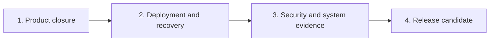

# Remaining Maincopy v1 work

Status: active backlog

Last reviewed: 2026-09-06

Related: [project overview](../README.md), [system design](design.md),
[managed Git runbook](managed-source.md),
[local development runbook](local-development.md), and
[engineering style](quality.md).

## Purpose

This document lists only unfinished work. Git history and tests provide the
record of completed implementation.

The [system design](design.md) remains the authority for V1 behavior, data
ownership, and trust boundaries. Each change must also follow the
[engineering style guide](quality.md).

## Execution order

1. Complete real-signer acceptance for the browser and human CLI.
2. Finish public-listener lifecycle and restore evidence.
3. Add metrics, NixOS, Caddy, encrypted Backblaze B2 backups, and restore support.
4. Complete the security review, system matrix, documentation, and release dry run.

Run independent product-closure workstreams in isolated checkouts. Review shared
API and router changes during integration. Remove completed backlog items after
the integrated batch passes its final quality checks.

Do not begin automatic provider delivery, subscription capture, multi-site
hosting, or Git write-back as part of V1.

## 1. Product closure

### 1.1 Complete real-signer acceptance

Verify the implemented account workflows with the owner's real signing tools.
Test-signer automation does not complete this acceptance.

- Verify successful Nostr sign-in and cancelled signing with the owner's browser
  extension. Record extension and browser names, versions, and results.
- Complete human CLI Nostr sign-in with an external signer and confirm protected
  session storage. Record the signer and operating system used.

### 1.2 Finish listener and tip administration

Complete the remaining lifecycle behavior on the public and profile surfaces.

Deliverables:

- Apply bounded request limits and structured access logs.
- Drain active public requests during orderly shutdown.
- Keep liveness independent from snapshot readiness.
- Include the active tip projection in offline restore evidence.

Required evidence:

- Drain an active request before the writer closes.
- Fail readiness after a required supervised task exits.
- Reconstruct the same eligible tip projection after offline restore.

### Product-closure gate

- Browser and CLI users can complete every supported release transition.
- No sync, reload, profile edit, or restart grants publication approval.
- Every public response has the accepted metadata and security headers.
- Public routes expose no admin, metrics, draft, or preview capability.

## 2. Deployment and recovery

### 2.1 Add metrics and database health

Create one application-owned Prometheus registry. Do not use the default
registry or user-controlled metric labels.

Deliverables:

- Serve `GET` and `HEAD /metrics` from a dedicated loopback listener.
- Record bounded writer queue, pool, transaction, WAL, and checkpoint metrics.
- Record stable Tokio runtime and Linux process metrics.
- Supervise the metrics listener and runtime collector with the application.
- Add a checked-in Grafana dashboard whose queries match emitted metrics.
- Convert corruption, disk-full, and checkpoint failures into typed health
  and shutdown behavior.

Required evidence:

- Keep `/metrics` absent from public and admin routers.
- Construct multiple isolated registries in one test process.
- Verify metric names, types, labels, content type, and cardinality.
- Fail the listener or collector and start controlled shutdown.
- Prove that labels contain no path, URL, identifier, slug, or secret.

### 2.2 Package the production topology

Add a NixOS module that owns the complete service boundary.

Deliverables:

- Package `maincopyd`, `maincopy`, `maincopy-mermaid`, Caddy, Litestream, and standard client-side encryption tools.
- Isolate service identities and state paths. Run backup processes under
  restricted identities that preserve database mode `0600`.
- Bind public traffic according to configuration.
- Keep admin and metrics upstreams on loopback.
- Make private-network admin exposure the default.
- Require explicit configuration for an Internet-reachable admin origin.
- Remove untrusted identity and forwarding headers at the gateway.
- Disable automatic retries for admin mutations.
- Keep SSH, TLS, B2 credentials, and backup encryption keys outside Git
  and the Nix store.

Required evidence:

- Evaluate minimal and complete module configurations.
- Boot the topology in a NixOS virtual machine.
- Prove route and origin isolation through Caddy.
- Reject unsafe ownership, permissions, paths, and listener addresses.

### 2.3 Add encrypted B2 backups and offline restore

Back up the operational SQLite ledger and retain compatible revision artifacts.

Deliverables:

- Replicate SQLite continuously with Litestream to Backblaze B2.
- Pin and validate the current Litestream file replica with rclone crypt uploads.
  Encrypt on the source server with protected server-supplied keys.
- Upload complete recovery checkpoints every minute. Publish the checkpoint
  manifest only after its required replica files and artifacts reach B2.
- Keep seven days of local encrypted recovery bundles.
- Back up immutable revision artifacts and identify complete recovery points
  whose required artifacts are already available off-site.
- Recover after replication or artifact-upload interruption without stopping
  the running publication.
- Reject missing or invalid keys and failed exports before upload. Never upload plaintext.
- Document key recovery and retain the keys needed for older backups.
- Expose degraded backup health without blocking public reads.
- Document recovery point objective and recovery time objective measurements.
- Restore into an empty destination only.
- Verify schema, database digest, artifact digest, and restore acceptance offline.
- Consume one typed restore marker before normal startup.
- Invalidate restored browser sessions and agent credentials.
- Refuse migration or mutation before the restored candidate is accepted.

Required evidence:

- Interrupt backup and upload, then retry without corrupting the live database.
- Restore after removing every local SQLite sidecar file.
- Prove encrypted off-site backup and successful recovery with the correct key.
  Reject missing and incorrect keys without accepting a restore candidate.
- Reject a marker for different bytes, schema, artifacts, or binary.
- Reproduce released pages, RSS, routes, profiles, and tip projection.
- Measure the documented recovery targets.

### Operations gate

- The NixOS virtual machine runs Maincopy, Caddy, and encrypted continuous replication.
- Local Prometheus can scrape the loopback metrics listener.
- The live database remains on local storage.
- The restore drill preserves the operational ledger and required artifacts.
- Restart and restore complete before public or admin readiness.

## 3. Security and system evidence

### 3.1 Run the end-to-end matrix

Exercise one representative managed Git site through browser, human CLI, and
agent API workflows.

The matrix must cover startup, login, sync, preview, immediate release,
scheduled release, update, cancellation, blocked retry, tips, metrics, backup,
restore, and shutdown.

Inject failures at each startup stage, writer boundary, activation boundary,
Git phase, renderer phase, gateway route, and restore gate. Public readers must
retain the last committed snapshot whenever the design requires continuity.

### 3.2 Complete the security review

Review these boundaries before release:

- password hashing, enumeration resistance, and password-worker limits;
- session fixation, expiry, rotation, revocation, cookies, and CSRF;
- Nostr login and NIP-98 freshness, replay, URL, method, and payload binding;
- role, scope, actor, host, origin, and route isolation;
- gateway header removal and TLS termination;
- Git host verification and private-key handling;
- content traversal, HTML, SVG, asset-origin, and CSP policy;
- database corruption, queue saturation, backup failure, and restore acceptance;
- dependency licenses, advisories, and reproducible inputs.

Record representative latency, compilation, queue, WAL, backup-lag, runtime,
and shutdown measurements. Close every critical or high-risk finding.

### 3.3 Verify operator documentation

- Run every documented command from a clean environment.
- Validate each TOML and frontmatter example.
- Check internal Markdown links and generated OpenAPI output.
- Execute the deployment and restore runbooks without hidden steps.
- Verify that documentation distinguishes current behavior from target design.

## 4. Release candidate

Prepare a candidate without publishing an artifact until the owner approves it.

Deliverables:

- Select a semantic version and write the changelog.
- Verify crate metadata, included files, README, and license.
- Build the source archive and Nix outputs from clean inputs.
- Generate checksums and a dependency inventory.
- Define a signed annotated tag policy and trusted signing keys.
- Pin each third-party release action to an immutable commit.
- Protect crates.io and release credentials behind owner approval.
- Test idempotent recovery after each publication step.

Required evidence:

- Run `cargo publish --dry-run --locked` on the exact candidate.
- Run `nix flake check` and `nix build` from the release archive.
- Reject an unsigned tag, version mismatch, or untrusted signing key.
- Create a draft GitHub Release without making it public.
- Confirm that ordinary continuous integration cannot access release secrets.

## Definition of done

Use `cargo check` and Clippy during implementation. Defer full workspace tests
and CRAP measurement to the final pre-commit gate. Run the canonical Nix gates
before each code commit and push.

A work item is complete only when all applicable statements are true:

- Tests cover success, rejection, limits, transitions, restarts, and isolation.
- External failures map to stable typed codes without secret detail.
- Database structure and domain transitions enforce the same invariants.
- Long-running work is supervised, cancelled, and awaited.
- New limits are configured or documented as safe fixed constants.
- New dependencies have minimal features and recorded licenses.
- New project traits, trivial getters, unsafe blocks, lint exceptions, and
  public items have a documented production need.
- Operator behavior and configuration changes update their runbooks.
- Formatting, Clippy, workspace tests, Nix checks, and the CRAP budget pass.

## Deferred work

The following work remains outside V1:

- browser article editing and Git write-back;
- multiple sites or tenants;
- mailing-list capture and email delivery;
- automatic Nostr or other provider delivery;
- X and Substack share kits;
- paid articles and access entitlements;
- Obsidian Sync as a managed source;
- replaceable themes and typed article widgets;
- sandboxed article code execution; and
- crawler or archive workers.

External archive systems can continue to use canonical links, sitemap,
`BlogPosting` metadata, RSS, and ordinary HTTP caching metadata.
