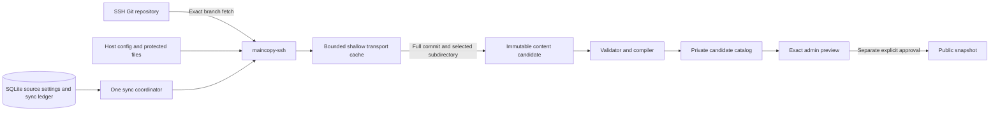
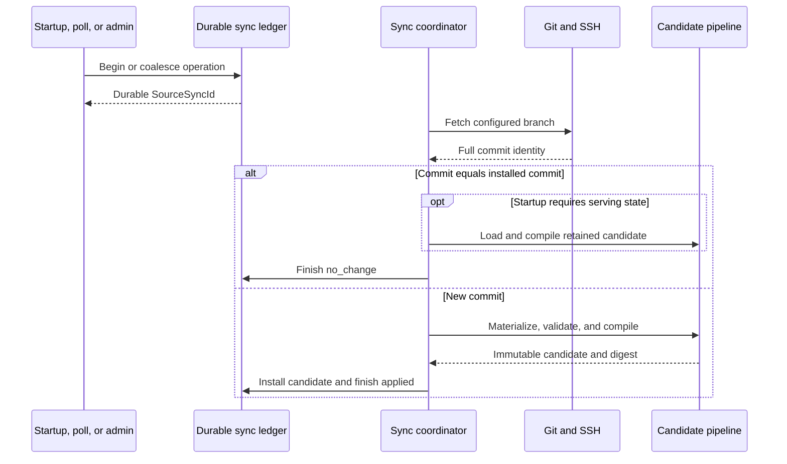

# Configure managed Git synchronization

Status: supported operator workflow

Last reviewed: 2026-09-06

Related: [system design](design.md),
[remaining implementation work](implementation.md),
[local development runbook](local-development.md), and
[engineering style guide](quality.md).

Use this runbook to configure one read-only SSH Git source. Maincopy fetches
one exact branch and prepares immutable content candidates.

A successful synchronization updates the private candidate catalog. It does
not publish an article or replace a public revision.

> [!WARNING]
> Install the generated public key with read-only repository access. A
> write-capable deploy key expands the effect of a credential compromise.

## Configuration ownership

Maincopy separates host controls from mutable source settings.

| Location | Values | Secret material |
| --- | --- | --- |
| Host `maincopy.toml` | Source mode, mirror path, process limits, named credential file references | No secret bytes |
| Protected host files | SSH private key and verified `known_hosts` entries | Yes |
| SQLite | SSH user, host, port, repository path, branch, content subdirectory, credential name, poll interval | No |

The host configuration selects `managed_git` and registers each credential by
name. The offline setup command selects one registered name for SQLite. Online changes
select from the same host-owned registry.

```toml
[paths]
state_root = "/var/lib/maincopy"
runtime_root = "/run/maincopy"

[source]
mode = "managed_git"
mirror_root = "/var/lib/maincopy/source-mirror"

[source.ssh_credentials.deploy]
private_key_file = "/var/lib/maincopy-credentials/source-key"
known_hosts_file = "/etc/maincopy/source-known-hosts"
```

`source.mirror_root` must be one dedicated direct child of
`paths.state_root`. It must not contain the SQLite database.

Relative host paths resolve from the directory that contains
`maincopy.toml`. Keep each private key outside Git and the Nix store.
After resolution, credential paths may use only ASCII letters, digits,
slashes, periods, underscores, and hyphens. This rule prevents OpenSSH from
expanding the validated path as configuration syntax.

The default managed Git limits are:

| Setting | Default | Purpose |
| --- | ---: | --- |
| `fetch_timeout_seconds` | `120` | Wall-clock limit for each Git phase |
| `command_output_bytes` | `33554432` | Captured command-output limit |
| `mirror_bytes` | `2147483648` | Local mirror size limit |
| `file_bytes` | `1073741824` | Child-process file-size limit |
| `address_space_bytes` | `2147483648` | Child-process address-space limit |
| `cpu_seconds` | `120` | Child-process CPU limit |
| `open_files` | `256` | Child-process open-file limit |

Set a smaller positive value in `[source]` when the repository permits it.
Maincopy also applies fixed maximum values during host configuration parsing.

## Data path



The SSH helper accepts only the configured target, port, and
`git-upload-pack` command. It clears inherited process environment and uses
strict host-key verification. It disables fallback identities and certificate
sidecars before it adds the selected private key. It is an outbound client: it
binds no listener and requests no tunnel. Keep ingress control in the VPC and
host firewall.

Git fetches only the configured branch. Maincopy disables tag following,
submodule recursion, `FETCH_HEAD` writes, and automatic maintenance for this
operation. When the advertised head changes, it shallow-fetches that head
without negotiating from objects left by an earlier remote, prunes unreachable
Git objects, and rechecks the configured mirror byte and entry bounds. One
operating-system lock gives the mirror a single process owner.

Every Git phase runs in its own process group. Its wall-time, file, memory,
CPU, descriptor, and captured-output limits cover its descendants. Timeout or
shutdown kills the whole group and reaps the command leader.

The bare mirror is a bounded transport cache, not an archive. Immutable
content candidates and database identities retain the revisions needed for
preview and publication. Maincopy does not commit, merge, push, create a remote
branch, or edit Markdown.

The candidate store has a fixed safety ceiling of 4,096 archive or staging
entries and 1 GiB of archive bytes. At capacity, synchronization fails closed
and keeps every retained revision; Maincopy does not guess which publication
artifact is safe to delete. Automatic candidate collection is disabled. The retention contract below defines
the evidence required before collection can be enabled.

Maincopy resolves the full commit before it reads the configured content
subdirectory. It rejects symbolic links, gitlinks, unsafe paths, and limit
excesses.

## Prepare the credential

Complete these steps while `maincopyd` is stopped.

1. Create the protected parent directory for the private key.
2. Put the managed host configuration in place.
3. Generate a dedicated Ed25519 deploy key:

   ```console
   maincopyd --config /etc/maincopy/maincopy.toml \
     source generate-key \
     --private-key-file /var/lib/maincopy-credentials/source-key
   ```

4. Copy the printed public key and fingerprint to a protected setup record.
5. Install only the public key as a read-only repository deploy key.
6. Obtain the SSH host key through a trusted, independent channel.
7. Write the verified host entry to the configured `known_hosts` file.

For a nondefault port, use the OpenSSH `[host]:port` host-field form.

The key command refuses to overwrite the private key or its `.pub` file. It
prints only the canonical public key and its SHA-256 fingerprint.

Give the daemon read access to both credential files. Keep the private key at
mode `0600` or stricter. Maincopy rejects symlinks, empty files, oversized
files, and group-readable or world-readable private keys. The private key must
belong to the daemon user. The non-secret `known_hosts` trust anchor may belong
to root or the daemon user, but it must not be group- or world-writable.
Every parent directory must belong to root or the daemon user. A group- or
world-writable parent is rejected unless it has the sticky bit; use protected
parent directories instead of relying on that exception. Maincopy verifies
the file identity and path again immediately before each transport command.

> [!CAUTION]
> Do not trust an unverified `ssh-keyscan` result. A substituted host key can
> direct the first connection to an attacker.

## Store source settings

SQLite must contain an enabled owner before source setup. In managed mode,
bootstrap the owner offline before configuring the initial source. Normal managed
startup requires source settings and a successful initial synchronization.

For controlled new-state provisioning, run:

```console
maincopyd --config /etc/maincopy/maincopy.toml \
  identity bootstrap password --username owner
```

Enter the new owner password only at the protected prompt.

Stop `maincopyd`, then store the non-secret source settings:

```console
maincopyd --config /etc/maincopy/maincopy.toml \
  source configure \
  --user git \
  --host git.example.test \
  --port 22 \
  --repository-path publisher/site.git \
  --branch main \
  --content-subdirectory publication \
  --credential-name deploy \
  --poll-interval-seconds 300
```

Use `.` when the repository root is the content root. The poll interval must
be from 30 through 86400 seconds.

For a repair, add `--expected-version CURRENT_VERSION`. This precondition
prevents an operator from replacing settings that changed after inspection.

The command acquires the normal process lock and binds no listener. It refuses
to run while the daemon owns the instance.

## Start and inspect synchronization

Start the daemon after identity, credential, and source settings exist:

```console
maincopyd --config /etc/maincopy/maincopy.toml
```

Managed mode completes its startup synchronization before it binds listeners.
An invalid source or failed initial compilation prevents the service from
becoming ready.

Select the same HTTPS administration origin for login and every later command.
Replace the example origin below with the deployed origin. For a private CA,
add `--admin-ca-file /path/to/trusted-ca.pem` to each command.
The CLI does not persist origin or CA options from a prior invocation.

Log in, then inspect the redacted source status:

```console
maincopy --admin-origin https://admin.example.com login --username owner
maincopy --admin-origin https://admin.example.com source status
```

Request a synchronization and wait for its durable terminal state:

```console
maincopy --admin-origin https://admin.example.com source sync --wait
```

Return after admission when another process will inspect the operation:

```console
maincopy --admin-origin https://admin.example.com source sync --async
```

Use `--json` for machine-readable output. Add `--idempotency-key UUID` when a
caller must safely retry one manual request.

## Everyday Git-to-preview loop

After the initial setup, ordinary article changes do not require a daemon
restart or another source-configuration command.

1. Commit the Markdown and its local assets, then push the configured branch.
2. Let Maincopy reach the displayed `Next poll` time, or choose **Sync now** on
   `/admin/source`. `maincopy source sync --wait` triggers the same operation.
3. When the operation reports `applied`, open **Posts**. A new publishable post
   appears as **Not published**; a new revision of a live post appears as
   **Unpublished changes**.
4. Review the exact rendered preview and explicitly publish that revision.

The poll, browser action, and CLI action all enter the same durable
coordinator. None of them publishes directly. A failed fetch or compile keeps
both the previous private candidate and the public site unchanged.

## Change source settings online

Sign in recently as an Owner, then open **Source settings** on `/admin/source`.
The form can change the remote, branch, subdirectory, credential name, and poll
interval. The credential name must identify a host-registered credential.

For the CLI, inspect the installed version and deploy identity first:

```console
maincopy --admin-origin https://admin.example.com source status
maincopy --admin-origin https://admin.example.com source deploy-key
```

The deploy-key command prints the selected Ed25519 public key and SHA-256
fingerprint. It derives that identity from the protected private key. It does
not return a private-key path or a `known_hosts` path.

Submit all proposed settings with the installed version:

```console
maincopy --admin-origin https://admin.example.com source configure \
  --user git --host git.example.test --port 22 \
  --repository-path publisher/site.git --branch main \
  --content-subdirectory publication --credential-name deploy \
  --poll-interval-seconds 300 --expected-version 1 --wait
```

Replace `1` with the installed version from `source status`. Use `--async`
instead of `--wait` to return after admission. Add `--idempotency-key UUID`
to repeat an identical request after an uncertain response.

Each proposal reserves an immutable configuration version and one durable sync
operation. Installed settings, their poll interval, and the private catalog
remain authoritative while Maincopy fetches, validates, and compiles the
proposal. Successful catalog installation activates the proposed settings in
the same database transaction. It does not publish a post.

A failed or cancelled proposal preserves the installed settings and candidate.
Failed proposals can leave gaps between installed configuration versions. Use
the displayed version instead of assuming that each successful change adds one.

A proposal conflicts with an active synchronization. An ordinary sync request
also conflicts with an active proposal. Wait for the active operation to finish,
then reload source status before submitting new settings.

If Maincopy restarts during a proposal, startup records `failed` with the
`interrupted` failure code. It then synchronizes the previously installed
settings. The proposal's operation resource and retry identity retain that
terminal result. Resubmit corrected settings with a new identity.

Both browser and API changes require a recent human Owner session. Scoped agent
credentials can inspect permitted resources or request ordinary synchronization;
they cannot replace the Owner confirmation for source settings.

## Operation behavior

Startup, periodic polling, and `Sync now` use the same coordinator. The
coordinator permits one active synchronization per instance.

Concurrent requests coalesce onto the active operation identifier. Maincopy
retains the newest 4,096 manual idempotency aliases globally. Repeating a key
replays its original result while its alias remains in that window. After the
alias expires, the durable audit key makes reuse a conflict instead of running
the request again, even when the associated operation is otherwise retained;
retry with a fresh key. Maincopy retains each operation referenced by a live
alias, even when newer poll operations exceed the normal history window.



The durable operation records its trigger, stage, result, commit, content
digest, and stable failure code. Maincopy retains the newest 4,096 terminal
operations, every nonterminal operation, and the operation referenced by the
current installation. An older history cursor can therefore expire. Startup
marks a still-active operation from an unexpectedly ended process as
`interrupted`. During orderly shutdown, cancellation wins before work enters
an uncancellable compile or durable commit. Work already crossing one of those
boundaries drains to its ordinary terminal result before the writer closes.

`applied` means that Maincopy installed a new private candidate. `no_change`
means that the configured branch still resolves to the installed commit.

A live poll or manual `no_change` skips compilation. Startup loads and compiles
the retained candidate because a new process needs an in-memory catalog.

Neither result grants publication approval. A changed live article becomes
`UnpublishedChange` until an administrator approves its exact preview.

## Failure diagnosis

Run `maincopy --json source status`. Inspect `latest_sync.failure_code` in the
returned document.

- If the code is `credential_unavailable`, verify the selected credential name,
  file ownership, and private-key mode.
- If the code is `unknown_host`, verify that `known_hosts` contains the exact
  configured host and port with a host key obtained through a trusted channel.
- If the code is `authentication_failed`, verify that the selected public key
  is installed as a read-only deploy key and its private key is readable by the
  daemon user.
- If the code is `remote_unavailable`, verify DNS, routing, the SSH port, and
  repository service availability.
- If the code is `fetch_failed`, inspect the operation ID in server logs for a
  safe failure class after checking the remote and read-only access.
- If the code is `branch_unavailable`, verify the exact branch name on the
  configured remote.
- If the code is `validation_failed` or `compile_failed`, build the same commit
  locally and correct the content errors in Git.
- If the code is `candidate_failed`, correlate the operation ID with server
  logs. Check candidate-store integrity and capacity before retrying; the
  installed candidate remains active.
- If the code is `timed_out`, inspect repository size and host connectivity.
  Increase a bound only after you confirm the expected workload.
- If `latest_sync.outcome` is `cancelled`, shutdown won before the admitted
  operation completed; request a new synchronization after the service is
  ready.
- If the code is `interrupted`, the previous process ended without completing
  its durable operation. Check the prior process failure, then request a new
  synchronization.

A failed synchronization keeps the prior private catalog and public snapshot.
Fix the cause, then run `maincopy source sync --wait` again.

Maincopy excludes SSH process output, private-key paths, and `known_hosts`
paths from source resources, API responses, and CLI output. Use the stable
failure code and operation ID to correlate safe server logs.

## Candidate retention contract

Automatic candidate collection is disabled. The capacity ceiling rejects new
candidates without deleting retained artifacts.

A future collector must preserve every candidate reachable from these roots:

| Root | Required artifacts |
| --- | --- |
| Installed source and current private catalog | The installed candidate and every previewable revision |
| Current public revisions | Exact Markdown, assets, renderer identities, and compiled output |
| Non-terminal releases | Every revision and candidate required to complete or recover the release |
| Active sync or configuration proposal | Any materialized candidate until its terminal result is durable |
| Compatible backup recovery points | Every digest named by a retained backup's artifact manifest |

Resolve these roots from a consistent database snapshot. Coordinate collection
with the sole writer and candidate admission so new references cannot race with
deletion. A candidate created after the snapshot remains protected for that pass.

Only unreferenced artifacts can become collection candidates. Recheck their
references before deletion and keep a recoverable quarantine until the recovery
point no longer needs them. Directory age and sync-history pruning alone never
prove that a candidate is unreachable.

An expired operation cursor or idempotency alias does not release a public,
preview, release, or backup reference. Mirror pruning remains independent because
the mirror is a transport cache.

## External checkout mode

Use the default `external_checkout` mode for an operator-maintained local
tree. Omit the managed mirror and credential registry:

```toml
[source]
mode = "external_checkout"
```

In this mode, `paths.content_root` selects the local content tree. Maincopy
observes that tree but performs no Git network or write operation.

`maincopy source status` reports `external_checkout`. A manual source sync is
unsupported because the operator owns checkout updates.
